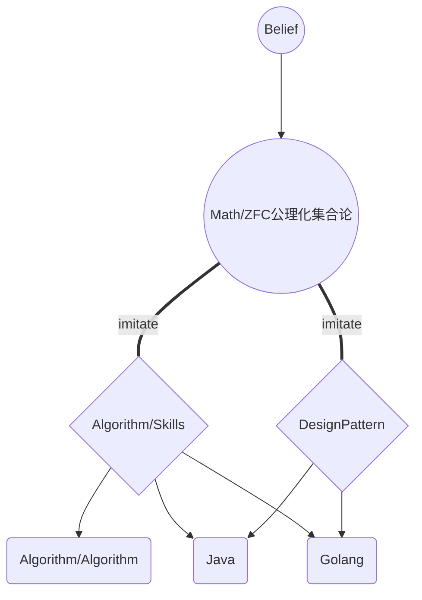

树形结构

```mermaid
graph TD

A((Math/ZFC公理化集合论))
B{Algorithm/Skills}
C{DesignPattern}
D(Algorithm/Algorithm)
Java(Java)
Go(Golang)
Blf((Belief))--->A
A===|imitate|B
A===|imitate|C
B-->D
B-->Java
B-->Go
C-->Java
C-->Go
```

https://discord.com/channels/1218507417533419531/1271304462656475167