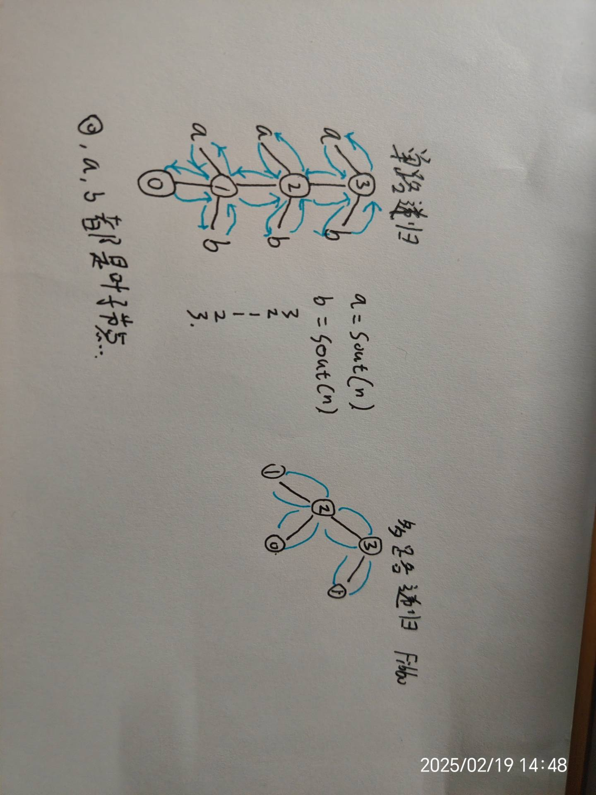
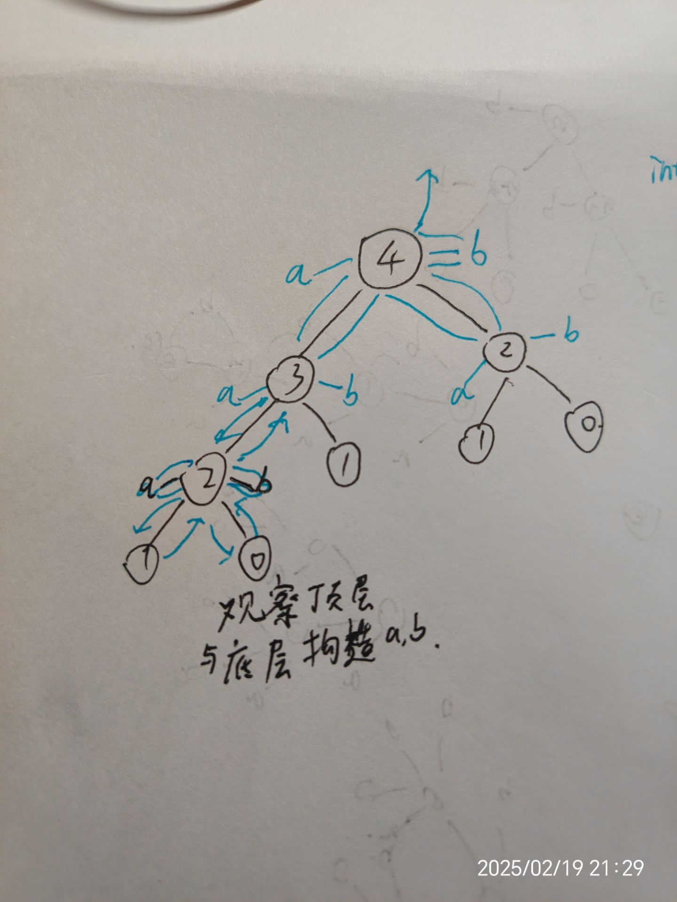
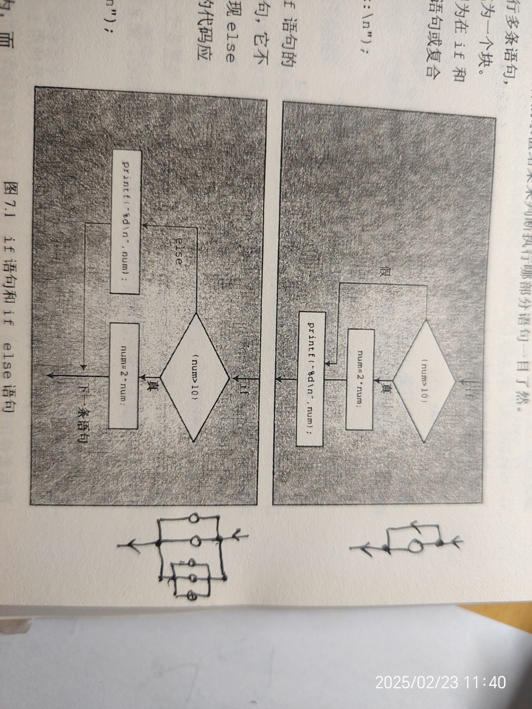
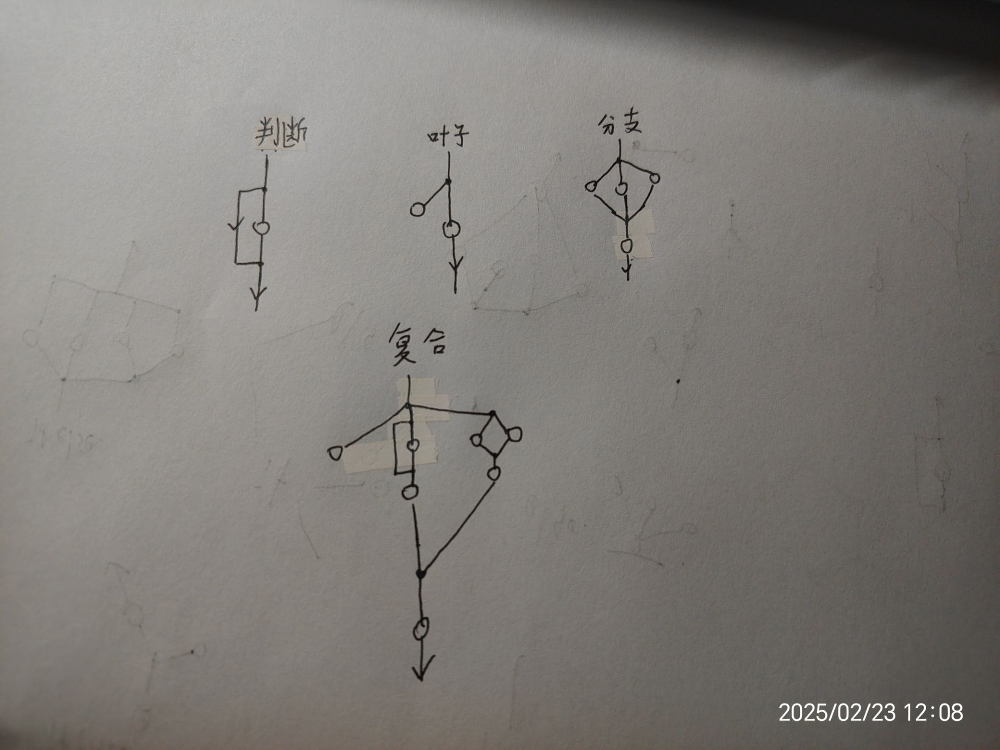

[TOC]  

 ReadMe
算法 数据结构 方面的注意事项 技巧 和数学有关的技巧等(Tips)不是具体的知识;实际编程语言的Tips不写入
 Algorithm

# Recursion
用memo进行优化;
## dp
dp表
降维
## dc

## bt

# DynamicPrograming

# BackTracking

# Cache
out in
每次out / in都必须边界判断;
## Queue
## Stack
## PriorityQueue
## MonotonicQueue MonotonicStack


# 通过Tree来考虑数据结构和算法
- 例如bfs 和 dfs 的queue stack实现,递归.递归树遍历;
# 指针(地址)的思想去考率类和对象
new Object<>() 构造方法生成的对象是一个地址
让后 Object<> var =new Object<>() 这个var是指向这个地址的指针
因为指针所以  让arr1=arr仅是让指针指向同一个不是copy;

# 指针技巧
## 记忆指针
- memo point
- 例如(二叉树模拟递归遍历)  用指针记忆是否return的状态;
```java
TreeNode head=node;
TreeNode pop=null;
ArrayDeque<TreeNode> cache=...;
static void dfs(TreeNode node){
     while(true){
            if(head==null && cache.isEmpty()){
                break;
            }
            if(head!=null){
                cache.push(head);
                head=head.left;
            }else{   // null是叶子节点 return;
                TreeNode peek = cache.peek();
                if(peek.right==pop || peek.right==null){  //如果右子树是null或者已被弹出直接return
                    pop = cache.pop();  //标记
                    result.add(pop.val);
                }else{
                    head=peek.right;        //否则head标记为right然后继续进栈;
                }
            }

        }
}
```

## 不回退指针
- no back nb指针
- 例如将数组排序,kmp算法等,A-Bproblem,滑动窗口,供暖器

### 双指针统计(归并)
将两部分排序
n^2的统计通过排序变为n
```java
// 统计部分
		long ans = 0;
		for (int j = m + 1, i = l, sum = 0; j <= r; j++) {
			while (i <= m && arr[i] <= arr[j]) {
				sum += arr[i++];
			}
			ans += sum;
		}
```

## 划分指针
- divide point
- 用指针划分区域
### 例子
#### 三指针划分(快速)
<的在a左边 大于的在b右边
```java
public static void partition2(int[] arr, int l, int r, int x) {
		first = l;
		last = r;
		int i = l;
		while (i <= last) {
			if (arr[i] == x) {
				i++;
			} else if (arr[i] < x) {
				swap(arr, first++, i++);
			} else {
				swap(arr, i, last--); //i不变因为交换过来的还没有遍历;
			}
		}
	}
```

#### 二分搜索划分红蓝区域寻找边界


# 递归思想:
- 递归树

递归是对递归树的遍历
## 递归树性质:
- State
1个栈{}代表一个节点,每个节点都有一个状态,f(n)n就代表根节点状态
回溯:基本数据类型的状态,随栈自动改变,引用数据类型的状态需要手动改变
栈return就变成了具体的值;
- Leaf
直接return 无开栈的是leaf节点,基本语句也可视作leaf节点,可以再任何位置;
- Branch
开栈f()可视作branch节点 ,开栈后的return可视作基本语句
- Root
branch节点的结构和root节点的结构相同,且仅能够从root节点设计递归树的结构
- dfs遍历
递归是对递归树的遍历,采取包裹(dfs)式的遍历,遇到叶子节点就返回;
具体例子可思考fabonacci 01背包 n皇后问题 全排列等

- 模板
构建递归树 只能在顶层对root节点进行加入叶子节点来操作;
```c

        //root
void f(int n){      //根节点--确定问题状态(n) (括号里的代表状态)

    //leaf
    if(n==boundary case){  //确定叶子节点--确定base问题状态;
        return;             //注意叶子节点可以在任意地方只要是return前边没有f()造栈语句的就是叶子节点                                 
                          // 判断子问题是否为叶子节点 是就原路返回return 如果不是void函数则带着返回值返回;
    }
    //branch
    leaves;             //a语句
    ...
    f(n-i);             // 分支--子问题的状态(n-i);
    f(n-j);            
    ...                                                   
    leaves;             //b语句

    return             //这个可视作语句 若是带值返回则出栈变为值
}

```
- 具体操作
用简单的问题模拟问题n
先看底层再看顶层 根据node的 状态和返回值设计语句a,b;

```java
public static int[] arr;

    public static void main(String[] args) {
            int n=5;
            arr=new int [n+1];
            Arrays.fill(arr,-1);
            arr[0]=1;arr[1]=1;
            f(n);
        for (int i : arr) {
            System.out.println(i);
        }
    }
    public static void f(int n){
        if(n==1 || n==0){
            return;
        }
        if(arr[n]!=-1){
            return;
        }

        f(n-1);
        f(n-2);

        arr[n]=arr[n-1]+arr[n-2];

    }
```

- 带值返回
例如 int f(int n)  栈pop弹出的时候变成值携带返回
- 回溯
每个子问题的状态参量要一致  例如 f(n-1) 相当于n1=n-1 n-1的子问题的状态参量是n1 
而 n=n-1 f(n)  此时n表示的状态参量与子问题n不一致需要回溯 及 在生成树末尾添加++ 返回时++将状态一致;
- 迭代式
while if形式的 判断边界条件 [__ 然后不断更新至边界条件;
```java
while(true){
    if(boundary case){
        ...
    }
    update;
}
```
while(!boundary case) 等价于 while if(boundary case) break;
if() return  等价于  if else

# Cache数据结构
- dfs bfs dijkstra都是 dad out child in的过程
- 节点in or out cache 时候标记为ture相应的 进入 或者拉出的时候判断是否需要continue
- 将第一个节点压入(offer/push)cache来启动
- 父节点拉出(poll/pop),符合要求的子节点进入(push/offer)cache再进行操作;

# if/else


Object state divide and choose 对对象状态的分划和选择,对象可以是变量,序偶等,例如a>b相当于(a,b)的state;选择某个状态就在假设某个状态成立下进行后续操作;注意合并逻辑
Priority sequence
- Vertex.visited
    if(v.visited==true){

    }else{

    }
- public int compare(Integer i1,Integer i2){
        if(i1.age!=i2.age){

        }
        else{}
        if(i1.name != i2.age){

        }else{

        }
}
```java
//1. 单if结构 短路结构  看图
//2. if , else,else if 遇到{return / continue/ break...} 叶子结构 不汇合;
//3. if/else/else if 为分支结构 **最终必汇合到顺序结构**
//4. 先考虑分支结构再考虑叶子结构和短路结构 来简化代码分支;
```
## 例题素分解
```c
include<stdio.h>
include<stdlib.h>
include<math.h>
void sufenjie(int n){
	printf("%d=",n);
	if(n%2==0){
		while(1){
			if(n==2){
				printf("%d",2);
				return;
			}
			if(n%2!=0){
				break;
			}
			n=n/2;
			printf("%d*",2);
		}
	}
	
	for(int i=3;i<=n;i+=2){
		if(n%i!=0){
			continue;
		}
		while(1){
				if(n/i==1){
			printf("%d",i);
			return;
		}
		if(n%i!=0){
			break;
		}
		n=n/i;
		printf("%d*",i);
		}
	}
} 
int main(){
	sufenjie(6);
}
```

# 边界判断
## 记忆指针 判断
归并排序中,线段树懒更新;
## null 
- 要考虑null空的情况很多时候都有空这个边界条件
- 在操作数据结构中通常数据结构为null的时候就会报错所以
## ∞溢出判断
- 数组越界
- integer.MAX_VALUE 相加溢出
- 
# 合并逻辑
- 减少if嵌套用逻辑量词&&||来合并逻辑
# while和priority sequence
先操作再说
考虑一般情况再考虑边界情况
先想一般情况操作,然后直接while()后边补充边界判断 可以ifbreak 或者 !();
如果需要循环指标i一定要先把这个写出来!!!!!!;
在循环操作的时候直接 while(!cache.isEmpty() || ...){}来操作
既能减少嵌套if 又能防止null异常;
- 二叉树遍历
- 归并排序
```java
static void merge(int l,int r,int m){
        int a=l;
        int b=m+1;
        int i=l;
        while (!(a>m || b>r)){
            help[i++]= arr[a]<=arr[b] ? arr[a++] : arr[b++];
        }
        while(!(a>m)){
            help[i++]=arr[a++];
        }
        while (!(b>r)){
            help[i++]=arr[b++];
        }

        //调用系统级别api
        System.arraycopy(help,l,arr,l,r-l+1);
    }

```
```java
public class MonotonicQueue {
        ArrayDeque<Integer> deque=new ArrayDeque<>();

        void offer(int element){
            while(!deque.isEmpty() && element>=deque.peekLast()){  //合并逻辑;
                deque.pollLast();
            }
            deque.offerLast(element);
        }

        void poll(){
            deque.pollFirst();
        }

        int peek(){
            return deque.peekFirst();
        }
}
```
# 善用三元运算符 ? :
- 和+= -=等运算符

# 状态与回溯
- 目前遇到的状态栈,int n ,
- 基本数据类型因为是副本自动回溯
- 引用数据类型手动回溯;


# 状态与回溯
- 目前遇到的状态栈,int n ,
- 基本数据类型因为是副本自动回溯
- 引用数据类型手动回溯;


# 数组索引
index+1 = num(index) 指定索引右一位为到此索引的元素个数  

可以考虑为  0,1,2,3,4,5,...,n,n_length ;  
- System.arrarycopy(arr1,start1,arr1,start2,arr1.length-start1)  这里的length-start1 就是剩余的元素个数
- for(int i=0;i<n;i++) 这个循环次数是n  用数学角度考虑就是 [0,n) 就是 [0,n-1] n-1+1 就是n个元素;


# flag标记变量
- cnt flag 等等

# sentry 哨兵指针
扫雷的外围一圈0;字符串""都起到辅助作用;
例如在快速排序的时候 i指针就是i左边的都是小于pivot的 最后再将pivot插入sentry中;
数据结构也常用sentry ;
# Cache
stack queue priorityqueue 等在bfs dfs等算法中起到cache 临时存储数据的作用;

# 指针参数の函数设计 int[] arr=new int[1];
翁恺c语言讲过
- void f(int * arr,int x){}; java中 可以设计public static int[] arr;静态变量代替这个;
比int * f(int x){}好 
例如public static void dfs(ArrayList<Vertex> arr,Vertex v)
比 public static ArrayList<Vertex> dfs(Vertex v) 好
- 参数是变量的时候在出栈的时候会销毁
所以在回溯的时候变量可以指针不可以
而需要传递不变量的时候可以传递一个指针例如:
使用数组或对象传递 cnt
如果你不想改变函数签名，可以使用一个数组或对象来保存 cnt，这样就能通过引用传递 cnt 的值了。

# 数组可以考虑成 正半轴,元素索引的右边一位就是前边所有元素的个数,例如{4,3,5,567,4}索引(2,5) 右边一共3个元素 size-index 就是index前边所有元素的个数;

# 二进制 1,2,4,8..
快速幂

# new
对某个对象进行操作的时候,最好把结果弄到一个new的对象上例如矩阵转置结果,new在一个新矩阵里否则原矩阵操作困难;
```c
include<stdio.h>

int main(){
    int n, m;
    scanf("%d %d", &n, &m);  // 输入矩阵的行数和列数
    int arr[n][m];            // 原矩阵
    int transpose[m][n];      // 转置矩阵

    // 读入原矩阵
    for (int i = 0; i < n; i++) {
        for (int j = 0; j < m; j++) {
            scanf("%d", &arr[i][j]);
        }
    }

    // 进行转置
    for (int i = 0; i < n; i++) {
        for (int j = 0; j < m; j++) {
            transpose[j][i] = arr[i][j];
        }
    }

    // 输出转置矩阵
    for (int i = 0; i < m; i++) {
        for (int j = 0; j < n; j++) {
            if (j == n - 1) {
                printf("%d\n", transpose[i][j]);  // 最后一项输出换行
            } else {
                printf("%d ", transpose[i][j]);  // 其他项输出空格
            }
        }
    }

    return 0;
}

```


# temp
- 交换两个数需用道中间变量temp;
- a=a^b;b=a^b;a=a^b;
- int temp=a;
		a=(int)((a+b)-abs(a-b))/2;
		b=(int)((temp+b)+abs(temp-b))/2;
# 状态压缩
- 用二进制可以表示boolean数组
- 先设置一个limit表示数组的长度 limit=(0<<n)-1 方便后续移位操作 limit&tmp就能转到表示的数组长度上;
- & 集合的与 乘法  | 集合或 有进位加法  ^ 集合补集 无进位加法 熟悉这些运算和性质方便操作 ~取反
- 遍历状态的时候可以用brian算法提取最右侧的1 tmp&-tmp 适当对状态数组取反方便brian算法遍历;while(n!=0){int tmp=n&-n;n=(n^tmp)&limit;...}

# arr[i++] 
可以实现数组后缀添加;这就是迭代器Iterator的原理 循环完以后正好 为数组个数n;
# dx dy
- int[] dx={0,-1,1,0,0};
- int[] dy={-1,0,0,1,0};
http://xmuoj.com/problem/GW033

```c
include<string.h>
include<stdio.h>
include<math.h>
include<stdlib.h>

int main(){
	int di[]={0,-1,1,0,0};
	int dj[]={-1,0,0,1,0};
	int n;int m;
	int arr[101][101];
	int newArr[101][101];
	scanf("%d %d",&n,&m);
	for(int i=0;i<n;i++){
		for(int j=0;j<m;j++){
		
			scanf("%d",&arr[i][j]);
				if(j==0 || j==m-1 || i==0 || i==n-1){
				newArr[i][j]=arr[i][j];
			}
		}
	}
	
	for(int i=1;i<n-1;i++ ){
		for(int j=1;j<m-1;j++){
			int sum=0;
			for(int k=0;k<5;k++){
				sum+=arr[i+di[k]][j+dj[k]];
			}
			newArr[i][j]=round((double)sum/5);
		}
	}
	
	for(int i=0;i<n;i++){
		
		for(int j=0;j<m;j++){
			if(j==m-1){
				printf("%d",newArr[i][j]);
				
			}
			else printf("%d ",newArr[i][j]);
			if(j==m-1) printf("\n");
		}
	}
	return 0;
	
}
```


 数论("%"(mod) and /) 
# 构造java类建议设置size/n这个成员变量;
- 个数似乎是一个构建和思考的好用的性质
# 进制(mod)
- 10进制转2进制;
```c
int main(){
	int n=23;int d=2;// d是进制数
	int arr[1001]={0};
	int i=0;
	while(n!=0){
		arr[i++]=n%d;   // mod 一次 进位一次 boundary case是0
		n=n/d;
	}
}
```
# 判断素数
final 优化
1. Math.sqrt(n) 
2. 6k+-1;
```java
// 判断素数的方法，已知1不是素数，在主函数中去除1即可
public static boolean isPrimeNumber(int n) {
		if (n == 2 || n == 3) {
			return true;
		}
		if ((n - 1) % 6 == 0 || (n + 1) % 6 == 0) {
			// 当前可能是素数
			for (int i = 2; i <= Math.sqrt(n); i++) {
				if (n % i == 0) {
					return false;
				}
			}
			return true;
		} else {
			return false;
		}
	}

```
# 质分解
奇数的奇数分解一定是素分解
```c
include <stdio.h>

// 函数：质因数分解
void prime_factors(int n) {
    // 找出2的所有因子
    while (n % 2 == 0) {
        printf("2 ");
        n = n / 2;
    }

    // 找出奇数的因子
    for (int i = 3; i * i <= n; i += 2) {
        while (n % i == 0) {
            printf("%d ", i);
            n = n / i;
        }
    }

    // 如果剩下的n是一个质数并大于2
    if (n > 2) {
        printf("%d", n);
    }
}

int main() {
    int num;
    
    // 用户输入
    printf("请输入一个整数：");
    scanf("%d", &num);

    // 质因数分解
    printf("质因数分解结果：");
    prime_factors(num);

    return 0;
}

```

# 辗转相除法 gcd 和 lcm
辗转相除法（也称为欧几里得算法）

**定理**：两个整数 \(a\) 和 \(b\) 的最大公约数等于 \(b\) 和 \(a \mod b\) 的最大公约数（这里 \(a \mod b\) 表示 \(a\) 除以 \(b\) 的余数）。

即：
\[
\text{GCD}(a, b) = \text{GCD}(b, a \mod b)
\]
这个过程会不断迭代，直到余数为 0，此时 \(b\) 就是 \(a\) 和 \(b\) 的最大公约数。

---

## **算法步骤**
1. 假设我们需要计算两个正整数 \(a\) 和 \(b\) 的最大公约数（假设 \(a > b\））。
2. 求 \(a \mod b\)。
3. 将 \(a\) 更新为 \(b\)，\(b\) 更新为 \(a \mod b\)。
4. 重复上述步骤，直到 \(b = 0\)。
5. 此时，\(a\) 的值就是最大公约数。

---

## **C语言实现**
以下是辗转相除法的 C 语言实现：

```c
include <stdio.h>

// 函数定义：计算两个整数的最大公约数
int gcd(int a, int b) {
    while (b != 0) {  // 当 b 不为 0 时继续迭代
        int temp = a % b;  // 计算 a 除以 b 的余数
        a = b;             // 更新 a 为 b
        b = temp;          // 更新 b 为余数
    }
    return a;  // 当 b 为 0 时，a 即为最大公约数
}

int main() {
    int num1, num2;
    
    // 输入两个整数
    printf("请输入两个整数：");
    scanf("%d %d", &num1, &num2);
    
    // 调用 gcd 函数计算最大公约数
    int result = gcd(num1, num2);
    
    // 输出结果
    printf("最大公约数是：%d\n", result);
    
    return 0;
}
```

---

## **代码说明**
1. **函数 `gcd`**：
   - 输入两个整数 \(a\) 和 \(b\)。
   - 使用 `while` 循环不断计算 \(a \mod b\)，并更新 \(a\) 和 \(b\) 的值。
   - 当 \(b = 0\) 时，循环结束，此时 \(a\) 即为最大公约数。

2. **主函数 `main`**：
   - 通过 `scanf` 获取用户输入的两个整数。
   - 调用 `gcd` 函数计算最大公约数。
   - 使用 `printf` 输出结果。

---

## **运行示例**
假设输入两个整数 56 和 98：

```plaintext
请输入两个整数：56 98
最大公约数是：14
```

**过程分析**：
1. 初始值：\(a = 56\), \(b = 98\)。
2. 第一次迭代：\(a \mod b = 56 \mod 98 = 56\)，更新为 \(a = 98\), \(b = 56\)。
3. 第二次迭代：\(a \mod b = 98 \mod 56 = 42\)，更新为 \(a = 56\), \(b = 42\)。
4. 第三次迭代：\(a \mod b = 56 \mod 42 = 14\)，更新为 \(a = 42\), \(b = 14\)。
5. 第四次迭代：\(a \mod b = 42 \mod 14 = 0\)，更新为 \(a = 14\), \(b = 0\)。
6. 结束：此时 \(b = 0\)，最大公约数为 \(a = 14\)。

---

## **递归实现**
辗转相除法也可以用递归方式实现：

```c
include <stdio.h>

// 递归函数定义
int gcd(int a, int b) {
    if (b == 0) {
        return a;  // 当 b 为 0 时，a 即为最大公约数
    }
    return gcd(b, a % b);  // 递归调用
}

int main() {
    int num1, num2;
    
    // 输入两个整数
    printf("请输入两个整数：");
    scanf("%d %d", &num1, &num2);
    
    // 调用 gcd 函数计算最大公约数
    int result = gcd(num1, num2);
    
    // 输出结果
    printf("最大公约数是：%d\n", result);
    
    return 0;
}
```
在 C 语言中，可以通过 **最大公约数（GCD）** 来计算 **最小公倍数（LCM）**。公式如下：

\[
\text{LCM}(a, b) = \frac{|a \cdot b|}{\text{GCD}(a, b)}
\]

以下是一个完整的 C 语言实现，用于计算两个正整数的最小公倍数。

## 代码实现

```c
include <stdio.h>

// 求最大公约数（使用欧几里得算法）
int gcd(int a, int b) {
    while (b != 0) {
        int temp = b;
        b = a % b;
        a = temp;
    }
    return a;
}

// 求最小公倍数
int lcm(int a, int b) {
    return (a / gcd(a, b)) * b; // 防止溢出，先除以 gcd
}

int main() {
    int num1, num2;
    
    // 输入两个正整数
    printf("请输入两个正整数：");
    scanf("%d %d", &num1, &num2);

    if (num1 <= 0 || num2 <= 0) {
        printf("输入的数字必须是正整数！\n");
        return 1;
    }

    // 计算并输出最小公倍数
    int result = lcm(num1, num2);
    printf("最小公倍数是：%d\n", result);

    return 0;
}
```

---

## 代码说明

1. **最大公约数函数 `gcd`**:
   - 使用 **欧几里得算法** 计算两个数的最大公约数。
   - 算法的核心是：\(\text{GCD}(a, b) = \text{GCD}(b, a \% b)\)，直到 \(b = 0\) 时，\(a\) 即为最大公约数。

2. **最小公倍数函数 `lcm`**:
   - 根据公式 \(\text{LCM}(a, b) = \frac{|a \cdot b|}{\text{GCD}(a, b)}\) 计算最小公倍数。
   - 为了防止整数溢出，先将 \(a\) 除以 \(\text{GCD}(a, b)\)，再乘以 \(b\)。

3. **主函数 `main`**:
   - 提示用户输入两个正整数。
   - 检查输入是否合法（正整数）。
   - 调用 `lcm` 函数计算最小公倍数，并输出结果。

---

## 示例运行

### 输入：
```
请输入两个正整数：12 18
```

### 输出：
```
最小公倍数是：36
```

### 输入：
```
请输入两个正整数：7 5
```

### 输出：
```
最小公倍数是：35
``` 

---

## 注意事项
1. 输入的数必须是正整数，代码中已做简单的输入检查。
2. 如果需要支持更大的数，建议使用 64 位整数（`long long`）。


# 容差法
- 判断中间结果double类型是不是整数
- double有效位数只有15位;
- 定义一个很小的数double epsilon=1e-10
- (a-Math.round(a)) < epsilon  ? true : 
- 为什么要用round因为double运算可能出现15.99999这种;

# mod运算满足加法和乘法的分配率;


 其他数学
# 几何
八皇后问题左斜线和右斜线冲突通过 y=x x+y=1的解析几何角度考虑下标映射;
 线性代数(向量)

# 两数最值的向量表示
```
int max=(a+b+abs(a-b))/2;
int min=(a+b-abs(a-b))/2;
```

 分析学(Function)
# 数组映射(自然数集)
## 统计字符串字母出现次数
```
include<stdio.h>
include<math.h>
include<string.h>
int main(){
	char ipt;
	int arr[1001]={0};
	char str[1001]="abc";
//	scanf()
	for(int i=0;i<strlen(str);i++){
		arr[str[i]]+=1;
	}
	printf("%d %d %d",arr[97],strlen(str),(int)'A');
}

String str=new String("abc");
        int[] arr=new int[1001];
        for(int i=0;i<str.length();i++){
            arr[(int)str.charAt(i)]+=1;
        }
        Scanner sc=new Scanner(System.in);
        String x=sc.nextLine();
        System.out.println(arr[(int)x.charAt(0)]);
```
