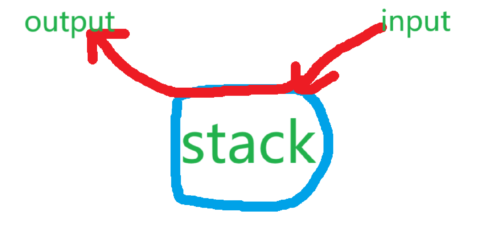
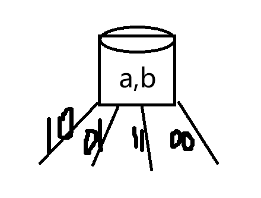
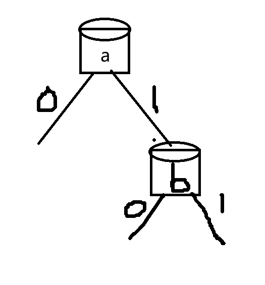
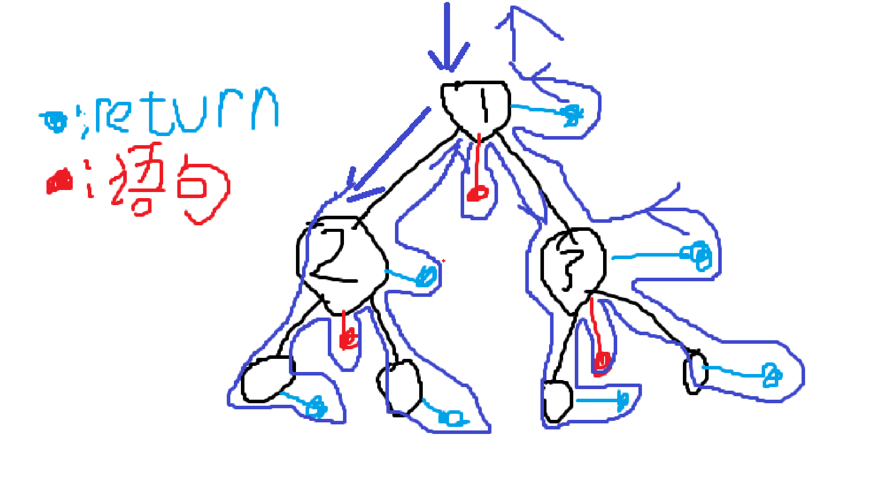
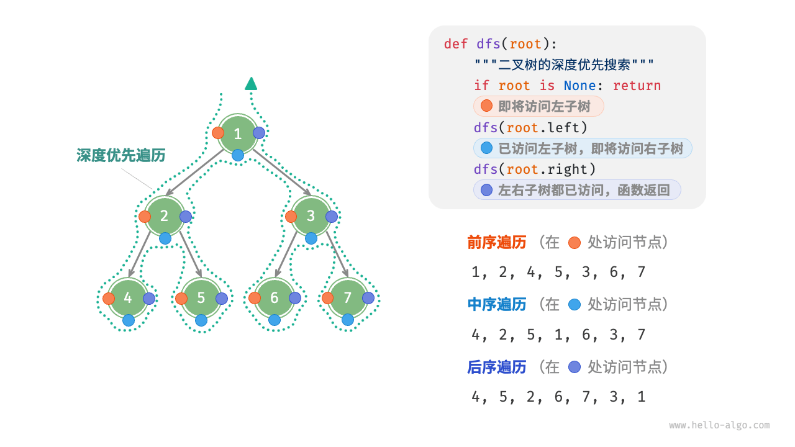
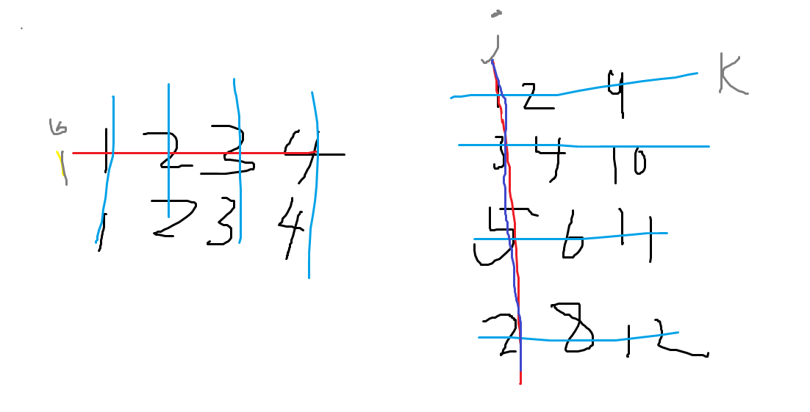

[TOC]  
# 格式
- 全部用c++命名方式,如果有个命名想用下边的子分类不想用大分类就中文命名
例如 指针技巧下有memo_pointer
- 可用.  discrete_fuction.∑∫

# math_refactor公理
- 借鉴数学的ZFC集合论公理体系
Skills->Algorithm ; Skills->JavaSE
- math_refactor是公理体系的公理;Skills里的例如no-backtracking_pointer等都是定理

# math_refactor
```json
{
    "set_theory":"math", //具体参见/Class/Math/集合论 
    "memory":"算法以计算机内存和集合论为基础",
    "var state":["variable is one field of memory","state is the variables' value " ],//variable是计算机内存的一块区域,具体取值是state,系统多个变量取值组合也可是系统整体状态
    "operator":{
        "process_quantity":null,
        "operator_evolve":null,
        //f()整体是算子一个过程量,其他的是var内存量,f是命名标记
        //算子是根据某种规则(rule)栈(计算机底层叫函数栈{})将()括号里输入的东西输出成规则对应的东西
        //算子进化:operator -> orderset 算子生成order集合
        //f()根据自定义的规则栈,f就是一个命名标记全部输出完毕后这个标记就是这个order_set的命名标记;这样就生成了一个order_set
        //operator底层是一个变量记录io stack信息
        "io":"input and output",//f(x)就是输入变量输出另一个变量,f(1) 输入一个变量状态(值)输出一个变量状态(值)
        "stack":"rule operate and return when args'state"//规则,底层函数栈,返回函数栈有值
    }
    

    //记忆:var->state   operator->()io and {}stack->input output operate return
}
```


```json
{
    "set":"",
    "variable _and_function set":"class",
    "function_set":"interface",
    "variable_set":"struct"
}
```

# tree
- 很多计算机底层都是树结构
- 例如bfs 和 dfs 的queue stack实现,递归.递归树遍历;
- 例如状态的枚举,分步乘法通过tree实现,例如a有3个状态,b有四个状态 合起来一共3*4  12 个状态
## tree_arr
- 通过arr构造树
因为树每个节点只有一个father所以 arr索引就是节点索引的值指向father
构造一个father数组即可 
例如并查集的father数组

# arr
- 抽象数组,将数组构造成很多数据结构

## link_arr
- 将数组构造成链表结构方便用链表方法解题
- arr索引是节点,索引的值是箭头指向下一个元素
## tree_arr
- 通过arr构造树
因为树每个节点只有一个father所以 arr索引就是节点索引的值指向father
构造一个father数组即可 
例如并查集的father数组

# vars_hubs
- if else通过变量状态的划分来进行
- state divide and choose 变量状态的分划和选择,对象可以是变量,序偶等,例如a>b相当于(a,b)的state;选择某个状态就在假设某个状态成立下进行后续操作;注意合并逻辑
## vars_hub

### enum
- hub中有多个变量,枚举所有状态
- 一个操作由同级的若干变量控制将变量状态的划分相乘
a:3状态 b:4状态 一共12个if else
- 例如二叉树判断
由左右孩子状态共同划分 10,11,01,00 划分为4个if else
- 例如kmp的边界判断 sp==0 和 pi[sp]==str[i]
#### enum_set
- 主析取范式
- 二叉树后序遍历将状态s分为左移 右移 弹出三个状态集合 

## var_hubs

- 若命题间有依赖关系,可以设计成多个hub每个hub有一个变量的树形结构
- 树状结构可通过vars_hub扁平化
- 例如二叉树判断 加一个左孩子存在那么还会连一个tail
```c
if(left!=null && right!=null){
    if(left.tail !=null){

    }else{

    }

}else if(left !=null && right ==null){
if(left.tail !=null){

    }else{
        
    }
}else if(left == null && right ==null){

}else{

}
```


## state_filter e.g.
- 因为状态的枚举太多了所以设计成filter结构减少枚举条件
- state filter(Priority sequence) 建议设计成过滤器的结构,记得加continue return break等
- 归并排序

- 合并链表
if(cur1!=null){
				pre.next=cur1;
			}
			if(cur2!=null){
				pre.next=cur2;
			}
- Vertex.visited
    if(v.visited==true){

    }else{

    }
- public int compare(Integer i1,Integer i2){
        if(i1.age!=i2.age){

        }
        else{}
        if(i1.name != i2.age){

        }else{

        }
}
```java
//1. 单if结构 短路结构  看图
//2. if , else,else if 遇到{return / continue/ break...} 叶子结构 不汇合;
//3. if/else/else if 为分支结构 **最终必汇合到顺序结构**
//4. 先考虑分支结构再考虑叶子结构和短路结构 来简化代码分支;
```

## while
- while就是循环代码块,根据vars_hubs来结束循环,while里嵌套ifelse
- while就是state_pointer遍历,
- 直接while再说

# boundary
- 收纳很多边界判断的技巧
- >= <= 优于==
例如快排中叶子节点为 l>=r 防止l在右边界

# state_pointer
## 普通迭代状态指针
### 迭代器
- for(i:set){j=i;break} 取set的随机一个元素可以这样
### while
- while就是循环代码块,根据vars_hubs来结束循环,while里嵌套ifelse
- while就是state_pointer遍历,
- 直接while再说
- 如果指针模拟状态遍历,那么指到哪里就立即更新他的状态
例如,遍历树的时候指针指向root先把root设置为visited再while遍历
 while/for
- 每次迭代都是一个状态
- e.g.
fori  
int i  while{... ;  i++} 末尾i状态变化
- 例如kmp里的前缀函数循环
```go
π(i-1)+1=π(i)
ππ(i-1)+1=π(i)
π^3(i-1)+1=π(i)
...
π^n(i-1)+1=π(i)
//终止条件是π^n==0 || π^n(-1)+1==π(i)
//以1为索引 以0就one_short
sp=pi[i-1]
while{
if...break;
sp=pi[sp]
}
```


- 下面的高级优化指针都是普通迭代状态指针的自己都继承他的特性
## pointers_container
- 参见container
---
NMP  (no-backtracking memo partition);
## no-backtracking_pointer/不回退指针
no backtracking pointer
- 数组反转
- 例如将数组排序,kmp算法等,A-Bproblem,滑动窗口,供暖器
### order
- 当需要两个指针不断循环的时候可以考虑排序然后改为no-backtracking指针
- 救生艇问题
### 双指针统计(归并)
将两部分排序
n^2的统计通过排序变为n
```java
// 统计部分
		long ans = 0;
		for (int j = m + 1, i = l, sum = 0; j <= r; j++) {
			while (i <= m && arr[i] <= arr[j]) {
				sum += arr[i++];
			}
			ans += sum;
		}
```

### 双指针收缩
两个指针往中间不回退收缩,注意两个都收缩,有可能重复计算例如 0,2,0 
l,r指针都来到2位置如果两个都收缩会计算两次2,注意要特判

## fast-slow_pointer
- 快慢指针
- 距离差,速度差,时间差构筑快慢指针
- 速度差:应用于寻找中点(等 比例点),寻找入环节点
- 距离差:应用于寻找倒数某位数,寻找相交节点

## memo_pointer/记忆指针
- 设置sentry 划分一维数组 ;
- memo pointer
- 例如(二叉树模拟递归遍历)  用指针记忆是否return的状态;
```java
TreeNode head=node;
TreeNode pop=null;
ArrayDeque<TreeNode> cache=...;
static void dfs(TreeNode node){
     while(true){
            if(head==null && cache.isEmpty()){
                break;
            }
            if(head!=null){
                cache.push(head);
                head=head.left;
            }else{   // null是叶子节点 return;
                TreeNode peek = cache.peek();
                if(peek.right==pop || peek.right==null){  //如果右子树是null或者已被弹出直接return
                    pop = cache.pop();  //标记
                    result.add(pop.val);
                }else{
                    head=peek.right;        //否则head标记为right然后继续进栈;
                }
            }

        }
}
```
- 最小栈记录栈的最小值

## partition_pointer/划分指针
- 和memopointer的区别 memo自身有记忆的状态,partition也可以有记忆区间状态,但是partition可以逐步扩充memo是瞬移,和flag的区别memo和数据结构本身相关,flag
例如bool flag cout等与数据结构本身无关
### 划分
- []闭区间划分
很典型,指针就是划分区域的边界
例如二分算法
- ()开区间划分
开区域优点是边界可以充当迭代器的头方便迭代,数组-1和n索引可不设置避免越界
开区间边界较为常见
- [)开闭区间划分
构造[)开闭区间,开区间头是划分指针的迭代头,充当迭代器的作用方便迭代
例如快排的三个[)区域,<和>区域的闭区间都是数组的-1和n
```java
[<)
  [=)    
        (>]
```

### swap
swap 交换来辅助划分区域
例如快排中如果遇到小的和=区域最左边交换=区域整体右移,小于区域也整体右移实现<区域扩充
移出数组中某个数,可以直接交换最后一个数,然后划分指针左移

### 例子
#### 三指针划分(快速)
<的在a左边 大于的在b右边
```java
public static void partition2(int[] arr, int l, int r, int x) {
		first = l;
		last = r;
		int i = l;
		while (i <= last) {
			if (arr[i] == x) {
				i++;
			} else if (arr[i] < x) {
				swap(arr, first++, i++);
			} else {
				swap(arr, i, last--); //i不变因为交换过来的还没有遍历;
			}
		}
	}
```

#### 二分搜索划分红蓝区域寻找边界


# recur_tree:
```json
{
    "operator":"io stack"
    //io定义为输入状态和返回结果,结果可以是集合,值
    //stack是具体的dfs遍历,用函数栈模拟递归树节点
}
```

- 递归树

递归是对递归树的dfs遍历
## basis 基底表示
### consis_operator 一致算子
- 用于构建递归树
- io:f(a,b) 解决a,b状态的问题构建math算子
- stack:用函数栈模拟递归树
- 将要解决的problem 抽象为带状态的树节点,node:f(a,b) a,b是这个节点的状态 f(a,b)是这个树节点由函数栈模拟
- 对状态进行枚举划分为leaf 和 no-leaf 他们区别就是开没开栈
- f和g是一致的所以g=f
- 由此构建每个节点最终组装成递归树
```tex
f()={
    k   
   ...  leaf 
k+g()+g()+k   
   ...  no-leaf
}
g()=f()

```
### basis
- Vn=∑kiVi+k*0  向量空间那个图来记忆
- 不同状态节点由其子状态向量基底表示
基底可一致转化
- 叶子节点表示为0向量+k
f(N)={
    k*0  is leaf
    kg(n)+k*0 is no-leaf
}
g=f 
## tree
### Node
- args state or varible state 函数栈节点的状态
- return state 函数返回会变成具体的值
1个栈{}代表一个节点,每个节点都有一个状态,f(n)n就代表根节点状态
回溯:基本数据类型的状态,随栈自动改变,引用数据类型的状态需要手动改变
栈return就变成了具体的值;

### 对于 递归函数 f()来说,以下开栈都是f()函数栈,其他函数的栈视作基本语句
- 判断关键就是开没开栈
### Leaf
- 节点内部未开f()函数栈的就是叶子节点
- 基本语句,return都算作叶子节点
直接return 无开栈的是leaf节点,基本语句也可视作leaf节点,可以再任何位置;
### Branch
- 节点内部开f()函数栈的就是分支节点
开栈f()可视作branch节点 ,开栈后的return可视作基本语句
### Root
- leaf和branch的区分就是开没开栈
branch节点的结构和root节点的结构相同,且仅能够从root节点设计递归树的结构
## dfs遍历 

递归是对递归树的遍历,采取包裹(dfs)式的遍历,遇到叶子节点就返回;
具体例子可思考fabonacci 01背包 n皇后问题 全排列等
- 按照栈先进先出恢复
- backtrack 记得恢复

### dustbin

- f=g+g+k g和f这两个算子是一致那么f=g 子问题g基底表示父问题f 如果f和g是一致的那么f=g
- operator的设计有自指的含义,
例如二叉树递归中root处io为返回节点stack为建好这课树,实际root处还没完成,对于两个子树可以直接当作完成了再拼接到一起,加了拼接这个语句,所有子问题都加上了拼接这个语句,自指
例如快排中io为返回空 stack为
## master公式
- T(N)=a*T(N/b)+O(N^c)
- 符合这个公式的递归可以估计复杂度,仅能估计子状态规模相等的情况
例如T(N)=2*T(N/2)+O(1) T(N)=2*T(N*2/3)+O(N) 
    b. 如果log(b,a)  < c，复杂度为：O(n^c)
    c. 如果log(b,a)  > c，复杂度为：O(n^log(b,a))
    d. 如果log(b,a) == c，复杂度为：O(n^c * logn)
    T(n) = 2*T(n/2) + O(n*logn)，时间复杂度是O(n * ((logn)的平方))，证明过程比较复杂，记住即可

## dustbin
- 模板
构建递归树 只能在顶层对root节点进行加入叶子节点来操作;
```c

        //root
void f(int n){      //根节点--确定问题状态(n) (括号里的代表状态)

    //leaf
    if(n==boundary case){  //确定叶子节点--确定base问题状态;
        return;             //注意叶子节点可以在任意地方只要是return前边没有f()造栈语句的就是叶子节点                                 
                          // 判断子问题是否为叶子节点 是就原路返回return 如果不是void函数则带着返回值返回;
    }
    //branch
    leaves;             //a语句
    ...
    f(n-i);             // 分支--子问题的状态(n-i);
    f(n-j);            
    ...                                                   
    leaves;             //b语句

    return             //这个可视作语句 若是带值返回则出栈变为值
}

```
- 具体操作
用简单的问题模拟问题n
先看底层再看顶层 根据node的 状态和返回值设计语句a,b;

```java
public static int[] arr;

    public static void main(String[] args) {
            int n=5;
            arr=new int [n+1];
            Arrays.fill(arr,-1);
            arr[0]=1;arr[1]=1;
            f(n);
        for (int i : arr) {
            System.out.println(i);
        }
    }
    public static void f(int n){
        if(n==1 || n==0){
            return;
        }
        if(arr[n]!=-1){
            return;
        }

        f(n-1);
        f(n-2);

        arr[n]=arr[n-1]+arr[n-2];

    }
```

- 带值返回
例如 int f(int n)  栈pop弹出的时候变成值携带返回
- 回溯
每个子问题的状态参量要一致  例如 f(n-1) 相当于n1=n-1 n-1的子问题的状态参量是n1 
而 n=n-1 f(n)  此时n表示的状态参量与子问题n不一致需要回溯 及 在生成树末尾添加++ 返回时++将状态一致;
- 迭代式
while if形式的 判断边界条件 [__ 然后不断更新至边界条件;
```java
while(true){
    if(boundary case){
        ...
    }
    update;
}
```
while(!boundary case) 等价于 while if(boundary case) break;
if() return  等价于  if else

# 递归衍生技巧
## global
- dfs()  二叉树dfs反序列化

## prune
- 应用于basis表示过程(递归树构建过程)
- 剪枝
把递归树开的栈提前变为具体的值 or 非零向量提前通过判断转成0向量
f(N)={
    k*0 //leaf

    g(n)+ ~~g(n)~~ +k*0 //prune把开的栈提前变成具体的值 or 变为零向量
}
斐波那契额递归用记忆数组剪枝
二分机器人走路问题达到最大值直接剪掉不考虑
全组合


## recover
- 应用于dfs过程(递归树遍历过程)
- 对memo_pointer_container recover
- recover:退回某个节点,memo也要恢复到这个节点的状态
- 回溯的时候要把visit 栈等memo恢复到上一个状态因为根据basis不同节点状态不一样并不一定都是root节点需要恢复进行下一个节点dfs
- 按照栈先进先出恢复
- 参数指针recover 参数值不用因为在栈里


# reverse
- 翻转技巧,有时光倒流,数组从后往前迭代
- 解决问题是继承或者消除正序所带来的影响
## 数组倒序迭代
- 桶排序从后往前迭代,方便继承上一次的排序结果 
- 单调栈处理重复元素 1,2,2,2,1 第一个2右边是2,第二个2右边是2,第三个二右边结果是1,倒叙迭代可以优化正序一个个到最后一个相同元素才结果
## time_return
- 时光倒流
- 打砖块问题
- 倒放从尾一步一步复原现场


# lazy
-  什么是懒操作？
懒操作的核心思想是：把本应立即执行的操作延迟到真正需要的时候才去执行。
- 二叉树的栈模拟后序递归遍历,返回的时候仅当memo没标记右节点且右节点不null才返回到右节点,否则不返回懒住栈一直弹出
懒得返回 虚返回
- 滑动窗口 mapcontainer仅储存窗口中元素,逃离窗口的元素map不必删除
懒得删

这样做通常可以节省开销、减少重复计算，从而提升整体运行效率。

1. 常见的应用场景
线段树（Segment Tree）的懒标记 Lazy Propagation）

在线段树中，经常需要对一个区间做批量的更新，比如给 [L, R] 区间加上一个值。
如果直接更新，会递归访问很多节点，复杂度很高。
使用懒操作，我们在访问到某个节点时，不立即更新其所有子节点，而是在该节点上加一个 "懒标记"（Lazy Tag）来记录还没传播下去的修改。
只有在将来真正访问子节点或者需要下层信息时，才把修改传播下去。
函数式编程中的惰性求值（Lazy Evaluation）

- 二叉树的栈模拟后序递归遍历,返回的时候仅当memo没标记右节点且右节点不null才返回到右节点,否则不返回懒住栈一直弹出


1. 为什么需要懒操作？
减少重复工作：更新一个大区间时，不必立刻递归到所有子节点。
提升效率：例如线段树大量区间修改场景，懒传播能把复杂度从 O(n) 降到 O(log n)。
节省内存/计算量：惰性求值避免了不必要的中间结果计算。
1. 一个直观类比
假设有一个教室里的学生座位表：

如果老师要求「给所有学生的成绩+5」，懒操作就是在教室门口挂个牌子写「进入这个班的成绩+5」，而不去一个个加。
等到别人要查某个学生成绩时，才把牌子的+5计算进去并登记好。
5. 懒操作需要注意的问题
保证一致性：传播懒标记的时候要小心，否则可能导致查询结果错误。
时机选择：并不是所有计算都适合懒处理，只有在「多次批量更新、少量查询」这种场景下收益比较大。
✅ 总结：
懒操作就是延迟执行、按需计算的思想。

在数据结构（特别是线段树的区间操作）和函数式编程里尤为重要。它的本质是通过延迟计算来提高整体性能。

要不要我给你画一个具体的例子（比如带懒标记的线段树区间加法的运行图解），这样更直观地展示懒操作是怎么工作的？

## pre
- lazy操作的反操作,勤快操作
- 此状态下顺便做个步骤,方便将来的状态
例如 归并排序题目先排序方便将来的统计
例如 缺失的数字发货到对应位置方便将来状态直接划走

# symmetry
- kmp前缀函数Π


# container
- 构造的所有容器都要全面维护,如果为空就要移出全面考虑,等boundary边界条件
## new_container
对某个对象进行操作的时候,最好把结果弄到一个new的对象上例如矩阵转置结果,new在一个新矩阵里否则原矩阵操作困难;
```c
include<stdio.h>

int main(){
    int n, m;
    scanf("%d %d", &n, &m);  // 输入矩阵的行数和列数
    int arr[n][m];            // 原矩阵
    int transpose[m][n];      // 转置矩阵

    // 读入原矩阵
    for (int i = 0; i < n; i++) {
        for (int j = 0; j < m; j++) {
            scanf("%d", &arr[i][j]);
        }
    }

    // 进行转置
    for (int i = 0; i < n; i++) {
        for (int j = 0; j < m; j++) {
            transpose[j][i] = arr[i][j];
        }
    }

    // 输出转置矩阵
    for (int i = 0; i < m; i++) {
        for (int j = 0; j < n; j++) {
            if (j == n - 1) {
                printf("%d\n", transpose[i][j]);  // 最后一项输出换行
            } else {
                printf("%d ", transpose[i][j]);  // 其他项输出空格
            }
        }
    }

    return 0;
}

```

## help_container
- 例如归并排序中的辅助数组,先写入help再刷回原数组,两个数组交替使用
- 基数排序也是这样

## pointer_container

- 指针过多收集到容器中方便管理
- 这里指针可以是memo,普通状态指针等
- 例如最小栈的memo指针容器;合并k个有序链表的小根堆不回退指针

## memo_container
- memo_p_container=memo_pointers+pointers_container
- 指的是记忆指针特别多放在容器李方便管理进化成容器了
- 例如带路径的递归,路径就用memo_container
### set_container 去重
- 用hashset 或者 hashmap对元素进行去重
例如去重全排列标记swap的元素进入set里 先判断是否在set里然后再操作

## map_container
- 经常需要一个容器其中元素同样存入哈希表中,方便直接O(1)查到对应元素和在容器中的位置 
- 可以通过map来实现很多结构例如二维栈可以通过哈希表记录单个栈key是数字,再用max计入栈顶

### map_arr哈希数组
- 将元素的索引或者索引集合记录在哈希表中

### map_link 哈希链表
- 经常搭配双向链表出现,因为实现了索引和方便增删的链表和数组两个的共同优点
- 例如LRU缓存 https://leetcode.cn/problems/all-oone-data-structure/description/

## pow_container
- 二维栈(最大频率栈),用栈,栈中元素是栈(栈套栈),类比向量空间

## cache_container
- 快速去出放入
out in
每次out / in都必须边界判断;
- dfs bfs dijkstra都是 dad out child in的过程
- 节点in or out cache 时候标记为ture相应的 进入 或者拉出的时候判断是否需要continue
- 将第一个节点压入(offer/push)cache来启动
- 父节点拉出(poll/pop),符合要求的子节点进入(push/offer)cache再进行操作;

## hub_container
- 集线器
- 在基数(桶)排序中用到了
- 将元素收集到若干个桶中再统一分发


# sentry 
哨兵:辅助作用
- 扫雷的外围一圈0;字符串""都起到辅助作用;
- 链表哨兵节点指向头节点辅助作用
- 常用sentry和new_container配合使用

# flag
- int flag=0; if(flag==0){...; flag=1}
- 标记变量 和memo_pointer的区别
flag和数据结构无关 memo和数据结构相关
- cnt flag carry等标记变量


# tmp
- 交换两个数需用道中间变量temp;
- a=a^b;b=a^b;a=a^b;
- int temp=a;
		a=(int)((a+b)-abs(a-b))/2;
		b=(int)((temp+b)+abs(temp-b))/2;


# 数学相关
## 反证法 贪心
- 假设否命题真推矛盾

## order
- 数轴
通过考虑距离,序数,移动思考
- 取自有序n元组 序偶
- cmp函数 返回-1在左边1在右边
- 全排列的规范序列
- 时间戳技术
### 上界下界常量倍增估计时间复杂度
- n的时候时间复杂度上界是O(nlogn)
- kn(k取2)2n的时候下界是O(nlogn)
- 由于时间复杂度不变所以是O(nlogn)

## ordinal_cardinal
- 序数 从0开始数轴
- 基数 n [0,n-1]
- 序数+1=基数 基数-1=序数 先有序数数轴(从0开始)再有基数所以序数+1

## (G,*,e,-1) 有序n元组 group_theory


### 数组索引
arr[i] 数量为i+1 n个数的数组是[0,n-1]

## 数论
### mod(%)
- 序数
对于数量n,mod本质是将数轴上的序数映射到0,1,...,n-1
f(x)=x%n : 将序数x映射到[0,n)上 可以看作循环
- 基数
//先x-1转为序数 最后整体+1转为基数
(x-1)%n+1 根据同余原理 -> x%n-1%n+1 == x%n
x%n : 整除n后剩余的数量

#### mod_arr
- 当数组是环形结构:遍历n-1下一个要求是0需要mod进行转换
- 可以在原数组增加若干个一样的help数组实现环型
- 如果仅关注索引可以不实际构造help数组,原数组内外可以arr[index mod n]实现取值
```
[1,2,3]
[1,2,3,1,2,3]
for i:=0;i<6;i++{
    print arr[i%3]
}

```
- 滑动窗口的加油出发点问题

### /
- 模映射,经过了多少数量的循环

### 数论微小量1
- 向上取整减去一个微小量1
ceil(a/b)=(a+b-1)/b;
- 边界条件+-个1;
- 1起始的mod运算 (n-1)mod m  +1;
### 同余原理
- 每次运算都mod

## one_short
- 差一问题
- 画匠问题分的组最开始就是1
- 数论微小量向上取整

## graph
- 研究vertex集合和edge集合
- edge可看作点集合到自身的映射 self operator
### ring
### permute ring
- 置换是集合x到自身的双射
- 用图表示
点是集合x 所有点都在环内的图是置换
计算最少交换次数

任何置换可以分解为 k 个环。
排序所需的最少交换次数 = 元素数 n - 环的个数。
判断置换的阶数

阶数 = 各环长度的最小公倍数（LCM）

## 组合数学

## discrete_oo
- discrete_operator_order_set
- 将数组dp 当成一个算子;dp(索引) 输出一个值到数组索引对应的位置上,那么这个数组整体构成一个order_set
### prefix

### 二分峰值(导函数介值定理)

### extrema
- 函数的局部极值点,求两侧差分如果变号就是极值点
供暖器问题
- 导函数介值定理,区间左端点导函数值为a,右端点为b那么 区间内部一定能取到a,b所有值
经常判断极值点


### Σ∫ 前缀和(积分) 
- 桶排序优化桶
- 1/1+1/2+1/3+...+1/n  is  ∫1/n=lnn的复杂度
- log1+log2+...+logn  is  ∫logn = nlogn
- ∫f(k) - ∫(f(k-1))=f(k) 类似于夹逼定理
### Δd 差分(微分)

## sup
- 上界
- 上确界:最小上界
- 下界 下确界(inf)同理
例如缺失的第一个正数,右指针的垃圾区
左指针找到一个垃圾元素意味着构筑数量的上确界-1所以右指针左移

## vector_space
- (K,+,x)-(V,+,||): aA+bB |A|
KV都是交换群
||:V->K 三角不等式 内积A*B=|A|x|B|xcosθ 
- 基底表示 basis

## basis
#### pow
幂运算可以看作坐标维度的升高
- 算子的幂次复合 f(x) f(f(x)):f^2(x) ...
可以用迭代的方式表示每个幂次算子的状态
p=x int i=0 while(true){i++;p=f(p)} 根据算子的状态立即更新i的状态
- kmp算法中的Π算子
####  pow_series
- 幂级数展开就是以 {1,x,x^2,...}的基底 线性表示 在向量空间的坐标表示
- 以{...,f^-2,f^-1,f^0,f,f^2,...}为基底的线性表示
- 和进制的关系
对一个数进行幂级数展开如二进制 1,2,4,8
x^5+2x^4+3x^3+4x^2+5x^1+6这个泰勒级数可以转化为以x为进制的123456
然后从0开始左移构建 p=0 p=p<<1+1; p=p<<1+2;...


### 矩阵遍历
- 嵌套循环的遍历顺序通过正交坐标变化的方向确定,最先移动的是内层循环

- 矩阵乘法三层循环


### 
八皇后问题左斜线和右斜线冲突通过 y=x x+y=1的解析几何角度考虑下标映射;
向量
### 两数最值的向量表示
```
int max=(a+b+abs(a-b))/2;
int min=(a+b-abs(a-b))/2;
```

### 容差法
- 判断中间结果double类型是不是整数
- double有效位数只有15位;
- 定义一个很小的数double epsilon=1e-10
- (a-Math.round(a)) < epsilon  ? true : 
- 为什么要用round因为double运算可能出现15.99999这种;

# 动态规划衍生技巧
## reduce_dimension
- 将二维数组构造的函数降维成一维数组构造的函数
- 将一维数组构造的函数降维成一个指针标记
- 很多动态规划题目都是例如背包问题,fabbonacci...
- 接雨水问题也是将前缀函数降维成指针标记处理

# binary_bit
- 二进制和位操作
```json
{
    "运算符":"<< >> | & ^ ~ lowbit",//operator
    "状态压缩":"(G,*,e,-1)"    //state_compress
}
```
## 二进制设计
- 以四位为例
- 0000=0  1111+1=0000=0 所以 1111=-1 设计成开头一位1为负数0为整数
0000~0111 表示0~2^3-1  1000~1111 表示 -2^3~-1
## 1248 幂级数展开
- 级数 0101= 1*2^0+0*2^1+1*2^2;(1,2,4,8);
- 非负数左右移动转换到十进制运算 <<n is *2^n ; >> is /2^n
## 二进制与十进制十六进制
- 4个一组  1011 0001=B1
- 0x  0b 等字面常量

## operator 位运算算子
### << 
- 带符号左移 高位用符号填充;
a<<n 二进制数左移n位(类比数组索引)
- state
通过数轴考虑,1左移31个距离到最左边
for(int i=0;;i++){1<<i} 可以实现从0到32位每位都有1的状态
- 十进制
a<<n=a*2^n; 仅对非负数有效
#### <<和幂级数展开
- 左移和幂级数
- x^5+2x^4+3x^3+4x^2+5x^1+6这个泰勒级数可以转化为以x为进制的123456
然后从0开始左移构建 p=0 p=p<<1+1; p=p<<1+2;...
参见horner算法
### >>
- 带符号右移 高位用符号填充;
a>>n 二进制数右移n位;
- state
通过数轴考虑,第i位要移动(i-0)的距离到第零位
for(i=0;;i++){n>>i}指针指向第0位每次左移对应第零位的状态
- 十进制
a>>n = a/2^n 整除 仅对非负数有效
- >>>
```cpp
实现无符号右移
int a = -8;
unsigned int result = (unsigned int)a >> 2;  // 先转换为无符号，再右移
```

### |
- 有进位加法 1011|0001=1011 
### &
- 乘法 1011&0001=0001;
- n& 1<<i 可取出n二进制下第i位的数;
- n&1 == 0 可以检查奇偶性
### ^
- 无进位相加  1011^0001=1010 
- 满足交换结合律
- n^n=0  n^0=n;
- 补集 A包含于C  补集就是 C^A   a^b=c   a^b^b=c^b  a^0=c^b a=c^b;
### ~
- -号为 -a=~a+1 
- 注意1000取反加一还是1000不能表示为整数 -256 没有 对应的正数因为最大到255 所以int_min 取绝对值还是自己
### + -
- 数学上的加减
- -:~n+1

### lowbit(brian算法)
- n&(-n)=n&(~n+1) 取出二进制数最右侧的1  01010100->10101011->1010100->00000100 
- 减去最右侧的1 用-号因为jvm优化比^快
### hightbit
- 取出二进制数最左侧的1
- java里是integer.highestOneBit(int)
- Go 中：bits.Len(x) 返回二进制位数，那么最高位 1 的值就是 1 << (bits.Len(x) - 1)。
```java
unsigned int highestOneBit(unsigned int x) {
    x |= (x >> 1);
    x |= (x >> 2);
    x |= (x >> 4);
    x |= (x >> 8);
    x |= (x >> 16);
    return x - (x >> 1);
}
```
### 位java api
```java
public class BitOpsDemo {
    public static void main(String[] args) {
        int x = 0b1011000; // 88
        //cardinal
        // 1. 统计 1 的数量
        System.out.println(Integer.bitCount(x)); // 3

        //ordinal
        // 2. 最高一位和最低一位
        System.out.println(Integer.highestOneBit(x)); // 64
        System.out.println(Integer.lowestOneBit(x));  // 8

        // 3. 前导零/后缀零数量
        System.out.println(Integer.numberOfLeadingZeros(x));   // 25
        System.out.println(Integer.numberOfTrailingZeros(x));  // 3

        // 4. 二进制逆序
        System.out.println(Integer.toBinaryString(Integer.reverse(x)));

        // 5. 循环移位
        System.out.println(Integer.toBinaryString(Integer.rotateLeft(x, 2)));
        System.out.println(Integer.toBinaryString(Integer.rotateRight(x, 2)));
    }
}

```


## bitmap 位图
- 用二进制结构模拟set这个数据结构,1代表存在0代表不存在
- bitset的算子用<< >> | & ~ 等拼出来

- e 1元
e=(1<<n)-1 
i=i&e 使得i的状态位和e一样
  -1是32位的e
- -1 逆
将bitmap取逆&e 再用lowbit方便遍历bitmap中的0
- create 增
bitset = bitset | (1<<index)
- read 查
bitset & (1<<index)
- update 改
反转状态 bitset=bitset ^ (1<<index)

- delete 删
bitset=bitset & (~(1<<index))

### dustbin
(G,*,e,-1)抽象代数(状态压缩)
- (G,*,e,-1) 有序四元组
- 用二进制可以表示boolean数组
用抽象代数思考就是 单位元,运算,brian遍历
- 先设置一个limit表示数组的长度 limit=(0<<n)-1 方便后续移位操作 limit&tmp就能转到表示的数组长度上;
- & 集合的与 乘法  | 集合或 有进位加法  ^ 集合补集 无进位加法 熟悉这些运算和性质方便操作 ~取反
- 遍历状态的时候可以用brian算法提取最右侧的1 tmp&-tmp 适当对状态数组取反方便brian算法遍历;while(n!=0){int tmp=n&-n;n=(n^tmp)&limit;...}


# midwear
## 接口
## 预处理优化（Precomputation Optimization）
- 把长时间打表的答案写进源代码,节省评测机中的时间;
素分解可以先把质数格式化输出成数组再复制粘贴到源代码中;
http://xmuoj.com/problem/LQ018
http://xmuoj.com/problem/LQ386

# 异常
## 数组越界
## 溢出
整数溢出,整数加法溢出中间值换成long;
### l+r/2 经常写作 l+(r-l)>>1 防溢出

## 空指针
- 对象是null却进行了方法;
- null,,栈堆等数据结构是空的却进行了方法
## /0
中间值可能为零然后除了


# while和priority sequence
先操作再说
考虑一般情况再考虑边界情况
先想一般情况操作,然后直接while()后边补充边界判断 可以ifbreak 或者 !();
如果需要循环指标i一定要先把这个写出来!!!!!!;
在循环操作的时候直接 while(!cache.isEmpty() || ...){}来操作
既能减少嵌套if 又能防止null异常;
- 二叉树遍历
- 归并排序
```java
static void merge(int l,int r,int m){
        int a=l;
        int b=m+1;
        int i=l;
        while (!(a>m || b>r)){
            help[i++]= arr[a]<=arr[b] ? arr[a++] : arr[b++];
        }
        while(!(a>m)){
            help[i++]=arr[a++];
        }
        while (!(b>r)){
            help[i++]=arr[b++];
        }

        //调用系统级别api
        System.arraycopy(help,l,arr,l,r-l+1);
    }

```
```java
public class MonotonicQueue {
        ArrayDeque<Integer> deque=new ArrayDeque<>();

        void offer(int element){
            while(!deque.isEmpty() && element>=deque.peekLast()){  //合并逻辑;
                deque.pollLast();
            }
            deque.offerLast(element);
        }

        void poll(){
            deque.pollFirst();
        }

        int peek(){
            return deque.peekFirst();
        }
}
```
# 善用+= -= *= /=
- 和+= -=等运算符


# 函数的静态参数
设计静态共享变量然后 设计 void f() 没有返回直接操作静态变量

# 数组可以考虑成 正半轴,元素索引的右边一位就是前边所有元素的个数,例如{4,3,5,567,4}索引(2,5) 右边一共3个元素 size-index 就是index前边所有元素的个数;


# arr[i++] 
可以实现数组后缀添加;这就是迭代器Iterator的原理 循环完以后正好 为数组个数n;
# dx dy
- int[] dx={0,-1,1,0,0};
- int[] dy={-1,0,0,1,0};
http://xmuoj.com/problem/GW033

```c
include<string.h>
include<stdio.h>
include<math.h>
include<stdlib.h>

int main(){
	int di[]={0,-1,1,0,0};
	int dj[]={-1,0,0,1,0};
	int n;int m;
	int arr[101][101];
	int newArr[101][101];
	scanf("%d %d",&n,&m);
	for(int i=0;i<n;i++){
		for(int j=0;j<m;j++){
		
			scanf("%d",&arr[i][j]);
				if(j==0 || j==m-1 || i==0 || i==n-1){
				newArr[i][j]=arr[i][j];
			}
		}
	}
	
	for(int i=1;i<n-1;i++ ){
		for(int j=1;j<m-1;j++){
			int sum=0;
			for(int k=0;k<5;k++){
				sum+=arr[i+di[k]][j+dj[k]];
			}
			newArr[i][j]=round((double)sum/5);
		}
	}
	
	for(int i=0;i<n;i++){
		
		for(int j=0;j<m;j++){
			if(j==m-1){
				printf("%d",newArr[i][j]);
				
			}
			else printf("%d ",newArr[i][j]);
			if(j==m-1) printf("\n");
		}
	}
	return 0;
	
}
```


 数论("%"(mod) and /) 
# 构造java类建议设置size/n这个成员变量;
- 个数似乎是一个构建和思考的好用的性质
# 进制(mod)
- 10进制转2进制;
```c
int main(){
	int n=23;int d=2;// d是进制数
	int arr[1001]={0};
	int i=0;
	while(n!=0){
		arr[i++]=n%d;   // mod 一次 进位一次 boundary case是0
		n=n/d;
	}
}
```

# 辗转相除法 gcd 和 lcm
辗转相除法（也称为欧几里得算法）

**定理**：两个整数 \(a\) 和 \(b\) 的最大公约数等于 \(b\) 和 \(a \mod b\) 的最大公约数（这里 \(a \mod b\) 表示 \(a\) 除以 \(b\) 的余数）。

即：
\[
\text{GCD}(a, b) = \text{GCD}(b, a \mod b)
\]
这个过程会不断迭代，直到余数为 0，此时 \(b\) 就是 \(a\) 和 \(b\) 的最大公约数。

---

## **算法步骤**
1. 假设我们需要计算两个正整数 \(a\) 和 \(b\) 的最大公约数（假设 \(a > b\））。
2. 求 \(a \mod b\)。
3. 将 \(a\) 更新为 \(b\)，\(b\) 更新为 \(a \mod b\)。
4. 重复上述步骤，直到 \(b = 0\)。
5. 此时，\(a\) 的值就是最大公约数。

---

## **C语言实现**
以下是辗转相除法的 C 语言实现：

```c
include <stdio.h>

// 函数定义：计算两个整数的最大公约数
int gcd(int a, int b) {
    while (b != 0) {  // 当 b 不为 0 时继续迭代
        int temp = a % b;  // 计算 a 除以 b 的余数
        a = b;             // 更新 a 为 b
        b = temp;          // 更新 b 为余数
    }
    return a;  // 当 b 为 0 时，a 即为最大公约数
}

int main() {
    int num1, num2;
    
    // 输入两个整数
    printf("请输入两个整数：");
    scanf("%d %d", &num1, &num2);
    
    // 调用 gcd 函数计算最大公约数
    int result = gcd(num1, num2);
    
    // 输出结果
    printf("最大公约数是：%d\n", result);
    
    return 0;
}
```

---

## **代码说明**
1. **函数 `gcd`**：
   - 输入两个整数 \(a\) 和 \(b\)。
   - 使用 `while` 循环不断计算 \(a \mod b\)，并更新 \(a\) 和 \(b\) 的值。
   - 当 \(b = 0\) 时，循环结束，此时 \(a\) 即为最大公约数。

2. **主函数 `main`**：
   - 通过 `scanf` 获取用户输入的两个整数。
   - 调用 `gcd` 函数计算最大公约数。
   - 使用 `printf` 输出结果。

---

## **运行示例**
假设输入两个整数 56 和 98：

```plaintext
请输入两个整数：56 98
最大公约数是：14
```

**过程分析**：
1. 初始值：\(a = 56\), \(b = 98\)。
2. 第一次迭代：\(a \mod b = 56 \mod 98 = 56\)，更新为 \(a = 98\), \(b = 56\)。
3. 第二次迭代：\(a \mod b = 98 \mod 56 = 42\)，更新为 \(a = 56\), \(b = 42\)。
4. 第三次迭代：\(a \mod b = 56 \mod 42 = 14\)，更新为 \(a = 42\), \(b = 14\)。
5. 第四次迭代：\(a \mod b = 42 \mod 14 = 0\)，更新为 \(a = 14\), \(b = 0\)。
6. 结束：此时 \(b = 0\)，最大公约数为 \(a = 14\)。

---

## **递归实现**
辗转相除法也可以用递归方式实现：

```c
include <stdio.h>

// 递归函数定义
int gcd(int a, int b) {
    if (b == 0) {
        return a;  // 当 b 为 0 时，a 即为最大公约数
    }
    return gcd(b, a % b);  // 递归调用
}

int main() {
    int num1, num2;
    
    // 输入两个整数
    printf("请输入两个整数：");
    scanf("%d %d", &num1, &num2);
    
    // 调用 gcd 函数计算最大公约数
    int result = gcd(num1, num2);
    
    // 输出结果
    printf("最大公约数是：%d\n", result);
    
    return 0;
}
```
在 C 语言中，可以通过 **最大公约数（GCD）** 来计算 **最小公倍数（LCM）**。公式如下：

\[
\text{LCM}(a, b) = \frac{|a \cdot b|}{\text{GCD}(a, b)}
\]

以下是一个完整的 C 语言实现，用于计算两个正整数的最小公倍数。

## 代码实现

```c
include <stdio.h>

// 求最大公约数（使用欧几里得算法）
int gcd(int a, int b) {
    while (b != 0) {
        int temp = b;
        b = a % b;
        a = temp;
    }
    return a;
}

// 求最小公倍数
int lcm(int a, int b) {
    return (a / gcd(a, b)) * b; // 防止溢出，先除以 gcd
}

int main() {
    int num1, num2;
    
    // 输入两个正整数
    printf("请输入两个正整数：");
    scanf("%d %d", &num1, &num2);

    if (num1 <= 0 || num2 <= 0) {
        printf("输入的数字必须是正整数！\n");
        return 1;
    }

    // 计算并输出最小公倍数
    int result = lcm(num1, num2);
    printf("最小公倍数是：%d\n", result);

    return 0;
}
```

---

## 代码说明

1. **最大公约数函数 `gcd`**:
   - 使用 **欧几里得算法** 计算两个数的最大公约数。
   - 算法的核心是：\(\text{GCD}(a, b) = \text{GCD}(b, a \% b)\)，直到 \(b = 0\) 时，\(a\) 即为最大公约数。

2. **最小公倍数函数 `lcm`**:
   - 根据公式 \(\text{LCM}(a, b) = \frac{|a \cdot b|}{\text{GCD}(a, b)}\) 计算最小公倍数。
   - 为了防止整数溢出，先将 \(a\) 除以 \(\text{GCD}(a, b)\)，再乘以 \(b\)。

3. **主函数 `main`**:
   - 提示用户输入两个正整数。
   - 检查输入是否合法（正整数）。
   - 调用 `lcm` 函数计算最小公倍数，并输出结果。

---

## 示例运行

### 输入：
```
请输入两个正整数：12 18
```

### 输出：
```
最小公倍数是：36
```

### 输入：
```
请输入两个正整数：7 5
```

### 输出：
```
最小公倍数是：35
``` 

---

## 注意事项
1. 输入的数必须是正整数，代码中已做简单的输入检查。
2. 如果需要支持更大的数，建议使用 64 位整数（`long long`）。


- 


# 数组映射(自然数集)
## 统计字符串字母出现次数
```
include<stdio.h>
include<math.h>
include<string.h>
int main(){
	char ipt;
	int arr[1001]={0};
	char str[1001]="abc";
//	scanf()
	for(int i=0;i<strlen(str);i++){
		arr[str[i]]+=1;
	}
	printf("%d %d %d",arr[97],strlen(str),(int)'A');
}

String str=new String("abc");
        int[] arr=new int[1001];
        for(int i=0;i<str.length();i++){
            arr[(int)str.charAt(i)]+=1;
        }
        Scanner sc=new Scanner(System.in);
        String x=sc.nextLine();
        System.out.println(arr[(int)x.charAt(0)]);
```

# 输入控制
- *%d 然后用flag标记只有第一个输出%d 然后flag变为1之后不是1就8%d;