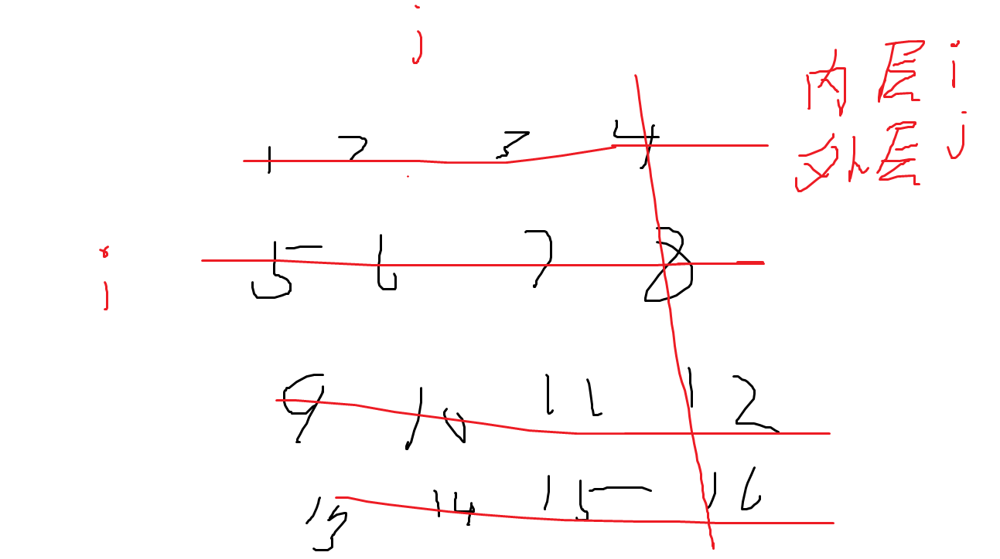

[TOC]  
# 格式
- 全部用c++命名方式,如果有个命名想用下边的子分类不想用大分类就中文命名
例如 指针技巧下有memo_pointer
- 可用.  discrete_fuction.∑∫

# math_refactor公理
- 借鉴数学的ZFC集合论公理体系
Skills->Algorithm ; Skills->JavaSE
- math_refactor是公理体系的公理;Skills里的例如no-backtracking_pointer等都是定理

# math_refactor
```json
{
    "set_theory":"math", //具体参见/Class/Math/集合论 取自vsios部分
    "variable state":["middle of element and set","variables'value degrade to element" ],//variable确定确定的状态退化为集合中具体的元素
    "func":{
        "()io":"order_set input and output",//算法中的函数和集合论的orderset定义一样,但是,算法中更注重io,变量的输入输出和函数栈
        "{}stack":"operate and return when args'state"//底层函数栈,返回函数栈有值
    }
    //记忆算法可省略soo vsios仅取vsios部分,因为算法中集合常用变量代替
    //例如背包问题确定研究位面,物品,数量,最小值三个set-element,再确定order,在确定orderset函数dp,在确定variable:i,j,min;最后确定()io和{}stack
    //dp(i,j)输出为最小值,等价关系是min=dp(i,j)
    //记忆:variable->state   function->()io and {}stack->input output operate return
}
```
```json
{
    "set":"",
    "variable _and_function set":"class",
    "function_set":"interface",
    "variable_set":"struct"
}
```

# if_else
## state_enum
- 在判断边界的时候通常有true false的状态组合,用二进制来考虑状态枚举问题
用二进制考虑所有的状态枚举,写下所有的ifelse
例如二叉树左右孩子的状态null或have 状态组合有11,10,00,01 2^2 4种状态
- state divide and choose 变量状态的分划和选择,对象可以是变量,序偶等,例如a>b相当于(a,b)的state;选择某个状态就在假设某个状态成立下进行后续操作;注意合并逻辑
## state_enum_set
- 二叉树后序遍历将状态s分为左移 右移 弹出三个状态集合

## state_filter e.g.
- 因为状态的枚举太多了所以设计成filter结构减少枚举条件
- state filter(Priority sequence) 建议设计成过滤器的结构,记得加continue return break等
- 归并排序

- 合并链表
if(cur1!=null){
				pre.next=cur1;
			}
			if(cur2!=null){
				pre.next=cur2;
			}
- Vertex.visited
    if(v.visited==true){

    }else{

    }
- public int compare(Integer i1,Integer i2){
        if(i1.age!=i2.age){

        }
        else{}
        if(i1.name != i2.age){

        }else{

        }
}
```java
//1. 单if结构 短路结构  看图
//2. if , else,else if 遇到{return / continue/ break...} 叶子结构 不汇合;
//3. if/else/else if 为分支结构 **最终必汇合到顺序结构**
//4. 先考虑分支结构再考虑叶子结构和短路结构 来简化代码分支;
```

# boundary
- 收纳很多边界判断的技巧
- >= <= 优于==
例如快排中叶子节点为 l>=r 防止l在右边界

# while/for
```json
{
    "variable":"state"
}
```
- 每次迭代都是一个状态
- e.g.
fori  
int i  while{... ;  i++} 末尾i状态变化
- 例如kmp里的前缀函数循环
```go
π(i-1)+1=π(i)
ππ(i-1)+1=π(i)
π^3(i-1)+1=π(i)
...
π^n(i-1)+1=π(i)
//终止条件是π^n==0 || π^n(-1)+1==π(i)
//以1为索引 以0就one_short
```


# tree
- 很多计算机底层都是树结构
- 例如bfs 和 dfs 的queue stack实现,递归.递归树遍历;


# recur_tree:
```json
{
    "set_theory":"math", //具体参见/Class/Math/集合论 skills的公理仅把集合论论的variable 和 function
    "variable":"middle of element and set",
    "state":"variables'value degrade to element" ,//variable确定确定的状态退化为集合中具体的元素
    "function":{
        "()io":"order_set input and output",//数学函数映射定义 参数是变量的副本 
        "{}stack":"operate and return when args'state"//底层函数栈,返回函数栈有值

    }

    //记忆:variable->state   function->()io and {}stack->input output operate return
}
```

- 递归树

递归是对递归树的遍历

## Node
- args state or varible state 函数栈节点的状态
- return state 函数返回会变成具体的值
1个栈{}代表一个节点,每个节点都有一个状态,f(n)n就代表根节点状态
回溯:基本数据类型的状态,随栈自动改变,引用数据类型的状态需要手动改变
栈return就变成了具体的值;

## 对于 递归函数 f()来说,以下开栈都是f()函数栈,其他函数的栈视作基本语句
- 判断关键就是开没开栈
## Leaf
- 节点内部未开f()函数栈的就是叶子节点
- 基本语句,return都算作叶子节点
直接return 无开栈的是leaf节点,基本语句也可视作leaf节点,可以再任何位置;
## Branch
- 节点内部开f()函数栈的就是分支节点
开栈f()可视作branch节点 ,开栈后的return可视作基本语句
## Root
- leaf和branch的区分就是开没开栈
branch节点的结构和root节点的结构相同,且仅能够从root节点设计递归树的结构
## dfs遍历

递归是对递归树的遍历,采取包裹(dfs)式的遍历,遇到叶子节点就返回;
具体例子可思考fabonacci 01背包 n皇后问题 全排列等
## function
- math:f(a,b) 解决a,b状态的问题构建math函数
- stack:用函数栈模拟递归树

## master公式
- T(N)=a*T(N/b)+O(N^c)
- 符合这个公式的递归可以估计复杂度,仅能估计子状态规模相等的情况
例如T(N)=2*T(N/2)+O(1) T(N)=2*T(N*2/3)+O(N) 
    b. 如果log(b,a)  < c，复杂度为：O(n^c)
    c. 如果log(b,a)  > c，复杂度为：O(n^log(b,a))
    d. 如果log(b,a) == c，复杂度为：O(n^c * logn)
    T(n) = 2*T(n/2) + O(n*logn)，时间复杂度是O(n * ((logn)的平方))，证明过程比较复杂，记住即可

## dustbin
- 模板
构建递归树 只能在顶层对root节点进行加入叶子节点来操作;
```c

        //root
void f(int n){      //根节点--确定问题状态(n) (括号里的代表状态)

    //leaf
    if(n==boundary case){  //确定叶子节点--确定base问题状态;
        return;             //注意叶子节点可以在任意地方只要是return前边没有f()造栈语句的就是叶子节点                                 
                          // 判断子问题是否为叶子节点 是就原路返回return 如果不是void函数则带着返回值返回;
    }
    //branch
    leaves;             //a语句
    ...
    f(n-i);             // 分支--子问题的状态(n-i);
    f(n-j);            
    ...                                                   
    leaves;             //b语句

    return             //这个可视作语句 若是带值返回则出栈变为值
}

```
- 具体操作
用简单的问题模拟问题n
先看底层再看顶层 根据node的 状态和返回值设计语句a,b;

```java
public static int[] arr;

    public static void main(String[] args) {
            int n=5;
            arr=new int [n+1];
            Arrays.fill(arr,-1);
            arr[0]=1;arr[1]=1;
            f(n);
        for (int i : arr) {
            System.out.println(i);
        }
    }
    public static void f(int n){
        if(n==1 || n==0){
            return;
        }
        if(arr[n]!=-1){
            return;
        }

        f(n-1);
        f(n-2);

        arr[n]=arr[n-1]+arr[n-2];

    }
```

- 带值返回
例如 int f(int n)  栈pop弹出的时候变成值携带返回
- 回溯
每个子问题的状态参量要一致  例如 f(n-1) 相当于n1=n-1 n-1的子问题的状态参量是n1 
而 n=n-1 f(n)  此时n表示的状态参量与子问题n不一致需要回溯 及 在生成树末尾添加++ 返回时++将状态一致;
- 迭代式
while if形式的 判断边界条件 [__ 然后不断更新至边界条件;
```java
while(true){
    if(boundary case){
        ...
    }
    update;
}
```
while(!boundary case) 等价于 while if(boundary case) break;
if() return  等价于  if else

# prune
- 剪枝

# 指针技巧
## 普通迭代状态指针
- 如果指针模拟状态遍历,那么指到哪里就立即更新他的状态
例如,遍历树的时候指针指向root先把root设置为visited再while遍历
- 下面的高级优化指针都是普通迭代状态指针的自己都继承他的特性
### pointers_container
- 指针过多收集到容器中方便管理
- 这里指针可以是memo,普通状态指针等
- 例如最小栈的memo指针容器;合并k个有序链表的小根堆不回退指针

---
NMP  (no-backtracking memo partition);
## no-backtracking_pointer/不回退指针
no backtracking pointer
- 数组反转
- 例如将数组排序,kmp算法等,A-Bproblem,滑动窗口,供暖器
### order
- 当需要两个指针不断循环的时候可以考虑排序然后改为no-backtracking指针
### 双指针统计(归并)
将两部分排序
n^2的统计通过排序变为n
```java
// 统计部分
		long ans = 0;
		for (int j = m + 1, i = l, sum = 0; j <= r; j++) {
			while (i <= m && arr[i] <= arr[j]) {
				sum += arr[i++];
			}
			ans += sum;
		}
```

### fast-slow_pointer
- 快慢指针
- 距离差,速度差,时间差构筑快慢指针

## memo_pointer/记忆指针
- 设置sentry 划分一维数组 ;
- memo pointer
- 例如(二叉树模拟递归遍历)  用指针记忆是否return的状态;
```java
TreeNode head=node;
TreeNode pop=null;
ArrayDeque<TreeNode> cache=...;
static void dfs(TreeNode node){
     while(true){
            if(head==null && cache.isEmpty()){
                break;
            }
            if(head!=null){
                cache.push(head);
                head=head.left;
            }else{   // null是叶子节点 return;
                TreeNode peek = cache.peek();
                if(peek.right==pop || peek.right==null){  //如果右子树是null或者已被弹出直接return
                    pop = cache.pop();  //标记
                    result.add(pop.val);
                }else{
                    head=peek.right;        //否则head标记为right然后继续进栈;
                }
            }

        }
}
```
- 最小栈记录栈的最小值

## partition_pointer/划分指针
- 和memopointer的区别 memo自身有记忆的状态,partition也可以有记忆区间状态,但是partition可以逐步扩充memo是瞬移,和flag的区别memo和数据结构本身相关,flag
例如bool flag cout等与数据结构本身无关
- partition pointer
用指针划分区域 [] and () 闭区间划分和开区间划分,开区间较为常见,仅二分用闭区间方便
开区域优点是边界可以充当迭代器的头方便迭代
- 开闭结合使用例如快排的三个区域

### 例子
#### 三指针划分(快速)
<的在a左边 大于的在b右边
```java
public static void partition2(int[] arr, int l, int r, int x) {
		first = l;
		last = r;
		int i = l;
		while (i <= last) {
			if (arr[i] == x) {
				i++;
			} else if (arr[i] < x) {
				swap(arr, first++, i++);
			} else {
				swap(arr, i, last--); //i不变因为交换过来的还没有遍历;
			}
		}
	}
```

#### 二分搜索划分红蓝区域寻找边界


# lazy
- 懒操作
1. 什么是懒操作？
懒操作的核心思想是：把本应立即执行的操作延迟到真正需要的时候才去执行。

这样做通常可以节省开销、减少重复计算，从而提升整体运行效率。

2. 常见的应用场景
线段树（Segment Tree）的懒标记 Lazy Propagation）

在线段树中，经常需要对一个区间做批量的更新，比如给 [L, R] 区间加上一个值。
如果直接更新，会递归访问很多节点，复杂度很高。
使用懒操作，我们在访问到某个节点时，不立即更新其所有子节点，而是在该节点上加一个 "懒标记"（Lazy Tag）来记录还没传播下去的修改。
只有在将来真正访问子节点或者需要下层信息时，才把修改传播下去。
函数式编程中的惰性求值（Lazy Evaluation）

- 二叉树的栈模拟后序递归遍历,返回的时候仅当memo没标记右节点且右节点不null才返回到右节点,否则不返回懒住栈一直弹出


1. 为什么需要懒操作？
减少重复工作：更新一个大区间时，不必立刻递归到所有子节点。
提升效率：例如线段树大量区间修改场景，懒传播能把复杂度从 O(n) 降到 O(log n)。
节省内存/计算量：惰性求值避免了不必要的中间结果计算。
1. 一个直观类比
假设有一个教室里的学生座位表：

如果老师要求「给所有学生的成绩+5」，懒操作就是在教室门口挂个牌子写「进入这个班的成绩+5」，而不去一个个加。
等到别人要查某个学生成绩时，才把牌子的+5计算进去并登记好。
5. 懒操作需要注意的问题
保证一致性：传播懒标记的时候要小心，否则可能导致查询结果错误。
时机选择：并不是所有计算都适合懒处理，只有在「多次批量更新、少量查询」这种场景下收益比较大。
✅ 总结：
懒操作就是延迟执行、按需计算的思想。

在数据结构（特别是线段树的区间操作）和函数式编程里尤为重要。它的本质是通过延迟计算来提高整体性能。

要不要我给你画一个具体的例子（比如带懒标记的线段树区间加法的运行图解），这样更直观地展示懒操作是怎么工作的？

# symmetry
- kmp前缀函数Π

# discrete_function
## prefix

## 二分峰值(导函数介值定理)

## Σ∫ 前缀和(积分) 
- 桶排序优化桶
- 1/1+1/2+1/3+...+1/n  is  ∫1/n=lnn的复杂度
- log1+log2+...+logn  is  ∫logn = nlogn
## Δd 差分(微分)

# container
- 为了算法实现构造的容器
## new_container
对某个对象进行操作的时候,最好把结果弄到一个new的对象上例如矩阵转置结果,new在一个新矩阵里否则原矩阵操作困难;
```c
include<stdio.h>

int main(){
    int n, m;
    scanf("%d %d", &n, &m);  // 输入矩阵的行数和列数
    int arr[n][m];            // 原矩阵
    int transpose[m][n];      // 转置矩阵

    // 读入原矩阵
    for (int i = 0; i < n; i++) {
        for (int j = 0; j < m; j++) {
            scanf("%d", &arr[i][j]);
        }
    }

    // 进行转置
    for (int i = 0; i < n; i++) {
        for (int j = 0; j < m; j++) {
            transpose[j][i] = arr[i][j];
        }
    }

    // 输出转置矩阵
    for (int i = 0; i < m; i++) {
        for (int j = 0; j < n; j++) {
            if (j == n - 1) {
                printf("%d\n", transpose[i][j]);  // 最后一项输出换行
            } else {
                printf("%d ", transpose[i][j]);  // 其他项输出空格
            }
        }
    }

    return 0;
}

```

## help_container
- 例如归并排序中的辅助数组,先写入help再刷回原数组,两个数组交替使用
- 基数排序也是这样

### pointers_container
- 指针过多收集到容器中方便管理
- 这里指针可以是memo,普通状态指针等
- 例如最小栈的memo指针容器;合并k个有序链表的小根堆不回退指针

## cache
- 快速去出放入
out in
每次out / in都必须边界判断;
- dfs bfs dijkstra都是 dad out child in的过程
- 节点in or out cache 时候标记为ture相应的 进入 或者拉出的时候判断是否需要continue
- 将第一个节点压入(offer/push)cache来启动
- 父节点拉出(poll/pop),符合要求的子节点进入(push/offer)cache再进行操作;

## hubs
- 集线器
- 在基数(桶)排序中用到了
- 将元素收集到若干个桶中再统一分发


# sentry 
哨兵:辅助作用
- 扫雷的外围一圈0;字符串""都起到辅助作用;
- 链表哨兵节点指向头节点辅助作用
- 常用sentry和new_container配合使用

# flag
- 标记变量 和memo_pointer的区别
flag和数据结构无关 memo和数据结构相关
- cnt flag carry等标记变量


# tmp
- 交换两个数需用道中间变量temp;
- a=a^b;b=a^b;a=a^b;
- int temp=a;
		a=(int)((a+b)-abs(a-b))/2;
		b=(int)((temp+b)+abs(temp-b))/2;


# 数学相关

## order
- 取自有序n元组 序偶
- cmp函数 返回-1在左边1在右边
- 全排列的规范序列

### 上界下界常量倍增估计时间复杂度
- n的时候时间复杂度上界是O(nlogn)
- kn(k取2)2n的时候下界是O(nlogn)
- 由于时间复杂度不变所以是O(nlogn)

## ordinal_cardinal
- 序数 从0开始数轴
- 基数 n [0,n-1]
- 序数+1=基数 基数-1=序数 先有序数数轴(从0开始)再有基数所以序数+1

## (G,*,e,-1) 有序n元组 group_theory


### 数组索引
arr[i] 数量为i+1 n个数的数组是[0,n-1]

## 数论
### mod(%)
- 序数
对于数量n,mod本质是将数轴上的序数映射到0,1,...,n-1
f(x)=x%n : 将序数x映射到[0,n)上 可以看作循环
- 基数
//先x-1转为序数 最后整体+1转为基数
(x-1)%n+1 根据同余原理 -> x%n-1%n+1 == x%n
x%n : 整除n后剩余的数量

### /
- 模映射,经过了多少数量的循环

### 数论微小量1
- 向上取整减去一个微小量1
ceil(a/b)=(a+b-1)/b;
- 边界条件+-个1;
- 1起始的mod运算 (n-1)mod m  +1;
### 同余原理
- 每次运算都mod

## one_short
- 差一问题
- 画匠问题分的组最开始就是1
- 数论微小量向上取整


## 分析几何和向量
### 矩阵遍历
- 嵌套循环的遍历顺序通过正交坐标变化的方向确定,最先移动的是内层循环

- 矩阵乘法三层循环


### 
八皇后问题左斜线和右斜线冲突通过 y=x x+y=1的解析几何角度考虑下标映射;
向量
### 两数最值的向量表示
```
int max=(a+b+abs(a-b))/2;
int min=(a+b-abs(a-b))/2;
```

### 容差法
- 判断中间结果double类型是不是整数
- double有效位数只有15位;
- 定义一个很小的数double epsilon=1e-10
- (a-Math.round(a)) < epsilon  ? true : 
- 为什么要用round因为double运算可能出现15.99999这种;

# binary_bit-operate
- 二进制和位操作
```json
{
    "运算符":"<< >> | & ^ ~ lowbit",//operator
    "状态压缩":"(G,*,e,-1)"    //state_compress
}
```
## 二进制设计
- 以四位为例
- 0000=0  1111+1=0000=0 所以 1111=-1 设计成开头一位1为负数0为整数
0000~0111 表示0~2^3-1  1000~1111 表示 -2^3~-1
## 1248-Taylor级数
- 泰勒级数 0101= 1*2^0+0*2^1+1*2^2;(1,2,4,8);
- 非负数左右移动转换到十进制运算 <<n is *2^n ; >> is /2^n
## 二进制与十进制十六进制
- 4个一组  1011 0001=B1
- 0x  0b 等字面常量

## 运算
### << 
- 带符号左移 高位用符号填充;
a<<n 二进制数左移n位(类比数组索引)
- 十进制
a<<n=a*2^n; 仅对非负数有效
### >>
- 带符号右移 高位用符号填充;
a>>n 二进制数右移n位;
- 十进制
a>>n = a/2^n 整除 仅对非负数有效
- >>>
```cpp
实现无符号右移
int a = -8;
unsigned int result = (unsigned int)a >> 2;  // 先转换为无符号，再右移
```

### |
- 有进位加法 1011|0001=1011 
### &
- 乘法 1011&0001=0001;
- n& 1<<i 可取出n二进制下第i位的数;
- n&1 == 0 可以检查奇偶性
### ^
- 无进位相加  1011^0001=1010 
- 满足交换结合律
- n^n=0  n^0=n;
- 补集 A包含于C  补集就是 C^A   a^b=c   a^b^b=c^b  a^0=c^b a=c^b;
### ~
- -号为 -a=~a+1 
- 注意1000取反加一还是1000不能表示为整数 -256 没有 对应的正数因为最大到255 所以int_min 取绝对值还是自己
### + -
- 数学上的加减
- -:~n+1

### lowbit(brian算法)
- n&(-n)=n&(~n+1) 取出二进制数最右侧的1  01010100->10101011->1010100->00000100 

## (G,*,e,-1)抽象代数(状态压缩)
- (G,*,e,-1) 有序四元组
- 用二进制可以表示boolean数组
用抽象代数思考就是 单位元,运算,brian遍历
- 先设置一个limit表示数组的长度 limit=(0<<n)-1 方便后续移位操作 limit&tmp就能转到表示的数组长度上;
- & 集合的与 乘法  | 集合或 有进位加法  ^ 集合补集 无进位加法 熟悉这些运算和性质方便操作 ~取反
- 遍历状态的时候可以用brian算法提取最右侧的1 tmp&-tmp 适当对状态数组取反方便brian算法遍历;while(n!=0){int tmp=n&-n;n=(n^tmp)&limit;...}


# 打表
- 打表找规律

# 预处理优化（Precomputation Optimization）
- 把长时间打表的答案写进源代码,节省评测机中的时间;
素分解可以先把质数格式化输出成数组再复制粘贴到源代码中;
http://xmuoj.com/problem/LQ018
http://xmuoj.com/problem/LQ386

# 异常
## 数组越界
## 溢出
整数溢出,整数加法溢出中间值换成long;
### l+r/2 经常写作 l+(r-l)>>1 防溢出

## 空指针
- 对象是null却进行了方法;
- null,,栈堆等数据结构是空的却进行了方法
## /0
中间值可能为零然后除了


# while和priority sequence
先操作再说
考虑一般情况再考虑边界情况
先想一般情况操作,然后直接while()后边补充边界判断 可以ifbreak 或者 !();
如果需要循环指标i一定要先把这个写出来!!!!!!;
在循环操作的时候直接 while(!cache.isEmpty() || ...){}来操作
既能减少嵌套if 又能防止null异常;
- 二叉树遍历
- 归并排序
```java
static void merge(int l,int r,int m){
        int a=l;
        int b=m+1;
        int i=l;
        while (!(a>m || b>r)){
            help[i++]= arr[a]<=arr[b] ? arr[a++] : arr[b++];
        }
        while(!(a>m)){
            help[i++]=arr[a++];
        }
        while (!(b>r)){
            help[i++]=arr[b++];
        }

        //调用系统级别api
        System.arraycopy(help,l,arr,l,r-l+1);
    }

```
```java
public class MonotonicQueue {
        ArrayDeque<Integer> deque=new ArrayDeque<>();

        void offer(int element){
            while(!deque.isEmpty() && element>=deque.peekLast()){  //合并逻辑;
                deque.pollLast();
            }
            deque.offerLast(element);
        }

        void poll(){
            deque.pollFirst();
        }

        int peek(){
            return deque.peekFirst();
        }
}
```
# 善用+= -= *= /=
- 和+= -=等运算符


# 函数的静态参数
设计静态共享变量然后 设计 void f() 没有返回直接操作静态变量

# 数组可以考虑成 正半轴,元素索引的右边一位就是前边所有元素的个数,例如{4,3,5,567,4}索引(2,5) 右边一共3个元素 size-index 就是index前边所有元素的个数;


# arr[i++] 
可以实现数组后缀添加;这就是迭代器Iterator的原理 循环完以后正好 为数组个数n;
# dx dy
- int[] dx={0,-1,1,0,0};
- int[] dy={-1,0,0,1,0};
http://xmuoj.com/problem/GW033

```c
include<string.h>
include<stdio.h>
include<math.h>
include<stdlib.h>

int main(){
	int di[]={0,-1,1,0,0};
	int dj[]={-1,0,0,1,0};
	int n;int m;
	int arr[101][101];
	int newArr[101][101];
	scanf("%d %d",&n,&m);
	for(int i=0;i<n;i++){
		for(int j=0;j<m;j++){
		
			scanf("%d",&arr[i][j]);
				if(j==0 || j==m-1 || i==0 || i==n-1){
				newArr[i][j]=arr[i][j];
			}
		}
	}
	
	for(int i=1;i<n-1;i++ ){
		for(int j=1;j<m-1;j++){
			int sum=0;
			for(int k=0;k<5;k++){
				sum+=arr[i+di[k]][j+dj[k]];
			}
			newArr[i][j]=round((double)sum/5);
		}
	}
	
	for(int i=0;i<n;i++){
		
		for(int j=0;j<m;j++){
			if(j==m-1){
				printf("%d",newArr[i][j]);
				
			}
			else printf("%d ",newArr[i][j]);
			if(j==m-1) printf("\n");
		}
	}
	return 0;
	
}
```


 数论("%"(mod) and /) 
# 构造java类建议设置size/n这个成员变量;
- 个数似乎是一个构建和思考的好用的性质
# 进制(mod)
- 10进制转2进制;
```c
int main(){
	int n=23;int d=2;// d是进制数
	int arr[1001]={0};
	int i=0;
	while(n!=0){
		arr[i++]=n%d;   // mod 一次 进位一次 boundary case是0
		n=n/d;
	}
}
```

# 辗转相除法 gcd 和 lcm
辗转相除法（也称为欧几里得算法）

**定理**：两个整数 \(a\) 和 \(b\) 的最大公约数等于 \(b\) 和 \(a \mod b\) 的最大公约数（这里 \(a \mod b\) 表示 \(a\) 除以 \(b\) 的余数）。

即：
\[
\text{GCD}(a, b) = \text{GCD}(b, a \mod b)
\]
这个过程会不断迭代，直到余数为 0，此时 \(b\) 就是 \(a\) 和 \(b\) 的最大公约数。

---

## **算法步骤**
1. 假设我们需要计算两个正整数 \(a\) 和 \(b\) 的最大公约数（假设 \(a > b\））。
2. 求 \(a \mod b\)。
3. 将 \(a\) 更新为 \(b\)，\(b\) 更新为 \(a \mod b\)。
4. 重复上述步骤，直到 \(b = 0\)。
5. 此时，\(a\) 的值就是最大公约数。

---

## **C语言实现**
以下是辗转相除法的 C 语言实现：

```c
include <stdio.h>

// 函数定义：计算两个整数的最大公约数
int gcd(int a, int b) {
    while (b != 0) {  // 当 b 不为 0 时继续迭代
        int temp = a % b;  // 计算 a 除以 b 的余数
        a = b;             // 更新 a 为 b
        b = temp;          // 更新 b 为余数
    }
    return a;  // 当 b 为 0 时，a 即为最大公约数
}

int main() {
    int num1, num2;
    
    // 输入两个整数
    printf("请输入两个整数：");
    scanf("%d %d", &num1, &num2);
    
    // 调用 gcd 函数计算最大公约数
    int result = gcd(num1, num2);
    
    // 输出结果
    printf("最大公约数是：%d\n", result);
    
    return 0;
}
```

---

## **代码说明**
1. **函数 `gcd`**：
   - 输入两个整数 \(a\) 和 \(b\)。
   - 使用 `while` 循环不断计算 \(a \mod b\)，并更新 \(a\) 和 \(b\) 的值。
   - 当 \(b = 0\) 时，循环结束，此时 \(a\) 即为最大公约数。

2. **主函数 `main`**：
   - 通过 `scanf` 获取用户输入的两个整数。
   - 调用 `gcd` 函数计算最大公约数。
   - 使用 `printf` 输出结果。

---

## **运行示例**
假设输入两个整数 56 和 98：

```plaintext
请输入两个整数：56 98
最大公约数是：14
```

**过程分析**：
1. 初始值：\(a = 56\), \(b = 98\)。
2. 第一次迭代：\(a \mod b = 56 \mod 98 = 56\)，更新为 \(a = 98\), \(b = 56\)。
3. 第二次迭代：\(a \mod b = 98 \mod 56 = 42\)，更新为 \(a = 56\), \(b = 42\)。
4. 第三次迭代：\(a \mod b = 56 \mod 42 = 14\)，更新为 \(a = 42\), \(b = 14\)。
5. 第四次迭代：\(a \mod b = 42 \mod 14 = 0\)，更新为 \(a = 14\), \(b = 0\)。
6. 结束：此时 \(b = 0\)，最大公约数为 \(a = 14\)。

---

## **递归实现**
辗转相除法也可以用递归方式实现：

```c
include <stdio.h>

// 递归函数定义
int gcd(int a, int b) {
    if (b == 0) {
        return a;  // 当 b 为 0 时，a 即为最大公约数
    }
    return gcd(b, a % b);  // 递归调用
}

int main() {
    int num1, num2;
    
    // 输入两个整数
    printf("请输入两个整数：");
    scanf("%d %d", &num1, &num2);
    
    // 调用 gcd 函数计算最大公约数
    int result = gcd(num1, num2);
    
    // 输出结果
    printf("最大公约数是：%d\n", result);
    
    return 0;
}
```
在 C 语言中，可以通过 **最大公约数（GCD）** 来计算 **最小公倍数（LCM）**。公式如下：

\[
\text{LCM}(a, b) = \frac{|a \cdot b|}{\text{GCD}(a, b)}
\]

以下是一个完整的 C 语言实现，用于计算两个正整数的最小公倍数。

## 代码实现

```c
include <stdio.h>

// 求最大公约数（使用欧几里得算法）
int gcd(int a, int b) {
    while (b != 0) {
        int temp = b;
        b = a % b;
        a = temp;
    }
    return a;
}

// 求最小公倍数
int lcm(int a, int b) {
    return (a / gcd(a, b)) * b; // 防止溢出，先除以 gcd
}

int main() {
    int num1, num2;
    
    // 输入两个正整数
    printf("请输入两个正整数：");
    scanf("%d %d", &num1, &num2);

    if (num1 <= 0 || num2 <= 0) {
        printf("输入的数字必须是正整数！\n");
        return 1;
    }

    // 计算并输出最小公倍数
    int result = lcm(num1, num2);
    printf("最小公倍数是：%d\n", result);

    return 0;
}
```

---

## 代码说明

1. **最大公约数函数 `gcd`**:
   - 使用 **欧几里得算法** 计算两个数的最大公约数。
   - 算法的核心是：\(\text{GCD}(a, b) = \text{GCD}(b, a \% b)\)，直到 \(b = 0\) 时，\(a\) 即为最大公约数。

2. **最小公倍数函数 `lcm`**:
   - 根据公式 \(\text{LCM}(a, b) = \frac{|a \cdot b|}{\text{GCD}(a, b)}\) 计算最小公倍数。
   - 为了防止整数溢出，先将 \(a\) 除以 \(\text{GCD}(a, b)\)，再乘以 \(b\)。

3. **主函数 `main`**:
   - 提示用户输入两个正整数。
   - 检查输入是否合法（正整数）。
   - 调用 `lcm` 函数计算最小公倍数，并输出结果。

---

## 示例运行

### 输入：
```
请输入两个正整数：12 18
```

### 输出：
```
最小公倍数是：36
```

### 输入：
```
请输入两个正整数：7 5
```

### 输出：
```
最小公倍数是：35
``` 

---

## 注意事项
1. 输入的数必须是正整数，代码中已做简单的输入检查。
2. 如果需要支持更大的数，建议使用 64 位整数（`long long`）。


- 


# 数组映射(自然数集)
## 统计字符串字母出现次数
```
include<stdio.h>
include<math.h>
include<string.h>
int main(){
	char ipt;
	int arr[1001]={0};
	char str[1001]="abc";
//	scanf()
	for(int i=0;i<strlen(str);i++){
		arr[str[i]]+=1;
	}
	printf("%d %d %d",arr[97],strlen(str),(int)'A');
}

String str=new String("abc");
        int[] arr=new int[1001];
        for(int i=0;i<str.length();i++){
            arr[(int)str.charAt(i)]+=1;
        }
        Scanner sc=new Scanner(System.in);
        String x=sc.nextLine();
        System.out.println(arr[(int)x.charAt(0)]);
```

# 输入控制
- *%d 然后用flag标记只有第一个输出%d 然后flag变为1之后不是1就8%d;