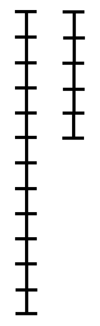

[TOC]

# json格式导论
- 每一部分开头写一个json来作为导论
- "重要内容":"辅助记忆的内容"//注释
- 辅助记忆的内容可以是符号 英文单词 或者自己造的专有名词例如Skills里的很多内容
(自己造专有名词/skills里的>符号>英文单词)注释可以随便修饰
- 目的就是轻量化记忆起到导论的作用总结重点,可以有的没有,不可以有的坚决没有
- mermaid 辅助记忆
- 模板:直接copy
## skills导论设计参考
- 参考自数学的ZFC公理体系集合论
- 通过集合可以构造出代数分析体系
- skills对应集合论公理定理 json对应如何组合公理定理方便记忆

# 理论这一块
## 时间复杂度
- 常数时间O(1)
和数据量无关,固定时间的操纵,PS:常数时间和数据量无关但也可能非常大大于O(n^2)等
数组,hashset...
- 无穷大量(无穷小量)
数据量N 操作次数为f(N) O(f(N)) 
例如 O(N^2)=2N^2+N+3;
- 非随机行为用最差情况估计
随机行为用期望情况,因为最差情况非常差
- 调和级数
1+1/2+...+1/n 用1/x的积分计算为ln(n) 所以为O(logN)


## 数据量猜解法-天字一号技巧
- 一个基本事实
C/C++运行时间1s，java/python/go等其他语言运行时间1s~2s，
对应的常数指令操作量是 10^7 ~ 10^8，不管什么测试平台，不管什么cpu，都是这个数量级
所以可以根据这个基本事实，来猜测自己设计的算法最终有没有可能在规定时间内通过

运用 根据数据量猜解法技巧 的必要条件：
1，题目要给定各个入参的范围最大值，正式笔试、比赛的题目一定都会给，面试中要和面试官确认
2，对于自己设计的算法，时间复杂度要有准确的估计

这个技巧太重要了！既可以提前获知自己的方法能不能通过，也可以对题目的分析有引导作用！


## 数据结构
- 所有数据结构底层都是连续结构(数组),跳转结构(指针链表)拼出来的
- 底层(连续,跳转)->理论(线性表,哈希表,树,图)
- problem->container->slice map tree vertex-edge

# 打表中间件
- 在另一个程序里做好中间件,在目标程序代码里提前做好中间件数组打表之类的,

## 打表找规律

## 习题
### [装苹果问题]
- 打表找规律
```java
package class042;

// 有装下8个苹果的袋子、装下6个苹果的袋子，一定要保证买苹果时所有使用的袋子都装满
// 对于无法装满所有袋子的方案不予考虑，给定n个苹果，返回至少要多少个袋子
// 如果不存在每个袋子都装满的方案返回-1
public class Code01_AppleMinBags {

	public static int bags1(int apple) {
		int ans = f(apple);
		return ans == Integer.MAX_VALUE ? -1 : ans;
	}

	// 当前还有rest个苹果，使用的每个袋子必须装满，返回至少几个袋子
	public static int f(int rest) {
		if (rest < 0) {
			return Integer.MAX_VALUE;
		}
		if (rest == 0) {
			return 0;
		}
		// 使用8规格的袋子，剩余的苹果还需要几个袋子，有可能返回无效解
		int p1 = f(rest - 8);
		// 使用6规格的袋子，剩余的苹果还需要几个袋子，有可能返回无效解
		int p2 = f(rest - 6);
		p1 += p1 != Integer.MAX_VALUE ? 1 : 0;
		p2 += p2 != Integer.MAX_VALUE ? 1 : 0;
		return Math.min(p1, p2);
	}

	public static int bags2(int apple) {
		if ((apple & 1) != 0) {
			return -1;
		}
		if (apple < 18) {
			if (apple == 0) {
				return 0;
			}
			if (apple == 6 || apple == 8) {
				return 1;
			}
			if (apple == 12 || apple == 14 || apple == 16) {
				return 2;
			}
			return -1;
		}
		return (apple - 18) / 8 + 3;
	}

	public static void main(String[] args) {
		for (int apple = 0; apple < 100; apple++) {
			System.out.println(apple + " : " + bags1(apple));
		}
	}

}

```
- 找出来规律
f(n){
    return -1 if 奇数
    rerturn 0 if n==0   
    return 1  if n==6 || n==8
    return 2  if n==12 || n==14 || n==16
    return -1 else
    return (n-18)/8+3; if n>=18
}

### [两牛吃草博弈问题]
```java
package class042;

// 草一共有n的重量，两只牛轮流吃草，A牛先吃，B牛后吃
// 每只牛在自己的回合，吃草的重量必须是4的幂，1、4、16、64....
// 谁在自己的回合正好把草吃完谁赢，根据输入的n，返回谁赢
public class Code02_EatGrass {

	// "A"  "B"
	public static String win1(int n) {
		return f(n, "A");
	}

	// rest : 还剩多少草
	// cur  : 当前选手的名字
	// 返回  : 还剩rest份草，当前选手是cur，按照题目说的，返回最终谁赢 
	public static String f(int rest, String cur) {
		String enemy = cur.equals("A") ? "B" : "A";
		if (rest < 5) {
			return (rest == 0 || rest == 2) ? enemy : cur;
		}
		// rest >= 5
		// rest == 100
		// cur : 
		// 1) 1 ->99,enemy ....
		// 2) 4 ->96,enemy ....
		// 3) 16 -> 84,enemy ....
		// 4) 64 -> 36,enemy ...
		// 没有cur赢的分支，enemy赢
		int pick = 1;
		while (pick <= rest) {
			if (f(rest - pick, enemy).equals(cur)) {
				return cur;
			}
			pick *= 4;
		}
		return enemy;
	}

	public static String win2(int n) {
		if (n % 5 == 0 || n % 5 == 2) {
			return "B";
		} else {
			return "A";
		}
	}

	public static void main(String[] args) {
		for (int i = 0; i <= 50; i++) {
			System.out.println(i + " : " + win1(i));
		}
	}

}

```
- 找出来规律
babaa 将n映射到0~4上 n mod 5

### [是否为连续正整数之和]
- 用滑动窗口解决子串问题
- 打表发现规律 2的幂就是-1
```java
import java.io.*;
import java.lang.invoke.VarHandle;
import java.util.*;
class vector{
    int x;
    int y;
    vector(int xx,int yy){
        x=xx;
        y=yy;
    }
}
public class Main{
    public static int[][] mat;
    public static void main(String[] args) throws IOException {
        BufferedReader reader = new BufferedReader(new InputStreamReader(System.in));
        PrintWriter out = new PrintWriter(new OutputStreamWriter(System.out));
        StreamTokenizer in = new StreamTokenizer(reader);
        //
        for(int i=1;i<=20;i++){
            out.println(i+" " + f(i));
        }
        //
        out.flush();
        out.close();
    }

    public static int f(int n){
        int l=1;int r=1;int sum=0;
        while(r<n){
            //right
            int numr=r;
            r++;
            sum+=numr;
            if(sum==n){
                return r-l;
            }

            //left
            while(sum>n){
                sum-=l++;
                if(sum==n){
                    return r-l;
                }
            }

        }
        return -1;
    }


}
```

# 对数器
```json


```
- 单元测试
- 和暴力解对拍
- 打表找规律

# 语言优化
## io优化
### 一般string int读入
```java
        BufferedReader reader = new BufferedReader(new InputStreamReader(System.in));
        PrintWriter out=new PrintWriter(new OutputStreamWriter(System.out));
        StreamTokenizer st=new StreamTokenizer(reader);
//st首指针在-1
while (st.nextToken() != StreamTokenizer.TT_EOF) { // 文件没有结束就继续 EOF=-1
			// n，二维数组的行
			int n = (int) st.nval;
			st.nextToken();
			// m，二维数组的列
			int m = (int) st.nval;
			out.println(maxSumSubmatrix(mat, n, m));
		}
```
### 读一行
```java
        BufferedReader reader = new BufferedReader(new InputStreamReader(System.in));
        PrintWriter out=new PrintWriter(new OutputStreamWriter(System.out));
        StringTokenizer st=new StringTokenizer("");
        st=new StringTokenizer(reader.readLine());
```

## 随机数优化
public static  Random rand = new Random();
int random=(int)rand.nextInt(r+1-l)+l;
全局定义一个静态的随机数生成器不用每次生成,java的new非常耗时间
Random比math包的快

## 全局静态空间
```java
public class Code03_StaticSpace {

	// 题目给定的行的最大数据量
	public static int MAXN = 201;

	// 题目给定的列的最大数据量
	public static int MAXM = 201;

	// 申请这么大的矩阵空间，一定够用了
	// 静态的空间，不停复用
	public static int[][] mat = new int[MAXN][MAXM];

	// 需要的所有辅助空间也提前生成
	// 静态的空间，不停复用
	public static int[] arr = new int[MAXM];

	// 当前测试数据行的数量是n
	// 当前测试数据列的数量是m
	// 这两个变量可以把代码运行的边界规定下来
	public static int n, m;

	public static void main(String[] args) throws IOException {
		BufferedReader br = new BufferedReader(new InputStreamReader(System.in));
		StreamTokenizer in = new StreamTokenizer(br);
		PrintWriter out = new PrintWriter(new OutputStreamWriter(System.out));
		while (in.nextToken() != StreamTokenizer.TT_EOF) {
			n = (int) in.nval;
			in.nextToken();
			m = (int) in.nval;
			for (int i = 0; i < n; i++) {
				for (int j = 0; j < m; j++) {
					in.nextToken();
					mat[i][j] = (int) in.nval;
				}
			}
			out.println(maxSumSubmatrix());
		}
		out.flush();
		br.close();
		out.close();
	}

	// 求子矩阵的最大累加和，后面的课会讲
	public static int maxSumSubmatrix() {
		int max = Integer.MIN_VALUE;
		for (int i = 0; i < n; i++) {
			// 因为之前的过程可能用过辅助数组
			// 为了让之前结果不干扰到这次运行，需要自己清空辅助数组需要用到的部分
			Arrays.fill(arr, 0, m, 0);
			for (int j = i; j < n; j++) {
				for (int k = 0; k < m; k++) {
					arr[k] += mat[j][k];
				}
				max = Math.max(max, maxSumSubarray());
			}
		}
		return max;
	}

	// 求子数组的最大累加和，后面的课会讲
	public static int maxSumSubarray() {
		int max = Integer.MIN_VALUE;
		int cur = 0;
		for (int i = 0; i < m; i++) {
			cur += arr[i];
			max = Math.max(max, cur);
			cur = cur < 0 ? 0 : cur;
		}
		return max;
	}

}

```

## 哈希表优化
- 全局静态hashmap用的时候clear和用的时候new没啥差距
- map设计成数组的形式比hashmap快非常多
- 

# ====================================================================================================================================== 指针技巧

# 二分
```json 
{   
    "红蓝区域法":null,
    "单调区间":null,
    "红蓝边界":null,
    "划分指针":"partition_pointer"// in Skills
}
```
- 时间复杂度:log(N) 
log(2^32)=32 所以二分非常快

## 红蓝区域法
- BV1d54y1q7k7
### 单调区间
区间满足单调性,区间中x∈red左侧都∈red,x∈blue右侧都∈blue;                  
### 红蓝边界
设置边界,将区间划分为red,blue两个区间
### 划分指针
- red指针初始在-1,blue指针初始在n,red指针左侧是red区域,blue指针右侧是blue区域;
- 取中间值x,若x∈red,red指针扩充到x,若x∈blue...;直到red+1==blue结束循环


## 二分峰值
```json
{
    "数组离散函数":"dr",
    "导函数介值定理":"dr.continue_r",//达布定理Darboux's theorem
    "划分指针":"partition_pointer"//特殊的划分(l,r)必有峰值
}
```
- [二分峰值leetcode](https://leetcode.cn/problems/find-peak-element/)
- 数组就是离散的函数;导函数介值定理;导数相乘<0 中间必有极值点
- 划分指针划分按必有峰值划分,可理解为l左侧必没有r右侧必没有
```java
class Solution {
    public int findPeakElement(int[] arr) {
        int n = arr.length;
        //特判
        if (arr.length == 1) {
            return 0;
        }
        if (arr[0] > arr[1]) {
            return 0;
        }
        if (arr[n - 1] > arr[n - 2]) {
            return n - 1;
        }
        //划分闭区间指针 (l,r)区间必有峰值可理解为l左侧必没有r右侧必没有
        int l=0;int r=n-1;int m=0;int ans=0;
        while(l+1!=r){
            m=(l+r)>>1;
            //左导数<0所以(l,m)必有极值点r扩充到m
            if(arr[m]<arr[m-1]){
                r=m;
            }else if(arr[m+1]>arr[m]){  //右导数>0所以(m,r)必有极值点l扩充的m
                l=m;
            }else{
                ans=m;
                break;
            }
        }
        return ans;
    }
}
```

## 二分答案
- boot
将答案分为两个区间,若mid是右区间则r来到mid 若是左区间l来到mid,直到l+1==r
最终答案就在l或者r上,
- 单调区间
1）估计 最终答案可能的范围 是什么，可以定的粗略，反正二分不了几次
2）分析 问题的答案 和 给定条件 之间的 单调性，大部分时候只需要用到 自然智慧
- 二分边界
3）建立一个f函数，当答案固定的情况下，判断 给定的条件是否达标
- 划分指针
4）在 最终答案可能的范围上不断二分搜索，每次用judge函数判断，直到二分结束，找到最合适的答案
### 习题
#### [爱吃香蕉的珂珂leetcode](https://leetcode.cn/problems/koko-eating-bananas/)
- 单调区间
速度区间 (0,piles.max]
- 二分边界
在h时间内不能吃完 | 在h时间内能吃完
- 向上取整 a+b-1/b
```java
class Solution {
    public int minEatingSpeed(int[] piles, int h) {
        int max=0;
        for (int i = 0; i < piles.length; i++) {
            max=Math.max(max,piles[i]);
        }
        int l=0;int r=max+1;
        while(l+1!=r){
            int m=(l+r)>>1;
            if(panduan(m,h,piles)){
                r=m;
            }else{
                l=m;
            }
        }
        return r;
    }
    //判断能不能吃完
    static boolean panduan(int v,int h,int[] piles){
        long ansh=0;
        for (int i = 0; i < piles.length; i++) {
            //数论微小量1向上取整
            ansh+=(piles[i]+v-1)/v;
            if(ansh>h){
                return false;
            }
        }
        return true;
    }
}
```

#### [画匠问题leetcode](https://leetcode.cn/problems/split-array-largest-sum/)
- flag move_pointer 指针到哪个位置就立即更新对应的状态
- 单调区间
[0,nums.sum],从0到累加和
- 二分区间
能分>k个区间 | 能分<=k个区间
```java
class Solution {
    public int splitArray(int[] nums, int k) {
            int right=0;int left=-1;int m=0;
            for(int i=0;i<nums.length;i++){
                right+=nums[i];
            }
            right++;
            while(left+1!=right){
                m=(left+right)>>1;
                if(judge(nums,k,m)){
                    right=m;
                }else{
                    left=m;
                }
            }
            return right;
    }
    public static boolean judge(int[]nums,int k,int val){
        //指针模拟状态遍历,那么指到哪里就立即更新他的状态
        //初始已经有一个油桶了
        //flag
        int partition=1;
        int sum=0;
        for(int i=0;i<nums.length;i++){
            //单值大于val直接不用分了
            if(nums[i]>val) return false;
            sum+=nums[i];
            //大于就重开一个油桶
            if(sum>val){
                partition++;
                sum=nums[i];
                continue;
            }
        }
        return partition<=k;
    }
}
```

#### [机器人跳跃nowcoder](https://www.nowcoder.com/practice/7037a3d57bbd4336856b8e16a9cafd71)
- 溢出剪枝 prune
```java
public class Main{
    public static void main(String[] args) throws IOException {
        BufferedReader reader = new BufferedReader(new InputStreamReader(System.in));
        PrintWriter out=new PrintWriter(new OutputStreamWriter(System.out));
        StringTokenizer st=new StringTokenizer("");
        //
        int n=0;
        n=Integer.parseInt(reader.readLine());
        st=new StringTokenizer(reader.readLine());
        int max=0;int[] arr=new int[n+1];
        arr[0]=0;
        for(int i=1;i<n+1;i++){
            arr[i]=Integer.parseInt(st.nextToken());
            max=Math.max(arr[i],max);
        }
        int left=-1;int right=max+1;int m=0;
        while(left+1!=right){
            m=(left+right)>>1;
            if(judge(arr,max,m)){
                right=m;
            }else{
                left=m;
            }
        }
        out.println(right);

        //
        out.close();
        reader.close();
    }
    public static boolean judge(int[] arr,int max,int e){
        for(int i=1;i<arr.length;i++){
            if(e>arr[i]){
                e+=e-arr[i];
            }else{
                e-=arr[i]-e;
            }
            if(e<0) return false;
            //找个例子会发现增加的值是2等比数列会溢出所以剪枝超过max必然能过
            if(e>=max) return true;
        }
        return true;
    }
}
```

#### [第k小的数对距离](https://leetcode.cn/problems/find-k-th-smallest-pair-distance/)
```json
{
    "二分答案":"partition_pointer",
    "滑动窗口统计对数":"partition_pointer nb_pointer"
}
```
- 第k小是数量是k个
```java
import java.util.Arrays;

class Solution {
    public int smallestDistancePair(int[] nums, int k) {
        Arrays.sort(nums);
        int l=-1;int r=nums[nums.length-1]-nums[0]+1;int mid=0;
        while(l+1!=r){
            mid =(l+r)>>1;
            int tmp=tongji(nums,mid);
            if(tmp>=k){
                r=mid;
            }else{
                l=mid;
            }
        }
        return r;
    }

    public static  int tongji(int[] arr,int num){
        int r=1;int l=0;int ans=0;
        while(r<arr.length){
            int rnum=arr[r];
            r++;
            while(true){
                int tmp=Math.abs(arr[l]-rnum);
                if(tmp>num){
                    l++;
                }else{
                    break;
                }
            }
            ans+=r-1-l;
        }
        return ans;
    }
}
```

---

# 指针技巧习题
## [删除元素](https://leetcode.cn/problems/remove-element/)
```json
{
    "划分两个区域":"partition_pointer.swap"
}
```
- 这题以后还会在O(1)数据结构题目出现
- 左指针左侧是没有val区域,右指针右侧是val区域,都是开区间,用swap交换元素实现扩充
```java
class Solution {
    public int removeElement(int[] nums, int val) {
        int n=nums.length;
        int l=0;int r=n-1;
        int ans=0;
        while(l<=r){
            int tmp=nums[l];
            if(tmp==val){
                if(nums[r]==val){
                    r--;ans++;
                }else{
                    swap(l,r,nums);
                    r--;ans++;
                }
            }else{
                l++;
            }
        }
        return n-ans;
    }
    public static void swap(int i,int j,int[] arr){
        int tmp=arr[i];
        arr[i]=arr[j];
        arr[j]=tmp;
    }
}
```

## [颜色分类](https://leetcode.cn/problems/sort-colors/)
```json
{
    "划分三个区域":"partition_pointer.swap"
}
//和快排一模一样
```
```java
class Solution {
    public void sortColors(int[] nums) {
        int l=0;int m=0;int r=nums.length-1;
        while(m<=r){
            if(nums[m]==0){
                swap(nums,l,m);
                l++;
                m++;
            }else if(nums[m]==1){
                m++;
            }else{
                swap(nums,m,r);
                r--;
            }
        }
    }
    public static void swap(int[] arr,int a,int b){
        int tmp=0;
        tmp=arr[a];
        arr[a]=arr[b];
        arr[b]=tmp;
    }
}
```

## [按奇偶排序数组 II](https://leetcode.cn/problems/sort-array-by-parity-ii/)
- partition_pointer.swap
设置为[)区域
- 设置一个不动的尾部指针不断往奇数区域偶数区域发货简简单单的
```java
class Solution {
    public int[] sortArrayByParityII(int[] nums) {
        int ji=1;int ou=0;int spy=nums.length-1;
        while(true){
            //奇数弄完偶数一定弄完,反之亦然
            if(ji>=nums.length || ou>=nums.length-1){
                break;
            }
            //是奇数奇数区域扩充,是偶数,偶数区域扩充
            if(nums[spy]%2==0){
                swap(nums,spy,ou);
                ou+=2;
            }else{
                swap(nums,spy,ji);
                ji+=2;
            }

        }
        return nums;
    }
    
    public static void swap(int[] arr,int a,int b){
        int tmp=arr[a];
        arr[a]=arr[b];
        arr[b]=tmp;
    }
}
```

## [寻找重复数](https://leetcode.cn/problems/find-the-duplicate-number/)
- 就是链表题目的寻找入环节点那题[查找链表环起点](https://leetcode.cn/problems/linked-list-cycle-ii/)
- link_arr fast-slow_pointer 
- 将数组看作链表 索引是链表节点,这个数组就形成了一个有环的链表,用快慢指针寻找入环起点
- f指针走两步,s指针走1步,相遇停止,再s从起点开始,s,f都每次走一步,相遇就是入环节点
```java
class Solution {
    public int findDuplicate(int[] nums) {
        int f=0;int s=0;
        while(true){
            //快指针跳两步
            f=nums[nums[f]];
            //慢指针跳一步
            s=nums[s];
            if(f==s) break;
        }
        s=0;
        while(f!=s){
            f=nums[f];
            s=nums[s];
        }
        return f;
    }
}
```

## [接雨水](https://leetcode.cn/problems/trapping-rain-water/)
```json
{
    "前缀max后缀max":"dr.prefix+.subset",
    "指针优化前后缀函数":"reduce_dim nobacktracking_pointer"
}
```
- 对于i位置能够接雨水的数量为不包含他的前缀最大值和不包含他的后缀最大值的min,min-i就是i位置接的雨水数量
- 所以构建数组所有位置的前缀后缀函数,再一个一个遍历
```java
public static int trap1(int[] nums) {
		int n = nums.length;
		int[] lmax = new int[n];
		int[] rmax = new int[n];
		lmax[0] = nums[0];
		// 0~i范围上的最大值，记录在lmax[i]
		for (int i = 1; i < n; i++) {
			lmax[i] = Math.max(lmax[i - 1], nums[i]);
		}
		rmax[n - 1] = nums[n - 1];
		// i~n-1范围上的最大值，记录在rmax[i]
		for (int i = n - 2; i >= 0; i--) {
			rmax[i] = Math.max(rmax[i + 1], nums[i]);
		}
		int ans = 0;
		//   x              x
		//   0 1 2 3...n-2 n-1
		for (int i = 1; i < n - 1; i++) {
			ans += Math.max(0, Math.min(lmax[i - 1], rmax[i + 1]) - nums[i]);
		}
		return ans;
	}
```

- reduce_dim优化
- 可以将前缀函数构建的数组函数用一个指针代替降维优化,前缀后缀直接用两个不回退指针往中间缩
- 左指针左侧函数是确定的,右指针右侧函数是确定的所以取左右最小值即可
```java
class Solution {
    public int trap(int[] height) {
        int l=1;int r=height.length-2;int lmax=0;int rmax=0;
        int ans=0;
        while(l<=r){
            lmax=Math.max(lmax,height[l-1]);
            rmax=Math.max(rmax,height[r+1]);
            //lmax和rmax相等的时候不能l++和r--因为如果l==r,那么就会重复计算
            if(lmax<=rmax){
                int tmp=lmax-height[l];
                if(tmp>0){
                    ans+=tmp;
                }
                l++;
            }else {
                int tmp=rmax-height[r];
                if(tmp>0){
                    ans+=tmp;
                }
                r--;
            }
        }
        return ans;
    }
}
```

## [救生艇](https://leetcode.cn/problems/boats-to-save-people/)
- nobacktracking_pointer 
先排个序然后就能用两个不回退指针了
- 注意双指针收缩两个都收缩的去重问题
```java
import java.util.Arrays;

class Solution {
    public int numRescueBoats(int[] people, int limit) {
        Arrays.sort(people);
        int ans=0;
        int l=0;int r=people.length-1;
        while(l<=r){
            //注意l==r的时候去重
            if(l==r){
                ans++;
                r--;l++;
                continue;
            }
            if(people[l]+people[r]<=limit){
                ans++;
                l++;
                r--;
            }else{
                ans++;
                r--;
            }

        }
        return ans;
    }
}
```

## 扩展
- 加个条件两人只有偶数才能上船
- 因为奇数+奇数=偶数 偶数+偶数=偶数
- 将原数组分成奇数偶数两个数组各自进行操作

## [盛水最多的容器](https://leetcode.cn/problems/container-with-most-water/)
- 简简单单的双指针+贪心
- 贪心反证法证明:在最优解是a,b下,双指针不会错过a,b
假设会错过
不妨设双指针先到达a,因为会错过说明b右侧有c,c>a,a右移此时a,c组成的容积大于a,b组成的容积因为高度取最小值c>a 这里a最小,min(a,b)<=a 
又因为宽度所以a,c是最优解矛盾
原命题成立
```java
class Solution {
    public int maxArea(int[] height) {
        int l=0;int r=height.length-1;
        int ans=0;
        while(l<r){
            int tmp=(r-l)*Math.min(height[l],height[r]);
            ans=Math.max(ans,tmp);
            if(height[l]<=height[r]){
                l++;
            }else{
                r--;
            }
        }
        return ans;
    }
}
```

## [供暖器](https://leetcode.cn/problems/heaters/)
```json
{
    "排序优化为不回退指针":"_pointer",
    "寻找houses匹配的供暖器":"dr.extrema"
}
```
- 传统解法是遍历每个房子每次再遍历每个供暖期找出每个房子最短半径再max O(n*m)
- 先对两个数组排序能够使用不回退指针 O(n+m)
- 供暖器的指针不回退寻找和房子匹配的最短的供暖器
- 通过求解房子到供暖器距离的极值点来确定匹配的
- 第i个房子匹配第j个供暖器,那么第i+1个房子前j-1个供暖器具一定不是极值点,判断后边即可
j-1 i j i+1
j-1 i i+1 j
j-1 j i i+1
 以上情况前j-1个均不是极值点
```java
class Solution {
    public int findRadius(int[] houses, int[] heaters) {
        Arrays.sort(houses);
		Arrays.sort(heaters);
        int j=0;int ans=0;
        for(int i=0;i<houses.length;i++){
            while (true) {
                if(j==heaters.length-1){
                    ans=Math.max(ans,Math.abs(houses[i]-heaters[j]));
                    break;
                }
                int tmp1 = Math.abs(houses[i] - heaters[j]);
                int tmp2=Math.abs(houses[i]-heaters[j+1]);
                if(tmp1<tmp2){
                    ans=Math.max(ans,Math.abs(houses[i]-heaters[j]));
                    break;
                }else{
                    j++;
                }
            }
        }
        return ans;
    }
}
```


## [缺失的第一个正数](https://leetcode.cn/problems/first-missing-positive/) 
```json
{
    "构建和垃圾区":"partition_pointer.swap",//设计成(]区域
    "上确界":"sup"
}
```

- 左指针要用数组的元素构建1,2,3,...,n数列 数列个数的上确界是n就是r+1,如果发现
元素超了r,意味着上确界-1,r元素和l元素交换,r--;

```java
class Solution {
    public int firstMissingPositive(int[] nums) {
        int l=0;int r=nums.length-1;
        while(l<=r){
            //用state filter减少状态组合
            //如果l指针位置就是需要构建的数那么就构建l++
            if(nums[l]==l+1){
                l++;
                continue;
            }
            //如果l位置超过r+1就发往垃圾区,剩下的数仅能构建1~r,r--
            //如果l位置数<l+1说明已经构建过了发往垃圾区r--;
            if(nums[l]>r+1 || nums[l]<l+1){
                swap(nums,l,r);
                r--;
                continue;
            }
            //如果l位置数重复,上确界-- r--
            if(nums[nums[l]-1]==nums[l]){
                swap(nums,l,r);
                r--;
                continue;
            }
            swap(nums,l,nums[l]-1);
        }
        return l+1;
    }
    public static void swap(int[] arr,int a,int b){
        int tmp=arr[a];
        arr[a]=arr[b];
        arr[b]=tmp;
    }
}
```

# ====================================================================================================================================== 基础数据结构

# 基础数据结构
- 所有数据结构底层都是连续结构(数组),跳转结构(指针链表)拼出来的
- 底层(连续,跳转)->理论(线性表,哈希表,树,图)
- 基础数据结构以0初始索引
- 高级数据结构以1初始索引
- 根据ordinal_cardinal,树的深度是root延申的数量,高度是叶子节点眼神到root的数量

# 线性表
- ArrayList slice 记得能remove

## 习题
### [螺旋矩阵](https://leetcode.cn/problems/spiral-matrix/)
- mp vars_hubs.statefilter  (sentry memo_container)
- 简简单单的
```java
class Solution {
    public List<Integer> spiralOrder(int[][] matrix) {
        List<Integer> ans = new ArrayList<>();
        int m=matrix.length;int n=matrix[0].length;
        //sentry+memo_container
        boolean[][] sentry = new boolean[m + 2][n + 2];
        for(int j=0;j<n+2;j++){
            sentry[0][j]=true;
            sentry[m+1][j]=true;
        }
        for(int i=0;i<m+2;i++){
            sentry[i][0]=true;
            sentry[i][n+1]=true;
        }
        int spi=0;int spj=0;
        while(true){
            if(sentry[spi][spj+1]==true && sentry[spi+1][spj]==true && sentry[spi+2][spj+1]==true && sentry[spi+1][spj+2]){
                ans.add(matrix[spi][spj]);
                break;
            }
            //两个flase过滤
            if(sentry[spi+2][spj+1]==false && sentry[spi+1][spj+2]==false)
            {
                ans.add(matrix[spi][spj]);
                sentry[spi+1][spj+1]=true;
                spj++;
                continue;
            }
            if(sentry[spi+1][spj]==false && sentry[spi+2][spj+1]==false)
            {
                sentry[spi+1][spj+1]=true;
                ans.add(matrix[spi][spj]);
                spi++;
                continue;
            }
            if(sentry[spi][spj+1]==false && sentry[spi+1][spj]==false)
            {
                sentry[spi+1][spj+1]=true;
                ans.add(matrix[spi][spj]);
                spj--;
                continue;
            }
            if(sentry[spi][spj+1]==false && sentry[spi+1][spj+2]==false)
            {
                sentry[spi+1][spj+1]=true;
                ans.add(matrix[spi][spj]);
                spi--;
                continue;
            }
            //一个false过滤
            if(sentry[spi+1][spj+2]==false)
            {
                sentry[spi+1][spj+1]=true;
                ans.add(matrix[spi][spj]);
                spj++;
                continue;
            }
            if(sentry[spi+2][spj+1]==false)
            {
                sentry[spi+1][spj+1]=true;
                ans.add(matrix[spi][spj]);
                spi++;
                continue;
            }
            if(sentry[spi+1][spj]==false)
            {
                sentry[spi+1][spj+1]=true;
                ans.add(matrix[spi][spj]);
                spj--;
                continue;
            }
            if(sentry[spi][spj+1]==false )
            {
                sentry[spi+1][spj+1]=true;
                ans.add(matrix[spi][spj]);
                spi--;
                continue;
            }

        }
        return ans;
    }
}
```

# 链表
```json
{
    "链表构造模型":"sentry memo_pointer container.new_container",//memo_pointer记忆尾节点
    "指针技巧":"memo_pointer nobacktracking_pointer",
    "快慢指针":"fastslow_pointer"
}
```
## 函数参数
- 函数参数是将变量拷贝副本传递到函数,指针也是变量,指针副本指向同一块内存区域
## 链表模型

- sentry节点
设置哨兵节点指向链表头节点方便插入 newNode.next=sentry.next;sentry.next=newNode;

- memo指针
指向链表的尾节点实现正序插入,记忆尾节点,也是memo指针的一种

- 指针
## 习题
### [两两交换链表中的节点](https://leetcode.cn/problems/swap-nodes-in-pairs)
- 链表模型(sentry memo_pointer) memo_pointer move_pointer
```java
class Solution {
    public ListNode swapPairs(ListNode head) {
        ListNode sentry=new ListNode(-1);
        ListNode pre=sentry;
        ListNode mp=head;
        ListNode memo1= head;
        ListNode memo2=head;
        while(true){
            if(mp==null || mp.next == null){
                break;
            }
            memo1=mp.next;
            memo2=memo1.next;
            memo1.next=pre.next;
            pre.next=memo1;
            pre=pre.next;
            mp.next=pre.next;
            pre.next=mp;
            pre=pre.next;
            mp=memo2;
        }
        if(mp!=null){
            mp.next=pre.next;
            pre.next=mp;
        }
        return sentry.next;
    }
}
```

### [链表反转leetcode](https://leetcode.cn/problems/reverse-linked-list/)
```java
class Solution {
    public ListNode reverseList(ListNode head) {
        if(head==null){
            return null;
        }
        //设置两个哨兵节点
        ListNode sentryHead=new ListNode();
        sentryHead.next=head;
        ListNode sentryAns=new ListNode();
        sentryAns.next=null;
        //设置memo指针
        ListNode p=head;
        while(p!=null){
            p=p.next;
            sentryHead.next.next=sentryAns.next;
            sentryAns.next=sentryHead.next;
            sentryHead.next=p;
        }
        return sentryAns.next;
    }
}
```

### [链表分组反转](https://leetcode.cn/problems/reverse-nodes-in-k-group/)
```json
{   
    "链表模型容器":"sentry memo_pointer flag",//用一个flag变量标记memo指向容器的最后一个元素方便sentry转移
    "很多个指针":"memo_pointer"
}
```
```java
public class Solution {
    public ListNode reverseKGroup(ListNode head, int k) {
        ListNode sentry = new ListNode(666);
        ListNode ans=sentry;
        ListNode prev=sentry;
        ListNode p=head;
        ListNode pmemo=head;
        ListNode p1=head;
        loop:
        while(true){
            for(int i=1;i<=k;i++){
                if(p1==null){
                    break loop;
                }
                p1=p1.next;
            }
            int flag=1;
            while (p!=p1){
                pmemo=p.next;
                p.next=sentry.next;
                sentry.next=p;
                p=pmemo;
                //flag标记代表第一次操作的状态
                //state filter 第一次操作时执行并状态改变
                if(flag==1){
                    prev=sentry.next;
                    //状态改变不再是第一次
                    flag=2;
                }

            }
            sentry=prev;
        }
        prev.next=p;
        return ans.next;

    }
}
```

### [合并有序链表leetcode](https://leetcode.cn/problems/merge-two-sorted-lists/)
好想的newContainer方法优化为在原链表模拟newContainer;
- 构造一个新的链表容器然后将节点逐一比较插入
- nobacktracking_pointer memo_pointer
```java
public static ListNode mergeTwoLists(ListNode head1, ListNode head2) {
			if (head1 == null || head2 == null) {
				return head1 == null ? head2 : head1;
			}
            ListNode head=null;
            //两个不回退指针
            ListNode cur1=null;
            ListNode cur2=null;
            if(head1.val<=head2.val){
                head=head1;
                cur1=head.next;
                cur2=head2;
            }else{
                head=head2;
                cur1=head.next;
                cur2=head1;
            }
            //设置pre 记忆指针memo
			ListNode pre = head;
			while (cur1 != null && cur2 != null) {
				if (cur1.val <= cur2.val) {
					pre.next = cur1;
					cur1 = cur1.next;
				} else {
					pre.next = cur2;
					cur2 = cur2.next;
				}
				pre = pre.next;
			}
			if(cur1!=null){
				pre.next=cur1;
			}
			if(cur2!=null){
				pre.next=cur2;
			}
			return head;
		}
```

### [链表相加leetcode](https://leetcode.cn/problems/add-two-numbers)
```java
class Solution {
    public ListNode addTwoNumbers(ListNode l1, ListNode l2) {
        int carry=0;int tmp=0;
        ListNode sentry=new ListNode();
        sentry.next=null;
        ListNode pre=new ListNode();
        pre=sentry;
        ListNode p1=l1;
        ListNode p2=l2;
        while(p1!=null || p2!=null){
            if (p1!=null && p2!=null) {
                tmp=p1.val+p2.val+carry;
                carry=tmp/10;
                tmp=tmp%10;
                pre.next=new ListNode(tmp);
                pre=pre.next;
                p1=p1.next;
                p2=p2.next;
            }
            else if(p1==null && p2!=null){
                tmp=0+p2.val+carry;
                carry=tmp/10;
                tmp=tmp%10;
                pre.next=new ListNode(tmp);
                pre=pre.next;
                p2=p2.next;
            }
            else if(p2==null && p1!=null){
                tmp=p1.val+0+carry;
                carry=tmp/10;
                tmp=tmp%10;
                pre.next=new ListNode(tmp);
                pre=pre.next;
                p1=p1.next;
            }
            //也可以改成state_filter形式 if()...continue

        }
        if(carry!=0){
            pre.next=new ListNode(carry);
            pre=pre.next;
        }
        pre.next=null;
        return sentry.next;

    }
}
```

### [划分链表leetcode](https://leetcode.cn/problems/partition-list/)
- sentry_node memo_pointer new_container
```java
class Solution {
    public ListNode partition(ListNode head, int x) {
        ListNode xiaoSentry = new ListNode(300);
        ListNode daSentry = new ListNode(300);
        //设置两个记忆指针记忆两个新链表的尾节点
        ListNode xiaoPre=xiaoSentry;
        ListNode daPre=daSentry;
        ListNode p=head;
        //记忆指针记忆p的下一个位置
        ListNode memo=head;
        while(p!=null){
            memo=p.next;
            if(p.val<x){
                xiaoPre.next=p;
                xiaoPre=p;
                p.next=null;
            }else{
                daPre.next=p;
                daPre=p;
                p.next=null;
            }
            p=memo;
        }
        if(xiaoSentry.next==null){
            return daSentry.next;
        }
        if(daSentry.next==null){
            return xiaoSentry.next;
        }
        xiaoPre.next=daSentry.next;
        return xiaoSentry.next;
    }
}
```

### [复制随机指针链表](https://leetcode.cn/problems/copy-list-with-random-pointer/)
- memo指针,container在原结构构建容器
- 把新节点和旧节点串起来,起到容器的作用,然后再遍历构造新节点的random最后再用memo指针分离开新旧节点
```java
class Solution {
    public Node copyRandomList(Node head) {
        if(head==null) return null;
        Node sentry=head;
        Node p=head;
        Node prev=head;
        //新旧节点串起来 1,1',2,2',3,3',...,null
        while(p!=null){
            prev=p.next;
            Node tmp = new Node(p.val);
            tmp.next=prev;
            p.next=tmp;
            p=prev;
        }
        //构建新节点random信息
        p=sentry;
        while(p!=null){
            //注意boundary可能为null
            if(p.random==null){
                p.next.random=null;
            }else{
                p.next.random=p.random.next;
            }
            p=p.next.next;
        }
        Node sentry1=sentry.next;
        p=sentry;Node memo;
        //分离新旧节点
        while(p.next.next!=null){
            prev=p.next.next;
            memo=p.next;
            memo.next=prev.next;
            p.next=prev;
            p=prev;
        }
        p.next=null;
        return sentry1;


    }
}
```

### [链表中点](https://leetcode.cn/problems/middle-of-the-linked-list/)
- 快慢指针简简单单的
```java
class Solution {
    public ListNode middleNode(ListNode head) {
        ListNode f=head;
        ListNode s=head;
        if(f.next==null) return f;
        if(f.next.next==null) return f.next;
        while(true){
            s=s.next;
            f=f.next.next;
            if(f.next==null) return s;
            if(f.next.next==null) return s.next;
        }
    }
}
```

### [链表排序](https://leetcode.cn/problems/sort-list/)
```json
{
    "寻找中点,归并排序":"fast-slow_pointer ro.subset help_container/sentry memo_pointer"
}
```
- 就是个链表的归并排序,用快慢指针寻找中点
- 然后递归两部分,再将两部分归并到辅助空间上,这个辅助空间就是链表模型(sentry memo_pointer)
- 子集分析
f(head)={
    head if head就一个next就是null
    merge(f(head.l),f(head.r));
}
- 每次递归的链表都最后指向null规范化方便操作
```java
class Solution {
    //链表模型辅助空间
    public static ListNode sentry=new ListNode(-1);
    public ListNode sortList(ListNode head) {
        if(head==null) return null;
        sentry.next=null;
        return dfs(head);
    }
    public static ListNode dfs(ListNode head){
        if(head.next==null ){
            return head;
        }
        //快慢指针找中点
        ListNode fast=head;
        ListNode slow=head;
        while(true){
            fast=fast.next;
            if(fast==null) break;
            fast=fast.next;
            if(fast==null) break;
            slow=slow.next;
        }
        ListNode tmp=slow.next;
        slow.next=null;
        //
        ListNode head1=dfs(head);
        ListNode head2=dfs(tmp);
        //链表模型辅助空间,用的时候next=null实现清空
        sentry.next=null;
        ListNode pre=sentry;
        ListNode sp1=head1;
        ListNode sp2=head2;
        ListNode memo1=sp1;
        ListNode memo2=sp2;
        while(sp1!=null && sp2!=null){
            if(sp1.val<=sp2.val){
                memo1=sp1.next;
                sp1.next=pre.next;
                pre.next=sp1;
                pre=pre.next;
                sp1=memo1;
            }else{
                memo2=sp2.next;
                sp2.next=pre.next;
                pre.next=sp2;
                pre=pre.next;
                sp2=memo2;
            }
        }
        if(sp1!=null){
            pre.next=sp1;
        }
        if(sp2!=null){
            pre.next=sp2;
        }
        return sentry.next;
    }
}
```

### [判断链表是不是回文](https://leetcode.cn/problems/palindrome-linked-list/)
- 快慢指针寻找中点然后,将右部分反转左右对比;
- 用额外空间的是将节点值存入数组然后不回退双指针遍历即可简简单单的
```json
{
    "寻找中点":"fast-slow_pointer",
    "反转右部分":"container"//链表模型
}
```
```java

 class Solution {
     public boolean isPalindrome(ListNode head) {
        ListNode s=head;
        ListNode f=head;
        while(f.next!=null && f.next.next!=null){
            s=s.next;
            f=f.next.next;
        }
        ListNode sentry=new ListNode(666);
        ListNode p=s.next;
        ListNode prev=p;
        while(p!=null){
            prev=p.next;
            p.next=sentry.next;
            sentry.next=p;
            p=prev;
        }
        p=sentry.next;
        while(p!=null){
            if(p.val!=head.val){
                return false;
            }
            p=p.next;
            head=head.next;
        }
        return true;

     }
 }
```

### [重排链表](https://leetcode.cn/problems/reorder-list)
- fast-slow_pointer 链表模型(sentry memo_pointer) memo_pointer mp
- 和上一题做法一样
```java
class Solution {
    public void reorderList(ListNode head) {
        //快慢指针找中点
        ListNode fast=head;
        ListNode slow=head;
        while(true){
            fast=fast.next;
            if(fast==null){
                break;
            }
            fast=fast.next;
            if(fast==null){
                break;
            }
            slow=slow.next;
        }
        //逆序链表
        ListNode sentry=new ListNode(-1);
        ListNode mp=slow.next;
        ListNode memo=mp;
        while(mp!=null){
            memo=mp.next;
            mp.next=sentry.next;
            sentry.next=mp;
            mp=memo;
        }
        //归并
        ListNode sp1=head;ListNode memo1=sp1;
        ListNode sp2=sentry.next;ListNode memo2=sp2;
        ListNode ans=new ListNode(-1);
        ListNode pre=ans;
        while(sp2!=null){
            memo1=sp1.next;
            memo2=sp2.next;
            sp1.next=pre.next;
            pre.next=sp1;
            pre=pre.next;
            sp2.next=pre.next;
            pre.next=sp2;
            pre=pre.next;
            sp1=memo1;
            sp2=memo2;
        }
        if(sp1==slow){
            sp1.next=pre.next;
            pre.next=sp1;
        }
        head=ans.next;
    }
}
```

### [链表排序](https://leetcode.cn/problems/sort-list)
- 好麻烦目前除了作甚的有递归做法
```java
class Solution {
    public ListNode sortList(ListNode head) {
        return sortList(head, null);
    }

    public ListNode sortList(ListNode head, ListNode tail) {
        if (head == null) {
            return head;
        }
        if (head.next == tail) {
            head.next = null;
            return head;
        }
        ListNode slow = head, fast = head;
        while (fast != tail) {
            slow = slow.next;
            fast = fast.next;
            if (fast != tail) {
                fast = fast.next;
            }
        }
        ListNode mid = slow;
        ListNode list1 = sortList(head, mid);
        ListNode list2 = sortList(mid, tail);
        ListNode sorted = merge(list1, list2);
        return sorted;
    }

    public ListNode merge(ListNode head1, ListNode head2) {
        ListNode dummyHead = new ListNode(0);
        ListNode temp = dummyHead, temp1 = head1, temp2 = head2;
        while (temp1 != null && temp2 != null) {
            if (temp1.val <= temp2.val) {
                temp.next = temp1;
                temp1 = temp1.next;
            } else {
                temp.next = temp2;
                temp2 = temp2.next;
            }
            temp = temp.next;
        }
        if (temp1 != null) {
            temp.next = temp1;
        } else if (temp2 != null) {
            temp.next = temp2;
        }
        return dummyHead.next;
    }
}

作者：力扣官方题解
链接：https://leetcode.cn/problems/sort-list/solutions/492301/pai-xu-lian-biao-by-leetcode-solution/
来源：力扣（LeetCode）
著作权归作者所有。商业转载请联系作者获得授权，非商业转载请注明出处。
```

### [删除倒数第n个节点leetcode](https://leetcode.cn/problems/remove-nth-node-from-end-of-list/)
```json
{
    "距离快慢指针":"fast-slow_pointer"
}
```
- 快慢指针 fastslow_pointer 设置不回退指针的距离差
```java
class Solution {
    public ListNode removeNthFromEnd(ListNode head, int n) {
        ListNode sentry = new ListNode(666);
        sentry.next=head;
        ListNode pRight=head;
        ListNode pLeft=head;
        ListNode memo=sentry;
        //构造距离差
        for(int i=0;i<n;i++){
            pRight=pRight.next;
        }
        while(pRight!=null){
            pRight=pRight.next;
            pLeft=pLeft.next;
            memo=memo.next;
        }
        memo.next=pLeft.next;
        return sentry.next;
    }
}
```

### [判断链表相交的交点](https://leetcode.cn/problems/intersection-of-two-linked-lists/)
```json
{
    "距离快慢指针":"fast-slow_pointer"
}
```
- 先得出两链表长度,长的前进使得两个指针在同一起点
```java
public class Solution {
    public ListNode getIntersectionNode(ListNode headA, ListNode headB) {
        ListNode a=headA;
        ListNode b=headB;
        int cnta=0;
        int cntb=0;
        while(a!=null){
            cnta++;
            a=a.next;
        }
        while (b!=null){
            cntb++;
            b=b.next;
        }
        a=headA;
        b=headB;
        if(cnta<=cntb){
            int tmp=cntb-cnta;
            for (int i = 0; i < tmp; i++) {
                b=b.next;
            }
        }else{
            int tmp=cnta-cntb;
            for (int i = 0; i < tmp; i++) {
                a=a.next;
            }
        }
        while(true){
            if(a==b) return a;
            a=a.next;
            b=b.next;
        }
    }
}
```

### [查找链表环起点](https://leetcode.cn/problems/linked-list-cycle-ii/)
```json
{
    "距离快慢指针":"fast-slow_pointer"
}
```
- head是起点 f速度是2 s速度是1,相交停止,再从头速度都是1 相交就是ans

```java

public class Solution {
    public ListNode detectCycle(ListNode head) {
        ListNode s=head;
        ListNode f=head;
        if(head==null) return null;
        while(true){
            if(f.next==null || f.next.next==null) return null;
            f=f.next.next;
            s=s.next;
            if(f==s){
                break;
            }
        }
        s=head;
        while(s!=f){
            f=f.next;
            s=s.next;
        }
        return s;
    }
}
```

# 队列和栈
## 数组实现队列和栈
- 队列构造[)partition pointer
```java
int[] arr=new int[3004];int l=0;int r=0;
arr[r++]=offer
arr[l++]=poll
```
- 栈同理
## 习题
### [LRU缓存模拟](https://leetcode.cn/problems/lru-cache/)
```json
{
    "双向链表队列+哈希表":"map_container.map_link"
}
```
- 双向链表队列+哈希表
- 用双向链表做队列方便O(1)复杂度找到container中的元素并remove,正常队列只能头部和尾部
```java
class LRUCache {
    class DoubleNode {
        public int key;
        public int val;
        public DoubleNode last;
        public DoubleNode next;

        public DoubleNode(int k, int v) {
            key = k;
            val = v;
        }
        public DoubleNode(){}
    }
    DoubleNode sentryHead=new DoubleNode();
    DoubleNode sentryTail=new DoubleNode();
    int len=0;
    int cap;
    HashMap<Integer,DoubleNode> map=new HashMap<>();
    public LRUCache(int capacity) {
        cap=capacity;
        sentryHead.next=sentryTail;
        sentryTail.last=sentryHead;
    }
    public  void offer(DoubleNode d){
        DoubleNode tmp = sentryTail.last;
        d.next=sentryTail;
        sentryTail.last=d;
        d.last=tmp;
        tmp.next=d;
        map.put(d.key,d);
    }
    public  void poll(){
        DoubleNode remove=sentryHead.next;
        DoubleNode tmp = sentryHead.next.next;
        sentryHead.next=tmp;
        tmp.last=sentryHead;
        map.remove(remove.key);
    }
    public void read(DoubleNode d){
        DoubleNode last = d.last;
        DoubleNode next = d.next;
        last.next=next;
        next.last=last;
        DoubleNode tmp = sentryTail.last;
        d.next=sentryTail;
        sentryTail.last=d;
        d.last=tmp;
        tmp.next=d;
    }

    public int get(int key) {
        if(map.containsKey(key)==false) return -1;
        read(map.get(key));
        return map.get(key).val;
    }

    public void put(int key, int value) {
        DoubleNode doubleNode = new DoubleNode(key, value);
        //这里注意boundary,如果已经存在要弹出再offer最后return
        if(map.containsKey(key)){
            DoubleNode d = map.get(key);
            DoubleNode last = d.last;
            DoubleNode next = d.next;
            last.next=next;
            next.last=last;
            offer(doubleNode);
            map.put(key,doubleNode);
            return;
        }
        if(len<cap){
            offer(doubleNode);
            len++;
        }else{
            poll();
            offer(doubleNode);
        }
    }
}

```

### [栈模拟队列leetcode](https://leetcode.cn/problems/implement-queue-using-stacks/)
- 两个栈循环
```java

class MyQueue {
    ArrayDeque<Integer> in=new ArrayDeque<>();
    ArrayDeque<Integer> out=new ArrayDeque<>();
    public MyQueue() {

    }
    //将in栈元素全部倒入out栈
    public void dao(){
        while(true){
            if(in.isEmpty()){
                break;
            }
            Integer pop = in.pop();
            out.push(pop);
        }
    }

    public void push(int x) {
        in.push(x);
    }

    public int pop() {
        if(out.isEmpty()){
            dao();
        }
        return out.pop();
    }

    public int peek() {
        if(out.isEmpty()){
            dao();
        }
        return out.peek();
    }

    public boolean empty() {
        if(in.isEmpty() && out.isEmpty()) return true;
        return false;
    }
}

```

### [队列模拟栈leetcode](https://leetcode.cn/problems/implement-stack-using-queues/)
- 一个队列循环
```java
	class MyStack {

		Queue<Integer> queue;

		public MyStack() {
			queue = new LinkedList<Integer>();
		}

		// O(n)
		public void push(int x) {
			int n = queue.size();
			queue.offer(x);
            //记录前边几个元素循环加入末尾
			for (int i = 0; i < n; i++) {
				queue.offer(queue.poll());
			}
		}

		public int pop() {
			return queue.poll();
		}

		public int top() {
			return queue.peek();
		}

		public boolean empty() {
			return queue.isEmpty();
		}

	}
```

### [最小栈leetcode](https://leetcode.cn/problems/min-stack/)
```json
{
    "记忆栈":"memo_container"//最小栈的每个元素记忆原栈到栈底的最小值,将记忆指针放入容器方便管理
}
```
```java
class MinStack1 {
		public Stack<Integer> data;
		public Stack<Integer> min;

		public MinStack1() {
			data = new Stack<Integer>();
			min = new Stack<Integer>();
		}

		public void push(int val) {
			data.push(val);
			if (min.isEmpty() || val <= min.peek()) {
				min.push(val);
			} else { // !min.isEmpty() && val > min.peek()
				min.push(min.peek());
			}
		}

		public void pop() {
			data.pop();
			min.pop();
		}

		public int top() {
			return data.peek();
		}

		public int getMin() {
			return min.peek();
		}
	}
```

### [最大频率栈(二维栈)](https://leetcode.cn/problems/maximum-frequency-stack/)
```json
{
    "构造一个二维栈套栈":"multidim_container",
    "map记忆频率":"map_container"
}
```
```java
class FreqStack {
    HashMap<Integer,Integer> map;
    int max=0;
    HashMap<Integer, ArrayList<Integer>> stack;
    public FreqStack() {
        map=new HashMap<>();
        stack=new HashMap<>();
    }

    public void push(int val) {
        if(map.containsKey(val)){
            map.put(val,map.get(val)+1);
        }else{
            map.put(val,1);
        }
        Integer cishu = map.get(val);
        if(stack.containsKey(cishu)){
            stack.get(cishu).add(val);
        }else{
            ArrayList<Integer> arr = new ArrayList<>();
            arr.add(val);
            stack.put(cishu,arr);
            max++;
        }

    }

    public int pop() {
        List<Integer> arr = stack.get(max);
        Integer remove = arr.remove(arr.size() - 1);
        map.put(remove,map.get(remove)-1);
        if(arr.isEmpty()){
            stack.remove(max);
            max--;
        }
        return remove;
    }
}
```

# 哈希表
- 去出hash表某个元素可用迭代器
tmp for(i:hashset){tmp=i;break;}

## 哈希数组
- 哈希表记录元素在数组中的索引

### 习题
#### [O(1) 时间插入、删除和获取随机元素](https://leetcode.cn/problems/insert-delete-getrandom-o1/)
```json
{
    "填remove的空隙":"partition_pointer",//用到划分指针的swap填充功能
    "哈希表计录每个元素索引":"container"//哈希容器
}
```
```java
import java.util.*;

class RandomizedSet {
    private ArrayList<Integer> arr;
    private HashMap<Integer,Integer> map;
    private Random rand;

    public RandomizedSet() {
        arr = new ArrayList<>();
        map = new HashMap<>();
        rand = new Random();
    }

    public boolean insert(int val) {
        if(map.containsKey(val)) return false;
        arr.add(val);
        map.put(val, arr.size() - 1);
        return true;
    }
    //划分指针的swap功能
    public boolean remove(int val) {
        if(!map.containsKey(val)) return false;
        int index = map.get(val);
        int lastVal = arr.get(arr.size() - 1);

        // 把最后的元素放到 index 位置
        arr.set(index, lastVal);
        map.put(lastVal, index);

        // 删除最后一个
        arr.remove(arr.size() - 1);
        map.remove(val);
        return true;
    }

    public int getRandom() {
        int index = rand.nextInt(arr.size());
        return arr.get(index);
    }
}

```

#### [O(1) 时间插入、删除和获取随机元素 - 允许重复](https://leetcode.cn/problems/insert-delete-getrandom-o1-duplicates-allowed/)
```json
{
    "填remove的空隙":"partition_pointer",//用到划分指针的swap填充功能
    "哈希表计录每个元素索引":"container"
}
```
```java
import java.util.*;

class RandomizedCollection {
    HashMap<Integer, HashSet<Integer>> map=new HashMap<>();
    ArrayList<Integer> arr=new ArrayList<>();
    public RandomizedCollection() {

    }

    public boolean insert(int val) {
        if(map.containsKey(val)){
            arr.add(val);
            HashSet<Integer> set = map.get(val);
            set.add(arr.size()-1);
            return false;
        }
        arr.add(val);
        HashSet<Integer> set = new HashSet<>();
        set.add(arr.size()-1);
        map.put(val,set);
        return true;
    }

    public boolean remove(int val) {
        if(!map.containsKey(val)) return false;
        HashSet<Integer> valSet = map.get(val);
        int valIndex=0;
        for (Integer i : valSet) {
            valIndex=i;
            break;
        }
        int tailIndex=(arr.size()-1);
        int tailVal = arr.get(tailIndex);
        HashSet<Integer> tailSet = map.get(tailVal);
        if(val==tailVal){
            //注意移出尾巴元素
            valSet.remove(tailIndex);
        }else{
            arr.set(valIndex,tailVal);
            valSet.remove(valIndex);
            tailSet.remove(tailIndex);
            tailSet.add(valIndex);
        }
        arr.remove(tailIndex);
        //注意如果容器空了要移出map
        if(valSet.isEmpty()) map.remove(val);
        return true;
    }

    public int getRandom() {
        return arr.get((int)(Math.random() * arr.size()));
    }
}

```

## 哈希链表
```json
{
    "哈希双向链表":"map_container.map_link"
}
```
- 将哈希表和双向链表结合实现数组的查找方便和链表的crud方便,实现两个线性表的优点

### 习题
#### [LRU缓存模拟](https://leetcode.cn/problems/lru-cache/)
```json
{
    "双向链表队列+哈希表":"container"
}
```
- 双向链表队列+哈希表
- 用双向链表做队列方便O(1)复杂度找到container中的元素并remove,正常队列只能头部和尾部
```java
class LRUCache {
    class DoubleNode {
        public int key;
        public int val;
        public DoubleNode last;
        public DoubleNode next;

        public DoubleNode(int k, int v) {
            key = k;
            val = v;
        }
        public DoubleNode(){}
    }
    DoubleNode sentryHead=new DoubleNode();
    DoubleNode sentryTail=new DoubleNode();
    int len=0;
    int cap;
    HashMap<Integer,DoubleNode> map=new HashMap<>();
    public LRUCache(int capacity) {
        cap=capacity;
        sentryHead.next=sentryTail;
        sentryTail.last=sentryHead;
    }
    public  void offer(DoubleNode d){
        DoubleNode tmp = sentryTail.last;
        d.next=sentryTail;
        sentryTail.last=d;
        d.last=tmp;
        tmp.next=d;
        map.put(d.key,d);
    }
    public  void poll(){
        DoubleNode remove=sentryHead.next;
        DoubleNode tmp = sentryHead.next.next;
        sentryHead.next=tmp;
        tmp.last=sentryHead;
        map.remove(remove.key);
    }
    public void read(DoubleNode d){
        DoubleNode last = d.last;
        DoubleNode next = d.next;
        last.next=next;
        next.last=last;
        DoubleNode tmp = sentryTail.last;
        d.next=sentryTail;
        sentryTail.last=d;
        d.last=tmp;
        tmp.next=d;
    }

    public int get(int key) {
        if(map.containsKey(key)==false) return -1;
        read(map.get(key));
        return map.get(key).val;
    }

    public void put(int key, int value) {
        DoubleNode doubleNode = new DoubleNode(key, value);
        //这里注意boundary,如果已经存在要弹出再offer最后return
        if(map.containsKey(key)){
            DoubleNode d = map.get(key);
            DoubleNode last = d.last;
            DoubleNode next = d.next;
            last.next=next;
            next.last=last;
            offer(doubleNode);
            map.put(key,doubleNode);
            return;
        }
        if(len<cap){
            offer(doubleNode);
            len++;
        }else{
            poll();
            offer(doubleNode);
        }
    }
}

```

#### [经典哈希链表中模拟](https://leetcode.cn/problems/all-oone-data-structure)
- 两个container都要全面维护,这里的state if else很麻烦
```java
import java.util.HashMap;
import java.util.HashSet;

class AllOne {

    Node sentryHead;
    Node sentryTail;
    HashMap<String,Node> map;
    class Node{
        int cnt;
        HashSet<String> set;
        Node last;
        Node next;
        Node(int c){
            cnt=c;
            set=new HashSet<>();
        }
    }

    public AllOne() {
        sentryHead=new Node(0);
        sentryTail=new Node(Integer.MAX_VALUE);
        sentryHead.next=sentryTail;
        sentryTail.last=sentryHead;
        map=new HashMap<>();
        sentryHead.set.add("");
        sentryTail.set.add("");
    }

    public void insert(Node left,Node mid , Node right){
        left.next=mid;
        right.last=mid;
        mid.next=right;
        mid.last=left;
    }

    public void remove(Node node){
        if(node.set.isEmpty()){
            Node last = node.last;
            Node next = node.next;
            last.next=next;
            next.last=last;
        }else{
            return;
        }
    }

    public void inc(String key) {
        if(map.containsKey(key)){
            Node node = map.get(key);
            if(node.next.cnt==node.cnt+1){
                node.set.remove(key);
                node.next.set.add(key);
                map.put(key,node.next);
            }else{
                Node newNode = new Node(node.cnt + 1);
                newNode.set.add(key);
                node.set.remove(key);
                insert(node,newNode,node.next);
                map.put(key,newNode);
            }
            //注意插入也要判断是否node为空
            remove(node);


        }else{
            if(sentryHead.next.cnt==1){
                sentryHead.next.set.add(key);
                map.put(key,sentryHead.next);
            }else{
                Node newNode = new Node(1);
                newNode.set.add(key);
                insert(sentryHead,newNode,sentryHead.next);
                map.put(key,newNode);</String>
            }
        }
    }

    public void dec(String key) {
        Node node = map.get(key);
        if(node.cnt==1){
            map.remove(key);
            node.set.remove(key);

        }else{
            if(node.last.cnt==node.cnt-1){
                node.last.set.add(key);
                node.set.remove(key);
                map.put(key,node.last);
            }else{
                Node newNode = new Node(node.cnt - 1);
                newNode.set.add(key);
                insert(node.last,newNode,node);
                node.set.remove(key);
                map.put(key,newNode);
            }
        }
        remove(node);
    }

    public String getMaxKey() {
        HashSet<String> set = sentryTail.last.set;
        String ans="";
        for (String s : set) {
            ans=s;
            return ans;
        }
        return ans;
    }

    public String getMinKey() {
        HashSet<String> set = sentryHead.next.set;
        String ans="";
        for (String s : set) {
            ans=s;
            return ans;
        }
        return ans;
    }
}

```


## 纯哈希表习题
### [setall](https://www.nowcoder.com/practice/7c4559f138e74ceb9ba57d76fd169967)
```json
{
    "时间戳":"axis"
}
```
```java
public static HashMap<Integer, int[]> map = new HashMap<>();
	public static int setAllValue;
	public static int setAllTime;
	public static int cnt;

	public static void put(int k, int v) {
		if (map.containsKey(k)) {
			int[] value = map.get(k);
			value[0] = v;
			value[1] = cnt++;
		} else {
			map.put(k, new int[] { v, cnt++ });
		}
	}

	public static void setAll(int v) {
		setAllValue = v;
		setAllTime = cnt++;
	}

	public static int get(int k) {
		if (!map.containsKey(k)) {
			return -1;
		}
		int[] value = map.get(k);
		if (value[1] > setAllTime) {
			return value[0];
		} else {
			return setAllValue;
		}
	}
```


# 二叉树
## 二叉树数组
- 父节点 (i-1)/2
- 子节点 i*2+1  i*2+2 以0为初始索引

## 递归实现dfs
- 递归设计整体考虑树的左子树和右子树
```json
{
    "递归树":"dc"
}
```
- 先序

红打印节点是leaf节点设计到root,branch节点的开栈前边实现先序打印

- 中序
红打印节点是leaf节点设计到root,branch节点的开栈中间实现中序打印

- 后序
红打印节点是leaf节点设计到root,branch节点的开栈后边实现后序打印
```java
public void dfs(treenode root){
    if(root == null) return;
    //先
    dfs(root.left);
    //中
    dfs(root.right);
    //后

}
```

### 习题
#### [二叉树最小深度](https://leetcode.cn/problems/minimum-depth-of-binary-tree/)
```json
{
    "递归树":"dc",
    "剪枝剪掉null":"prune",
    "分为四种节点状态":"state_enum"
}
```
- io:输入节点状态 返回节点到叶子节点的最小深度
- stack:剪掉null节点 state_enum分为四种节点控制遍历顺序
```java
class Solution {
    public int minDepth(TreeNode root) {
        if(root==null) return 0;
        return dfs(root);
    }
    public static int dfs(TreeNode node){
        if(node.left==null && node.right==null) return 1;
        if(node.left!=null && node.right!=null){
            return Math.min(dfs(node.left),dfs(node.right))+1;
        }
        if(node.left==null && node.right!=null){
            return dfs(node.right)+1;
        }
        return dfs(node.left)+1;
    }
}
```
#### [二叉树最大深度](https://leetcode.cn/problems/maximum-depth-of-binary-tree/)
- dctree 简简单单的
- io:输入节点状态,返回节点到叶子节点的最大深度
```java
class Solution {
    public int maxDepth(TreeNode root) {
        if(root==null) return 0;
        return dfs(root);
    }
    public static int dfs(TreeNode node){
        if(node==null) return 0;
        return Math.max(dfs(node.left),dfs(node.right))+1;
    }
}
```

#### [二叉树先序序列化和反序列化](https://leetcode.cn/problems/serialize-and-deserialize-binary-tree/)
```json
{
    "递归树简简单单的":"dc",
    "cnt作为状态指针游走":"move_pointer"
}
```

- 反序列化dctree
io:返回一个树节点
stack:构建一颗树,并把左右孩子链接起来
state:由cnt游走的指针控制

```java
/**
 * Definition for a binary tree node.
 * public class TreeNode {
 *     int val;
 *     TreeNode left;
 *     TreeNode right;
 *     TreeNode(int x) { val = x; }
 * }
 */
public class Codec {

  // Encodes a tree to a single string.
    public String serialize(TreeNode root) {
        dfs(root);
        return sb.toString();
    }
    public static StringBuilder sb=new StringBuilder("");
    public static void dfs(TreeNode node){
        if(node==null){
            sb.append("#,");
            return;
        }
        sb.append(node.val+",");
        dfs(node.left);
        dfs(node.right);
    }

    // Decodes your encoded data to tree.
    public TreeNode deserialize(String data) {
        String[] split = data.split(",");
        return rdfs(split);
    }
    public static int cnt=0;
    public static TreeNode rdfs(String[] split){
        if(split[cnt].equals("#")){
            cnt++;
            return null;
        }
        TreeNode tmp = new TreeNode(Integer.parseInt(split[cnt]));
        cnt++;
        tmp.left=rdfs(split);
        tmp.right=rdfs(split);
        return tmp;
    }
}


```
#### [二叉树后序序列化和反序列化]
- 反序列化把数组reverse就是先序反序列化,简简单单的

#### [先序中序序列构造二叉树](https://leetcode.cn/problems/construct-binary-tree-from-preorder-and-inorder-traversal)
- dc.subset map_container 加速查询
- 先序数组为[头节点,左树,右数] 中序数组为[左树,头节点,右树]
- f()={
    f(左树先序数组,左树中序数组)
    f(右树先序数组,右树中序数组)
    返回的头节点拼接为整个树
}


```java
class Solution {
    public TreeNode buildTree(int[] preorder, int[] inorder) {
        HashMap<Integer, Integer> map = new HashMap<>();
        for (int i = 0; i < inorder.length; i++) {
            map.put(inorder[i],i);
        }
        return dfs(preorder,0,preorder.length-1,inorder,0,inorder.length-1,map);
    }
    public static TreeNode dfs(int[] xian, int xl, int xr, int[] zhong, int zl, int zr, HashMap<Integer,Integer> map){
        if(xl>xr){
            return null;
        }
        if(xl==xr){
            return new TreeNode(xian[xl]);
        }
        TreeNode root = new TreeNode(xian[xl]);
        Integer index = map.get(root.val);
        int zuoshucnt=index-zl;
        int youshucnt=zr-index;
        //用axis列方程判断具体索引
        root.left=dfs(xian,xl+1,zuoshucnt+xl,zhong,zl,index-1,map);
        root.right=dfs(xian,zuoshucnt+xl+1,xr,zhong,index+1,zr,map);
        return root;
    }
}
```

#### [中序后序序列构造二叉树](https://leetcode.cn/problems/construct-binary-tree-from-inorder-and-postorder-traversal/)
- 完全和上题一样
```java
class Solution {
    public static HashMap<Integer,Integer> map=new HashMap<>();
    public TreeNode buildTree(int[] inorder, int[] postorder) {
        map.clear();
        for (int i = 0; i < inorder.length; i++) {
            map.put(inorder[i],i);
        }
        return dfs(inorder,0,inorder.length-1,postorder,0,postorder.length-1,map);
    }
    public static TreeNode dfs(int[] zhong,int lz,int rz,int [] hou,int lh,int rh,HashMap<Integer,Integer> map){
        if(lz>rz){
            return null;
        }
        if(lz==rz){
            return new TreeNode(zhong[lz]);
        }
        TreeNode node = new TreeNode(hou[rh]);
        Integer index = map.get(hou[rh]);
        int zuocnt=index-lz;
        int youcnt=rz-index;
        node.left=dfs(zhong,lz,index-1,hou,lh,rh-youcnt-1,map);
        node.right=dfs(zhong,index+1,rz,hou,rh-youcnt,rh-1,map);
        return node;
    }
}
```

#### [判断完全二叉树](https://leetcode.cn/problems/check-completeness-of-a-binary-tree/)
- cache_container flag全局标记变量
- 判断标准
1. 左空右不空直接false
2. 孩子不全(左有,或全没有)后边遇到的都是叶子节点用flag全局标记实现
```java
class Solution {
    public static TreeNode[] cache=new TreeNode[104];
    public static boolean flag=false;
    public boolean isCompleteTree(TreeNode root) {
        flag=false;
        int l=0;int r=0;int n=0;
        cache[r++]=root;n=1;
        //特判
        if(root.right!=null && root.left==null){
            return false;
        }
        if(root.right==null && root.left!=null && !(root.left.left==null && root.left.right==null)){
            return false;
        }
        //遍历
        while(l<r){
            for(int i=0;i<n;i++){
                TreeNode node=cache[l++];
                n--;
                TreeNode lnode=node.left;
                TreeNode rnode=node.right;
                if(lnode !=null){
                    cache[r++]=lnode;
                    n++;
                    if(lnode.right!=null && lnode.left==null){
                        return false;
                    }
                    if(flag==true && !(lnode.left==null && lnode.right==null)){
                        return false;
                    }
                    if(lnode.left==null || lnode.right==null){
                        flag=true;
                    }
                }
                if(rnode!=null){
                    cache[r++]=rnode;
                    n++;
                    if(rnode.right!=null && rnode.left==null){
                        return false;
                    }
                    if(flag==true && !(rnode.left==null && rnode.right==null)){
                        return false;
                    }
                    if(rnode.left==null || rnode.right==null){
                        flag=true;
                    }
                }

            }
        }
        return true;
    }
}
```

#### [完全二叉树节点个数](https://leetcode.cn/problems/count-complete-tree-nodes/)
- dc.subset prune
- 子集分析
f(root){
    0 if root==null
    f(root.left)+f(root.right)+1
}

prune:剪枝
计算左右树ln和rn 如果ln==rn说明左树肯定完全用等比数列求和搭配左移运算剪掉左树递归
如果ln>rn说明右树肯定完全同理剪枝
```java
class Solution {
    public int countNodes(TreeNode root) {
        return dfs(root);
    }

    public static int dfs(TreeNode root){
        if(root==null){
            return 0;
        }
        int ln=0;int rn=0;
         TreeNode mp=root.left;
         //state pointer
        while(true){
            if(mp==null){
                break;
            }
            ln++;
            mp=mp.left;
        }
        mp=root.right;
        while(true){
            if(mp==null){
                break;
            }
            rn++;
            mp=mp.left;
        }
        int ans=0;
        if(ln==rn){
            ans+=(1<<ln);
            ans+=dfs(root.right);
        }else{
            ans+=(1<<rn);
            ans+=dfs(root.left);
        }
        return ans;

    }
}
```

#### [二叉树最近公共祖先lca](https://leetcode.cn/problems/lowest-common-ancestor-of-a-binary-tree/)
- dc.subset
f(root)={
    root if root==null || q || p
    f(root.left)+f(root.right)
}

```java
class Solution {
    public TreeNode lowestCommonAncestor(TreeNode root, TreeNode p, TreeNode q) {
        return dfs(root,p,q);   
    }
    public static TreeNode dfs(TreeNode root,TreeNode p, TreeNode q){
        if(root ==null || root==p || root == q){
            return root;
        }
        TreeNode left=dfs(root.left,p,q);
        TreeNode right=dfs(root.right,p,q);
        //如果都找到就返回root
        if(left!=null && right!=null){
            return root;
        }
        //只找到一个返回这个
        else if(left==null && right!=null){
            return right;
        }else if(left !=null && right ==null){
            return left;
        }else{
            return null;
        }

    }
}
```

#### [搜索二叉树lca](https://leetcode.cn/problems/lowest-common-ancestor-of-a-binary-search-tree/)
##### 搜索二叉树
- root节点的值大于左树所有节点的值且小于右树所有节点的值
- left.allvalue<mid.value<right.allvalue
##### 递归剪枝解法
- dc.subset prune 反证法
- p,q组成的线段,如果此节点<min说明一定不在左树,剪掉左树,右树同理;
- 由搜索树性质可得第一次到达线段中间位置就是最近公共祖先,反证法可证
```java
class Solution {
    public TreeNode lowestCommonAncestor(TreeNode root, TreeNode p, TreeNode q) {
        return dfs(root,p,q);
    }
    public static TreeNode dfs(TreeNode node,TreeNode p, TreeNode q){
        // if(node == null){
        //     return node;
        // }
        if(node.val>p.val && node.val>q.val){
          return dfs(node.left,p,q);
        }
        if(node.val<p.val && node.val<q.val){
           return dfs(node.right,p,q);
        }

        return node;
    }
}
```

##### 递归转move_pointer 迭代解法
```json
{
    "数轴点逼近线段":"axis",
    "节点指针遍历树":"move_pointer"
}
```
二叉搜索树可以扁平化为数轴,root为中间的点
从root开始的mp在数轴上游走逼近(min,max)组成的线段
- 由搜索树性质可得第一次到达线段中间位置就是最近公共祖先,反证法可证
mp碰到就返回这个值
```java

class Solution {
    public TreeNode lowestCommonAncestor(TreeNode root, TreeNode p, TreeNode q) {
        TreeNode mp=root;
        int min=Math.min(p.val,q.val);
        int max=Math.max(p.val,q.val);
        while(true){
            //逼近
            if(min>mp.val){
                mp=mp.right;
            }else if(max<mp.val){
                mp=mp.left;
            }
            //碰到
            if(mp==null || mp==p || mp==q){
                break;
            }
            if(mp.val>min && mp.val<max){
                break;
            }
        }
        return mp;
    }
}
```

#### [二叉树到叶节点的路径之和](https://leetcode.cn/problems/path-sum-ii/)
```json
{
    "递归树遍历":"dc.subset recover",//路径恢复到节点的状态
    "叶节点branch节点":"vars_hubs.enum"//划分为左branch 右branch leaf和纯branch三种节点进行递归调用
}
```

```java

class Solution {
    public List<List<Integer>> pathSum(TreeNode root, int targetSum) {
        ans=new ArrayList<>();
        if(root==null){
            return ans;
        }
        ArrayList<Integer> memo = new ArrayList<>();
        dfs(root,targetSum,0,memo);
        return ans;
    }
    public static List<List<Integer>> ans=new ArrayList<>();
    public static void dfs(TreeNode root,int tg,int sum,ArrayList<Integer> memo) {
        sum+=root.val;
        memo.add(root.val);
        //vars_hubs.enum
        if(root.left==null&&root.right==null){
            if(sum==tg){
                List<Integer> ret = new ArrayList<>(memo);
                ans.add(ret);
            }
        }else if(root.left!=null && root.right==null){
            dfs(root.left,tg,sum,memo);
        }else if(root.left==null && root.right!=null){
            dfs(root.right,tg,sum,memo);
        }else{
            dfs(root.left,tg,sum,memo);
            dfs(root.right,tg,sum,memo);
        }
        //recover
        memo.remove(memo.size()-1);
        //这里sum没必要recover因为函数栈
        sum-=root.val;
        return;
    }
}

```

#### [二叉树最大路径和](https://leetcode.cn/problems/binary-tree-maximum-path-sum/)
- dc.subset
- dc算子是返回左或右一直垂直连到这里的最大路径
有三种情况
1. 左右节点较大是负数那么直接返回此节点值
2. 不是负数返回左右节点较大的加上这个节点
```java
class Solution {
public int maxPathSum(TreeNode root) {
    max=Integer.MIN_VALUE;
    dfs(root);
    return max;
}
public static int max;

public static int dfs(TreeNode mp){
    if(mp==null){
        return 0;
    }
    int l=dfs(mp.left);
    int r=dfs(mp.right);
    int lrmax=Math.max(l,r);
    //横跨左右的路径
    max=Math.max(l+r+mp.val,max);
    //加上此节点的路径
    max= Math.max(max,lrmax+mp.val);
    //仅有这个节点的路径
    max=Math.max(max,mp.val);
    return Math.max(mp.val,mp.val+lrmax);
}
}
```

#### [判断平衡二叉树](https://leetcode.cn/problems/balanced-binary-tree/)
- dc.subset globalflag
- 就是求二叉树最大深度加了个全局标记
f(p)={
    max(f(left),f(right))+1
}

```java
class Solution {
    public boolean isBalanced(TreeNode root) {
        flag=true;
        int num=dfs(root);
        return flag;
    }
    public static boolean flag=true;
    public static int dfs(TreeNode p){
        if(p==null) return 0;
        int l=dfs(p.left);
        int r=dfs(p.right);
        if(Math.abs(r-l)>1){
            flag=false;
        }
        return Math.max(l,r)+1;
    }
}
```

#### [判断搜索二叉树](https://leetcode.cn/problems/validate-binary-search-tree/)
- dc.subset flag axis memo_pointer
- 用记忆指针记忆上次遍历的结果
- 搜索二叉树中序遍历是一个递增序列依照这个性质如果不满足axis就将flag设置为flag
```java
class Solution {
    public boolean isValidBST(TreeNode root) {
        flag=true;
        //一开始设置为long.min方便记忆也可以多用一个全局flag记忆
        memo=Long.MIN_VALUE;
        dfs(root);
        return flag;
    }
    public static boolean flag=true;
    public static long memo;
    public static void dfs(TreeNode p){
        if(p==null){
            return;
        }
        dfs(p.left);
        //遍历这个节点如果比上次小就不是
        if(memo>=p.val){
            flag=false;
        }
        memo=p.val;
        dfs(p.right);
    }
}
```

#### [修剪二叉搜索树](https://leetcode.cn/problems/trim-a-binary-search-tree/)
- dc.subset axis
- 递归函数f:修建并返回节点
```java
class Solution {
    public TreeNode trimBST(TreeNode root, int low, int high) {
        return dfs(root,low,high);
    }

    public static TreeNode dfs(TreeNode p,int l,int r){
        if(p==null){
            return null;
        }
        if(p.val<l){
            return dfs(p.right,l,r);
        }
        if(p.val>r){
            return dfs(p.left,l,r);
        }
        p.left=dfs(p.left,l,r);
        p.right=dfs(p.right,l,r);
        return p;
    }
}
```

#### [二叉树打家劫舍](https://leetcode.cn/problems/house-robber-iii/)
- dc.subset+.multi_return 
- 通过多返回值降维优化二维的递归问题将2个order转化为2个返回值1个参数
- 递归多返回值问题,
f(root)={
    return 0,0 if null
    return1: f(root.left).return1+f(root.right).return2
    return2: max(f(root.l).return1,.return2 )+max(f(root.r).return1,.return2)
    return
}


```java
class Solution {
    public int rob(TreeNode root) {
        int ans1=dfs2(root,0);
        int ans2=dfs2(root,1);
        return Math.max(ans1,ans2);
    }
    public static int dfs2(TreeNode mp,int state){
        if(mp==null){
            return 0;
        }
        int l0=dfs2(mp.left,0);
        int l1=dfs2(mp.left,1);
        int r0=dfs2(mp.right,0);
        int r1=dfs2(mp.right,1);
        if(state==0){
             return Math.max(l0,l1)+Math.max(r0,r1);
        }
        return l0+r0+ mp.val;
    }
}
//可加map优化为记忆化搜索
```

- 降维多返回值优化
```java
class Solution {
    public int rob(TreeNode root) {
        int[] ans = dfs(root);
        return Math.max(ans[0],ans[1]);
    }
    public static int[] dfs(TreeNode mp){
        if(mp==null){
            return new int[]{0,0};
        }
        int[] l = dfs(mp.left);
        int[] r = dfs(mp.right);
        int[] ans = new int[2];
        ans[0]=l[1]+r[1]+mp.val;
        ans[1]=Math.max(l[0],l[1])+Math.max(r[0],r[1]);
        return ans;
    }
}
//这里的dfs是求每个节点的两个值
```


#### 递归同时遍历两颗二叉树问题 

#### [合并二叉树](https://leetcode.cn/problems/merge-two-binary-trees/)

```java
class Solution {
    public TreeNode mergeTrees(TreeNode root1, TreeNode root2) {
        return dfs(root1,root2);

    }
    public static TreeNode dfs(TreeNode sp1,TreeNode sp2){
        if(sp1==null && sp2==null){
            return null;
        }else if(sp1!=null && sp2==null){
            TreeNode ans = new TreeNode(sp1.val);
            ans.left=sp1.left;
            ans.right=sp1.right;
            return ans;
        }else if(sp1==null && sp2!=null){
            TreeNode ans=new TreeNode(sp2.val);
            ans.left=sp2.left;
            ans.right=sp2.right;
            return ans;

        }
        TreeNode ans = new TreeNode(sp1.val + sp2.val);
        TreeNode l=dfs(sp1.left,sp2.left);
        TreeNode r=dfs(sp1.right,sp2.right);
        ans.left=l;
        ans.right=r;
        return ans;
    }
}
```

```java
class Solution {
    public TreeNode mergeTrees(TreeNode root1, TreeNode root2) {
        return dfs(root1,root2);
    }
    public static TreeNode dfs(TreeNode sp1,TreeNode sp2){
        if(sp1==null && sp2==null){
            return null;
        }else if(sp1!=null && sp2==null){
            return sp1;
        }else if(sp1==null && sp2!=null){
            return sp2;
        }
        TreeNode ans = new TreeNode(sp1.val + sp2.val);
        ans.left=dfs(sp1.left,sp2.left);
        ans.right=dfs(sp1.right,sp2.right);
        return ans;
    }
}
```

#### [对称二叉树](https://leetcode.cn/problems/symmetric-tree/)

```java
class Solution {
    public boolean isSymmetric(TreeNode root) {
        flag=true;
        dfs(root,root);
        return flag;
    }
    public static boolean flag=true;
    public static void dfs(TreeNode sp1,TreeNode sp2){
        if(sp1==null && sp2==null){
            return ;
        }
        if(sp1==null || sp2 == null){
            flag=false;
            return;
        }
        if(sp1.val!=sp2.val){
            flag=false;
        }
        dfs(sp1.left,sp2.right);
        dfs(sp1.right,sp2.left);
    }
}
```

## 栈模拟递归

```json
{   
    "栈模拟递归树":"dc memo_pointer",
    "记忆节点路径":"memo_container",
    "虚返回":"lazy",//虚返回可以看作懒操作不用一步步返回
}
```
### 先序
- null是leaf节点
- branch节点首次进入就会被记录到ans中经过两次就会弹走
- 终止条件是p==null&&栈空了
```java
class Solution {
    public List<Integer> preorderTraversal(TreeNode root) {
            TreeNode p=root;
        ArrayDeque<TreeNode> cache = new ArrayDeque<>();
        List<Integer> ans = new ArrayList<>();
        while(true){
            //终止条件
            if(cache.isEmpty() && p==null){
                return ans;
            }
            if(p!=null){
                ans.add(p.val);
                cache.push(p);
                p=p.left;
            }else{
                TreeNode pop = cache.pop();
                //这里return的箭头是虚线,虚返回但是返回到了pop右孩子
                p=pop.right;
            }
        }

    }
}

```


### 中序
- null是leaf节点
- branch节点经过两次就会弹走并记录到ans
- 终止条件是p==null&&栈空了
```java
class Solution {
    public List<Integer> inorderTraversal(TreeNode root) {
        List<Integer> ans = new ArrayList<>();
        ArrayDeque<TreeNode> cache = new ArrayDeque<>();
        TreeNode p=root;
        while (true){
            //终止条件
            if(cache.isEmpty() && p==null){
                return ans;
            }
            //模拟dc
            if(p!=null){
                cache.push(p);
                p=p.left;
            }else{
                //这里return的箭头是虚线,虚返回但是返回到了pop右孩子
                TreeNode tmp = cache.pop();
                ans.add(tmp.val);
                p=tmp.right;
            }
        }
    }
}
```


### 后序
- 无敌将左神解法和中序遍历交给gpt5写出来的
- null是leaf节点
- 右节点memo||为空就弹出 并标记
```java
    public List<Integer> postorderTraversal(TreeNode root) {
        List<Integer> ans = new ArrayList<>();
        ArrayDeque<TreeNode> stack = new ArrayDeque<>();
        TreeNode p = root, memo = null;
        while (p != null || !stack.isEmpty()) {
            if(p!=null){
                stack.push(p);
                p=p.left;
            }else{
                TreeNode peek = stack.peek();
                //返回条件
                if(peek.right==memo || peek.right==null){
                    //懒操作
                    TreeNode pop = stack.pop();
                    ans.add(pop.val);
                    memo=pop;
                }else{
                    //懒操作直到右节点满足条件p才真正转移过去
                    p=peek.right;
                }
            }
        }
        return ans;
    }

```


### 先中后序真正的模拟栈法
- p代表函数栈凡是p到的节点state就++
- leaf节点是null 循环终止条件是根节点
- 后序遍历在state==3时候打印先序1 中序2
```java
class Solution {
    public List postorderTraversal(TreeNode root) {
        List<Integer> ans = new ArrayList<Integer>();
        if (root == null) return ans;

        ArrayDeque<Pair> cache = new ArrayDeque<>();
        Pair pairroot = new Pair(root, 1);
        Pair p=pairroot;
        while(true){
            if(p.node==root && p.state==3){
                ans.add(root.val);
                return ans;
            }
            if(p.node!=null){
                if(p.state==1){
                    cache.push(p);
                    Pair tmp = new Pair(p.node.left, 1);
                    p=tmp;
                }else if(p.state==2){
                    Pair tmp = new Pair(p.node.right, 1);
                    p=tmp;
                }else{
                    Pair pop = cache.pop();
                    ans.add(pop.node.val);
                    p=cache.peek();
                    p.state++;
                }
            }else{
                Pair peek = cache.peek();
                p=peek;
                p.state++;
            }
        }
    }

    private static class Pair {
        TreeNode node;
        //记忆每个节点进入几次的状态
        int state;
        Pair(TreeNode n, int s) {
            node = n;
            state = s;
        }
    }
}


```


## cache实现bfs
```json
{
    "cache队列容器实现":"cache_container"//out in
}
```
- 记入每一层cache的数量每次刷新一层
```java
class Solution {
    public List<List<Integer>> levelOrder(TreeNode root) {
        ArrayDeque<TreeNode> cache = new ArrayDeque<>();
        List<List<Integer>> ans = new ArrayList<>();
        if(root==null) return ans;
        int cnt=0;
        cache.offer(root);
        //state pointer 状态要立即更新好
        cnt=cache.size();
        while(cache.isEmpty()!=true){
            ArrayList<Integer> tmp = new ArrayList<>();
            //每次while循环刷新一层节点
            for(int i=0;i<cnt;i++){
                TreeNode poll = cache.poll();
                if(poll.left!=null) cache.offer(poll.left);
                if(poll.right!=null) cache.offer(poll.right);
                tmp.add(poll.val);
            }
            ans.add(tmp);
            cnt=cache.size();
        }
        return ans;
    }
}
```

### 数组实现队列cache
- 数组实现队列方便索引查询
```json
{
    "数组模拟队列":"partition_pointer"//用patition_pointer 构造[)区间队列
}
```
```java
public List<List<Integer>> zigzagLevelOrder(TreeNode root) {
        List<List<Integer>> ans=new ArrayList<>();
        if(root==null) return ans;
        TreeNode[] cache = new TreeNode[2002];
        int l=0;int r=1;int cnt=1;
        cache[l]=root;int flag=0;
        while(r>l){
            List<Integer> tmp = new ArrayList<>();
            //先收集这里数组构建的queue方便索引
            for(int i=l;i<r;i++){
                tmp.add(cache[i].val);
            }
            flag ^=1;
            for(int i=0;i<cnt;i++){
                TreeNode poll = cache[l];
                l++;
                if(poll.left!=null){
                    cache[r]=poll.left;
                    r++;
                }
                if(poll.right!=null){
                    cache[r]=poll.right;
                    r++;
                }
            }
            ans.add(tmp);
            cnt=r-l;
        }
        return ans;
    }
```

### 习题
#### [z型二叉树bfs](https://leetcode.cn/problems/binary-tree-zigzag-level-order-traversal/)
```java
public List<List<Integer>> zigzagLevelOrder(TreeNode root) {
        List<List<Integer>> ans=new ArrayList<>();
        if(root==null) return ans;
        TreeNode[] cache = new TreeNode[2002];
        int l=0;int r=1;int cnt=1;
        cache[l]=root;int flag=0;
        while(r>l){
            List<Integer> tmp = new ArrayList<>();
            //先收集这里数组构建的queue方便索引
            if(flag==0){
                for(int i=l;i<r;i++){
                    tmp.add(cache[i].val);
                }
            }else{
                for(int i=r-1;i>=l;i--){
                    tmp.add(cache[i].val);
                }
            }
            flag ^=1;
            for(int i=0;i<cnt;i++){
                TreeNode poll = cache[l];
                l++;
                if(poll.left!=null){
                    cache[r]=poll.left;
                    r++;
                }
                if(poll.right!=null){
                    cache[r]=poll.right;
                    r++;
                }
            }
            ans.add(tmp);
            cnt=r-l;
        }
        return ans;
    }
```

#### [二叉树最大宽度包含null](https://leetcode.cn/problems/maximum-width-of-binary-tree)
```json
{
    "记忆每个节点的位置":"memo_container",//方便计算宽度
    "cache容器":"cache"
}
```
- 将cache中的树节点在数组中的位置记录下来方便计算宽度
- 数组实现队列cache,每次刷新一层
```java
class Solution {
    public int widthOfBinaryTree(TreeNode root) {
        if(root==null) return 0;
        int ans=0;
        TreeNode[] cache = new TreeNode[3004];
        int[] memocache = new int[3004];
        int l=0;int r=0;int cnt=0;
        cache[l]=root;r++;memocache[l]=0;
        cnt=1;
        while(r>l){
            ans= Math.max(memocache[r-1]-memocache[l]+1,ans);
            for(int i=0;i<cnt;i++){
                TreeNode poll=cache[l];
                int memopoll=memocache[l];
                l++;
                if(poll.left!=null){
                    cache[r]=poll.left;
                    memocache[r]=memopoll*2+1;
                    r++;
                }
                if(poll.right!=null){
                    cache[r]=poll.right;
                    memocache[r]=memopoll*2+2;
                    r++;
                }
            }
            cnt=r-l;
        }
        return ans;
    }
}
```

#### [二叉树层序序列化和反序列化](https://leetcode.cn/problems/serialize-and-deserialize-binary-tree/)
```json
{
    "层序遍历队列容器":"cache",
    "p作为状态指针游走":"move_pointer"
}
```

```java


public class Codec {
    public static TreeNode[] cache=new TreeNode[10004];
    // Encodes a tree to a single string.
    public String serialize(TreeNode root) {
        int l=0;int r=0;
        StringBuilder stringBuilder = new StringBuilder("");
        if(root==null) return "";
        stringBuilder.append(root.val+",");
        cache[r++]=root;
        while(l<r){
            int size=r-l;
            for(int i=0;i<size;i++){
                TreeNode node=cache[l++];
                TreeNode left = node.left;
                TreeNode right = node.right;
                if(left!=null){
                    stringBuilder.append(left.val+",");
                    cache[r++]=left;
                }else{
                    stringBuilder.append("#,");
                }
                if(right!=null){
                    stringBuilder.append(right.val+",");
                    cache[r++]=right;
                }else{
                    stringBuilder.append("#,");
                }
            }
        }
        return stringBuilder.toString();
    }
    TreeNode[] rcache=new TreeNode[10004];
    // Decodes your encoded data to tree.
    public TreeNode deserialize(String data) {
        int l=0;int r=0;
        if(data.equals("")) return null;
        String[] split = data.split(",");
        int p=0;
        TreeNode root = new TreeNode(Integer.parseInt(split[p]));
        rcache[r++]=root;
        while(l<r){
            int size=r-l;
            for(int i=0;i<size;i++){
                TreeNode node = rcache[l++];
                p++;
                if(split[p].equals("#")){
                    node.left=null;
                }else {
                    TreeNode nodeleft = new TreeNode(Integer.parseInt(split[p]));
                    rcache[r++]=nodeleft;
                    node.left=nodeleft;
                }
                p++;
                if(split[p].equals("#")){
                    node.right=null;
                }else {
                    TreeNode noderight = new TreeNode(Integer.parseInt(split[p]));
                    rcache[r++]=noderight;
                    node.right=noderight;
                }
            }
        }
        return root;
    }
}

// Your Codec object will be instantiated and called as such:
// Codec ser = new Codec();
// Codec deser = new Codec();
// TreeNode ans = deser.deserialize(ser.serialize(root));
```

# 堆
- 优先级队列思考堆结构,堆结构是一个""排好序的队列",小头进大头出大根堆,大头进小头出小根堆
- 仅堆顶是确定的最大最小元素其他位置都不确定;如果需要自动排序的数据结构要确定堆顶在哪一头,
小头需要操作就是小根堆,大头需要操作就是大根堆
- 父节点 (i-1)/2
- 子节点 i*2+1  i*2+2 以0为初始索引
- 小根堆大根堆 Less()函数不同而已
## 上滤 heapinsert
```java
	public static void heapInsert(int i) {
        //终止boundary条件是<=
        //(0-1)/2=0所以终止掉在0;
		while (arr[i] > arr[(i - 1) / 2]) {
			swap(i, (i - 1) / 2);
			i = (i - 1) / 2;
		}
	}
```
- O(logn)
## 下滤 heapify
```java
	// i位置的数，向下调整大根堆
	// 当前堆的大小为size
	public static void heapify(int i, int size) {
		int l = i * 2 + 1;
		while (l < size) {
			int best = l + 1 < size && arr[l + 1] > arr[l] ? l + 1 : l;
			best = arr[best] > arr[i] ? best : i;
			if (best == i) {
				break;
			}
			swap(best, i);
			i = best;
			l = i * 2 + 1;
		}
	}
```
- O(logn)

## heapsort
```java
	// 从顶到底建立大根堆，O(n * logn)
	// 依次弹出堆内最大值并排好序，O(n * logn)
	// 整体时间复杂度O(n * logn)
	public static void heapSort1() {
		for (int i = 0; i < n; i++) {
			heapInsert(i);
		}
		int size = n;
		while (size > 1) {
			swap(0, --size);
			heapify(0, size);
		}
	}
```
- 从第一个元素的堆不断加入元素,构建一个大根堆,上滤
- 再从堆顶不断取最大值和末尾交换排序,下滤

```java
	// 从底到顶建立大根堆，O(n)
	// 依次弹出堆内最大值并排好序，O(n * logn)
	// 整体时间复杂度O(n * logn)
	public static void heapSort2() {
		for (int i = n - 1; i >= 0; i--) {
			heapify(i, n);
		}
		int size = n;
		while (size > 1) {
			swap(0, --size);
			heapify(0, size);
		}
	}
```
- 从叶子节点到root进行下滤,每次左右孩子都是已经好的大根堆相当于root节点变化进行下滤操作
- 时间复杂度是o(n)
- 

## dr.∑∫积分 估计复杂度
- log1+log2+...+logn  is  ∫logn = nlogn
- 上滤下滤来回两轮

## 常量倍增法估计复杂度
- n的时候时间复杂度上界是O(nlogn)
- kn(k取2)2n的时候下界是O(nlogn)
- 由于时间复杂度不变所以是O(nlogn)


## 习题
### [合并k个有序链表leetcode](https://leetcode.cn/problems/merge-k-sorted-lists/)
```json
{
    "优先级队列小根堆":"container.cache",
    "不回退状态指针":"_pointer_container"//进入cache充当不回退指针
}
```
- 合并两个用不回退指针和链表模型
- 注意进入cache充当不回退指针
```java
public class Solution {
    public ListNode mergeKLists(ListNode[] lists) {
        PriorityQueue<ListNode> cache = new PriorityQueue<>((a,b)->{return a.val-b.val;});
        ListNode sentry = new ListNode(666, null);
        ListNode pre=sentry;
        for (ListNode i : lists) {
            if(i!=null){
                cache.offer(i);
            }
            
        }
        while(!cache.isEmpty()){
            ListNode poll = cache.poll();
            pre.next=poll;
            pre=pre.next;
            if(pre.next!=null){
                cache.offer(pre.next);
            }
        }
        return sentry.next;
    }
}
```


### [数组整体累加和减半的操作次数leetcode](https://leetcode.cn/problems/minimum-operations-to-halve-array-sum/)
```java

class Solution {
	public static int halveArray(int[] nums) {
		// 大根堆
		PriorityQueue<Double> heap = new PriorityQueue<>((a, b) -> b.compareTo(a));
		double sum = 0;
		for (int num : nums) {
			heap.add((double) num);
			sum += num;
		}
		// sum，整体累加和，-> 要减少的目标！
		sum /= 2;
		int ans = 0;
		for (double minus = 0, cur; minus < sum; ans++, minus += cur) {
			cur = heap.poll() / 2;
			heap.add(cur);
		}
		return ans;
	}
}

```

### [数据流中的中位数](https://leetcode.cn/problems/find-median-from-data-stream/)
- 用一大一小两个优先级队列维护,拼起来就是一个排好序的数组
- 左部分用大根堆因为大头需要操作,右部分小根堆因为小头需要出来操作
```java
class MedianFinder {
    PriorityQueue<Integer> leftHeap=new PriorityQueue<>((a,b)->{return b-a;});
    PriorityQueue<Integer> rightHeap=new PriorityQueue<>((a,b)->{return a-b;});

    public MedianFinder() {

    }

    public void addNum(int num) {
        if(leftHeap.isEmpty() && rightHeap.isEmpty()){
            leftHeap.offer(num);
            return ;
        }
        Integer peekl = leftHeap.peek();
        if(num<=peekl){
            leftHeap.offer(num);
        }else{
            rightHeap.offer(num);
        }
        blance();
    }

    public double findMedian() {
        if(leftHeap.size()==rightHeap.size()){
            Integer peekl = leftHeap.peek();
            Integer peekr = rightHeap.peek();
            return ((double)(peekl+peekr))/2;
        }
        if(leftHeap.size()>rightHeap.size()) return (double)leftHeap.peek();
        return (double) rightHeap.peek();
    }
    //平衡两个堆的数量差在1以内
    public void blance(){
        int delt=(int)(Math.abs(leftHeap.size()-rightHeap.size()));
        if(delt>1){
            if(leftHeap.size()>rightHeap.size()){
                Integer poll = leftHeap.poll();
                rightHeap.offer(poll);
            }else{
                Integer poll = rightHeap.poll();
                leftHeap.offer(poll);
            }
        }
    }
}

```

# 图
## 建图
- tree_mat 邻接矩阵
- tree_arr.down 邻接表
- link_arr 链式前向星

## 拓扑排序(依赖排序)
```json
{
    "解决依赖排序问题":null,//应用于包依赖的排序,也可以叫依赖排序
    "具体实现":"cache_container"//第一个指针用于遍历节点,container的指针来遍历收集结果
}
```
- 将入度为零的点加入队列然后out/in再将弹出节点的chid节点入度全都-1后为0的加入队列

```java
class Solution {
    public int[] findOrder(int numCourses, int[][] prerequisites) {
        List<ArrayList<Integer>> graph = new ArrayList<>();
        int[] degree = new int[numCourses];
        for(int i=0;i<numCourses;i++){
            graph.add(new ArrayList<Integer>());
        }
        for (int[] ints : prerequisites) {
            graph.get(ints[1]).add(ints[0]);
            degree[ints[0]]++;
        }
        //用数组实现队列(partition_pointer)方便收集结果
        int[] queue = new int[numCourses];
        int l=0;int r=0;
        int anscnt=0;
        for (int i = 0; i < degree.length; i++) {
            if(degree[i]==0){
                queue[r++]=i;
            }
        }
        while(l<r){
            int cur=queue[l++];
            //根据container的mp进行计数
            anscnt++;
            for (Integer i : graph.get(cur)) {
                degree[i]--;
                if(degree[i]==0){
                    queue[r++]=i;
                }
            }
        }
        return anscnt == numCourses ? queue : new int[0];

    }
}
```

### 习题
# ====================================================================================================================================== 高等数据结构

# 高等数据结构
- 基础数据结构以0初始索引
- 高级数据结构以1初始索引
- 开头都要写这个高级数据结构要解决什么问题,以及如何构造的

# =================================================================== 线性结构

# 滑动窗口
```json
{
    "解决全子串问题":null,//枚举所有子串
    "滑动窗口":"partition_pointer nobacktracking_pointer"//维护的区域构建为[),左指针不回退
}
// 应用于数组的全子串问题,维护一个滑动的子串窗口,将O(n^2)优化为O(n)
// 暴力做法以右边为边界从0至n-1 遍历所有子串,每次遍历左指针回退到0重新开始, O(n^2)
// 通过左边界的不回退指针,遍历每个字串不回退,优化为O(n)
```
## 习题
### [累加和>=k的最短子串](https://leetcode.cn/problems/minimum-size-subarray-sum/)
```java
class Solution {
    public int minSubArrayLen(int target, int[] nums) {
        int l=0;int r=0;int ans=Integer.MAX_VALUE;int n=nums.length;
        int sum=0;
        while(r<n){
            //以右为基准,右指针遍历每个字串
            sum+=nums[r];
            r++;
            //左指针不回退收缩区域
            while(true){
                if(sum-nums[l]<target) break;
                sum-=nums[l++];
            }
            if(sum>=target){
                ans=Math.min(ans,(r-l));
            }
        }
        if(ans==Integer.MAX_VALUE) return 0;
        return ans;
    }
}
```

### [无重复字符的最长字串](https://leetcode.cn/problems/longest-substring-without-repeating-characters/)
```json
{
    "记录索引方便查询是否在窗口内":"map_container",
    "懒得删":"lazy",//不删除不包含在窗口中map里的元素,仅关注在窗口中的元素即可,懒得删了
    "滑动窗口":"_pointer partition_pointer"
}
```
- 用一个mapcontainer 储存窗口中的元素 及其 索引
- 存在一个lazy操作,判断窗口存在重复那么直接更新到重复的下一个,在map里仅改变重复的其余的不改变懒住,加一个>=l判断仅关注map里在窗孔中的元素即可
类似与野指针
```java
import java.util.HashMap;
import java.util.Map;

class Solution {
    public int lengthOfLongestSubstring(String s) {
        Map<Character, Integer> map = new HashMap<>();
        int l=0;int r=0;int ans=0;
        int n=s.length();
        while(r<n){
            char chr = s.charAt(r);
            r++;
            if(!map.containsKey(chr)){
                map.put(chr,r-1);
                ans=Math.max(ans,r-l);
                continue;
            }
            Integer last = map.get(chr);
            if(last>=l){
                map.put(chr,r-1);
                l=last+1;
            }else{
                map.put(chr,r-1);
            }
            ans=Math.max(ans,r-l);
        }
        return ans;
    }
}
```

### [最小覆盖子串](https://leetcode.cn/problems/minimum-window-substring)
```json
{
    "窗口内需要包含的字符数量":"map_container",
    "控制ans答案收集":"flag",//flag是负债标记不标记盈余实现控制
    "滑动窗口":"_pointer partition_pointer"
}
```
- 用map储存滑动窗口里含小字符串字符的数量,
- 仅当所有都map所有>=0才能更新ans 用flag来控制map所有>=0 
- map是负债表,flag标记负债而不标记盈余实现控制
```java
class Solution {
    public String minWindow(String s, String t) {
        int l=0;int r=0;int ansl=0;int ansr=Integer.MAX_VALUE-1;int flag=0;
        int n=s.length();
        Map<Character, Integer> map = new HashMap<>();
        for(int i=0;i<t.length();i++){
            char tmp = t.charAt(i);
            if(!map.containsKey(tmp)){
                map.put(tmp,-1);
                flag--;
            }else{
                map.put(tmp,map.get(tmp)-1);
                flag--;
            }
        }
        //窗口滑动的state_enum有 是否存在map,存在是否>0两个state
        while(r<n){
            //右指针
            char c = s.charAt(r);
            r++;
            if(map.containsKey(c)){
                //注意这里仅负债++盈余不++
                if(map.get(c)<0){
                    flag++;
                }
                map.put(c,map.get(c)+1);
            }
            //左指针不回退
            while(l<r){
                char cl = s.charAt(l);
                if(!map.containsKey(cl)){
                    l++;
                    continue;
                }else{
                    if(map.get(cl)<=0){
                        break;
                    }else{
                        //注意这里盈余,flag不--
                        l++;
                        map.put(cl,map.get(cl)-1);
                    }
                }

            }
            if(flag>=0){
                if(ansr-ansl > r-l){
                    ansr=r;
                    ansl=l;
                }
            }

        }
        if(ansr==Integer.MAX_VALUE-1){
            return "";
        }
        return s.substring(ansl,ansr);

    }
}
```

### [最小覆盖子串ii 平衡字符串](https://leetcode.cn/problems/replace-the-substring-for-balanced-string)
- 该题可转化为最小覆盖子串问题
- // 替换子串得到平衡字符串
// 有一个只含有 'Q', 'W', 'E', 'R' 四种字符，且长度为 n 的字符串。
// 假如在该字符串中，这四个字符都恰好出现 n/4 次，那么它就是一个「平衡字符串」。
// 给你一个这样的字符串 s，请通过「替换一个子串」的方式，使原字符串 s 变成一个「平衡字符串」。
// 你可以用和「待替换子串」长度相同的 任何 其他字符串来完成替换。
// 请返回待替换子串的最小可能长度。
// 如果原字符串自身就是一个平衡字符串，则返回 0。
```java
import java.nio.file.FileAlreadyExistsException;
import java.util.HashMap;
import java.util.Map;

class Solution {
    public int balancedString(String s) {
        Map<Character, Integer> map = new HashMap<>();
        int n=s.length();
        int should=n/4;
        map.put('Q',should);
        map.put('W',should);
        map.put('E',should);
        map.put('R',should);
        for(int i=0;i<n;i++){
            map.put(s.charAt(i),map.get(s.charAt(i))-1);
        }
        int flag=0;
        for (Map.Entry<Character, Integer> p : map.entrySet()) {
            if(p.getValue()<0){
                flag+=p.getValue();
            }
        }
        if(flag==0) return 0;
        int l=0;int r=0;
        int ans=Integer.MAX_VALUE;
        while(true){
            if(r>=n) break;
            //right
            char num = s.charAt(r);
            r++;
            if(map.containsKey(num)){
                if(map.get(num)<0){
                    flag++;
                }
                map.put(num,map.get(num)+1);
            }
            //left
            while(l<r){
                char lnum = s.charAt(l);
                if(map.containsKey(lnum) && map.get(lnum)<=0){
                    break;
                }else if (map.containsKey(lnum) && map.get(lnum)>0){
                    map.put(lnum,map.get(lnum)-1);
                        l++;
                    }
                else{
                    l++;
                }

            }
            if(flag==0){
                ans=Math.min(r-l,ans);
            }
        }
        return ans;
    }
}
```

### [加油站出发点](https://leetcode.cn/problems/gas-station/)
```json
{
    "滑动窗口":"_pointer partition_pointer",
    "复制一份数组模拟环":"help_container mod"//将复制的数组索引mod映射到原来数组索引
}
```
- 将这个环上油和距离做差值生成数组[-2,-2,-2,3,3] 
- 遍历每个节点,然后从每个节点出发累加,加到<0意味着这个节点不行
- 可看作环数组的全子串问题可以通过滑动窗口优化
- 后边再拼接一份一样的数组实现环数组的转化,[-2,-2,-2,3,3,-2,-2,-2,3,3] 
- 仅关注索引可以不实际构造help数组,原数组内外通过arr[index mod n]实现取值

```java
class Solution {
    public int canCompleteCircuit(int[] gas, int[] cost) {
        int n=gas.length;
        int[] arr = new int[n];
        for (int i = 0; i < n; i++) {
            arr[i]=gas[i]-cost[i];
        }
        int l=0;int r=0;
        int sum=0;
        int ans=-1;
        //r-l==n代表找到节点了返回l
        while(r-l<n){
            //注意这里boudary判断l>=n直接return 没找到
            if(l>=n) return ans;
            int num = arr[r % n];
            r++;
            sum+=num;
            //sum<0直接l,r跳到num后边
            if(sum<0){
                l=r;
                sum=0;
                continue;
            }
        }
        return l;
    }
}
```


### [k个不同数的子串](https://leetcode.cn/problems/subarrays-with-k-different-integers/)
```json
{
     "滑动窗口":"partition_pointer nobacktracking_pointer",//维护的区域构建为[),左指针不回退
     "积分再差分求k":"dr.∑∫",
     "记录答案":"container.map_container"
}

```
- 求<=k 和<= k-1 然后相减差分求k
```java
class Solution {
    public int subarraysWithKDistinct(int[] nums, int k) {
        return f(nums,k)-f(nums,k-1);
    }
    public static int f(int[] nums,int k){
        int n=nums.length;
        int l=0;int r=0;
        Map<Integer, Integer> map = new HashMap<>();
        int ans=0;
        int cnt=0;
        while(r<n){
            //right
            int rnum=nums[r];
            r++;
            if(map.containsKey(rnum)){
                map.put(rnum,map.get(rnum)+1);
            }else{
                map.put(rnum,1);
                cnt++;
            }
            //left
            while(true){
                if(cnt<=k){
                    break;
                }else{
                    int lnum=nums[l];
                    map.put(lnum,map.get(lnum)-1);
                    l++;
                    if(map.get(lnum)==0){
                        map.remove(lnum);
                        cnt--;
                    }
                }

            }
            ans+=r-l;
        }
        return ans;
    }
}
```

# 单调栈
```json
{
    "解决凹凸问题":"dr.extrema",
    "单调栈":"container",
    "重复元素修正":"reverse"//平定山峰从后往前遍历即可 1,2,2,2,0 最后一个2的答案0会直接向前传递所有2
}
```

- 栈内元素讨论

- 重复元素修正
如果遇到重复元素直接弹出记录右侧为这个相等的值最后再修正
平定山峰修正:1,2,2,2,1 从后忘前遍历 最后一个2答案是1,其余2答案都是2,从后往前遍历一下把2的答案都记录成最右边2的答案1

# =================================================================== 树结构

# 前缀树
```json
{
    "解决前缀查询问题":"prefix read",
    "前缀树":"tree dr.prefix"
}
- prefix read 使用场景为前缀查询 
以前缀为查询条件的查询
- tree 将线性结构离散成树结构
每个节点记录pass end信息,由于数的结构还记录了从根节点到节点的路径信息
```

# 并查集
- find union set
```json
{
    "解决元素查找和集合合并问题":"find union set",
    "并查集":"tree.tree_arr"
}
- 解决查找元素在哪个集合和集合合并的问题
- tree 每个集合是一个树,树的root是这个集合的代表(名字)
```


```java

```
- 小挂大
维护一个size指向每一个集合中元素的数量
union 合并集合的时候小集合挂在大集合下边

- 扁平化
查找元素所在集合的时候用栈将沿途元素记录下来,之后再一个一个弹出挂到root节点上
或者用递归实现


```java
public class Main {

    public static int MAXN = 1000001;

    public static int[] father = new int[MAXN];

    public static int[] size = new int[MAXN];
    //栈可用静态数组实现优化
    public static int[] stack1 = new int[MAXN];
    //集合的数量
    public static int sets;
    //集合的初始数量0
    public static int n;

    public static void build() {
        sets=n;
        //高级数据结构索引1
        for(int i=0;i<=n;i++){
            father[i]=i;
            size[i]=0;
        }
    }


    public static int find(int i) {
        int ans=0;
        ArrayDeque<Integer> stack = new ArrayDeque<>();
        //move_pointer
        while(true){
            //终止条件是到root节点,root节点特征为指向自己
            if(father[i]==i){
                ans=i;
                break;
            }
            stack.push(i);
            i=father[i];
        }
        while(true){
            if(stack.isEmpty()){
                break;
            }
            Integer pop = stack.pop();
            father[pop]=ans;
        }
        return ans;
    }
    //递归实现
    public static int find_recur(int i){
        if(father[i]==i){
            return i;
        }
        int ans=find_recur(father[i]);
        father[i]=ans;
        return ans;
    }

    public static boolean isSameSet(int x, int y) {
        return find(x)==find(y);
    }

    public static void union(int x, int y) {
        int xroot = find(x);
        int yroot= find(y);
        //如果一个集合就不用union
        if(xroot==yroot) return;
        //小挂大
        if(size[xroot]<=size[yroot]){
            father[xroot]=yroot;
            size[yroot]+=size[xroot];
            size[xroot]=-1;
        }else{
            father[yroot]=xroot;
            size[xroot]+=size[yroot];
            size[yroot]=-1;
        }
        //更新集合数量
        sets--;
    }


}

```

## 时间复杂度
- O(1) 发明者证明证了15年直接记住

## 习题
### [情侣牵手问题](https://leetcode.cn/problems/couples-holding-hands/)
```json
{
    "置换环":"graph.permute_ring",
    "并查集":"tree.tree_arr"
}
```
- 数组中每个元素val/2是一个vertex顶点
- 每两个一组不符合的vertex点加入到一个环里,符合的顶点形成一个自环,并查集合并
- 最后图形成置换 环
- ans=交换次数=∑ring.size()-1=元素个数-环的数量
```java
import java.util.ArrayDeque;

class Solution {
    public static int[] father=new int[34];
    public static int[] size=new int [34];
    public static int sets;
    public int minSwapsCouples(int[] row) {
        build(row.length/2);
        for(int i=0;i<row.length;i+=2){
            int a = row[i]/2;
            int b=row[i+1]/2;
            union(a,b);
        }
        return row.length/2-sets;
    }
    public static void build(int n){
        sets=n;
        for(int i=0;i<n;i++){
            father[i]=i;
            size[i]=0;
        }
    }
    public static int find(int i){
        ArrayDeque<Integer> cache = new ArrayDeque<>();
        int ans=0;
        int mp=i;
        while(father[mp]!=mp){
            cache.push(mp);
            mp=father[mp];
        }
        ans=mp;
        while(!cache.isEmpty()){
            Integer pop = cache.pop();
            father[pop]=ans;
        }
        return ans;

    }

    public static void union(int a,int b){
        int aroot=find(a);
        int broot=find(b);
        if(aroot==broot){
            return;
        }
        if(size[aroot]>=size[broot]){
            father[broot]=aroot;
            size[aroot]+=size[broot];
        }else{
            father[aroot]=broot;
            size[broot]+=size[aroot];
        }
        sets--;
    }
}
```

### [相似字符串](https://leetcode.cn/problems/similar-string-groups/)
- tree.tree_arr 并查集
```java
import java.util.ArrayDeque;

class Solution {
    public static int[] father=new int[304];
    //没有使用size 优化时间
    public static int[] size=new int[304];
    public static int sets=0;
    public static void build(int n){
        sets=n;
        for(int i=0;i<n;i++){
            father[i]=i;
        }
    }
    public static int find(int i){
        ArrayDeque<Integer> stack = new ArrayDeque<>();
        int mp=i;
        while(father[mp]!=mp){
            stack.push(mp);
            mp=father[mp];
        }
        while(!stack.isEmpty()){
            Integer pop = stack.pop();
            father[pop]=mp;
        }
        return mp;
    }
    public static void union(int a,int b){
        int aroot=find(a);
        int broot=find(b);
        if (aroot==broot){
            return;
        }
        father[aroot]=broot;
        sets--;
    }
    public int numSimilarGroups(String[] strs) {
        build(strs.length);
        for(int i=0;i<strs.length;i++){
            loop:
            for(int j=i+1;j<strs.length;j++){
                int flag=0;
                int i1=0;int i2=0;
                String tmp1=strs[i];
                String tmp2 = strs[j];
                while(true){
                    if(flag>2) continue loop;
                    if(i1>=tmp1.length()) break;
                    if(tmp1.charAt(i1)!=tmp2.charAt(i2)) flag++;
                    i1++;i2++;
                }
                union(i,j);
            }
        }
        return sets;
    }
}
```

# ====================================================================================================================================== 排序相关

# 排序导论

# 归并(分治)
```json
{
    "递归树":"dc",
    "merge":"_pointer",//这里merge的时候有一个简单的statefilter
    "统计部分":"partition_pointer nobacktracking_pointer"//这里是开区间的划分指针,开区间更常见仅二分为了方便用闭区间

}
```
- 原理：
1）思考一个问题在大范围上的答案，是否等于，左部分的答案 + 右部分的答案 + 跨越左右产生的答案 //dc state为区间范围
2）计算“跨越左右产生的答案”时，如果加上左、右各自有序这个设定，会不会获得计算的便利性  //函数设计为return答案stack数组变有序,需要划分指针不回退指针实现
3）如果以上两点都成立，那么该问题很可能被归并分治解决（话不说满，因为总有很毒的出题人）
4）求解答案的过程中只需要加入归并排序的过程即可，因为要让左、右各自有序，来获得计算的便利性


## 归并排序
- 二分为两部分每一部分都有序再用辅助数组将两部分合成一个有序部分
```java
class Solution {
    int[] help;
    public int[] sortArray(int[] nums) {
        help = new int[nums.length];
        dfs(nums,0,nums.length-1);
        return nums;
    }
    //dc
    public void dfs(int[] arr,int l,int r){
        if(l==r) return;
        int m=(l+r)>>1;
        dfs(arr,l,m);
        dfs(arr,m+1,r);
        merge(arr,l,m,r);
    }

    public void merge(int[] arr,int l,int m,int r){
        int i=l;int j=m+1;
        //辅助数组container.help_container
        int k=l;
        //i,j nobacktracking指针
        while(i<=m && j<=r){
            if(arr[i]<=arr[j]){
                tmp[k++]=arr[i++];
            }else{
                tmp[k++]=arr[j++];
            }
        }
        //state_filter
        // 左侧指针、右侧指针，必有一个越界、另一个不越界
        while(i<=m){
            tmp[k++]=arr[i++];
        }
        while(j<=r){
            tmp[k++]=arr[j++];
        }
        System.arraycopy(tmp,l,arr,l,r+1-l);
    }
}


```
### 时空复杂度
	// 假设l...r一共n个数
    //merge()操作额外复杂度是O(n)通过分析dctree可以简易得出
	// T(n) = 2 * T(n/2) + O(n)
	// a = 2, b = 2, c = 1
	// 根据master公式，时间复杂度O(n * logn)
	// 空间复杂度O(n)//用了一个n的辅助help数组

## 习题
### [小和问题nowcoder](https://www.nowcoder.com/practice/edfe05a1d45c4ea89101d936cac32469)
```json
{
    "递归树":"dc",
    "merge排序":"nobacktracking_pointer",
    "统计部分":"partition_pointer nobacktracking_pointer"//这里是开区间的划分指针,开区间更常见仅二分为了方便用闭区间
}
```
```java
import java.io.*;
import java.util.Scanner;

// 注意类名必须为 Main, 不要有任何 package xxx 信息
public class Main {
    public static int MAXN = 100001;

    public static int[] arr = new int[MAXN];

    public static int[] help = new int[MAXN];

    public static int n;

    public static void main(String[] args) throws IOException {
        BufferedReader br = new BufferedReader(new InputStreamReader(System.in));
        StreamTokenizer in = new StreamTokenizer(br);
        PrintWriter out = new PrintWriter(new OutputStreamWriter(System.out));
        while (in.nextToken() != StreamTokenizer.TT_EOF) {
            n = (int) in.nval;
            for (int i = 0; i < n; i++) {
                in.nextToken();
                arr[i] = (int) in.nval;
            }
            out.println(smallSum(0, n - 1));
        }
        out.flush();
        out.close();
    }

    // 结果比较大，用int会溢出的，所以返回long类型
    // 特别注意溢出这个点，笔试常见坑
    // 返回arr[l...r]范围上，小和的累加和，同时请把arr[l..r]变有序
    // 时间复杂度O(n * logn)
    public static long smallSum(int l, int r) {
        if (l == r) {
            return 0;
        }
        int m = (l + r) / 2;
        long tmp = smallSum(l, m) + smallSum(m + 1, r) + tongji(l, m, r);
        merge(l, m, r);
        return tmp;
    }

    // 统计部分
    public static long tongji(int l, int m, int r) {
        long ans = 0;
        int sum = 0;
        //i是开区间划分指针,sum记录区间状态
        int i = l;
        //j是nobacktrack指针寻找小和
        for (int j = m + 1; j <= r; j++) {
            //寻找右指针对应的区间
            while (true) {
                if (i > m) break;
                if (arr[i] <= arr[j]) {
                    sum += arr[i++];
                } else {
                    break;
                }
            }
            ans += sum;
        }
        return ans;
    }

    // 返回跨左右产生的小和累加和，左侧有序、右侧有序，让左右两侧整体有序
    // arr[l...m] arr[m+1...r]
    public static void merge(int l, int m, int r) {
        // 正常merge
        int i = l;
        int a = l;
        int b = m + 1;
        while (a <= m && b <= r) {
            help[i++] = arr[a] <= arr[b] ? arr[a++] : arr[b++];
        }
        while (a <= m) {
            help[i++] = arr[a++];
        }
        while (b <= r) {
            help[i++] = arr[b++];
        }
        for (i = l; i <= r; i++) {
            arr[i] = help[i];
        }
    }
}
```


### [反转对数量leetcode](https://leetcode.cn/problems/reverse-pairs/)
- 注意溢出风险
- 和第一题几乎一模一样
```json
{
    "递归树":"dc",
    "merge排序":"nobacktracking_pointer",
    "统计部分":"partition_pointer nobacktracking_pointer"//这里是开区间的划分指针,开区间更常见仅二分为了方便用闭区间
}
```
```java
public class Solution {
        int[] help;
        public int reversePairs(int[] nums) {
            help = new int[nums.length];
            int l=0;int r=nums.length-1;
            return dfs(nums,l,r);
        }
        public static int dfs(int[] arr,int l,int r){
            if(l==r){
                return 0;
            }
            int m=(l+r)>>1;
            int tmp=dfs(arr,l,m)+dfs(arr,m+1,r)+tongji(arr,l,m,r);
            merge(arr,l,m,r);
            return tmp;
        }
        public static int tongji(int[]arr,int l,int m,int r){
            int i=l;int j=m+1;int sum=0;int ans=0;
            for(i=l;i<=m;i++){
                while(true){
                    if(j>r) break;
                    //注意溢出风险
                    if((long) arr[i] > (long) arr[j] * 2){
                        sum++;
                        j++;
                    }else{
                        break;
                    }
                }
                ans+=sum;
            }
            return ans;
        }
        public static void merge(int[]arr,int l,int m,int r){
            int i=l;int j=m+1;int k=l;
            while(i<=m && j<=r){
                if(arr[i]<=arr[j]){
                    help[k++]=arr[i++];
                }else{
                    help[k++]=arr[j++];
                }
            }
            while(i<=m){
                help[k++]=arr[i++];
            }
            while(j<=r){
                help[k++]=arr[j++];
            }
            System.arraycopy(help,l,arr,l,r+1-l);
        }
    }
```

# 随机快速(分治)
```json
{
    "递归":"dc.subset boundary",//递归中涉及边界得判断技巧,>= <= 优于==
    "划分区域函数":"multi_return partition_pointer+.swap",
    //划分函数设计成多返回值得形式返回两个边界方便解决问题
    //划分成< = >三个区域,注意着三个区域的开闭关系,<是) =是[) >是( , <区域扩充用到划分指针典型的swap
    "边界判断技巧":"boundary"
}
```
## 随机快速排序
- dfs函数的io是:
整体排好序
- stack是:
先划分把=区域的元素确定好顺序,再dfs<和>区域
- 划分指针分析
典型的开闭结合划分指针
i是<区域的右开区间和=区域的左[闭区间
k是=区域的)右开区间
j是>区域的左(开区间
开区间都设计为指针的移动方向,因为设计成迭代头的形式方便迭代遍历
这样设计一开始所有区间都没元素
```java
class Solution {
    public int[] sortArray(int[] nums) {
        dfs(nums,0,nums.length-1);
        return nums;
    }
    //随机数优化
    public static Random rand = new Random();
    public static void dfs(int [] arr,int l,int r){
        //boundary技巧
        //注意这里的叶子节点为>= 因为划分指针如果在最右端会出现>的情况
        if(l>=r){
            return ;
        }
        int[] xiaoda = partition(arr, l, r);
        dfs(arr,l,xiaoda[0]-1);
        dfs(arr,xiaoda[1]+1,r);
    }
    //划分完=区域就排好序确定了
    public static int[] partition(int [] arr,int l,int r) {
        int random=(int)rand.nextInt(r+1-l)+l;
        int num=arr[random];
        //ll是<区域右开区间同时也是=区域左闭区间
        //mm是=区域的右开区间
        //rr是>区域左开区间
        //这样设计一开始所有区间都没元素,且有迭代头
        int ll=l;int mm=l;int rr=r;
        while(mm<=rr){
            int tmp = arr[mm];
            if(tmp>num){
                swap(arr,mm,rr);
                //mm不变因为右边调换过来的数没有检查过
                rr--;
            }else if(tmp<num){
                swap(arr,ll,mm);
                //        ll     mm     rr
                //1,2,3,4,5,5,5,4,4,...
                //划分指针典型的swap将=区域末尾的数swap<区域++ =区域也++正好实现
                mm++;
                ll++;
            }else{
                //遇到相等的中间等于区域直接扩充
                mm++;
            }
        }
        return new int[]{ll,rr};
    }
    public static void swap(int []arr ,int a,int b){
        int tmp=arr[a];
        arr[a]=arr[b];
        arr[b]=tmp;
    }

}
```
## 习题 
### [第k大的数](https://leetcode.cn/problems/kth-largest-element-in-an-array/)
```json
{
    "递归":"dc.subset boundary",//递归中涉及边界得判断技巧,>= <= 优于==
    "划分区域函数":"multi_return partition_pointer+.swap",
    //划分函数设计成多返回值得形式返回两个边界方便解决问题
    //划分成< = >三个区域,注意着三个区域的开闭关系,<是) =是[) >是( , <区域扩充用到划分指针典型的swap
    "边界判断技巧":"boundary",
    "剪枝为一叉树":"prune"
}
```
- 参见随机快排划分完=区域已经排好序已经确定不再改变(原理是axis定义左边都小于此元素,右边都大于此元素就是数轴元素的定义),据此来寻找剪枝寻找第k小的树
- 这里递归树只走一个分支并不会遍历所有节点
- 时间复杂度参考快排的期望计算,每次分一半n/2+n/4+n/8+...+1=log(n)等比数列
- io:输入区域返回第k小的数 stack:划分好区域

```java
class Solution {
    //随机数优化 用全局静态遍量和Random类
    public static  Random rand = new Random();
    public int findKthLargest(int[] nums, int k) {
        int kk=nums.length-k;
        return dfs(kk,nums,0,nums.length-1);
    }
    public static int dfs(int k,int [] arr,int l,int r){
        //boundary技巧
        if(l>=r){
            return arr[l];
        }
        int[] xiaoda = partition(arr, l, r);
        if(k>=xiaoda[0] && k<=xiaoda[1]){
            return arr[k];
        }else if(k<xiaoda[0]){
            return dfs(k,arr,l,xiaoda[0]-1);
        }else{
            return dfs(k,arr,xiaoda[1]+1,r);
        }
    }
    //多返回值返回两个边界
    //划分指针有三个都是左闭右开最左边充当两个作用小于的右开区间和等于的左必须见
    public static int[] partition(int [] arr,int l,int r) {
        int random=(int)rand.nextInt(r+1-l)+l;
        int num=arr[random];
        int ll=l;int mm=l;int rr=r;
        while(mm<=rr){
            int tmp = arr[mm];
            if(tmp>num){
                swap(arr,mm,rr);
                rr--;
            }else if(tmp<num){
                swap(arr,ll,mm);
                mm++;
                ll++;
            }else{
                mm++;
            }
        }
        return new int[]{ll,rr};
    }
    public static void swap(int []arr ,int a,int b){
        int tmp=arr[a];
        arr[a]=arr[b];
        arr[b]=tmp;
    }

}
```

## [颜色分类](https://leetcode.cn/problems/sort-colors/)
```json
{
    "划分三个区域":"partition_pointer.swap"
}
//和快排一模一样
```
```java
class Solution {
    public void sortColors(int[] nums) {
        int l=0;int m=0;int r=nums.length-1;
        while(m<=r){
            if(nums[m]==0){
                swap(nums,l,m);
                l++;
                m++;
            }else if(nums[m]==1){
                m++;
            }else{
                swap(nums,m,r);
                r--;
            }
        }
    }
    public static void swap(int[] arr,int a,int b){
        int tmp=0;
        tmp=arr[a];
        arr[a]=arr[b];
        arr[b]=tmp;
    }
}
```


## 时间复杂度分析
- 随机过程用期望值,因为如果用最差情况概率会等于零
- 差
递归树二叉树退化为一叉树,时间复杂度O(N^2) 空间复杂度O(N)
- 好
用等比数列来算 深度x 数量n 
递归树完全是二叉树,时间复杂度是O(NlogN) 空间复杂度是O(logN)
master公式 T(n)=2T(n/2)+O(n)  时间复杂度是O(nlogn)
空间复杂度:由二叉树可得叶子节点是n 树的层数为x  n=2^(x-1) x=log(n) 
- 由于用期望来计算 综合时间复杂度为o(nlogn) 空间复杂度为o(logn)

# 基数(桶)排序
```json
{   "桶":"hub_container",//记忆要像桶这个模型倒入倒出起到集线器的作用
    "前缀和函数优化桶":"dr.Σ∫",
    "继承上一次排序的次序":"reverse"//因为前缀,所以排序的时候每个桶内先排大的,所以遍历原数组要从右往左遍历保证大的先排到,继承上次次序
}
```
## 计数排序
- 投票问题
适用于范围较小,准备数列,每个索引是一个桶,投哪个就++最后倒出来

## 桶排序 前缀和函数,进制优化
- 自然比较先比较个位排好再比较十位,每一位都进行一遍桶操作
- 
## 十进制
```java
    public static void jishuSort(int[] arr){
        int n=arr.length;
        int[] tmp = new int[n];
        int[] tong = new int[10];
        int max=0;
        for (int i : arr) {
            max=Math.max(max,i);
        }
        int bits=(""+max).length();
        int offset=1;
        for(int i=1;i<=bits;i++){
            Arrays.fill(tong,0);
            for(int j=arr.length-1;j>=0;j--){
                int tmpnumber=(arr[j]/offset)%10;
                tong[tmpnumber]++;
            }
            for(int j=1;j<=9;j++){
                tong[j]=tong[j]+tong[j-1];
            }
            for(int j=arr.length-1;j>=0;j--){
                int tmpnumber=(arr[j]/offset)%10;
                tmp[tong[tmpnumber]-1]=arr[j];
                tong[tmpnumber]--;
            }
            System.arraycopy(tmp,0,arr,0,arr.length);

            offset=offset*10;
        }
    }

```

```java


// 基数排序
// 测试链接 : https://leetcode.cn/problems/sort-an-array/
public class Solution {

	// 可以设置进制，不一定10进制，随你设置
	public static int BASE = 10;

	public static int MAXN = 50001;

	public static int[] help = new int[MAXN];

	public static int[] cnts = new int[BASE];

	public static int[] sortArray(int[] arr) {
		if (arr.length > 1) {
			// 如果会溢出，那么要改用long类型数组来排序
			int n = arr.length;
			// 找到数组中的最小值
			int min = arr[0];
			for (int i = 1; i < n; i++) {
				min = Math.min(min, arr[i]);
			}
			int max = 0;
			for (int i = 0; i < n; i++) {
				// 数组中的每个数字，减去数组中的最小值，就把arr转成了非负数组
				arr[i] -= min;
				// 记录数组中的最大值
				max = Math.max(max, arr[i]);
			}
			// 根据最大值在BASE进制下的位数，决定基数排序做多少轮
			radixSort(arr, n, bits(max));
			// 数组中所有数都减去了最小值，所以最后不要忘了还原
			for (int i = 0; i < n; i++) {
				arr[i] += min;
			}
		}
		return arr;
	}

	// 返回number在BASE进制下有几位
	public static int bits(int number) {
		int ans = 0;
		while (number > 0) {
			ans++;
			number /= BASE;
		}
		return ans;
	}

	// 基数排序核心代码
	// arr内要保证没有负数
	// n是arr的长度
	// bits是arr中最大值在BASE进制下有几位
	public static void radixSort(int[] arr, int n, int bits) {
		// 理解的时候可以假设BASE = 10
		for (int offset = 1; bits > 0; offset *= BASE, bits--) {
			Arrays.fill(cnts, 0);
			for (int i = 0; i < n; i++) {
				// 数字提取某一位的技巧
                //桶数组
				cnts[(arr[i] / offset) % BASE]++;
			}
			// 处理成前缀次数累加的形式
			for (int i = 1; i < BASE; i++) {
                //桶数组∑∫
				cnts[i] = cnts[i] + cnts[i - 1];
			}
			for (int i = n - 1; i >= 0; i--) {
				// 前缀数量分区的技巧
				// 数字提取某一位的技巧
				help[--cnts[(arr[i] / offset) % BASE]] = arr[i];
			}
			for (int i = 0; i < n; i++) {
				arr[i] = help[i];
			}
		}
	}

}

```


# 排序算法总结
- 稳定性指元素间相对order不变
- 归并快排用master公式估计时间复杂度
- 主要算法时间、空间、稳定性总结
                  时间               空间              稳定性
SelectionSort    O(N^2)             O(1)               无
BubbleSort       O(N^2)             O(1)               有
InsertionSort    O(N^2)             O(1)               有
MergeSort        O(N*logN)          O(N)               有
QuickSort        O(N*logN)        O(logN)              无
HeapSort         O(N*logN)          O(1)               无
CountSort        O(N)               O(M)               有
RadixSort        O(N)               O(M)               有
- quicksort相比merge空间少了但是不稳定,守恒
- quicksort通常常数时间比heapsort好,守恒

# ====================================================================================================================================== 二进制位运算题目

# binary-bit题目
## 异或题目
- 1~10少了一个元素求这个元素
准备两个集合一个是[1,10]另一个是少了的集合
两个集合元素^  1^1^2^2^... 因为n^n=0 0^n=n 所以最后就剩下了缺失的那个数
- 数组中一种数出现奇数次另一种出现偶数次直接全部异或不必多说
- 黑白棋
### [只出现一次的数字 III](https://leetcode.cn/problems/single-number-iii/)
- 全部异或 剩下a^b
- lowbit 确定a,b不同位某位一定为1 某位一定为0
- 将这一位为1的跳过再全部异或起来最会肯定剩下a或b再a^b^x 确定另一个元素
```java
class Solution {
    public int[] singleNumber(int[] nums) {
        int e1=0;
        for (int num : nums) {
            e1=e1^num;
        }
        int lowbit=e1&(-e1);
        int e2=0;
        for (int num : nums) {
            if((num&lowbit)==0){
                e2=e2^num;
            }
        }
        int[] ans = new int[2];
        int e3=e2^e1;
        ans[0]=e3;ans[1]=e2;
        return ans;
    }
}
```
## bit题目
### [只出现一次的数字 II](https://leetcode.cn/problems/single-number-ii/)
- 统计所有位上的1,不是m的倍数的就是这位就有answer的1最后加起来
```java
class Solution {
    public int singleNumber(int[] nums) {
        int m=3;
        int[] cnt = new int[32];
        for (int num : nums) {
            for(int i=0;i<32;i++){
                int tmp=1&(num>>i);
                if(tmp==1){
                    cnt[i]++;
                }
            }
        }
        int ans=0;
        for(int i=0;i<32;i++){
            if(cnt[i]%m!=0){
            ans=ans | (1<<(i));
            }
        }
        return ans;
    }
}
```
### [2的幂判断](https://leetcode.cn/problems/power-of-two/)
- lowbit
```java
class Solution {
    public boolean isPowerOfTwo(int n) {
        //2的幂仅有一位1所以lowbit看看是不是相同就行
        if(n>0 && (n&(-n))==n) return true;
        return false;
    }
}
```
### [3的幂判断](https://leetcode.cn/problems/power-of-three/)
- 找一个int范围内最大的3的幂计算器或者自己算然后%n==0就是!=0就不是

### [区间内所有数&起来](https://leetcode.cn/problems/bitwise-and-of-numbers-range/)
- lowbit看最右侧的1会不会消失
```java
public class Code04_LeftToRightAnd {
	public static int rangeBitwiseAnd(int left, int right) {
		while (left < right) {
			right -= right & -right;
		}
		return right;
	}

}
```

### java关于bit的api 
- cout hightlowbit trailleading

# ====================================================================================================================================== 递归相关

# 递归题目
- dc.subset recover prune global

## [只用递归逆序栈](左肾自造题)
- dc.subset
### subset分析
- 返回栈底元素的算子
io:返回栈底元素 stack:void
f(n)={
    return poll if n==1  //leaf

    poll+f(n-1)+poll
}

- 逆序栈算子
stack:逆序栈 io:void
f(n)={
    return if n==1  //leaf

    返回栈底元素+g(n-1)+push
}
```java
package class038;

import java.util.Stack;

// 用递归函数逆序栈
public class Code05_ReverseStackWithsetsive {

	public static void reverse(Stack<Integer> stack) {
		if (stack.isEmpty()) {
			return;
		}
		int num = bottomOut(stack);
		reverse(stack);
		stack.push(num);
	}

	// 栈底元素移除掉，上面的元素盖下来
	// 返回移除掉的栈底元素
	public static int bottomOut(Stack<Integer> stack) {
		int ans = stack.pop();
		if (stack.isEmpty()) {
			return ans;
		} else {
			int last = bottomOut(stack);
			stack.push(ans);
			return last;
		}
	}

	public static void main(String[] args) {
		Stack<Integer> stack = new Stack<Integer>();
		stack.push(1);
		stack.push(2);
		stack.push(3);
		stack.push(4);
		stack.push(5);
		reverse(stack);
		while (!stack.isEmpty()) {
			System.out.println(stack.pop());
		}
	}

}

```

## [汉诺塔问题](简简单单的)
### subset分析
stack:打印n  a->c的路径 io:void
f(n)={
    sout(a,c) if n==1; //leaf

    f(n-1)+f(1)+f(n-1)
}

```java
class Solution{
    public static void dfs(int n,String a,String b,String c){
        if(n==1){
            System.out.println(a+"->"+c);
            return;
        }
        dfs(n-1,a,c,b);
        dfs(1,a,b,c);
        dfs(n-1,b,a,c);
        return;
    }
}
```


## [同时运行n台电脑最长时间](https://leetcode.cn/problems/maximum-running-time-of-n-computers)
- dc.subset
f(n)={
    sum/n
    f(n-1)
}


- 理论连续可供电时间为sum/n 如果遍历电池大于sum/n 那么就让他自己供一台电脑
转化为subset 子问题n-1台电脑和剩下的电池进行供电,
直到遍历电池<=sum/n 为0向量

```java
class Solution {
    public long maxRunTime(int n, int[] batteries) {
        Arrays.sort(batteries);
        long sum = 0;
        for (int b : batteries) {
            sum += b;
        }
        return dfs(n,batteries.length-1,batteries,sum);
    }
    public static long dfs(int n,int p,int[] arr,long sum){
        int  cur=arr[p];
        long junzhi=sum/n;
        if(junzhi<arr[p]){
            return dfs(n-1,p-1,arr,sum-cur);
        }
        return junzhi;
    }
}
```

- 迭代优化递归
```java
class Solution {
    public long maxRunTime(int n, int[] batteries) {
        Arrays.sort(batteries);
        long sum = 0;
        for (int b : batteries) {
            sum += b;
        }
        for (int i = batteries.length - 1; ; i--) {
            if (batteries[i] <= sum / n) {
                return sum / n;
            }
            sum -= batteries[i];
            n--;
        }
    }
}
```

## [至少有k个重复字符的最长子串](https://leetcode.cn/problems/longest-substring-with-at-least-k-repeating-characters/)
- roo.subset map_container
- map容器设计成数组的形式比hashmap快非常多
- 这里是java里的split搭配正则表达式首次使用,正则表达式里的[]表示从集合中任意选取字符做分割点
- subset分析
f(s)={
    0 if s中字符都小于k
    max(f(s1),f(s2),...)  这里的si是将s中小于k的字符做分割点分割出来的字符串
}

```java
class Solution {
    public int longestSubstring(String s, int k) {
        return dfs(s,k);
    }
    public static int dfs(String s,int k){
        //小于k直接返回
        if(s.length()<k){
            return 0;
        }
        HashMap<Character,Integer> map=new HashMap<>();
        for(int i=0;i<s.length();i++) {
            char ch = s.charAt(i);
            if (map.containsKey(ch)) {
                map.put(ch, map.get(ch) + 1);
            } else {
                map.put(ch, 1);
            }
        }
        //两个标记控制全<k 和 全>=k
        boolean flag1=true;
        boolean flag2=true;
        String delim="[";
        for (Map.Entry<Character, Integer> mp : map.entrySet()) {
            if(mp.getValue()<k){
                flag1=false;
                //正则表达式
                delim=delim+""+mp.getKey();
                continue;
            }
            flag2=false;
        }
        //如果全<k直接return0;
        if(flag2){
         return 0;
        }
        //如果 全>=k直接return
        if(flag1){
            return s.length();
        }
        delim=delim+"]";
        String[] splits = s.split(delim);
        int ans=0;
        //subset
        for(int i=0;i<splits.length;i++){
            ans=Math.max(ans,dfs(splits[i],k));
        }
        return ans;
    }
}
```

# 括号嵌套类递归题目
## [括号嵌套计算器]()
```java

```

## [嵌套字符串解码](https://leetcode.cn/problems/decode-string/)
```java
class Solution {
    public String decodeString(String s) {
        str="";
        l=0;
        str=s+"]";
        return dfs(1);
    }
    public static String str;
    public static int l=0;
    public static String dfs(int n){
        StringBuilder stringBuilder = new StringBuilder();
        int cur=0;
        while(str.charAt(l)!=']'){
            if(str.charAt(l)>='0' && str.charAt(l)<='9'){
                cur=cur*10+(str.charAt(l)-'0');
                l++;
            }else if(str.charAt(l)=='['){
                l++;
                stringBuilder.append(dfs(cur));
                cur=0;
            }else{
                stringBuilder.append(str.charAt(l));
                l++;
            }
        }
        if(n==1){
            l++;
            return stringBuilder.toString();
        }else{
            StringBuilder ans = new StringBuilder();
            for(int i=0;i<n;i++){
                ans.append(stringBuilder.toString());
            }
            l++;
            return ans.toString();
        }
    }
}
```

# prune recover-memo_p_container  剪枝,带路径恢复的递归问题
- prune:非零向量提前通过判断转成0向量
- recover:退回某个节点,memo也要恢复到这个节点的状态
## [n皇后](https://leetcode.cn/problems/n-queens-ii/description/)
- json:dc prune recover 
### subset分析
- io:返回填n行皇后的种类数
- f(n)={
    return 0 if n==0 //leaf

    n*f(n-1) 填第n行每一列时对应填n-1行的种类数
}


### 剪枝版本
- f(n)={
    return 0 if n==0 //leaf
 
    f(n-1)+...~~f(n-1)~~...f(n-1)  //prune
}

- prune : 通过记忆之前的路径开g栈时提前剪掉,判断标准为同一列 或者同一斜线

```java
import java.util.Arrays;

class Solution {
    public int totalNQueens(int n) {
        int[] path = new int[n];
        Arrays.fill(path,-1);
        return dfs(path,0,n);
    }

    public static int dfs(int[] path,int i,int n){
        if(i==n){
            return 1;
        }
        int ans=0;
        for(int j=0;j<n;j++){
            if(check(path,i,j)){
                path[i]=j;
                ans+=dfs(path,i+1,n);
                path[i]=-1; //recover
            }
        }
        return ans;
    }

    public static boolean check(int[] path,int i,int j){
        for(int k=0;k<i;k++){
            if(j==path[k]){
                return false;
            }
            if(Math.abs(i-k)==Math.abs(j-path[k])){
                return false;
            }
        }
        return true;
    }

}
```
### 剪枝位图版本(状态压缩)
- dc prune recover bitmap
```java
class Solution {
    public int totalNQueens(int n) {
        int e=(1<<n)-1;
        return dfs(0,n,0,0,0,e);
    }//
    //col left right分别是填在某列时剩下列不能填的位置
    public static int dfs(int i,int n,int col,int left,int right,int e){
        if(i==n){
            return 1;
        }
        int ans=0;
        int ban=col | left | right;
        //遍历能填的位置,直接剪掉不能填的位置
        //取反再*e再用lowbit方便取出原bitmap中的0
        int can=e&(~ban);
        while(can!=0){
            int lowbit = can&(-can);
            ans+=dfs(i+1,n,col+lowbit,(left+lowbit)<<1,(right+lowbit)>>1,e);
            can-=lowbit;
        }
        return ans;
    }
}
```

## [n对括号的有效组合](https://leetcode.cn/problems/generate-parentheses)
- dc.subset recover
```java
class Solution {
    public static List<String> ans=new ArrayList<>();
    public static StringBuilder stack=new StringBuilder();
    public List<String> generateParenthesis(int n) {
        stack.delete(0,stack.length());
        ans.clear();
        StringBuilder stack = new StringBuilder();
        dfs(n,0);
        return ans;
    }
    public static void dfs(int n,int bu){
        if(n==0){
            StringBuilder tmp = new StringBuilder(stack);
            for(int i=0;i<bu;i++){
                tmp.append(")");
            }
            ans.add(tmp.toString());
            return;
        }
        stack.append("(");
        dfs(n-1,bu+1);
        stack.deleteCharAt(stack.length()-1);
        for(int i=0;i<bu;i++){
            stack.append(")");
            stack.append("(");
            dfs(n-1,bu-i);
            stack.deleteCharAt(stack.length()-1);
        }
        for(int i=0;i<bu;i++){
            stack.deleteCharAt(stack.length()-1);
        }

    }
}
```


## 感染问题(洪水填充问题)

## [岛屿数量](https://leetcode.cn/problems/number-of-islands/)
- subset分析
io:void stack:感染以ij为起点的所有连起来的1岛屿
f(i,j)={
    return if i,j是0||超出边界||已经感染过了 //leaf

    感染i,j+f(ij上)+f(ij下)+f(ij左)+f(ij右)
}

- prune: 感染的做标记 提前判断有没有感染直接return变成0向量
```java
class Solution {
    public int numIslands(char[][] grid) {
        int ans=0;
        for(int i=0;i<grid.length;i++){
            for(int j=0;j<grid[0].length;j++){
                if(grid[i][j]=='1'){
                    ans++;
                    dfs(grid,i,j);
                }
            }
        }
        return ans;
    }

    public static void dfs(char[][]grid,int i,int j){
        //注意这里是'1'不是1睇错
        if(i<0 || j<0 || i>=grid.length || j>=grid[0].length || grid[i][j]!='1'){
            return;
        }
        
        grid[i][j]='2';
        dfs(grid , i,j+1);
        dfs(grid , i,j-1);
        dfs(grid , i+1,j);
        dfs(grid , i-1,j);
    }
}
```

## [被围绕的区域](https://leetcode.cn/problems/surrounded-regions/description/)
- 上一题岛屿数量的变式
- 从边缘开始找起,对边缘的o进行感染,感染成f,中间的o不影响,然后中间的o遍历改成x,再把感染的f改回o就可以
```java
class Solution {
    public void solve(char[][] board) {
        for(int j=0;j<board[0].length;j++){
            if(board[0][j]=='O'){
                dfs(board,0,j);
            }
        }
        for(int j=0;j<board[0].length;j++){
            if(board[board.length-1][j]=='O'){
                dfs(board,board.length-1,j);
            }
        }
        for(int i=0;i<board.length;i++){
            if(board[i][0]=='O'){
                dfs(board,i,0);
            }
        }
        for(int i=0;i<board.length;i++){
            if(board[i][board[0].length-1]=='O'){
                dfs(board,i,board[0].length-1);
            }
        }
        for(int i=0;i<board.length;i++){
            for (int j=0;j<board[0].length;j++){
                if(board[i][j]=='O'){
                    board[i][j]='X';
                }
                if(board[i][j]=='F'){
                    board[i][j]='O';
                }
            }
        }
        return;
    }

    public static void dfs(char[][] board,int i,int j){
        if(i<0 || j<0 || i>=board.length || j>=board[0].length || board[i][j]=='X') return;
        //prune
        if(board[i][j]=='F') return;
        board[i][j]='F';
        dfs(board,i+1,j);
        dfs(board,i-1,j);
        dfs(board,i,j+1);
        dfs(board,i,j-1);
    }
}
```

## [最大人工岛](https://leetcode.cn/problems/making-a-large-island/)
- 上上题岛屿数量的变式
- 先感染每座岛屿并为每座岛屿起名,把岛屿对应的数量记录到map里可以dfs时候顺便返回记录,也可以重新遍历记录
- 遍历所有0,将上下左右的岛屿数量加起来在+1,注意要去重,最后max比较出最大的
```java
import java.util.HashMap;
import java.util.HashSet;
import java.util.Map;

class Solution {
    public int largestIsland(int[][] grid) {
        int cnt=2;
        for(int i=0;i<grid.length;i++){
            for(int j=0;j<grid[0].length;j++){
                if(grid[i][j]==1){
                    dfs(grid,i,j,cnt);
                    cnt++;
                }
            }
        }
        Map<Integer, Integer> map = new HashMap<>();
        //sentry
        map.put(0,0);
        for(int i=0;i<grid.length;i++){
            for(int j=0;j<grid[0].length;j++){
                if(grid[i][j]!=0){
                    if(map.containsKey(grid[i][j])){
                        map.put(grid[i][j],map.get(grid[i][j])+1);
                    }else{
                        map.put(grid[i][j],1);
                    }
                }
            }
        }
        //找出岛屿中数量最大的
        int max=0;
        for (Map.Entry<Integer, Integer> e : map.entrySet()) {
            max=Math.max(max,e.getValue());
        }

        for(int i=0;i<grid.length;i++){
            for(int j=0;j<grid[0].length;j++){
                if(grid[i][j]==0){
                    //memo_p_container 去重防止重复记录
                    HashSet<Integer> set = new HashSet<>();
                    if(i>0){
                        set.add(grid[i-1][j]);
                    }
                    if(i<grid.length-1){
                        set.add(grid[i+1][j]);
                    }
                    if(j>0){
                        set.add(grid[i][j-1]);
                    }
                    if(j<grid[0].length-1){
                        set.add(grid[i][j+1]);
                    }
                    int sum=0;
                    for (Integer mp : set) {
                        sum+=map.get(mp);
                    }
                    max=Math.max(max,sum+1);
                }
            }
        }
        return max;
    }
    public void dfs(int[][] grid,int i,int j,int cnt){
        if(i<0 || j<0 || i>=grid.length || j>=grid[0].length || grid[i][j]!=1){
            return;
        }
        grid[i][j]=cnt;
        dfs(grid,i,j+1,cnt);
        dfs(grid,i,j-1,cnt);
        dfs(grid,i+1,j,cnt);
        dfs(grid,i-1,j,cnt);
    }
}
```

## [打砖块](https://leetcode.cn/problems/bricks-falling-when-hit)
- reverse.time_return
- 依然是上上上题的变式,卧槽能变出多少花活来阿
- 这题的dfs是有io的 io:返回感染的数量
- 时光倒流,用2表示有粘性的砖块
先复原顶层砖块,再一步步到访复原
```java
class Solution {
    //防止参数过多设置全局变量
    public static int n;
    public static int m;
    public static int[][] g;
    public int[] hitBricks(int[][] grid, int[][] hits) {
        int[] ans = new int[hits.length];
        n=grid.length;m=grid[0].length;g=grid;
        for (int[] hit : hits) {
            g[hit[0]][hit[1]]-=1;
        }
        for(int j=0;j<m;j++){
            dfs(0,j);
        }
        //recover 时光倒流,从尾到头一步步还原
        for (int i = hits.length - 1; i >= 0; i--) {
            int x=hits[i][0];
            int y=hits[i][1];
            g[x][y]++;
            if(isDfs(x,y)){
                ans[i]=dfs(x,y)-1;
            }else{
                ans[i]=0;
            }
        }
        return ans;
    }

    public static boolean isDfs(int i,int j){
        //state-filter 枚举所有状态一共3^4所以进过滤true的选项
        if(g[i][j]<=0) return false;
        if(i==0 || g[i-1][j]==2) return true;
        if(i<n-1 && g[i+1][j]==2 ) return true;
        if(j>0 && g[i][j-1]==2) return true;
        if(j<m-1 && g[i][j+1]==2) return true;
        return false;
    }

    public static int dfs(int i,int j){
        if(i<0 || j<0 || i>=n || j>=m || g[i][j]!=1){
            return 0;
        }
        g[i][j]=2;
        int ans=0;
        ans+=dfs(i+1,j);
        ans+=dfs(i-1,j);
        ans+=dfs(i,j+1);
        ans+=dfs(i,j-1);
        //io:返回感染的数量
        return ans+1;
    }
}
```

# 多维递归和多返回值递归题目
- 多维递归就是参数有若干个,子集是order,通过3维空间函数思考

## [二叉树打家劫舍](https://leetcode.cn/problems/house-robber-iii/)
- dc.subset+.multidim or .multi_return 
- 通过多返回值降维优化二维的递归问题将2个order转化为2个返回值1个参数
- 也可以看作本质就是一个多返回值得算子
递归多返回值问题,
f(root)={
    return 0,0 if null
    return1: g(root.left).return1+g(root.right).return2
    return2: max(g(root.l).return1,.return2 )+max(g(root.r).return1,.return2)
    return
}
g=f

```java
class Solution {
    public int rob(TreeNode root) {
        int ans1=dfs2(root,0);
        int ans2=dfs2(root,1);
        return Math.max(ans1,ans2);
    }
    public static int dfs2(TreeNode mp,int state){
        if(mp==null){
            return 0;
        }
        int l0=dfs2(mp.left,0);
        int l1=dfs2(mp.left,1);
        int r0=dfs2(mp.right,0);
        int r1=dfs2(mp.right,1);
        if(state==0){
             return Math.max(l0,l1)+Math.max(r0,r1);
        }
        return l0+r0+ mp.val;
    }
}
//可加map优化为记忆化搜索
```

- 多返回值优化
```java
class Solution {
    public int rob(TreeNode root) {
        int[] ans = dfs(root);
        return Math.max(ans[0],ans[1]);
    }
    public static int[] dfs(TreeNode mp){
        if(mp==null){
            return new int[]{0,0};
        }
        int[] l = dfs(mp.left);
        int[] r = dfs(mp.right);
        int[] ans = new int[2];
        ans[0]=l[1]+r[1]+mp.val;
        ans[1]=Math.max(l[0],l[1])+Math.max(r[0],r[1]);
        return ans;
    }
}
//这里的dfs是求每个节点的两个值
```

## [二叉树直径](https://leetcode.cn/problems/diameter-of-binary-tree/)
- roo.subset+.multidim or .multi_return
- 设计成多维递归优化为多返回值
- 返回到节点左树得最大值和右树的最大值

```java
class Solution {
    public int diameterOfBinaryTree(TreeNode root) {
        max=0;
        dfs(root);
        return max-1;
    }
    public static int max;
    public static int[] dfs(TreeNode mp){
        if(mp==null){
            return new int[]{0,0};
        }
        int[] l=dfs(mp.left);
        int[] r=dfs(mp.right);
        int lmax=Math.max(l[0],l[1]);
        int rmax=Math.max(r[0],r[1]);
        int ans=lmax+rmax+1;
        max=Math.max(ans,max);
        return new int[]{lmax+1,rmax+1};

    }
}
```


# ====================================================================================================================================== 高等数学

# 高等数学
- skills 数学相关指的是数学底层的东西例如集合论soo,mod底层算子原理
- 高等数学是数学相关的应用例如同余原理

# 最大公约数(辗转相除法)
```json
{
    "基数取模":"mod"
}
```

```java
public int gcd (int a,int b){
    while(b!=0){
        int tmp=a;
        a=b;
        b=tmp%b;
    }
    return a;
}
```
## 习题
### [第n个神奇的数字](https://leetcode.cn/problems/nth-magical-number/)
- 简简单单的二分
```java
class Solution {
    public int nthMagicalNumber(int n, int a, int b) {
        int lcm=lcm(a,b);
        long l=Math.min(a,b);
        long r=l*n;
        long mid=0;
        //因为整除所以l是< r是>=n 寻找n-1和n的边界
        while(l+1<r){
            mid=(r-l)/2+l;
            if(mid/a+mid/b-mid/lcm>=n){
                r=mid;
            }else{
                l=mid;
            }
        }
        return (int) (r%(1000000000+7));
    }
    public static int gcd(int a,int b){
        while(b!=0){
            int tmp=a;
            a=b;
            b=tmp%b;
        }
        return a;
    }

    public static int lcm(int a,int b){
        return a/gcd(a,b)*b;
    }
}
```

# 同余原理
- 每步运算都取模=整体取模
- (a+b+c)mod d =(a+b)mod d+c)mod d = (a +0 mod d+ b+0 mod d) mod d)+c+0 mod d)mod d=(((a mod d)+(b mod d))mod d+(c mod d))mod d
- 减法出现负数:
(10 - 7) mod 4->(10 mod 4 - 7 mod 4)mod4出现负数
加个4就行->(10 mod 4 - 7 mod 4 + 4)mod4
a mod b=(a + bmodb)mod b =同余原理= (a+b)mod b
# 组合数学
- 递归subset recover
- 排列组合递归函数io:void stack:全组合/全排列 [l:]数组
## 全组合
- 全组合是取所有元素进行010101001(bitmap表示存在不存在)

### 不同元素全组合
```json
{
    "子集分析":"dc.subset recover",
}
```
#### dc构建(子集分析)
- arr中元素皆不同,全组合
f(l)={
    return if l==n; //leaf

    arr[l]+g(l+1) + 0*arr[l]+g(l+1) 
}
g=f
```java
import java.util.ArrayList;
import java.util.Arrays;
import java.util.List;

class Solution{
    public List<List<Integer>> subsetsWithDup(int[] nums){
        Arrays.sort(nums);
        ArrayList<Integer> arr = new ArrayList<>();
        List<List<Integer>> ans=new ArrayList<>();
        dfs(nums,0,arr,ans);
        return ans;
    }
    public static void dfs(int[] nums,int l, ArrayList<Integer> arr,List<List<Integer>>ans){
        if(l==nums.length){
            ans.add(new ArrayList<>(arr));
            return;
        }
        //subset : 2g*(l+1)+k
        dfs(nums,l+1,arr,ans);
        arr.add(nums[l]);
        dfs(nums,l+1,arr,ans);
        arr.remove(arr.size()-1);
        return;
       
    }
}
```


### 去重全组合
```json
{
    "子集分析":"dc.subset recover",
    "划分出排序后数组相同元素的区域":"partition_pointer"//方便subset
}
```
- 由不同元素全组合进化而来,区别是前者0,1两个0向量 后者是0,1,2,3...多个零向量
例如11122333  全组合子集是 0个1g(2后边的)+1个1g(2后边的)+...
f(l)={
    return if l==n; //leaf

    add0+g(l+1)+remove+add1+g(l+1)+remove...
    
}
g=f
https://leetcode.cn/problems/subsets-ii
```java
import java.util.*;

class Solution {
    public List<List<Integer>> subsetsWithDup(int[] nums) {
        //排序分组
        Arrays.sort(nums);
        ans.clear(); // 清空静态结果集,不然力扣会再调用他下一个测试用例的
        dfs(nums, 0);
        return ans;
    }

    private static List<List<Integer>> ans = new ArrayList<>();
    private static ArrayList<Integer> path = new ArrayList<>();

    private static void dfs(int[] nums, int l) {
        if (l == nums.length) {
            ans.add(new ArrayList<>(path));
            return;
        }
        int r = l + 1;
        //boundary <> 优于 == !=
        while (r < nums.length && nums[r] == nums[l]) {
            r++;
        }
        // 0 个
        dfs(nums, r);
        // 1 ~ (r-l) 个
        //划分区域
        for (int i = 0; i < r - l; i++) {
            path.add(nums[l]);
            dfs(nums, r);
        }
        // 回溯撤销 recover
        for (int i = 0; i < r - l; i++) {
            path.remove(path.size() - 1);
        }
    }
}

```

## 全排列
- 全排列是取所有元素进行排列
### 不同元素全排列
```json
{
    "subset分析":"dc.subset recover",
}
```
对l以后全排列==l后每个元素放第一个全排列l+1后的
#### subset分析
f(l)={
    return if l==n  //leaf

    swap(l:)+add(l)+n*g(l+1)+remove(l)+swap(l:);
}
g=f
```java

import java.util.ArrayList;
import java.util.Arrays;
import java.util.List;

class Solution{

        public List<List<Integer>> permute(int[] nums) {
            List<Integer> arrayList = new ArrayList<>();
            List<List<Integer>> ans = new ArrayList<>();
            dfs(nums,0,arrayList,ans);
            return ans;
        }

    public static void dfs(int[] nums,int l, List<Integer> arr,List<List<Integer>>ans){
        if(l>=nums.length){
            ans.add(new ArrayList<>(arr));
            return;
        }
        for(int i=l;i<nums.length;i++){
            //栈式recover
            swap(nums,l,i);
            arr.add(nums[l]);
            dfs(nums,l+1,arr,ans);
            arr.remove(arr.size()-1);
            swap(nums,l,i);
        }

    }

    public static void swap(int[] nums,int i,int j){
            int tmp=nums[i];
            nums[i]=nums[j];
            nums[j]=tmp;
            return;
    }
}
```
### 去重全排列
```json
{
    "subset分析":"dc.subset recover",
    "去重":"memo_container"
}
```
- 由不同元素全排列进化而来
- 再交换的时候去重即可
```java
import java.util.*;

class Solution{

        public List<List<Integer>> permuteUnique(int[] nums) {
            List<Integer> arrayList = new ArrayList<>();
            List<List<Integer>> ans = new ArrayList<>();
            dfs(nums,0,arrayList,ans);
            return ans;
        }

    public static void dfs(int[] nums,int l, List<Integer> arr,List<List<Integer>>ans){
        if(l>=nums.length){
            ans.add(new ArrayList<>(arr));
            return;
        }
        //用hashset 记录每次交换的变量 再来相同的直接去掉 memo记忆
        //不能用一个变量memo因为1,1,2,2 交换2的时候这个变量仅记忆了1,第二个2交换也是重复的
        HashSet<Integer> set = new HashSet<>();
        for(int i=l;i<nums.length;i++){
            if(set.contains(nums[i])) continue;
            set.add(nums[i]);
            swap(nums,l,i);
            arr.add(nums[l]);
            dfs(nums,l+1,arr,ans);
            arr.remove(arr.size()-1);
            swap(nums,l,i);
        }

    }

    public static void swap(int[] nums,int i,int j){
            int tmp=nums[i];
            nums[i]=nums[j];
            nums[j]=tmp;
            return;
    }
}
```

# ====================================================================================================================================== 离散函数和动态规划
- 用数组模拟算子,将索引映射的算法
- 动态规划可以看作递归树的逆从leaf到root的遍历,递归可改成dp

# 前缀和积分
```json
{
    "解决查询区间和问题":null,//前缀和解决查询区间和问题,实现原理是先积分,再积分函数相减得到区间和,∫f(b)-∫f(a) 得到a,b区间和
    "积分数组":"dr.∫∑+.subset sentry"
    //dr.subset i处积分值有i-1和arr[i]获得
    //积分数组设置一个sum(0,)的sentry,因为经常需要查询[0,n]区间和问题方便查询
}
```
```java
class NumArray {
    public int[] sum;
    public NumArray(int[] nums) {
        //0sentry
        sum=new int[nums.length+1];
        for(int i=1;i<=nums.length;i++){
            //dr.subset
            sum[i]=sum[i-1]+nums[i-1];
        }
    }

    public int sumRange(int left, int right) {
        return sum[right+1]-sum[left];
    }
}

```

## 习题
 
### [累加和为k的最长子串](https://www.nowcoder.com/practice/36fb0fd3c656480c92b569258a1223d5)
- 典中典区间查询问题
- 前缀和 map_container.map_arr 
```java
public class Main {
    public static int[] sum=new int[100004];
    public static void main(String[] args) throws IOException {
        BufferedReader br = new BufferedReader(new InputStreamReader(System.in));
        StreamTokenizer in = new StreamTokenizer(br);
        PrintWriter out = new PrintWriter(new OutputStreamWriter(System.out));
        //
        in.nextToken();int n=(int)in.nval;in.nextToken();int tg=(int)in.nval;
        //用map容器记忆前缀和和索引方便快速查询
        HashMap<Integer, Integer> map = new HashMap<>();
        map.put(0,0);
        //前缀和区间查询问题设置一个sum(0,0)sentry,方便查询0,n区间的sum
        for(int i=1;i<=n;i++){
            in.nextToken();
            sum[i]=sum[i-1]+(int)in.nval;

            if(!map.containsKey(sum[i])){
               map.put(sum[i],i);
            }
        }
        int ans=-1;
        for(int i=1;i<=n;i++){
            int cha=sum[i]-tg;
            if(map.containsKey(cha)){
                //注意这里去重,参见滑动窗口,子串以右边界为基准,遍历全子串
                //注意这里是小于防止长度为0的空子串
                if(map.get(cha)<i) {
                    ans = Math.max(i - map.get(cha), ans);
                }
            }
        }
        out.println(ans);
        //
        out.flush();
        out.close();
        br.close();
    }

}

```

### [正负数量相等的最长子串](https://www.nowcoder.com/practice/545544c060804eceaed0bb84fcd992fb)
- data_mapping 数据映射 前缀和
- 将正数映射到1,负数映射到-1,0映射到0 正数数量 负数数量 这样做前缀和就可以计算出某个区间正数和负数的数量之差,再进行区间查询
```java
public class Main {
    public static int[] sum=new int[100004];
    public static void main(String[] args) throws IOException {
        BufferedReader br = new BufferedReader(new InputStreamReader(System.in));
        StreamTokenizer in = new StreamTokenizer(br);
        PrintWriter out = new PrintWriter(new OutputStreamWriter(System.out));
        //
        in.nextToken();int n=(int) in.nval;
        HashMap<Integer,Integer> map=new HashMap<>();
        for(int i=1;i<=n;i++){
            in.nextToken();
            int tmp=(int)in.nval;
            int num=0;
            if(tmp>0){
                num=1;
            }else if(tmp<0){
                num=-1;
            }else{
                num=0;
            }
            sum[i]=num+sum[i-1];
            if(!map.containsKey(sum[i])){
                map.put(sum[i],i);
            }
        }
        int ans=0;
        for(int i=1;i<=n;i++){
            if(map.containsKey(sum[i])){
                if(map.get(sum[i])<i){
                    ans= Math.max(ans,i-map.get(sum[i]));
                }
            }
        }
        out.println(ans);
        //
        out.flush();
        out.close();
        br.close();
    }

}

```

### [累加和为k的子串数量](https://leetcode.cn/problems/subarray-sum-equals-k/)
- 前缀和 nobacktracking_pointer 不回退指针既优化了sum数组空间又解决了顺序问题防止出现长度为0子串的情况,喵!
```java
class Solution {
    public int subarraySum(int[] nums, int k) {
        HashMap<Integer,Integer> map=new HashMap<>();
        int ans=0;
        map.put(0,1);
        int sum=0;
        for(int i=1;i<=nums.length;i++){
            sum+=nums[i-1];
            int cha=sum-k;
            if(map.containsKey(cha)){
                ans+=map.get(cha);
            }    
            //注意这里应该先寻找,在加入map里,因为有可能k=0;出现长度为0子串的情况
            if(map.containsKey(sum)){
                map.put(sum,map.get(sum)+1);
            }else{
                map.put(sum,1);
            }
        }
        return ans;
    }
}
```

### [良好上班的最长时间](https://leetcode.cn/problems/longest-well-performing-interval/)
- 前缀和 data_mapping dr.continue_r nobacktracking_pointer map_container
- 将>8映射到1 <=8映射到-1 
- 最后原数组都是1,-1 所以生成的积分sum数组从0开始是"连续"的每次索引增加1 sum函数值仅能变化+1 -1,所以sum函数满足连续函数的介值定理
- 因为每次遍历要寻找之前的所以用nobacktracking_pointer 不回退指针既优化了sum数组空间又解决了不访问之后数组的顺序问题
- 遍历sum 到i如果sum[i]=-3  那么仅需要找到i之前-4所在的最左边的位置就是最长的
- 反证法证明,如果-4左边还有-5之类的,那么根据连续函数介值定理,原点值是0,从原点到-5这个点,sum函数绝对能取到0~-5任何值,所以再-5左边仍然有-4;
- 用map记住值对应的索引遍历即可
```java
class Solution {
    public int longestWPI(int[] hours) {
        int ans=0;
        int sum=0;
        HashMap<Integer,Integer> map=new HashMap<>();
        map.put(0,-1);
        for(int i=0;i<hours.length;i++){
            int num=0;
            if(hours[i]>8){
                num=1;
            }else{
                num=-1;
            }
            sum+=num;
            if(sum>0){
                ans=i+1;
                continue;
            }
            int cha=sum-1;
            if(map.containsKey(cha)){
                ans=Math.max(ans,(i-map.get(cha)));
            }

            if(!map.containsKey(sum)){
                map.put(sum,i);
            }
        }
        return ans;
    }
}
```


# 差分微分


# dr.prefix

## 题目
### [接雨水](https://leetcode.cn/problems/trapping-rain-water/)
```json
{
    "前缀max后缀max":"dr.prefix+.subset",
    "指针优化前后缀函数":"reduce_dim nobacktracking_pointer"
}
```
- 对于i位置能够接雨水的数量为不包含他的前缀最大值和不包含他的后缀最大值的min,min-i就是i位置接的雨水数量
- 所以构建数组所有位置的前缀后缀函数,再一个一个遍历
```java
public static int trap1(int[] nums) {
		int n = nums.length;
		int[] lmax = new int[n];
		int[] rmax = new int[n];
		lmax[0] = nums[0];
		// 0~i范围上的最大值，记录在lmax[i]
		for (int i = 1; i < n; i++) {
			lmax[i] = Math.max(lmax[i - 1], nums[i]);
		}
		rmax[n - 1] = nums[n - 1];
		// i~n-1范围上的最大值，记录在rmax[i]
		for (int i = n - 2; i >= 0; i--) {
			rmax[i] = Math.max(rmax[i + 1], nums[i]);
		}
		int ans = 0;
		//   x              x
		//   0 1 2 3...n-2 n-1
		for (int i = 1; i < n - 1; i++) {
			ans += Math.max(0, Math.min(lmax[i - 1], rmax[i + 1]) - nums[i]);
		}
		return ans;
	}
```

- reduce_dim优化
- 可以将前缀函数构建的数组函数用一个指针代替降维优化,前缀后缀直接用两个不回退指针往中间缩
- 左指针左侧函数是确定的,右指针右侧函数是确定的所以取左右最小值即可
```java
class Solution {
    public int trap(int[] height) {
        int l=1;int r=height.length-2;int lmax=0;int rmax=0;
        int ans=0;
        while(l<=r){
            lmax=Math.max(lmax,height[l-1]);
            rmax=Math.max(rmax,height[r+1]);
            //lmax和rmax相等的时候不能l++和r--因为如果l==r,那么就会重复计算
            if(lmax<=rmax){
                int tmp=lmax-height[l];
                if(tmp>0){
                    ans+=tmp;
                }
                l++;
            }else {
                int tmp=rmax-height[r];
                if(tmp>0){
                    ans+=tmp;
                }
                r--;
            }
        }
        return ans;
    }
}
```


# KMP
https://www.bilibili.com/video/BV1Er421K7kF/
https://oi-wiki.org/string/kmp/
```json
{
    "前缀算子π":"symmetry dr.prefix",
    "π算子幂":"dr.subset vector_space.pow_basis",
    // "Π算子幂的边界判断":"vars_hubs move_pointer"
    //因为这俩很基础但在kmp体现的淋漓尽致所以指出来
}
```
### dr前缀算子π
- 用dr数组构建前缀算子Π,Π(i)=[0,i]闭区间上这个串的对称最长真子串长度

### subset分析
- Π(i)={
    Π(i-1)+1
    Π^2+1
    ...

    0
}
Π(i)就是他前一位的对称最长真子串长度+1如果最后一位相同
如果最后一位不相同那么就是他前一位的对称第二长真子串长度+1如果这次的最火一位相同
...
直到每次的最后一位相同或者Π为0
- 求法


发现成pow_basis幂级数关系,不用仔细考虑直接pow_basis上

### symmetry dr.prefix


```go
π(i-1)+1=π(i)
ππ(i-1)+1=π(i)
π^3(i-1)+1=π(i)
...
π^n(i-1)+1=π(i)
//终止条件是π^n==0 || π^n(-1)+1==π(i)
//以1为索引 以0就one_short
```
```java
//以0为索引
class Solution {
    public int strStr(String haystack, String needle) {
        int ans=needle.length();
        StringBuilder sb = new StringBuilder();
        sb.append(needle);sb.append('#');sb.append(haystack);
        int[] pi = new int[sb.length()];
        pi[0]=0;
        for(int i=1;i<pi.length;i++){
            //mp是move_pointer 类似于int i while{ i++}末尾状态更新
            int mp=pi[i-1];
            while(true){
                //vars_hubs 枚举边界状态
                if(mp==0 && sb.charAt(mp)==sb.charAt(i)){
                    pi[i]=1;
                    break;
                }else if(mp==0 && sb.charAt(mp)!=sb.charAt(i)){
                    pi[i]=0;
                    break;
                }else if(mp!=0 && sb.charAt(mp)==sb.charAt(i)){
                    pi[i]=mp+1;
                    break;
                }else{
                    mp=pi[mp-1];
                }
            }
            if(pi[i]==ans){
                return i-2*ans;
            }
        }
        return -1;
    }
}

//以1为索引
class Solution {
    public int strStr(String haystack, String needle) {
        int ans=needle.length();
        StringBuilder sb = new StringBuilder();
        sb.append(needle);sb.append('#');sb.append(haystack);
        int[] pi = new int[sb.length()];
        pi[0]=0;
        for(int i=1;i<pi.length;i++){
             //j是迭代指数 类似于int i while{ i++}末尾状态更新
            int j=pi[i-1];
            while(true){
                if(j==0 || sb.charAt(i)==sb.charAt(j)) break;
                j=pi[j-1];
            }
            if(sb.charAt(i)==sb.charAt(j)){
                pi[i]=j+1;
            }
            if(pi[i]==ans){
                return i-2*ans;
            }
        }
        return -1;
    }
}
```

# =================================================================== 动态规划
- 动态规划就是将递归转化为数组(离散空间)上的算子例如数组上,所以任何动态规划都能转化成递归
- 递归的某个子集重复计算且每个节点在一个数组(离散空间)上就可以转化成动态规划
- dp=dc.subset(dr.subset)+重叠子问题+数组(离散空间)
- 所以先写出来递归算法再把递归过程中的return转化为dp[i]=?; continue;在数组离散空间中反向迭代遍历即可

# 一维动态规划
## 典中典 fabbnoci 数列
算子dp,将索引i映射到i的斐波那契值 dp(i)=dp(i-1)+dp(i-2);
```java
public static int fabbnoci(int n){
    int[] dp=new int[n+1];
    dp[0]=1;dp[1]=1;
    for(int i=2;i<=n;i++){
        dp[i]=dp[i-1]+dp[i-2];
    }
    return dp[n];
}
```
- 降维优化
```java
public static int fabbnoci(int n){
    int dp1=1;int dp2=1;
    int i=1;
    while(true){
        if(i==n) return dp2;
        int tmp=dp2;
        dp2=dp1+dp2;
        dp1=tmp;
        i++;
    }
}
```

## 习题
### [最低票价](https://leetcode.cn/problems/minimum-cost-for-tickets/)
```json
{
    "dp=dc.subset(dr.subset)+重叠子问题+数组(离散空间)":"dc.subset dr.subset"
}
```
- subset子集分析
f(i)={
    0 if i==n
    min(g(i->1)+cost[1],g(i->7)+cost[7],g(i->30)+cost[30])
}
g=f
f(i):数组i以后所有天数花费的最小值
f(i->k):
例如day{1,4,6,7,8,20}  1,2,3,4,5,6,7,8,9,10
k==7时i=1时 日期开始是1 那么能管的日期是1~1+7-1 截止日期是7所以 1->7是4
```java
class Solution {
    //静态数组优化
    public static int[] duration={1,7,30};
    public static int[] dp=new int[340];
    public int mincostTickets(int[] days, int[] costs) {
        int n=days.length;
        Arrays.fill(dp,Integer.MAX_VALUE);
        //sentry
        dp[n]=0;
        for(int i=n-1;i>=0;i--){
            int mp=i;
            for(int k=0;k<3;k++){
                int jiezhi=days[i]+duration[k]-1;
                //move_pointer
                while(true){
                    if(mp>=days.length) break;
                    if(days[mp]>jiezhi) break;
                    mp++;
                }
                dp[i]=Math.min(dp[i],costs[k]+dp[mp]);
            }
        }
        return dp[0];
    }
    //纯递归
    public static int dfs(int[]days,int[] costs,int i){
        if(i>=days.length) return 0;
        int ans=Integer.MAX_VALUE;
        int mp=i;
        for(int k=0;k<3;k++){
            int jiezhi=days[i]+duration[k]-1;
            //move_pointer
            while(true){
                if(mp>=days.length){
                    break;
                }
                if(days[mp]>jiezhi){
                    break;
                }
                mp++;
            }
            ans=Math.min(ans,costs[k]+dfs(days,costs,mp));
        }
        return ans;
    }
    //剪枝递归加一个map记录答案就行
}
```

### [解码方法](https://leetcode.cn/problems/decode-ways)
- dc.subset dr.subset state_filter reduce_dim
- subset分析
f(i)={
    1 if i=n;
    g(i+1)+g(i+2);
}
g=f
详见dfs函数
```java
class Solution {
    public static int[] dp=new int[108];
    public int numDecodings(String s) {
        int n=s.length();
        Arrays.fill(dp,0);
        dp[n]=1;
        for(int i=n-1;i>=0;i--){
            char c1;char c2;
            //第一个字符进行state_filter
            c1=s.charAt(i);
            if(c1=='0'){
                dp[i]=0;
                continue;
            }
            int ans=0;
            ans+=dp[i+1];
            //第二个字符进行state_filter
            if(i==s.length()-1){
               dp[i]=1;
               continue;
            }
            c2=s.charAt(i+1);
            int tmp=(c1-'0')*10+(c2-'0');
            if(tmp>26){
                dp[i]=ans;
                continue;
            }
            ans+=dp[i+2];
            dp[i]=ans;
            continue;
        }
        return dp[0];
    }
    public static int dfs(String s,int i){
        if(i==s.length()) return 1;
        char c1;char c2;
        //第一个字符进行state_filter
        c1=s.charAt(i);
        if(c1=='0'){
            return 0;
        }
        int ans=0;
        ans+=dfs(s,i+1);
        //第二个字符进行state_filter
        if(i==s.length()-1){
            return 1;
        }
        c2=s.charAt(i+1);
        int tmp=(c1-'0')*10+(c2-'0');
        if(tmp>26){
            return ans;
        }
        ans+=dfs(s,i+2);
        return ans;
    }
}
```
- 降维优化
用两个变量代替数组降维
```java
class Solution {
    public static int[] dp=new int[108];
    public int numDecodings(String s) {
        int n=s.length();
        //降维处理
        int sp1=1;int sp2=0;
        for(int i=n-1;i>=0;i--){
            char c1;char c2;
            //第一个字符进行state_filter
            c1=s.charAt(i);
            if(c1=='0'){
                sp2=sp1;
                sp1=0;
                continue;
            }
            int ans=0;
            ans+=sp1;
            //第二个字符进行state_filter
            if(i==s.length()-1){
               sp2=sp1;
               sp1=1;
               continue;
            }
            c2=s.charAt(i+1);
            int tmp=(c1-'0')*10+(c2-'0');
            if(tmp>26){
                sp2=sp1;
                sp1=ans;
                continue;
            }
            ans+=sp2;
            sp2=sp1;
            sp1=ans;
            continue;
        }
        return sp1;
    }
}
```

###  [解码方法2](https://leetcode.cn/problems/decode-ways-ii)

```java
大模拟我草泥马
```

### [丑数]()

# ====================================================================================================================================== 贪心
- 每步局部最优可以得到全局最优的问题
- 证明采取贪心策略局部最优可以得到全局最优证明很难,一般用反证法,或者对数器和暴力解对拍证明

# 贪心题目


