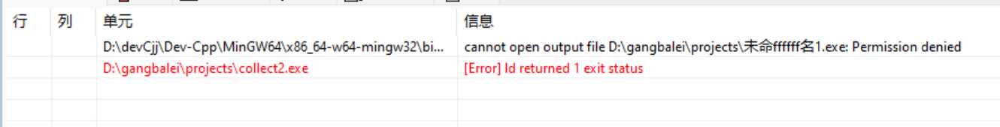
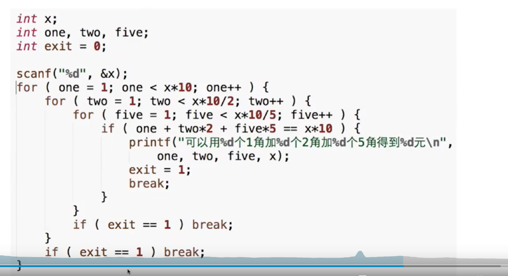
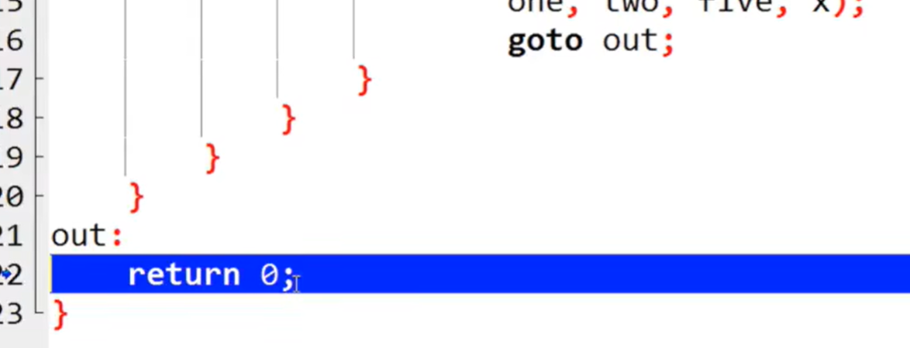
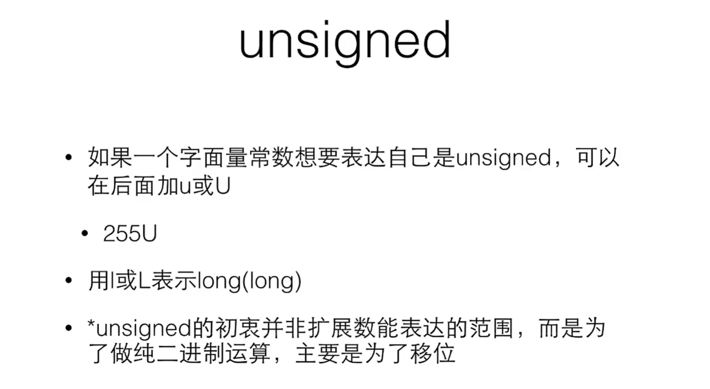
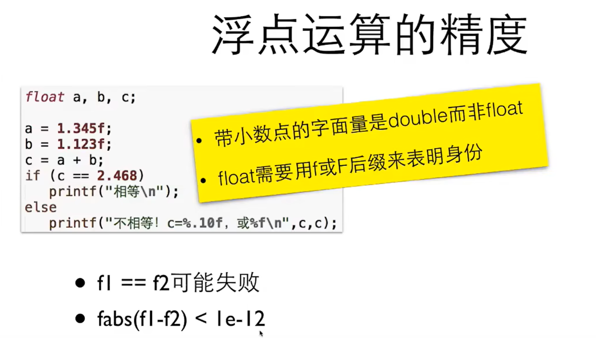
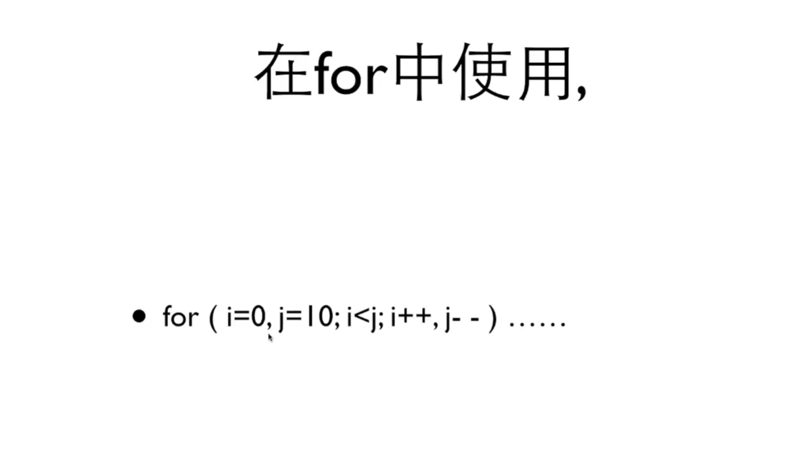
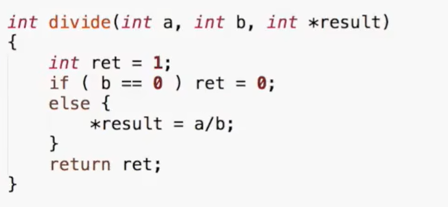
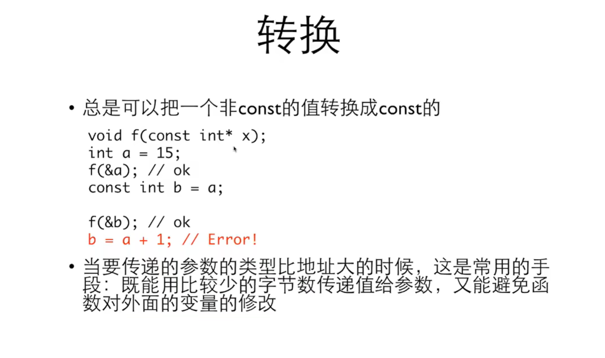

# ReadMe
完全备战转专业考试用的;
这个代表 上一个运行还没有结束把上一个终端关掉即可;
int a = 0, b = 0, c = 0, d = 0;
xmuoj 数字末尾不能有空格
c语言不能 int arr[n];所以可以设置一个最大值 或者 int * arr= (int *)malloc(n*sizeof(int));

- 注意double老是出错
int compare(const void* o1, const void* o2) {
    double a = *(const double*)o1;
    double b = *(const double*)o2;
    if (a < b)
        return -1;
    else if (a > b)
        return 1;
    return 0;
}
# 算法
## 冒泡算法
```C
void optimizedBubbleSort(int arr[], int n) {
    for (int i = 0; i < n-1; i++) {
        int swapped = 0;  // 标记是否发生了交换
        for (int j = 0; j < n-i-1; j++) {
            if (arr[j] > arr[j+1]) {
                int temp = arr[j];
                arr[j] = arr[j+1];
                arr[j+1] = temp;
                swapped = 1;  // 标记发生了交换
            }
        }
        // 如果没有发生交换，说明数组已经有序
        if (swapped == 0) {
            break;
        }
    }
}
```
## 二分查找
```c
int ef(int arr[],int n,int tg){
	int max=n-1;int min =0;
	while(min!=max && min<max){
		int mid=(max+min)/2;
		if(arr[mid]==tg){
			max=mid;min=mid;
		}else if(arr[mid]<tg){
			min=mid+1;
		}else{
			max=mid-1;
		}
	}
	if(max==min){
		return max;
	}else if(max<min){
		return -1;
	}
}
```

# c primer plus
## tips
- 注意(double)除法   注意 int 还是double
oop 是一门哲学,对语言建模适应问题,
数组大小不能用变量声明数组大小不能用变量声明数组大小不能用变量声明数组大小不能用变量声明数组大小不能用变量声明数组大小不能用变量声明
学调试代码,插入printf()监测变量的值

C的6种语句

identifier(变量,函数,实体)与内存位置的映射   

声明  |0x1A |  |  ---int x;
赋值  |0x1A | 2|  ---x=2; 

function给终止

编译器发现的错误可能再上一行 分号; 拼写等语法 错误.

1位=1bit  1byte=8bit

decimal  binary octal hexadecimal   10 2 8 16
0x 十六进制
0   八进制
0b  二进制    
16= 0x1 = 020  

## 取整
ceil  floor  round round必配(double)
## 输入
scanf处理不了 空格和回车  getchar 逐步处理字符; fgets(str,sizeof(str),stdin) 整行输入 和java的 reader.readline()一样;
while(scanf!=EOF)来控制输入;
- fgets(str,n,stdin) ab abc \n   "ab abc \n\0"   如果只读3个 "ab\0"
去掉\n  可以  str[strcspn(str,'\n')]=\0;
## 字符串
strlen  
- strcmp
strcmp(str1,str2) 1 前者greater  0一样大 -1 后者大 和 比较函数一样;
- memset
## math
fabs()double abs () int
## 数组
memset
## time;
# 老翁凯C语言

关系运算高于赋值低于算数运算

有数学归纳法可得用"1"来判断循环

数论很重要 取模% 和整除/ 很重要  考虑边界条件如2 1等

随机数:
```
srand(time(0));  设置随机数种子;
rand();
```

for 当作向量的遍历;多一个flag变量

判断素数用开方优化 mod 
```int jug(int ipt){
	if(ipt==2) return 1;
	int flag=0;
	for(int i=2;i<=sqrt(ipt);i++){
		if(ipt % i==0) return 0;
		else{continue;
	}
	}return 1;
} 
```

break循环只能跳出一重循环;如果想全跳出则要加个flag变量也可以用goto 就在需要跳出多重循环需要goto其他最好不要用goto

/是整除 (double) /  是小数除法;

printf 格式输出
在 C 语言中，`printf` 是一个功能强大的输出函数，用于格式化输出数据。通过 `printf`，我们可以将不同类型的数据按指定的格式输出到标准输出（通常是屏幕）。下面是对 `printf` 格式输出的详细讲解。

---

## **`printf` 的基本语法**
```c
printf("格式控制字符串", 参数1, 参数2, ...);
```
- **格式控制字符串**：指定输出的文本及数据的格式，包括普通文本和格式说明符。
- **参数**：与格式说明符对应的变量或值。

---

## **格式控制字符串**
格式控制字符串可以包含：
1. **普通字符**：直接输出到屏幕。
2. **转义字符**：以反斜杠 `\` 开头的特殊字符，用于表示特定的格式或行为。
   - `\n`：换行
   - `\t`：水平制表符（Tab）
   - `\\`：输出反斜杠
   - `\"`：输出双引号
   - `%%`：输出百分号
3. **格式说明符**：用于指定变量的类型和输出格式，以 `%` 开头。

---

## **格式说明符**
格式说明符用于告诉 `printf` 如何输出变量的值。常见的格式说明符如下：

### **1. 整数类型**
| 说明符 | 描述                     | 示例输出（假设变量值为 123） |
|--------|--------------------------|-----------------------------|
| `%d`   | 有符号十进制整数         | `123`                       |
| `%i`   | 有符号十进制整数（等同于 `%d`） | `123`                 |
| `%u`   | 无符号十进制整数         | `123`                       |
| `%o`   | 无符号八进制整数         | `173`                       |
| `%x`   | 无符号十六进制整数（小写）| `7b`                        |
| `%X`   | 无符号十六进制整数（大写）| `7B`                        |

### **2. 浮点类型**
| 说明符 | 描述                     | 示例输出（假设变量值为 123.456） |
|--------|--------------------------|---------------------------------|
| `%f`   | 十进制浮点数（小数点形式） | `123.456000`                   |
| `%e`   | 指数形式（小写 e）        | `1.234560e+02`                 |
| `%E`   | 指数形式（大写 E）        | `1.234560E+02`                 |
| `%g`   | 根据值自动选择 `%f` 或 `%e` | `123.456` 或 `1.23456e+02`     |
| `%G`   | 根据值自动选择 `%f` 或 `%E` | `123.456` 或 `1.23456E+02`     |

### **3. 字符和字符串**
| 说明符 | 描述                     | 示例输出                      |
|--------|--------------------------|-------------------------------|
| `%c`   | 单个字符                 | `'A'`                         |
| `%s`   | 字符串                   | `"Hello, World!"`             |

### **4. 指针和特殊类型**
| 说明符 | 描述                     | 示例输出                      |
|--------|--------------------------|-------------------------------|
| `%p`   | 指针地址                 | `0x7ffee3b7c8b8`              |
| `%n`   | 输出的字符数存储到变量中 | 无直接输出，存储字符数         |

### **5. 百分号**
| 说明符 | 描述                     | 示例输出                      |
|--------|--------------------------|-------------------------------|
| `%%`   | 输出百分号 `%`           | `%`                           |

---

## **格式说明符的修饰符**
格式说明符可以通过修饰符进一步控制输出的宽度、精度和对齐方式。

### **1. 字段宽度**
- 指定输出的最小宽度，若数据宽度不足则用空格填充。
- 语法：`%宽度说明符`
- 示例：
  ```c
  printf("%5d\n", 42);  // 输出：   42（右对齐，宽度为 5）
  printf("%-5d\n", 42); // 输出：42   （左对齐，宽度为 5）
  ```

### **2. 精度**
- 用于控制浮点数的小数位数或字符串的最大长度。
- 语法：`%.精度说明符`
- 示例：
  ```c
  printf("%.2f\n", 3.14159);  // 输出：3.14（保留两位小数）
  printf("%.3s\n", "abcdef"); // 输出：abc（截取前三个字符）
  ```

### **3. 组合宽度和精度**
- 语法：`%宽度.精度说明符`
- 示例：
  ```c
  printf("%8.2f\n", 3.14159);  // 输出：   3.14（宽度 8，保留 2 位小数）
  ```

### **4. 填充字符**
- 默认用空格填充，可以用 `0` 指定填充字符为 `0`。
- 示例：
  ```c
  printf("%05d\n", 42);  // 输出：00042（宽度 5，填充 0）
  ```

---

## **完整示例**

```c
#include <stdio.h>

int main() {
    int a = 42;
    float b = 3.14159;
    char c = 'A';
    char str[] = "Hello";

    // 整数输出
    printf("整数输出：%d\n", a);           // 输出：42
    printf("宽度为 5：%5d\n", a);         // 输出：   42
    printf("左对齐宽度 5：%-5d\n", a);    // 输出：42   

    // 浮点数输出
    printf("浮点数输出：%f\n", b);         // 输出：3.141590
    printf("保留两位小数：%.2f\n", b);     // 输出：3.14
    printf("宽度 8 精度 2：%8.2f\n", b);   // 输出：   3.14

    // 字符和字符串输出
    printf("字符输出：%c\n", c);           // 输出：A
    printf("字符串输出：%s\n", str);       // 输出：Hello
    printf("截取字符串：%.3s\n", str);     // 输出：Hel

    // 十六进制与指针
    printf("十六进制输出：%x\n", a);       // 输出：2a
    printf("指针地址：%p\n", (void*)&a);   // 输出：0x...

    return 0;
}
```

### **输出结果**
```plaintext
整数输出：42
宽度为 5：   42
左对齐宽度 5：42   
浮点数输出：3.141590
保留两位小数：3.14
宽度 8 精度 2：   3.14
字符输出：A
字符串输出：Hello
截取字符串：Hel
十六进制输出：2a
指针地址：0x7ffee3b7c8b8
```

---

## **总结**

- `printf` 是一个功能强大的格式化输出函数，通过格式说明符和修饰符，可以灵活地输出各种类型的数据。
- 常用说明符包括 `%d`（整数）、`%f`（浮点数）、`%c`（字符）、`%s`（字符串）等。
- 可以通过宽度、精度和对齐方式进一步控制输出格式。

sizeof(int)  sizeof(i) c语言中的数据类型以字节byte为单位 常见单位为 1 2 4 8个byte  int 4byte double 8byte  %d %lf

计算机编码: 用3位举例  2^3=8  111=-1  000=0 011=3  从111 -- 000 ---011  构造-1到-4到0到3的映射; 方便进行加法运算;100+1=101 ... 111所以是从-4到-1 一切为了实现加法运算
unsigned int 

1.33f 和 23123L   float 和 long 的字面常量的表示方式
一般都选择 double int %d %lf

数据类型一切都是内存二进制的映射;

49 65 97  'A'和'a'之间差了32; \t \b \n  
(double)强制类型转换 是静态的

&& || 和:有0则0  或:有1则1

, 逗号运算符优先级最低目前只有for循环多个循环变量ij一个用处

极值的向量表示
	int max=(a+b+abs(a-b))/2;
	int min=(a+b-abs(a-b))/2;

函数遇到return就结束了 栈就消除了变成了一个数
函数是一个栈 参数作用范围是函数栈里的 无法实现main中的变量交换
大括号叫做块 进入大括号就相当于生成一个栈

const int number =10; 常量不能改变;

int a[10]={0}; int a[]={2,23,4,5};
sizeof(a)/sizeof(a[0]) or sizeof(asizeof(int) 可以得到数组长度

prime[cnt++]=  实现往后加一个的效果

二维数组 a[i][j] i是行 j是列

%p 是地址&x 的格式化输出 在编译器32可用%x 输出十六进制 但是64位就不行了

一切对象都是地址(指针) int 数组 就是 四字节一组的地址

指针的使用场景

  const int * p 传进去一个结构防止改变结构中的东西  int * const p 指的是p只能指向一块区域 数组就是一个后者的指针 不能数组++ 因为数组只能指向第一个  函数参数一般传进来前const的值

指针之差就是 地址之差/sizeof(int)

NULL表示0地址  

void* 是单位为1的指针  (void*) 强制类型转换  

"hellow" 是编译空间中的是前const的指针 用数组定义可以变成本地变量

字符串 char a[10]; scanf("%9s",a); 格式输出限制长度
char * a[3] 指针数组 数组的元素是地址


# 洛谷习题
## 阿斯克码
'A' 65 'a' 97差了32;  '1'是49 

## 四舍五入
```
#include <stdio.h>
#include <math.h>
//round()返回的是一个整数;
int main() {
    double num = 3.14159;
    double scale = 100.0; // 保留两位小数
    double rounded = round(num * scale) / scale;
    printf("Rounded value: %.2f\n", rounded); // 输出: 3.14
    return 0;
}
```
double 用%lf  %lf 也能整数输入
(int)(a/b) 加括号这个得


# xmuoj题目
## dydx
http://xmuoj.com/problem/GW033
#include<string.h>
#include<stdio.h>
#include<math.h>
#include<stdlib.h>

int main(){
	int di[]={0,-1,1,0,0};
	int dj[]={-1,0,0,1,0};
	int n;int m;
	int arr[101][101];
	int newArr[101][101];
	scanf("%d %d",&n,&m);
	for(int i=0;i<n;i++){
		for(int j=0;j<m;j++){
		
			scanf("%d",&arr[i][j]);
				if(j==0 || j==m-1 || i==0 || i==n-1){
				newArr[i][j]=arr[i][j];
			}
		}
	}
	
	for(int i=1;i<n-1;i++ ){
		for(int j=1;j<m-1;j++){
			int sum=0;
			for(int k=0;k<5;k++){
				sum+=arr[i+di[k]][j+dj[k]];
			}
			newArr[i][j]=round((double)sum/5);
		}
	}
	
	for(int i=0;i<n;i++){
		
		for(int j=0;j<m;j++){
			if(j==m-1){
				printf("%d",newArr[i][j]);
				
			}
			else printf("%d ",newArr[i][j]);
			if(j==m-1) printf("\n");
		}
	}
	return 0;
	
}

## http://xmuoj.com/problem/GW043字符串处理
```java
#include <string.h>
#include <stdio.h>
#include <stdlib.h>

typedef struct {
    char str[101];
    int length;
    int index;
} String;

int compare1(const void *o1, const void *o2) {
    String *s1 = (String *)o1;
    String *s2 = (String *)o2;
    if (s1->length != s2->length) {
        return s2->length - s1->length; // Descending order for longest
    }
    return s1->index - s2->index; // Ascending order by index
}

int compare2(const void *o1, const void *o2) {
    String *s1 = (String *)o1;
    String *s2 = (String *)o2;
    if (s1->length != s2->length) {
        return s1->length - s2->length; // Ascending order for shortest
    }
    return s1->index - s2->index; // Ascending order by index
}

int main() {
    char input[20001]; // To hold the entire input line
    fgets(input, sizeof(input), stdin); // Read the line of input
    int n = 1001;

    String *arr = (String *)malloc(n * sizeof(String));
    int cnt = 0;

    char *token = strtok(input, " ,"); // Split input by space or comma
    while (token != NULL) {
        strcpy(arr[cnt].str, token); // Copy the word into the struct
        arr[cnt].length = strlen(token); // Calculate the length of the word
        arr[cnt].index = cnt; // Store the word's index position
        cnt++;
        token = strtok(NULL, " ,");
    }

    // Sort for the longest word
    qsort(arr, cnt, sizeof(String), compare1);
    printf("%s\n", arr[0].str); // The first longest word

    // Sort for the shortest word
    qsort(arr, cnt, sizeof(String), compare2);
    printf("%s\n", arr[0].str); // The first shortest word

    free(arr);
    return 0;
}

```

## 学习用类 qsort进行排序
```c
#include <stdio.h>
#include <stdlib.h>

int digitSum(int x) {
    int sum = 0;
    while (x) {
        sum += x % 10;
        x /= 10;
    }
    return sum;
}

typedef struct {
    int value;  // 原始数字
    int dsum;   // 数字和
} Number;

int cmp(const void *a, const void *b) {
    Number *n1 = (Number *)a;
    Number *n2 = (Number *)b;
    
    // 首先比较数字和
    if (n1->dsum != n2->dsum)
        return n1->dsum - n2->dsum;
    // 数字和相同则比较数字本身
    return n1->value - n2->value;
}

int main() {
    int n, m;
    scanf("%d", &n);
    scanf("%d", &m);
    
    Number *arr = (Number *)malloc(n * sizeof(Number));
    
    for (int i = 0; i < n; i++) {
        arr[i].value = i + 1;
        arr[i].dsum = digitSum(i + 1);
    }
    
    qsort(arr, n, sizeof(Number), cmp);
    
    // 注意 m 是从 1 开始计数，数组下标从 0 开始
    printf("%d\n", arr[m - 1].value);
    
    free(arr);
    return 0;
}

```

## 前缀和初见
```c
#include<stdio.h>
#include<stdlib.h>
#include<string.h>
#include<math.h>
int isRun(int x) {
    if ((x % 4 == 0 && x % 100 != 0) || (x % 400 == 0)) {
        return 1;  // 是闰年
    } else {
        return 0;  // 不是闰年
    }
}
int main(){
	//
	int runY[13]={0,31,29,31,30,31,30,31,31,30,31,30,31};
	int pingY[13]={0,31,28,31,30,31,30,31,31,30,31,30,31};
	int runyear[13];int pingyear[13];
	int sum1=0;int sum2=0;
	for(int i=0;i<13;i++){
		sum1=sum1+runY[i];
		runyear[i]=sum1;
		sum2=sum2+pingY[i];
		pingyear[i]=sum2;
		
	}
	int year; int month;int day;
	while(scanf("%d/%d/%d",&year,&month,&day)!=EOF){
		if(isRun(year)){
			printf("%d\n",runyear[month-1]+day);
		}else{
			printf("%d\n",pingyear[month-1]+day);
		}
	}
	
	
}
```


## 打表法
http://xmuoj.com/problem/GW035
```c
#include<stdio.h>
#include<stdlib.h>
#include<math.h>

int main(){
		int n=0;scanf("%d",&n);
		int arr[1000002]={0};
		arr[1]=1;arr[2]=2;
		for(int i=3;i<=1000001;i++){
			arr[i]=(arr[i-1]*2+arr[i-2])%32767;
		}
		for(int i=0;i<n;i++){
			int k=0;scanf("%d",&k);
			printf("%d\n",arr[k]);
		}
	
	
}
```


ACW3768统计字符串中连续的x
```c
#include <stdio.h>

int main() {
    int n;
    scanf("%d", &n);
    
    char arr[n+1];  // +1 to accommodate null terminator
    // Read the string
    scanf("%s", arr);
    
    int sum = 0;  // To store the number of deletions
    int count = 0;  // To count consecutive 'x'

    for (int i = 0; i < n; i++) {
        if (arr[i] == 'x') {
            count++;  // Increment count for consecutive 'x'
            if (count > 2) {
                sum++;  // If more than 2 'x' in a row, increment deletion count
            }
        } else {
            count = 0;  // Reset count if the character is not 'x'
        }
    }

    printf("%d", sum);
    return 0;
}

```
XMU2034 http://xmuoj.com/problem/XMU2034
## GW026 雇佣兵
#include<math.h>
#include<stdio.h>
int main(){
	int M=5,T=0,N=2,X=10;
	scanf("%d %d %d",&M,&N,&X);
	while(1){
		int xuyao=ceil((double)M/2);
		if(xuyao>X){
			break;
		}else{
			T=M;X=X-xuyao;
		}
		
		if(T/N==0){
			break;
		}else{
			N+=T/N;T=0;
		}
		
	}
	printf("%d",N);
	
}

两个边界条件


# 复习提单
## 洛谷
P1888
P5707
