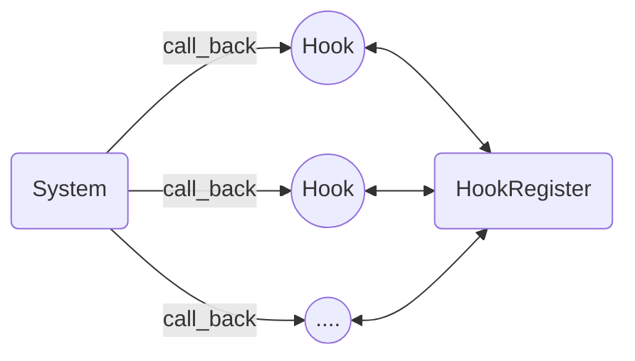

# Hook
- 框架
you call library , framework call you
you call library function,framework call your function
框架是基于hook模式建立的

- 系统运行时执行注册的hook函数


- callback实现
gin框架路由仅注册传入回调函数,gin.run()路由请求方法再调用注册的回调函数,hook会传递一个框架参数方便hook函数和框架的通信

# Singleton 单例设计模式
- 设计global全局变量和initialize初始化函数,程序或者测试运行前加载initialize初始化全局变量和全局运行环境
- 单例设计模式和依赖注入这两个互为反,全局的工具性的变量设置为单例执行前初始化,其他需要用到的时候在注入是依赖注入

# Midwear
## 接口
- 给具体的变量实现加一个中间层,这个中间层是函数的集合,调用变量仅能通过接口 
- 简化,从var operator tree角度思考面向接口编程
- type之类的struct interface type []int等都是反应变量的内部情况包含什么,方法就是对应的operator
- interface是一个tree他链接这多个实现的变量,父节点是midwear子节点是具体的实现
- 因为调用具体实现需要通过接口所以生成接口变量的New由配置好的wire框架实现,在wire框架中配置生成接口变量所需的所有实现和接口;

# DI
- 为什么需要依赖注入,因为全局变量全部加载费内存仅加载必需的变量
- 用lazy global的方式实现依赖注入,将变量设置为懒全局变量仅在需要的时候使用,
具体实现方式用new once方式实现
```golang
var(
    ServiceVar *ServiceImpl
    once=&sync.Once{}   //为啥这里需要赋值因为仅声明once *sync.Once 没有具体变量无法调用
)

type ServiceImpl struct{
    Dependency InterfaceOrImpl
    //...
}

func NewServiceImpl(d InterfaceOrImpl){
    once.Do(func(){
        ServiceVar=&Service{
            Dependency:d,
            //,
        }
    })
    return ServiceVar
}

```
- 需要设置为lazy global的就是依赖注入变量,不需要的就是变量包含,依赖注入的直接传参数里交给wire框架,变量包含自己赋值

详见wire


# 缓存Cache


