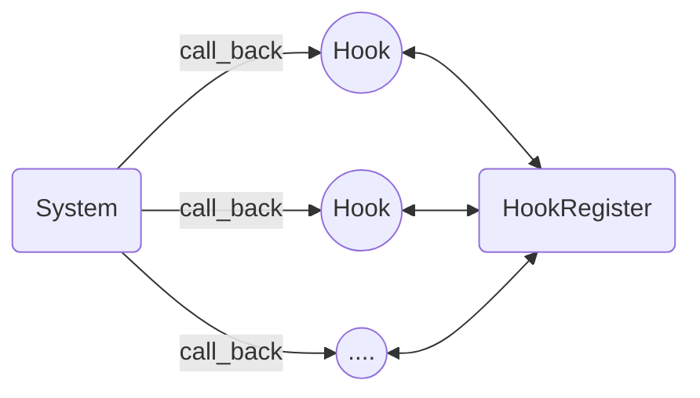

# Hook
- 框架
you call library , framework call you
you call library function,framework call your function
框架是基于hook模式建立的

- 系统运行时执行注册的hook函数


- callback实现
gin框架路由仅注册传入回调函数,gin.run()路由请求方法再调用注册的回调函数,hook会传递一个框架参数方便hook函数和框架的通信

# Singleton 单例设计模式
- 设计global全局变量和initialize初始化函数,程序或者测试运行前加载initialize初始化全局变量和全局运行环境
- 单例设计模式和依赖注入这两个互为反,全局的工具性的变量设置为单例执行前初始化,其他需要用到的时候在注入是依赖注入

# DI
- 本质还是var ram 
var type new 需要啥就注入到结构体中直接
type结构体是var所在的内存区域中包含哪些变量,new是在ram中生成具体的var
- 依赖注入:将变量注入到需要实现的结构体中,生成函数new参数传递具体变量,实现组合而非继承
## lazy global
- 有的时候注入的变量需要全局一份,可以通过lazy global来实现
- 用lazy global的方式实现优化依赖注入,将变量设置为懒全局变量仅在需要的时候使用,
具体实现方式用new once方式实现

```golang
var(
    ServiceVar *ServiceImpl
    once=&sync.Once{}   //为啥这里需要赋值因为仅声明once *sync.Once 没有具体变量无法调用
)

type ServiceImpl struct{
    Dependency InterfaceOrImpl
    //...
}

func NewServiceImpl(d InterfaceOrImpl){
    once.Do(func(){
        ServiceVar=&Service{
            Dependency:d,
            //,
        }
    })
    return ServiceVar
}

```
- 需要设置为lazy global的就是依赖注入变量,不需要的就是变量包含,依赖注入的直接传参数里交给wire框架,变量包含自己赋值

详见wire
## new(&config{})
- 这种也是常见的lib第三方库依赖注入实现的


# Midwear
- 封装具体实现,仅能通过中间层调用实现,实现抽象,扩展,通信,缓冲等

## 接口
abstract抽象中文垃圾翻译,改成摘要,提取一个物体的关键部分方便研究
接口等都是具体struct的抽象
- 给具体的变量实现加一个中间层,这个中间层是函数的集合,调用变量仅能通过接口 
- 简化,从var operator tree角度思考面向接口编程
- type之类的struct interface type []int等都是反应变量的内部情况包含什么,方法就是对应的operator
- interface是一个tree他链接这多个实现的变量,父节点是midwear子节点是具体的实现
- 因为调用具体实现需要通过接口所以生成接口变量的New由配置好的wire框架实现,在wire框架中配置生成接口变量所需的所有实现和接口;

## 并发控制
等待组的并发控制外移分离并发控制和业务逻辑
- 树形结构考虑线程,go func在主线程节点分出一个子线程,子线程root下就是这个func函数,控制外移就是在root和func之间加一个中间控制函数
- 匿名函数+defer实现并发控制外移
- 原本需要go f(wg *sync.WaitGroup){defer wg.done()}
wg仅起到flag标记函数返回没有的标记,所以抽离出来放在原函数和新线程root之间的中间件,
原函数返回的时候正好defer掉wg
- 因为golang支持闭包所以可以不用传wg这个参数
```go
main{
wg := &sync.WaitGroup{}
	wg.Add(1)
	go func() {
		defer wg.Done()
		chatsession.ChatStream(ctx, "讲解算法中的二分答案法")
	}()
	wg.Add(1)
	go func() {
		defer wg.Done()
		chatsession.ChatStreamOut()
	}()
	wg.Wait()

}
```

## channel <->
- 在两个对象间加入一个管道实现数据的传输通信
- 例如go中的chan实现协程通信
- llm中的stream流

## buffer <-
- 在数据传输过程中加入一个中间临时存放的容器
- 例如在构建对象，io等中间加一个容器提升速度

## filter
- redis rag


# 装饰器
- 将对象包装（wrap）在另一个对象中，这个包装对象在调用原有方法前后添加新的行为，从而增强功能,不改变对象名字
- 根据不修改只增加的原则,我们想增加原来函数功能,可以再包一层函数,不改变原函数功能和名字且通过函数闭包扩展
原函数功能,外部仅能通过这个包装的新中间函数来调用