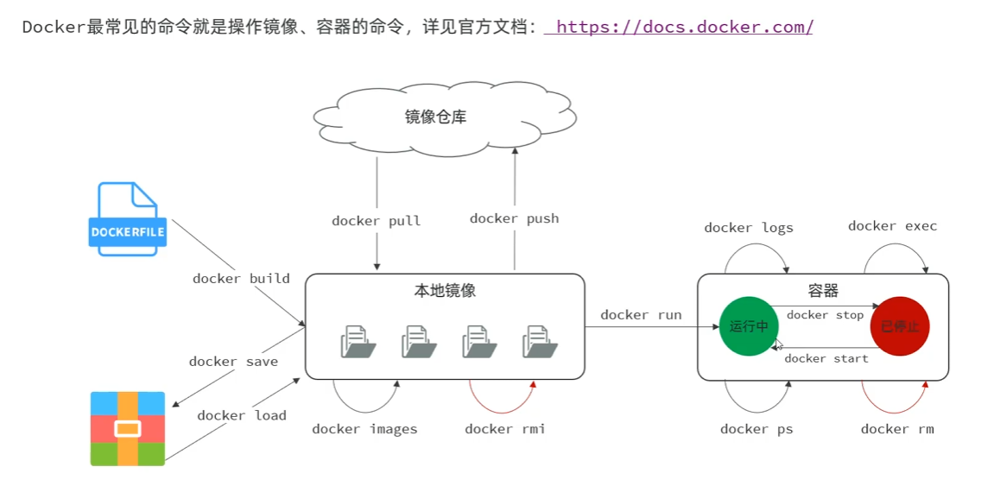

---
{
    "dependency":"class/linux"
}
---

# linux docker安装和配置
详见飞书https://heuqqdmbyk.feishu.cn/wiki/GAwGwd0GHibOovkLpH3cjpMwnVm

# 镜像和容器
- 镜像是模具容器是做的模型(就是虚拟机)
- 本地没有镜像就会从dockerhub下载镜像到本地
- 使用命令用镜像做容器

# docker 命令

## docker 镜像容器相关

镜像是模具容器是虚拟机


## 镜像
镜像名:版本
- docker pull
- docker push
- docker images 查看所有镜像
- docker rmi 删除镜像
- docker save --output 打包的镜像名 所选镜像:版本
- docker load --input  打包的镜像名

## 容器
- docker run 镜像  
构建虚拟机容器
```linux

docker run -d \ 
  --name mysql \
  -p 3307:3306 \
  -e TZ=Asia/Shanghai \
  -e MYSQL_ROOT_PASSWORD=123 \
  mysql:8

```
run本地没有镜像会dockerhub拉去镜像
-d 后台运行
--name 命名这台虚拟机
-p 容器就是个虚拟机有自己的ip和端口,端口映射将宿主机的端口映射到docker虚拟机的端口
-e 容器的环境变量
mysql:8 8版本的mysql默认最新
- docker ps -a 
查看全部虚拟机容器运行状态 包括没启动的虚拟机
- docker rm 
删除容器 -f 强制删除否做要先停掉再删除
- docker stop
停止虚拟机
- docker start 
启动虚拟机容器
- docker exec -it 容器 bash
进入虚拟机bash
- docker logs -f 容器
查看容器日志

# 数据卷
- 容器目录和宿主机目录的映射
- 可以本地windows开发上传到数据卷所在linux目录 数据卷会同步到docker虚拟机容器中
docker run -v 数据卷:虚拟机目录
docker volume create
创建数据巻

docker volume ls
查看所有数据卷

docker volume rm
删除指定数据卷

docker volume inspect 数据卷
查看某个数据卷的详情

docker volume pruge
清除所有未使用的数据卷

# 本地目录挂载
docker run -v 本地目录:虚拟机容器目录
实现本地目录和虚拟机容器目录的双重映射

# dockerfile自定义镜像
```py
# 使用 CentOS 7 作为基础镜像
FROM centos:7

# 添加 JDK 到镜像中
COPY jdk17.tar.gz /usr/local/
RUN tar -xzf /usr/local/jdk17.tar.gz -C /usr/local/ &&  rm /usr/local/jdk17.tar.gz

# 设置环境变量
ENV JAVA_HOME=/usr/local/jdk-17.0.10
ENV PATH=$JAVA_HOME/bin:$PATH

# 创建应用目录
RUN mkdir -p /app
WORKDIR /app

# 复制应用 JAR 文件到容器
COPY app.jar app.jar

# 暴露端口
EXPOSE 8080

# 运行命令
ENTRYPOINT ["java","-Djava.security.egd=file:/dev/./urandom","-jar","/app/app.jar"]
```
- docker build -t 镜像名 打包目录
docker build -t myapp:1.0 .


# 网络
``` docker
# 1.首先通过命令创建一个网络
docker network create itheima

# 2.然后查看网络
docker network ls

# 结果：
NETWORK ID     NAME      DRIVER    SCOPE
639bc44d0a87   bridge    bridge    local
403f16ec62a2   itheima     bridge    local
0dc0f72a0fbb   host      host      local
cd8d3e8df47b   none      null      local
# 其中，除了itheima以外，其它都是默认的网络


# 3.让 myapp 和 mysql 都加入该网络
# 3.1.mysql容器，加入 itheima 网络
docker network connect itheima mysql

# 3.2.myapp容器，也就是我们的java项目, 加入 itheima 网络
docker network connect itheima myapp


# 4.进入dd容器，尝试利用别名访问db
# 4.1.进入容器
docker exec -it myapp bash

# 4.2.用容器名访问
ping mysql

# 结果：
PING mysql (172.18.0.2) 56(84) bytes of data.
64 bytes from mysql.itheima (172.18.0.2): icmp_seq=1 ttl=64 time=0.044 ms
64 bytes from mysql.itheima (172.18.0.2): icmp_seq=2 ttl=64 time=0.054 ms
```

# dockercompose
- 自动化创建多个容器和网络
- sudo docker compose up -d