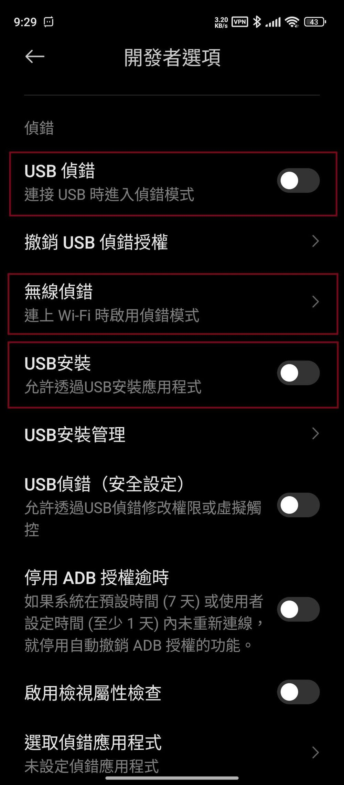
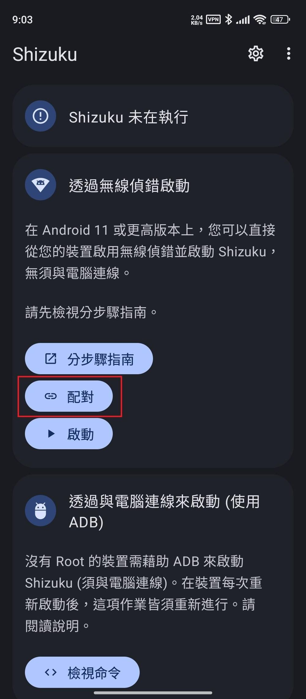
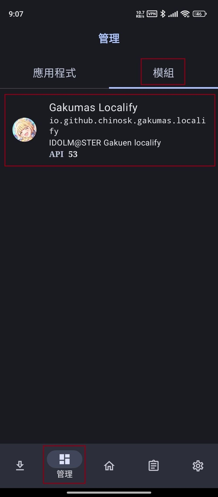
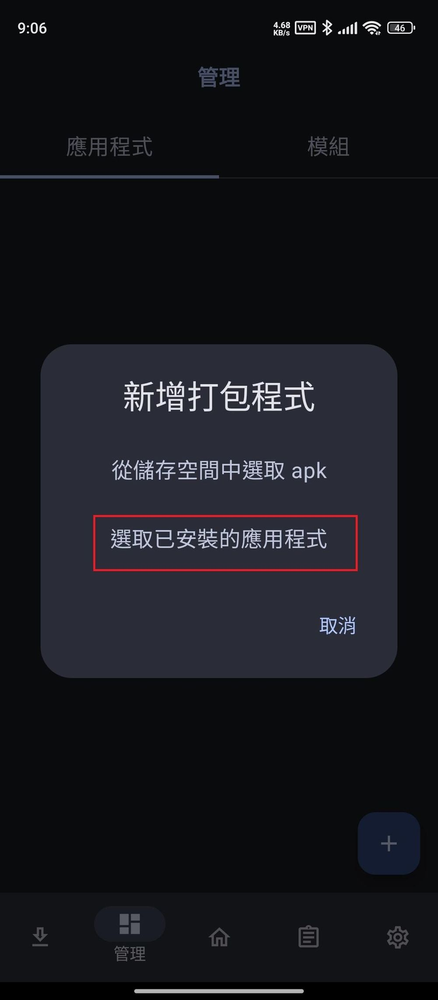
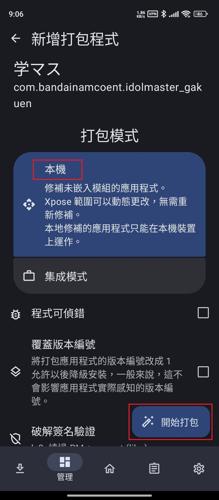
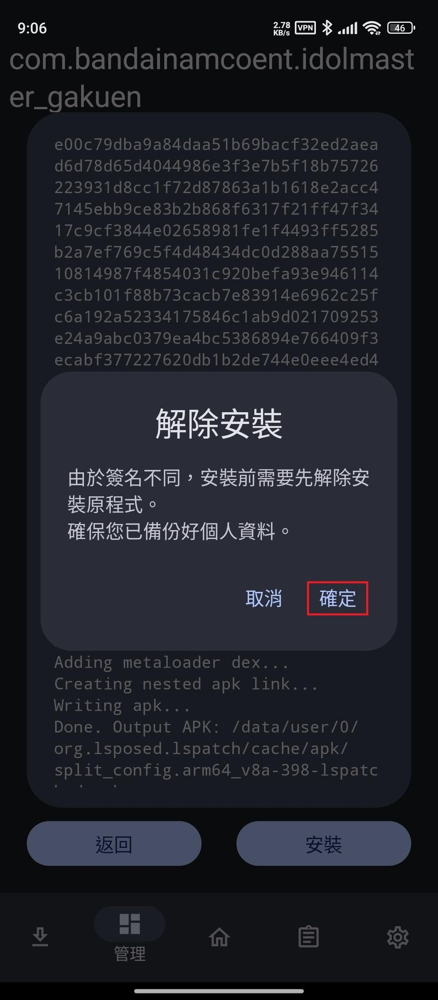
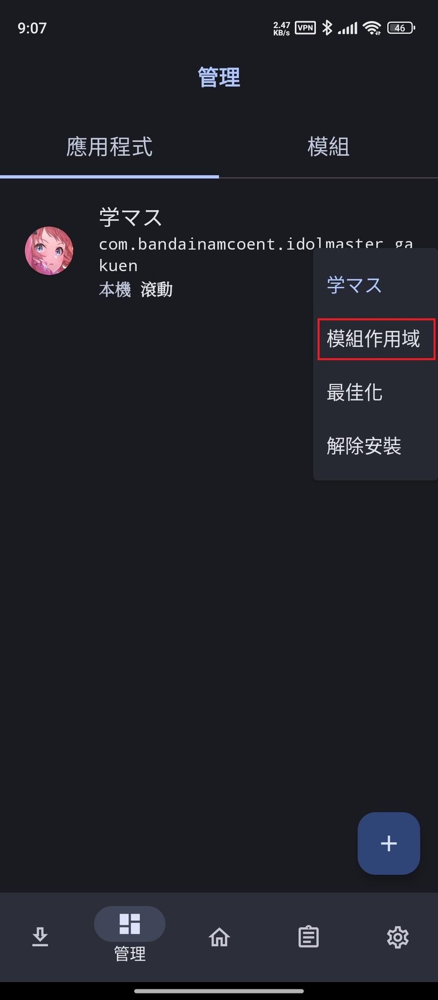

# root讲解
- 手机是真的垃圾不如电脑一根
- root指的是获取手机的最高权限可以使用最高权限某些接口进行开发等
## root的风险
- 某些沟槽app检测到root了就不给使用

# 技术简要讲解
## 准备
- (汉化插件库)[https://github.com/chinosk6/gakuen-imas-localify]
- (LSPatch)[https://github.com/LSPosed/LSPatch]
- Shizuku(Googleplay直接下载)
## gakuen-imas-localify(汉化插件库)
- xposed插件
注入app汉化插件
## LSPatch
- 工具
通过链接shizuku服务器调用接口能够对app进行重新打包,并注入插件
## Shizuku
- 获取系统级别的接口权限
- 是一个服务器可以通过wifi usb等链接桥接这些接口实现变相root

# 技术详细讲解

---

## 1. LSPatch

### 简介
**LSPatch** 是一种 Android 应用的“无 root”修改（patch）工具。它的目标是让用户在不 root 设备的情况下，对应用进行类似 Xposed/LSP（如 LSPosed、EdXposed）模块的功能增强或破解。

### 工作原理
- LSPatch 主要通过“重打包（Repackaging）”技术将补丁/模块直接注入到 APK 文件中，然后重新签名、安装。
- 这样，你可以对某些应用实现功能增强、广告去除、权限控制、界面美化等操作，而无需 root 系统或安装 Xposed 框架。
- 但因为是对 APK 进行修改，所以每次应用更新后需要重新 patch 一次。

### 优缺点
- **优点**：不需要 root，操作相对安全，适合对系统安全有顾虑的用户。
- **缺点**：需要重新签名，可能影响应用登录/支付等功能（因签名校验）；补丁有限，对大型或高安全性的应用支持不佳。

---

## 2. Shizuku

### 简介
**Shizuku** 是一款 Android 工具，允许普通（未 root）用户以“ADB 权限”来运行部分需要高级权限的命令或应用。

### 工作原理
- Shizuku 利用 Android 的 ADB 后台功能或 root 权限，在设备上开启一个服务（Shizuku 服务）。
  - ADB 模式：通过电脑连接设备，使用命令激活 Shizuku 服务，无需 root。
  - Root 模式：root 用户直接在本地启动服务。
- 启动后，支持的应用可以通过 Shizuku 获得一些原本需要 root 或系统级权限才能执行的操作，比如管理应用、自定义系统设置等。

### 应用场景
- 许多第三方管理工具（如 App Ops、IceBox、LADB、App Manager 等）可以通过集成 Shizuku，免 root 实现强大功能。
- Shizuku 本身不修改系统，只是桥接权限，让工具“借用”系统级接口。

### 安装方式
- Google Play 可直接搜索“Shizuku”下载安装。
- 启动后按指引选择 ADB 或 Root 模式激活服务即可。

---

## 总结对比

| 工具      | 主要功能          | 是否需 root | 主要用途            | 典型场景               |
|-----------|-------------------|-------------|---------------------|------------------------|
| LSPatch   | Patch 应用功能    | 否          | 修改应用功能/破解等 | 去广告、功能增强等     |
| Shizuku   | 权限桥接服务      | 否/需要（可选）| 提供高级权限接口     | 应用管理、系统设置等   |

---

### 小结
- **LSPatch**：让你在不 root 的情况下修改 APK，实现 Xposed 类似的部分功能。
- **Shizuku**：让你在不 root 的情况下，让某些高级管理工具获得“近似 root”的操作权限（如应用冻结、权限管理等）。

如果你还有具体用法或原理的问题，可以继续提问！

# 方法
1.  开启开发者选项并设定。
找到手机系统版本号并连点，"开启开发者选项"下拉，
同意风险，开启"USB 侦错"与"USB 安装"选项。
  (汉化完后这些项目可以再回来关掉)

2. 打开 Shizuku
透过无线侦错启动，选择"配对"，按照提示开启通知，
  回到"开发者选项"，点选"无线侦错"，
选择"使用配对码配对装置"，接着通知会提示已找到配对服务，
点选"输入配对码"，输入下方系统提供的 wifi 配对码即可配对成功。

  配对完成后返回 Shizuku 点选"启动"。
(过程中如有提示任何操作，或是不同安卓版本，可查看"分步骤指南"，请以 app 提示为主，按照 app 提供的方式去操作)

3. 开启 LSPatch，
  检查 Shizuku 服务使否成功启用，
点选下方"管理"，到"模组"中查看是否有 Gakumas Localify，
  确认没问题后开始进行应用程式打包。

  选择"应用程式"，点选右下方"+"，
  点选"选取已安装的应用程式"，或者直接打包.apk文件.
  找到"学园偶像大师"，
  选择打包模式"本机"，点选右下方"开始打包"，
  完成后"安装"。

4. 开启模组
点选"模组作用域"，勾选"Gakumas Localify"，记得点右下角的" ✓ "。
  回到桌面开启游戏享受汉化。

# 常见问题与解答
## Laspath安装打包好的app卡住
- 直接用gakuen-imas-localify打包app里边集成了Laspath

---

# root模拟器或者手机汉化方法
https://forum.gamer.com.tw/C.php?bsn=79730&snA=229