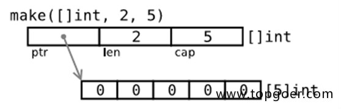
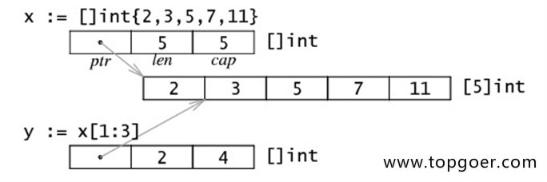

# goの简化
- go中()是函数 函数类型 {}是生成
- 万能:= go强调变量名称弱化类型后置
:=&struct{}

- 和python一样强大的, i,j=j,i
Go 语言的 := 是 短变量声明，它的规则是：
在同一个作用域中，:= 左边必须至少有一个是新的变量，其它变量可以是已经存在的变量。
对于已经存在的变量，:= 其实是普通的重新赋值。所以err能赋值两次
```go
i, err := f(3)
	if err != nil {
		fmt.Println(err)
	}
	fmt.Println(i)
	i2, err := f(34)
	if err != nil {
		fmt.Println(err)
	}
	fmt.Println(i2)
```

- 简化type struct type interface 里不用加var和func 因为外边已经有type了

- 包一般小写命名

# math_refactor
```json
{
    "set":"math", //具体参见/Class/Math/集合论
    "variable":"one of set",
    "state":"variables'value" ,//一组变量具体取值的集合
    "function":{
        "math":"input and output",//数学函数映射定义 参数是变量的副本 stack in math
        "stack":"operate and return when args'state"//底层函数栈,返回函数栈有值

    }

    //记忆:variable->state   function->math and stack->input output operate
}
```
```json
{
    "set":"",
    "variable and function set":"class",
    "function set":"interface",
    "variable set":"struct"
}
```

# 语言设计哲学
- Less can be more
gofmt .go

# 变量
## 作用域
1）声明在函数内部，函数栈内局部变量
    2）声明在函数外部，是对当前包可见(包内所有.go文件都可见)的全局值，类似protect
    3）声明在函数外部且首字母大写是所有包可见的全局值,类似public

## 声明
- 后缀.var方便ide代码补全
- 万能:=
- var i int =1  var i =1  i:=1
```go
var (
    i=1
    j=1
)
```

## 匿名变量_下划线
- 用于忽略值
- 多值返回函数 可以 _,y=f(3,4) 忽略第一个返回值
- 迭代器 for _,v := range slice 忽略迭代器索引仅用值

# 函数
- math input and output stack operate and return

## 函数类型
- go中函数是一个类型
func(int, int) (int, int) or func(a,b int) (x,y int)
函数类型声明定义确保有input和output即可

- Go 编译器判断函数类型时，只关心：
参数的 数量、顺序、类型
返回值的 数量、顺序、类型
参数名和返回值名都不参与类型匹配 
参数只是个占位符,编译器底层会忽略掉形式参数名称参见java jvm
- 代码美学(少写注释)+go强调变量名称 建议所有函数类型和定义都写上参数名称 返回值名称随意因为函数名称就是返回值名称
func print(x int) int{}  func f(a,b int func(x int) int ) int{}


## 函数第一公民


### 一、什么是“第一公民”？
在编程语言领域，“第一公民（First-class citizen）”这个术语的意思是：
> 某个实体（比如函数、对象等）在语言中可以像其他变量一样使用 —— 可以赋值给变量、作为参数传递、作为返回值返回等等。

也就是说，如果一个元素（如函数）在语言中满足以下条件，就可以认为它是**第一公民**：
1. **可以赋值给变量**
2. **可以作为函数参数传递**
3. **可以作为函数返回值返回**
4. **可以存储到数据结构中**
5. **可以在运行时创建**

---

### 二、Golang 中的函数是“第一公民”的表现


#### 1. **函数可以赋值给变量**
```go
package main

import "fmt"

func add(a, b int) int {
    return a + b
}

func main() {
    f := add // 将函数赋值给变量
    fmt.Println(f(3, 4)) // 7
}
```

#### 2. **函数可以作为参数传递**
```go
package main

import "fmt"

func compute(a, b int, op func(int, int) int) int {
    return op(a, b)
}

func add(x, y int) int {
    return x + y
}

func main() {
    result := compute(3, 4, add)
    fmt.Println(result) // 7
}
```

#### 3. **函数可以作为返回值返回**
```go
package main

import "fmt"

func adder() func(int) int {
    sum := 0
    return func(x int) int {
        sum += x
        return sum
    }
}

func main() {
    posSum := adder()
    fmt.Println(posSum(1)) // 1
    fmt.Println(posSum(2)) // 3
}
```
#### 3.5 **函数可以多返回值**
```go
func f(a, b int) (x, y int) {
	x, y = b, a
	return 
}
func ff(a, b int) (int, int) {
	return b, a
}

func main() {
	a, _ := f(3, 4) //用不到的用_占位
	i1, i2 := ff(4, 4)
	fmt.Printf("%d %d %d", a, i1, i2)
}
```

上述例子中，`adder` 返回了一个匿名函数（闭包），并且这个函数引用了外部的 `sum` 变量，这也是 Golang 支持**闭包**的体现。

#### 4. **函数可以存储在数据结构中**
```go
package main

import "fmt"

func main() {
    ops := []func(int, int) int{
        func(a, b int) int { return a + b },
        func(a, b int) int { return a - b },
    }

    fmt.Println(ops[0](3, 4)) // 7
    fmt.Println(ops[1](3, 4)) // -1
}
```

#### 5. **可以在运行时定义新的函数（匿名函数）**
```go
package main

import "fmt"

func main() {
    f := func(name string) {
        fmt.Printf("Hello, %s\n", name)
    }
    f("Go") // Hello, Go
}
```

---

### 三、为什么这很重要？
- **灵活性**：函数作为值可以动态组合、传递，实现更通用的代码。
- **高阶函数**：支持函数式编程的一些特性（虽然 Go 并不是纯函数式语言）。
- **闭包**：函数内部可以捕获并访问外部变量，实现状态保持。
- **回调机制**：用函数作为参数来实现事件驱动、策略模式等。

---

### 四、小结
说 **Go 中的函数是第一公民**，是因为它们拥有与其他类型一样的待遇：
- 可以赋值给变量
- 可以作为参数传递给其他函数
- 可以从函数返回
- 可以存在数组、map 等数据结构中
- 可以在运行时动态创建（匿名函数）

换句话说，**在 Go 中，函数是一种特殊的类型（`func`），和其他类型一样，可以被自由操作**。

---

## 匿名函数
- 参见java的lambda表达式
f=func(a,b int) int{
    return a+b
}

## 编译器内置函数
- len cap append copy delete
- 速度快但是太底层len返回字节数等 常用len append 其他slices maps包有泛型函数

## defer
延迟在return后执行,defer 常用于资源释放、panic 恢复

# type
- 自定义类型是定义了一个全新的类型。我们可以基于内置的基本类型定义，也可以通过struct定义。例如：
    //将MyInt定义为int类型
    type MyInt int
通过Type关键字的定义，MyInt就是一种新的类型，它具有int的特性。
```go
type IntHeap []int

func (h IntHeap) Len() int {
	return len(h)
}
func (h IntHeap) Less(a,b int) bool {
	return h[a]<h[b]
}
func (h IntHeap) Swap(i,j int) {
	h[i],h[j]=h[j],h[i]
}
func (h *IntHeap) Push(x any) {
	*h= append(*h, x.(int))
}
func (h *IntHeap) Pop() any {
	old:=*h
	n:= len(old)
	x:=old[n-1]
	*h=old[0:n-1]
	return x
}
```
## 结构体
- variable set is struct
- :=&json{}格式初始化 最佳实践
//一般用指针直接:= & 不用new因为有逃逸分析
p :=&Person{...}
建议直接p:=&struct{}
因为很多方法 的接受体值满足的可以用指针和值 指针满足的只能用指针
### 
在 Go 语言中，`struct`（结构体）是一种用户自定义的复合数据类型，它允许你将不同类型的数据字段组合成一个单一的逻辑单元。结构体是 Go 语言中实现面向对象编程（OOP）思想（特别是组合优于继承）的基础。

### 1. `struct` 的基本概念

*   **定义：** 结构体是一个类型，它包含了一组字段（field），每个字段都有自己的名字和类型。
*   **作用：** 用于组织和表示具有相关属性的数据。例如，你可以定义一个 `Person` 结构体来表示一个人，它可能包含 `Name` (姓名)、`Age` (年龄)、`City` (城市) 等字段。
*   **值类型：** 结构体是值类型，这意味着当你将一个结构体变量赋值给另一个变量时，会创建一个副本。

### 2. `struct` 的定义

使用 `type` 关键字和 `struct` 关键字来定义一个结构体。

```go
// 定义一个名为 Person 的结构体
type Person struct {
    Name    string
    Age     int
    City    string
    IsStudent bool // 布尔类型字段
}

// 定义一个名为 Point 的结构体
type Point struct {
    X int
    Y int
}
```

**字段说明：**
*   每个字段都有一个名称和一个类型。
*   字段名称的首字母大小写决定了其可见性：
    *   **大写字母开头：** 公开的（`Public`），可以在包外部访问。
    *   **小写字母开头：** 私有的（`Private`），只能在定义它的包内部访问。

### 3. `struct` 的创建和初始化

有多种方式可以创建和初始化结构体实例。

#### 3.1. 声明并使用零值初始化

当声明一个结构体变量时，它的所有字段都会被自动初始化为它们各自类型的**零值**（zero value）：
*   `int`、`float` 类型为 `0`
*   `string` 类型为 `""` (空字符串)
*   `bool` 类型为 `false`
*   指针类型为 `nil`

```go
var p1 Person // p1.Name = "", p1.Age = 0, p1.City = "", p1.IsStudent = false
fmt.Println(p1) // { 0  false}
```

#### 3.2. 字段逐一赋值

创建结构体实例后，可以逐个字段进行赋值。

```go
var p2 Person
p2.Name = "Alice"
p2.Age = 30
p2.City = "New York"
p2.IsStudent = true

fmt.Println(p2) // {Alice 30 New York true}
```

#### 3.3. 使用结构体字面量（Literal）初始化

这是最常用和推荐的方式。

**方式一：按字段顺序赋值（不推荐，容易出错）**
这种方式要求你严格按照结构体定义中字段的顺序来提供值。如果结构体定义发生变化，代码可能失效。

```go
p3 := Person{"Bob", 25, "London", false}
fmt.Println(p3) // {Bob 25 London false}
```

**方式二：指定字段名赋值（推荐）**
这种方式更清晰，且不依赖于字段的顺序。你可以只初始化部分字段，未初始化的字段会使用零值。

```go
p4 := Person{
    Name: "Charlie",
    Age:  35,
    City: "Paris",
} // p4.IsStudent 为 false (零值)
fmt.Println(p4) // {Charlie 35 Paris false}

p5 := Person{Name: "David"} // p5.Age=0, p5.City="", p5.IsStudent=false
fmt.Println(p5) // {David 0  false}
```

#### 3.4. 使用 `new()` 函数创建指针

`new()` 函数为指定类型分配内存，并返回一个指向该类型零值的指针。

```go
ptrP := new(Person) // ptrP 是一个 *Person 类型，指向一个零值 Person 结构体
fmt.Println(*ptrP)  // { 0  false}
ptrP.Name = "Eve"   // 也可以通过指针直接访问字段（Go 自动解引用）
fmt.Println(ptrP.Name) // Eve
```

### 4. 访问结构体字段

使用点 `.` 操作符来访问结构体的字段。

```go
p := Person{Name: "Frank", Age: 40}
fmt.Println(p.Name) // Frank
fmt.Println(p.Age)  // 40

p.Age = 41 // 修改字段值
fmt.Println(p.Age) // 41
```

如果结构体变量是一个指针，Go 语言会自动解引用（dereference）它，所以你可以像访问普通结构体一样访问字段。

```go
ptrP := &Person{Name: "Grace"} // ptrP 是一个指向 Person 结构体的指针
fmt.Println(ptrP.Name) // Grace (等同于 (*ptrP).Name)
```

### 5. 结构体作为函数参数

当结构体作为函数参数传递时，默认是**传值**（pass by value）。这意味着函数会接收结构体的一个副本。如果想让函数修改原始结构体，需要传递结构体的**指针**。

```go
func printPerson(p Person) {
    fmt.Printf("Name: %s, Age: %d\n", p.Name, p.Age)
    // p 是一个副本，修改它不会影响原始结构体
    p.Age = 99
}

func changePersonAge(p *Person, newAge int) {
    // p 是一个指针，修改它会影响原始结构体
    p.Age = newAge
}

func main() {
    person := Person{Name: "Heidi", Age: 28}
    printPerson(person) // Name: Heidi, Age: 28
    fmt.Println("Original age after printPerson:", person.Age) // Original age after printPerson: 28

    changePersonAge(&person, 29)
    fmt.Println("New age after changePersonAge:", person.Age) // New age after changePersonAge: 29
}
```

### 6. 匿名结构体（Anonymous Struct）

匿名结构体是没有明确名称的结构体类型。它们通常用于一次性使用或作为函数的返回值。

```go
// 定义并初始化一个匿名结构体
data := struct {
    ID   int
    Name string
}{
    ID:   1,
    Name: "Anonymous User",
}

fmt.Println(data.Name) // Anonymous User

// 作为函数返回值
func GetConfig() struct {
    Host string
    Port int
} {
    return struct {
        Host string
        Port int
    }{
        Host: "localhost",
        Port: 8080,
    }
}

config := GetConfig()
fmt.Println(config.Host, config.Port) // localhost 8080
```

### 7. 结构体嵌入（Embedded Structs / Composition）

Go 语言没有继承的概念，但通过结构体嵌入（也称为组合或匿名字段）可以达到类似的效果。将一个结构体类型直接作为另一个结构体的字段，而不需要指定字段名。被嵌入的结构体的字段和方法会被“提升”到外部结构体，可以直接访问。

```go
type Address struct {
    Street  string
    City    string
    ZipCode string
}

type Employee struct {
    Person    // 嵌入 Person 结构体
    Address   // 嵌入 Address 结构体
    EmployeeID string
    Salary     float64
}

func main() {
    emp := Employee{
        Person: Person{
            Name: "Ivy",
            Age:  30,
        },
        Address: Address{
            Street:  "123 Main St",
            City:    "Anytown",
            ZipCode: "12345",
        },
        EmployeeID: "E001",
        Salary:     50000.0,
    }

    // 直接访问嵌入结构体的字段
    fmt.Println(emp.Name)       // Ivy
    fmt.Println(emp.City)       // Anytown (来自 Address)
    fmt.Println(emp.EmployeeID) // E001

    // 如果字段名冲突，需要通过完整的路径访问
    // 假设 Person 和 Address 都有一个字段叫 'ID'
    // emp.Person.ID 和 emp.Address.ID
}
```

### 8. 结构体标签（Struct Tags）

结构体标签是附加在结构体字段上的字符串元数据。它们通常用于反射（reflection）机制，为编码/解码（如 JSON, XML）、数据库映射等提供额外的信息。

```go
type User struct {
    ID     int    `json:"id" db:"user_id"` // id：用于 JSON 序列化/反序列化；db：用于数据库映射
    Name   string `json:"name"`
    Email  string `json:"email,omitempty"` // omitempty：如果字段是零值，则在 JSON 中忽略
    Status string `json:"-"`               // -：忽略此字段，不进行 JSON 编解码
}

func main() {
    u := User{
        ID:    101,
        Name:  "John Doe",
        Email: "john.doe@example.com",
        Status: "active",
    }

    jsonData, _ := json.Marshal(u)
    fmt.Println(string(jsonData)) // {"id":101,"name":"John Doe","email":"john.doe@example.com"} (Status被忽略)

    u2 := User{
        ID:    102,
        Name:  "Jane Smith",
        Email: "", // Email 是零值
        Status: "inactive",
    }
    jsonData2, _ := json.Marshal(u2)
    fmt.Println(string(jsonData2)) // {"id":102,"name":"Jane Smith"} (Email和Status都被忽略)
}
```

### 9. 结构体与方法（Methods）

虽然不是结构体本身的属性，但方法是 Go 语言中与结构体紧密结合的概念。你可以为任何类型（包括结构体）定义方法，从而为结构体添加行为。

```go
type Rectangle struct {
    Width  float64
    Height float64
}

// 为 Rectangle 类型定义一个计算面积的方法
// (r Rectangle) 是接收者，表示这个方法属于 Rectangle 类型的值
func (r Rectangle) Area() float64 {
    return r.Width * r.Height
}

// 为 Rectangle 类型定义一个改变尺寸的方法
// (r *Rectangle) 是指针接收者，表示这个方法可以修改原始 Rectangle 结构体
func (r *Rectangle) Scale(factor float64) {
    r.Width *= factor
    r.Height *= factor
}

func main() {
    rect := Rectangle{Width: 10, Height: 5}
    fmt.Printf("Initial Area: %.2f\n", rect.Area()) // Initial Area: 50.00

    rect.Scale(2.0)
    fmt.Printf("Scaled Area: %.2f\n", rect.Area()) // Scaled Area: 200.00 (Width, Height 都翻倍了)
}
```

### 总结

Go 语言的 `struct` 是构建复杂数据结构和实现面向对象风格编程的核心。通过组合（嵌入）、字段可见性、方法以及结构体标签，`struct` 提供了强大而灵活的数据组织和行为定义能力。理解并熟练使用 `struct` 是编写高效、可维护 Go 程序的关键。

## any/interface{}
- any是interface{}别名 {}生成一个空接口
- 参见java object

## 接口
- function set is interface

## 面向接口编程
- 参见java function set is interface 多态


## 面向对象编程


# 内存
## java
- java全是引用数据类型
- java 直接new
## := &
- go中常用值,仅传递参数和内存大的时候用指针
h *IntHeap 指针声明
*p 指针使用
&p 指针获取
### 逃逸分析
- go中内存栈和堆开辟内存会被编译器优化所以直接:=生成值
```golang
p := Person{
    Name:"Jane",
    Age:10        //json格式赋值
}
f(&p)  //直接&变量使用指针

```
### 最佳实践
//一般用指针直接:= & 不用new因为有逃逸分析
p :=&Person{...}
建议直接p:=&struct{}
因为很多方法 的接受体值满足的可以用指针和值 指针满足的只能用指针

## make
- 引用数据类型
go中仅slice map chan 用make生成是引用数据类型
- 在append等扩充slice返回新的slice要用引用的指针
```go
type IntHeap []int
//...
func (h *IntHeap) Push(x any){

}
```


# comma ok
- map contains
- 错误处理

# 类型转换
Go语言中只有强制类型转换，没有隐式类型转换。该语法只能在两个类型之间支持相互转换的时候使用。

强制类型转换的基本语法如下：  
[]byte(str string)
## any interface{}
- 参见java的Object
- any是空接口的别名
- 类型断言
x.(int)

# 异常处理

## 1. Go 的异常处理理念

Go 语言**不使用传统的 try...catch** 这种异常机制（如 Java），而是鼓励通过**多返回值（返回 error）**来处理错误。

在 Go 语言中：
- **正常的错误**（业务逻辑、输入不合法等）：用 `error` 类型返回
- **严重的运行时错误**（数组越界、空指针等）：触发 **`panic`**
- **在 panic 后想恢复程序**：使用 **`recover`**

> Go 的设计思想是：**错误是值(error is value)**，应该显式返回并处理，而不是通过抛异常的方式隐藏。

---

## 2. 基础错误处理（error 类型）

`error` 是 Go 预定义的接口类型：

```go
type error interface {
    Error() string
}
```

我们可以用 `errors.New` 或 `fmt.Errorf` 创建一个 error：

```go
package main

import (
    "errors"
    "fmt"
)

func divide(a, b int) (int, error) {
    if b == 0 {
        return 0, errors.New("division by zero")
    }
    return a / b, nil
}

func main() {
    result, err := divide(10, 0)
    if err != nil {
        fmt.Println("错误:", err)  // 错误: division by zero
        return
    }
    fmt.Println("结果:", result)
}
```

**特点：**
- Go 倾向于让调用方主动检查 `err`
- 错误是普通的值，可以赋值、传递、比较
- 习惯写法：`if err != nil { ... }`

---

## 3. `panic` 与 `recover`

### 3.1 panic
`panic` 表示**不可恢复的错误**（编程错误、无法预期的异常）。

调用 `panic`：
1. 立即停止当前函数后续代码
2. 向调用栈**逐层向上**返回，执行各层 `defer`
3. 最终退出程序，打印 panic 信息和堆栈

示例：
```go
func testPanic() {
    panic("something went wrong")
}

func main() {
    fmt.Println("Before panic")
    testPanic()
    fmt.Println("After panic") // 不会执行
}
```

### 3.2 recover
`recover` 只能在 `defer` 中调用，用于**捕获 panic**，恢复程序执行。

```go
func main() {
    defer func() {
        if r := recover(); r != nil {
            fmt.Println("捕获到panic:", r)
        }
    }()

    fmt.Println("正常执行")
    panic("出现严重错误！")
    fmt.Println("这句不会执行")
}
```

**注意事项：**
- `recover()` 必须在 `defer` 中调用才有效
- 如果未调用 `recover()`，程序崩溃
- `recover()` 返回 `panic()` 的参数

---

## 4. defer + panic + recover 结合示例

```go
package main

import "fmt"

func mayPanic() {
    panic("bad thing happened")
}

func safeCall() {
    defer func() {
        if err := recover(); err != nil {
            fmt.Println("恢复了:", err)
        }
    }()
    mayPanic()
    fmt.Println("这里不会执行")
}

func main() {
    safeCall()
    fmt.Println("main继续执行")
}
```

输出：
```
恢复了: bad thing happened
main继续执行
```

---

## 5. 常用错误处理模式

### 5.1 早返回（fail fast）
```go
if err != nil {
    return err
}
```

### 5.2 自定义错误类型
```go
type MyError struct {
    Code int
    Msg  string
}

func (e MyError) Error() string {
    return fmt.Sprintf("Code:%d, Msg:%s", e.Code, e.Msg)
}

func doSomething() error {
    return MyError{Code: 404, Msg: "Not Found"}
}
```

### 5.3 Wrapping Error（Go 1.13+）
Go 1.13 引入了 `errors.Is`、`errors.As`、`%w`：

```go
import (
    "errors"
    "fmt"
)

var ErrNotFound = errors.New("not found")

func find() error {
    return fmt.Errorf("failed to find user: %w", ErrNotFound)
}

func main() {
    err := find()
    if errors.Is(err, ErrNotFound) {
        fmt.Println("是 ErrNotFound 错误")
    }
}
```

---

## 6. 设计建议
1. **业务错误**：使用 `error` 返回，调用方检查
2. **程序员错误**：适当使用 `panic`
3. 不要滥用 `panic` 作为流程控制
4. 长调用链中，考虑错误封装（`fmt.Errorf("%w", err)`）
5. 在公共库里**不要直接 panic**（除非无法恢复），把错误返回给调用者

---

✅ **总结**
- Go 错误处理以显式 `error` 返回为主
- `panic` 用于不可恢复的严重错误
- 可用 `recover` 捕获 panic
- defer 常用于资源释放、panic 恢复
- 养成`if err != nil`的习惯

---

如果你需要的话，我可以帮你画一个 **Go 异常处理流程图**，帮你更直观理解。你要我画吗？

# 单元测试
- _test.go->TestFunction->测试数据

## 1. Go 单元测试的基本规则

在 Go 里，单元测试遵循以下约定（标准库 `testing`）：

1. **测试文件命名**：文件名必须以 `_test.go` 结尾
   例如被测试文件是 `calc.go`，测试文件通常叫 `calc_test.go`。

2. **测试函数格式**：
   - 函数名必须以 `Test` 为前缀，例如 `func TestAdd(t *testing.T)`
   - 接收一个 `*testing.T` 类型的参数。
   - 通过 `t.Errorf`、`t.Fatalf` 等方法报告失败。

3. **运行测试**：
   在当前目录运行：
   ```bash
   go test
   ```
   或带详细输出：
   ```bash
   go test -v
   ```

---

## 2. 简单示例

假设我们有一个函数 `Add` 需要测试：

`calc.go`
```go
package calc

func Add(a, b int) int {
    return a + b
}
```

`calc_test.go`
```go
package calc

import "testing"

func TestAdd(t *testing.T) {
    result := Add(2, 3)
    expected := 5
    if result != expected {
        t.Errorf("Add(2, 3) = %d; expected %d", result, expected)
    }
}
```

运行：
```bash
go test
```

---

## 3. 表驱动测试（推荐 Go 风格）

Go 常用“表驱动测试”来简化多组数据的校验：

```go
func TestAdd(t *testing.T) {
    tests := []struct {
        name     string
        a, b     int
        expected int
    }{
        {"positive numbers", 2, 3, 5},
        {"with zero", 0, 5, 5},
        {"negative numbers", -1, -2, -3},
    }

    for _, tt := range tests {
        t.Run(tt.name, func(t *testing.T) {
            if got := Add(tt.a, tt.b); got != tt.expected {
                t.Errorf("Add(%d, %d) = %d, want %d", tt.a, tt.b, got, tt.expected)
            }
        })
    }
}
```

这里的 `t.Run` 类似于 JUnit 的 `@ParameterizedTest` 中子用例的概念。

---

## 4. 断言库

Go 标准库的 `testing` 并没有丰富的断言方法，常用第三方断言库，例如：

- **testify**
  安装：
  ```bash
  go get github.com/stretchr/testify/assert
  //安装完后 go mod tidy引入依赖
  ```
  使用：
  ```go
  import (
      "testing"
      "github.com/stretchr/testify/assert"
  )

  func TestAdd(t *testing.T) {
      assert.Equal(t, 5, Add(2, 3), "they should be equal")
  }
  ```

---

## 5. Mock 与依赖隔离

在 Go 里你可以通过接口 + 自定义实现来做 Mock，对应 JUnit 里 Mockito 的用法。
常用工具库：
- `github.com/stretchr/testify/mock`
- `github.com/golang/mock/gomock`（官方推荐，功能强大）

例如 gomock 使用步骤：
```bash
go install github.com/golang/mock/mockgen@latest
mockgen -source=your_interface.go -destination=mock_interface.go -package=xxx
```
然后在测试中注入 Mock 对象。

---

## 6. 基准测试（性能测试）

Go 的 `testing` 还内置了 Benchmark：
```go
func BenchmarkAdd(b *testing.B) {
    for i := 0; i < b.N; i++ {
        Add(2, 3)
    }
}
```
运行：
```bash
go test -bench=.
```

---

## 7. 小结

| Java / JUnit                 | Go / testing                 |
|------------------------------|-----------------------------|
| `@Test` 注解                 | `TestXxx(*testing.T)` 函数名约定 |
| `assertEquals()` 等          | 手动 if 判断 / 第三方断言库     |
| 参数化测试                   | 表驱动测试 + `t.Run`            |
| Mockito / Stub               | 接口 + 手写 mock / gomock     |
| Maven/Gradle 运行测试         | `go test` 命令                |

---

如果你愿意，我可以帮你把你熟悉的一个 **JUnit 测试类** “翻译”成 Go 的单元测试版本，这样你可以更直观地对照两者的差异。

你想让我给你做一个这样的 JUnit → Go 的对照示例吗？这样学习会更快。

# 数据结构
- 数据结构类不用方法 用对应包的工具函数操作 例如 slices maps strings 包

## slice
- 通过make创建引用数据类型

### 底层


- 切片指针
用一个指针指向切片 切片再指向底层数组
方便切片append生成新的切片指针再指向新切片
```go
func (*h IntHeap) Push(x any) {
    *h=append(*h,x.(int))
}
```
### slices包
- len append
- 增删改查
#### 1. 背景

从 **Go 1.21** 开始，Go 标准库新增了 [`slices`](https://pkg.go.dev/slices) 包，它提供了**针对任意切片的常用通用操作函数**。
这些函数基于 Go 1.18 引入的 **泛型（Generics）** 实现，简化了日常对切片的排序、搜索、比较、复制、截断等操作。

在 Go 1.21 及以上版本，你可以直接使用：

```go
import "slices"
```

---

#### 2. 函数列表与讲解

##### 2.1 比较类函数

###### `slices.Equal`
```go
func Equal[S ~[]E, E comparable](s1, s2 S) bool
```
判断两个切片元素和顺序是否相等。
**要求元素类型 `E` 必须是可比较的 (`comparable`)**。

**示例：**
```go
package main

import (
    "fmt"
    "slices"
)

func main() {
    a := []int{1, 2, 3}
    b := []int{1, 2, 3}
    fmt.Println(slices.Equal(a, b)) // true
}
```

---

###### `slices.EqualFunc`
```go
func EqualFunc[S1 ~[]E1, S2 ~[]E2, E1, E2 any](s1 S1, s2 S2, eq func(E1, E2) bool) bool
```
使用自定义比较函数判断两个切片是否相等（元素可以是不同类型）。

**示例：**
```go
people1 := []string{"Alice", "Bob"}
people2 := []string{"ALICE", "BOB"}
eq := func(a, b string) bool {
    return strings.EqualFold(a, b)
}
fmt.Println(slices.EqualFunc(people1, people2, eq)) // true
```

---

##### 2.2 排序类函数

###### `slices.Sort`
```go
func Sort[E constraints.Ordered](x []E)
```
原地排序，元素必须是有序类型（数字、字符串等）。

```go
nums := []int{3, 1, 2}
slices.Sort(nums)
fmt.Println(nums) // [1 2 3]
```

---

###### `slices.SortFunc`
```go
func SortFunc[E any](x []E, cmp func(a, b E) int)
```
使用自定义比较函数排序，`cmp` 返回：
- 负值：a < b
- 0：a == b
- 正值：a > b

```go
people := []string{"Bob", "Alice", "Tom"}
slices.SortFunc(people, func(a, b string) int {
    return strings.Compare(a, b)
})
```

---

###### `slices.SortStableFunc`
稳定排序，比较方式同上，但稳定地保持相等元素原有顺序。

```go
slices.SortStableFunc(data, cmp)
```

---

##### 2.3 搜索类函数

###### `slices.BinarySearch`
```go
func BinarySearch[E constraints.Ordered](x []E, target E) (index int, found bool)
```
二分查找（切片必须已排序）。

```go
nums := []int{1, 3, 5, 7}
idx, found := slices.BinarySearch(nums, 5)
// idx = 2, found = true
```

---

###### `slices.BinarySearchFunc`
```go
func BinarySearchFunc[E any, T any](x []E, target T, cmp func(E, T) int) (int, bool)
```
自定义比较函数进行二分查找。

---

###### `slices.Index`
```go
func Index[E comparable](s []E, v E) int
```
返回切片中第一次出现 `v` 的索引，不存在返回 `-1`。

---

###### `slices.IndexFunc`
```go
func IndexFunc[E any](s []E, f func(E) bool) int
```
返回满足条件的第一个元素的索引。

---

###### `slices.LastIndex`
```go
func LastIndex[E comparable](s []E, v E) int
```
返回切片中最后一次出现 `v` 的索引。

---

###### `slices.LastIndexFunc`
```go
func LastIndexFunc[E any](s []E, f func(E) bool) int
```
返回最后一个满足条件的索引。

---

##### 2.4 修改操作

###### `slices.Clone`
```go
func Clone[S ~[]E, E any](s S) S
```
返回切片的副本。

---

###### `slices.Concat`
```go
func Concat[S ~[]E, E any](slices ...S) S
```
拼接多个切片，返回新的切片。

---

###### `slices.Insert`
```go
func Insert[S ~[]E, E any](s S, i int, v ...E) S
```
在索引 `i` 处插入元素，返回新的切片。

---

###### `slices.Delete`
```go
func Delete[S ~[]E, E any](s S, i, j int) S
```
删除索引范围 `[i, j)` 内的元素。

---

###### `slices.Replace`
```go
func Replace[S ~[]E, E any](s S, i, j int, v ...E) S
```
替换 `[i, j)` 区间的元素为 `v`。

---

###### `slices.Clip`
```go
func Clip[S ~[]E, E any](s S) S
```
将切片的容量缩小到长度（释放多余底层数组空间）。

---

##### 2.5 条件判断类操作

###### `slices.Contains`
检查切片是否包含某值。

###### `slices.ContainsFunc`
检查切片中是否存在满足条件的元素。

---

##### 2.6 其他

（可能随 Go 版本增加更多方法）

---

#### 3. 小结对比

以前我们操作切片往往需要引入第三方库（如 `golang.org/x/exp/slices`），或手写一些基本的搜索、排序、比较函数。
**Go 1.21 的内置 `slices` 包** 把这些高频操作纳入标准库，让代码简洁、可靠并且类型安全。

---

##### 注意事项：
1. **排序/二分查找前必须保证已有序**（或使用对应的 Sort 进行排序）。
2. 大部分函数都会返回新的切片引用，需要用返回值覆盖原切片变量，否则修改无效。
3. `Delete`、`Insert` 等会重新分配底层数组，可能影响性能；大量数据情况下应关注内存拷贝成本。
4. 如果是 Go 1.18~1.20，可以使用 `golang.org/x/exp/slices`，API 基本一致。

---


## map
- 引用数据类型用make
- comma ok 来判断是否有某个键
```go
func main() {
    scoreMap := make(map[string]int)
    scoreMap["张三"] = 90
    scoreMap["小明"] = 100
    // 如果key存在ok为true,v为对应的值；不存在ok为false,v为值类型的零值
    v, ok := scoreMap["张三"]
    if ok {
        fmt.Println(v)
    } else {
        fmt.Println("查无此人")
    }
}
```

### maps
- delete len

| 函数        | 作用                         | 备注 |
|-------------|------------------------------|------|
| `Clear`     | 清空 map                      | 原地修改 |
| `Clone`     | 浅拷贝                        | 返回新 map |
| `Copy`      | 从 src 复制到 dst             | 覆盖重复键 |
| `DeleteFunc`| 自定义筛选删除                | 修改原 map | 参见java的removeif 因为迭代器批量删除会有并发问题所以要用匿名函数删
| `Equal`     | 按值比较两个 map              | 键值都可比较 |
| `EqualFunc` | 自定义值比较                  | 支持不可比较值 |
| `Keys`      | 获取所有键切片                | 顺序随机 |
| `Values`    | 获取所有值切片                | 顺序随机 |

- 参见cpp 值得contains函数需要遍历查询

### set
- s:=make(map[int]any)
用any 空接口代替值

## range迭代器
- for i,v:=range map/slice{}
i索引v值 可用_忽略值

## sort接口
- 参见 java的类比较方法和Comparable<>{}接口(lambda表达式简化)
- 鸭子类型实现Len()int Less()bool Swap()函数
```go
func (h IntHeap) Len() int           { return len(h) }
func (h IntHeap) Less(i, j int) bool { return h[i] < h[j] } //true在左边 false在右边
func (h IntHeap) Swap(i, j int)      { h[i], h[j] = h[j], h[i] }
```
实现元素实现sort接口才可以用slices.sort排序否则用slices.sortfunc


## cmp函数
- slices.sortfunc
- func(a,b T) int  -1a在左边 1a在右边 0相等 注意和sort接口的Less()bool不同
```go
arr := make([]int, 34)
	slices.SortFunc(arr, func(a, b int) int {
		return a - b  //参见java -1在左边 1在右边 0相等
	})
```

### dustbin
- ~~sort.slice 因为之前没有泛型性能不高所用用slices.sort替代~~
```go
arr := make([]int, 2034)
    //匿名函数参数是索引因为go之前没有泛型
	sort.Slice(arr, func(i, j int) bool {
		return arr[i] > arr[j]
	})
```

## heap
- 参见java PriorityQueue
鸭子类型实现sort接口和heap接口
type IntHeap []int 
点实现接口找heap包下的interface就能自动生成需要实现的方法
```go
package main

import (
    "container/heap"
    "fmt"
)

type IntHeap []int

func (h IntHeap) Len() int           { return len(h) }
//参数一般都是索引因为go之前没泛型
func (h IntHeap) Less(i, j int) bool { return h[i] < h[j] } 
func (h IntHeap) Swap(i, j int)      { h[i], h[j] = h[j], h[i] }

func (h *IntHeap) Push(x any) {
    *h = append(*h, x.(int))
}

func (h *IntHeap) Pop() any {
    old := *h
    n := len(old)
    x := old[n-1]
    *h = old[0 : n-1]
    return x
}
func (h IntHeap) Peek() any{
	return h[0]
}

func main() {
    h := &IntHeap{2, 1, 5} 
    //为什么可以传指针,因为鸭子类型这个指针也满足接口那么它就是接口卧槽!!!!
    heap.Init(h)  //指针接受因为接口中push pop用的指针 
    
    heap.Push(h, 3)
    fmt.Println(heap.Pop(h)) // 输出 1
}

```

## list
- 双端队列参见java linkedlist

## string
- []索引 有中文转换为[]rune
- len(str)	返回字节长度
- +或fmt.Sprintf	拼接字符串建议用strings.Builder
- strings.Split	分割
- strings.Contains	判断是否包含
- strings.HasPrefix,strings.HasSuffix	前缀/后缀判断
- strings.Index(),strings.LastIndex()	子串出现的位置
- strings.ToLower(s) 转小写
strings.ToUpper(s) 转大写
cases.Title()（更推荐，来自 golang.org/x/text/cases）
- strings.Replace(str,old,new,n)
- strings.Join(a[]string, sep string)	join操作
好的，我们来讲讲 **Go语言（Golang）中字符串常用的函数** 以及用法。
在 Go 中，**字符串** 是不可变的 UTF-8 编码字节序列，常用的字符串函数主要来自标准库的两个包：

- [`strings`](https://pkg.go.dev/strings) —— 针对字符串的常用操作函数
- [`strconv`](https://pkg.go.dev/strconv) —— 字符串与其它类型的转换
- 另外还有一些内置函数，例如 `len()`，以及 `[]byte` 转换等

---

### 1. 内置函数

#### `len(s)`
- 返回字符串的 **字节数**（不是字符数）
```go
package main

import "fmt"

func main() {
    str := "Hello, 世界"
    fmt.Println(len(str)) // 13，因为中文占3个字节
}
```

> 如果想获取字符（rune）数量，需要：
```go
fmt.Println(len([]rune(str))) // 9
```

---

### 2. `strings` 包常用函数

需要先导入：
```go
import "strings"
```

#### 2.1 基本查询
- `strings.Contains(s, substr)`
  判断 `s` 是否包含子串 `substr`
```go
strings.Contains("hello", "he") // true
```

- `strings.HasPrefix(s, prefix)`
  是否以 `prefix` 开头
```go
strings.HasPrefix("golang", "go") // true
```

- `strings.HasSuffix(s, suffix)`
  是否以 `suffix` 结尾
```go
strings.HasSuffix("picture.jpg", ".jpg") // true
```

- `strings.Index(s, substr)`
  返回子串第一次出现的位置，找不到返回 `-1`
```go
strings.Index("golang", "lan") // 2
```
- `strings.LastIndex(s, substr)`
  返回子串最后一次出现的位置

---

#### 2.2 字符串大小写
- `strings.ToLower(s)` 转小写
- `strings.ToUpper(s)` 转大写
- `strings.Title(s)` 单词首字母大写（已废弃，不推荐）
- `cases.Title()`（更推荐，来自 `golang.org/x/text/cases`）

---

#### 2.3 替换与重复
- `strings.Replace(s, old, new, n)`
  将 s 中前 n 个 old 替换为 new，`n = -1` 表示全部替换
```go
strings.Replace("oink oink oink", "oink", "moo", -1)
// "moo moo moo"
```

- `strings.Repeat(s, count)`
  返回将 s 重复 `count` 次的新串
```go
strings.Repeat("na", 3) // "nanana"
```

---

#### 2.4 分割与拼接
- `strings.Split(s, sep)`
  按 sep 分割字符串，返回切片
```go
strings.Split("a,b,c", ",") // []string{"a","b","c"}
```

- `strings.Join(a []string, sep string)`
  用 sep 拼接字符串切片
```go
arr := []string{"go", "lang"}
strings.Join(arr, "-") // "go-lang"
```

- `strings.Fields(s)`
  按空白字符（空格、换行等）分隔
```go
strings.Fields("foo bar\tbaz\n") // []string{"foo", "bar", "baz"}
```

---

#### 2.5 修剪
- `strings.Trim(s, cutset)`
  去掉 s 首尾的 `cutset` 中的任意字符
```go
strings.Trim(" !!!Hello!!! ", " !") // "Hello"
```

- `strings.TrimSpace(s)`
  去掉首尾空白字符（空格、\t、\n等）

- `strings.TrimPrefix(s, prefix)`
- `strings.TrimSuffix(s, suffix)`
  去掉指定前缀/后缀（如果有）

---

### 3. `strconv` 包（字符串与数值转换）

导入：
```go
import "strconv"
```

#### 3.1 数字转字符串
```go
strconv.Itoa(123) // "123"
strconv.FormatFloat(3.14159, 'f', 2, 64) // "3.14"
```

#### 3.2 字符串转数字
```go
n, _ := strconv.Atoi("123") // n = 123
f, _ := strconv.ParseFloat("3.14", 64) // f = 3.14
b, _ := strconv.ParseBool("true")      // b = true
```

---

### 4. Rune 与 UTF-8 相关
Go 字符串是字节序列，如果含有中文等多字节字符，要按 **rune（Unicode code point）** 处理：

```go
import "unicode/utf8"

s := "世界"
fmt.Println(len(s))                    // 6 字节
fmt.Println(utf8.RuneCountInString(s)) // 2 rune
```

---

### 5. 小结
常用的字符串处理函数主要在：

- **内置函数:** `len()`
- **strings 包:** Contains、HasPrefix、HasSuffix、Index/LastIndex、ToUpper/ToLower、Replace、Repeat、Split、Join、Fields、Trim/TrimSpace
- **strconv 包:** 字符串与数字/布尔的转换
- **unicode/utf8 包:** 多字节字符长度计算等

---

### 底层
- string底层是一个[]byte 可转换为[]rune
- rune类型是int32储存unicode字符 英文1字节 中文3-4字节
- 操作字符串可以将string强制类型转换为[]byte() 如果要处理中文用[]rune()转换 然后用slice的函数去操作
- len返回字节长度所以可以转换为[]rune再len 推荐用utf8.RuneCountInString(str)


### strconv
#### 3.1 数字转字符串
```go
strconv.Itoa(123) // "123"
strconv.FormatFloat(3.14159, 'f', 2, 64) // "3.14"
```

#### 3.2 字符串转数字
```go
n, _ := strconv.Atoi("123") // n = 123
f, _ := strconv.ParseFloat("3.14", 64) // f = 3.14
b, _ := strconv.ParseBool("true")
```
### strings.Builder
- 参见java的StringBuilder
- 用于字符串拼接
- 常用方法WriteString String WriteByte WriteRune Write([]Byte)


## big包
- 参见java的BigInteger

### big.Int
- 内存大用指针接受
- big.Int{} b.SetString

# 网络编程

## TCP

## http
