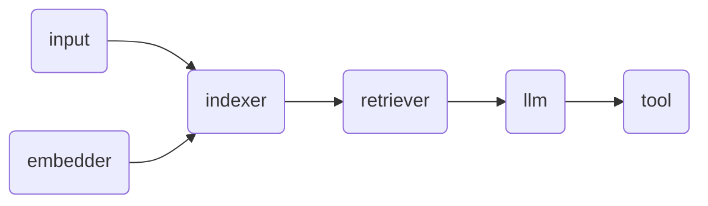

# 常见错误
- embeder返回的是float64,indexer存到milvus中的转换成了float32
- 记得配置数据库的时候要全,数据库名,collection表,等

# chatmodel

# rag

input->rag->llm->tool->output

```mermaid
graph LR
A(input)-->B(indexer)
B-->C(retriever)
C-->D(llm)
E(embedder)-->B
D-->F(tool)
```

## embeder

## indexer

## transformer

## tool

