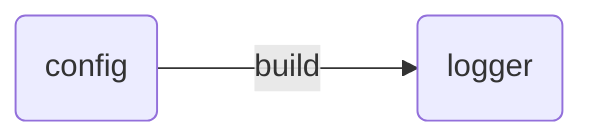

# zapboot

zap快速启动
```go
var logger *zap.Logger
func main(){
    InitLogger()
    //刷新缓冲区确保日志输出
    defer logger.Sync()
}
func InitLogger() {
    //生成开发者日志默认配置
	config := zap.NewDevelopmentConfig()
    config.Level = zap.NewAtomicLevelAt(zap.InfoLevel)
	//默认是[]string{"stderr"}
	config.OutputPaths = []string{"stdout", "./logs/log.txt"}
    //配置构建logger
	l, _ := config.Build()
	logger = l
}

```
- zap日志格式
```json
{
	"级别":"level",
	"json数据":"json",
	"注释":"comment"
}
```
级别+msg+jsong字段值
``` go
if err != nil {
        logger.Error(
            "Error fetching url..",
            zap.String("url", url),
            zap.Error(err))
    } else {
        logger.Info("Success..",
            zap.String("statusCode", resp.Status),
            zap.String("url", url))
        resp.Body.Close()
    }
```
# Logger
通过调用zap.NewProduction()/zap.NewDevelopment()或者zap.Example()创建一个Logger。
上面的每一个函数都将创建一个logger。唯一的区别在于它将记录的信息不同。例如production logger默认记录调用函数信息、日期和时间等。
通过Logger调用Info/Error等。
默认情况下日志都会打印到应用程序的console界面。
```go
package main

import (
    "net/http"

    "go.uber.org/zap"
)

var logger *zap.Logger

func main() {
    InitLogger()
    defer logger.Sync()
    simpleHttpGet("www.5lmh.com")
    simpleHttpGet("http://www.google.com")
}
func InitLogger() {
    //生成开发者日志默认配置
	config := zap.NewDevelopmentConfig()
    config.Level = zap.NewAtomicLevelAt(zap.InfoLevel)
	//默认是[]string{"stderr"}
	config.OutputPaths = []string{"stdout", "./logs/log.txt"}
    //配置构建logger
	l, _ := config.Build()
	logger = l
}

func simpleHttpGet(url string) {
    resp, err := http.Get(url)
    if err != nil {
        logger.Error(
            "Error fetching url..",
            zap.String("url", url),
            zap.Error(err))
    } else {
        logger.Info("Success..",
            zap.String("statusCode", resp.Status),
            zap.String("url", url))
        resp.Body.Close()
    }
}
```
在上面的代码中，我们首先创建了一个Logger，然后使用Info/ Error等Logger方法记录消息。

日志记录器方法的语法是这样的：
```go
    func (log *Logger) MethodXXX(msg string, fields ...Field)
```
其中MethodXXX是一个可变参数函数，可以是Info / Error/ Debug / Panic等。每个方法都接受一个消息字符串和任意数量的zapcore.Field场参数。

每个zapcore.Field其实就是一组键值对参数。

我们执行上面的代码会得到如下输出结果：
```json
{"level":"error","ts":1573180648.858149,"caller":"ce2/main.go:25","msg":"Error fetching url..","url":"www.5lmh.com","error":"Get www.5lmh.com: unsupported protocol scheme \"\"","stacktrace":"main.simpleHttpGet\n\te:/goproject/src/github.com/student/log/ce2/main.go:25\nmain.main\n\te:/goproject/src/github.com/student/log/ce2/main.go:14\nruntime.main\n\tE:/go/src/runtime/proc.go:200"}

{"level":"error","ts":1573180669.9273467,"caller":"ce2/main.go:25","msg":"Error fetching url..","url":"http://www.google.com","error":"Get http://www.google.com: dial tcp 31.13.72.54:80: connectex: A connection attempt failed because the connected party did not properly respond after a period of time, or established connection failed because connected host has failed to respond.","stacktrace":"main.simpleHttpGet\n\te:/goproject/src/github.com/student/log/ce2/main.go:25\nmain.main\n\te:/goproject/src/github.com/student/log/ce2/main.go:15\nruntime.main\n\tE:/go/src/runtime/proc.go:200"}
1.
```

# 配置
- 生成环境和开发者环境
## 简易配置
```go
var logger *zap.Logger
func InitLogger() {
    //生成开发者日志默认配置
	config := zap.NewDevelopmentConfig()
    //日志级别debug info warn error
    config.Level = zap.NewAtomicLevelAt(zap.InfoLevel)
	//默认是[]string{"stderr"}
	config.OutputPaths = []string{"stdout", "./logs/log.txt"}
    //配置构建logger
	l, _ := config.Build()
	logger = l
}

```

## 详细配置
``` go
package main

import (
	"os"

	"go.uber.org/zap"
	"go.uber.org/zap/zapcore"
)

func main() {
	// 1. 配置 EncoderConfig
	// 这是定义日志条目中各个字段如何编码的关键部分。
	// 通常从 zap.NewProductionEncoderConfig() 或 zap.NewDevelopmentEncoderConfig() 开始，然后进行修改。
	encoderConfig := &zapcore.EncoderConfig{
		// TimeKey: 日志中时间戳的键名。生产环境通常使用 "ts" 或 "timestamp"。
		TimeKey: "ts",
		// LevelKey: 日志中级别的键名。生产环境通常使用 "level"。
		LevelKey: "level",
		// NameKey: 日志中 logger 名称的键名。如果使用 zap.Named() 设置了 logger 名称，则会显示。
		NameKey: "logger",
		// CallerKey: 日志中调用者信息（文件名:行号）的键名。
		CallerKey: "caller",
		// MessageKey: 日志消息内容的键名。生产环境通常使用 "msg" 或 "message"。
		MessageKey: "msg",
		// StacktraceKey: 日志中堆栈跟踪的键名。
		StacktraceKey: "stacktrace",
		// LineEnding: 日志条目结束时的字符。通常使用默认的换行符。
		LineEnding: zapcore.DefaultLineEnding,

		// EncodeLevel: 如何编码日志级别。
		// zapcore.CapitalLevelEncoder: 大写字母表示 (如 INFO, ERROR)。
		// zapcore.CapitalColorLevelEncoder: 带颜色的大写字母 (主要用于控制台输出)。
		EncodeLevel: zapcore.CapitalLevelEncoder,

		// EncodeTime: 如何编码时间戳。
		// zapcore.ISO8601TimeEncoder: ISO8601 格式 (如 "2023-10-27T10:00:00.123Z")，人类可读且机器友好。
		// zapcore.EpochTimeEncoder: Unix 时间戳 (秒)。
		// zapcore.EpochMillisTimeEncoder: Unix 时间戳 (毫秒)。
		EncodeTime: zapcore.ISO8601TimeEncoder,

		// EncodeDuration: 如何编码持续时间字段。
		// zapcore.SecondsDurationEncoder: 以秒为单位的浮点数。
		EncodeDuration: zapcore.SecondsDurationEncoder,

		// EncodeCaller: 如何编码调用者信息。
		// zapcore.ShortCallerEncoder: 简短路径 (如 "main.go:23")，适合生产环境，占用空间小。
		// zapcore.FullCallerEncoder: 完整路径。
		EncodeCaller: zapcore.ShortCallerEncoder,
	}

	// 2. 构建 zap.Config 结构体并填充所有字段
	cfg := &zap.Config{
		// Level: 日志级别。
		// zap.NewAtomicLevelAt(zap.InfoLevel): 在生产环境中，通常将日志级别设置为 Info，只记录 Info、Warn、Error 等重要日志。
		// 如果需要更详细的日志，可以设置为 DebugLevel。
		Level: zap.NewAtomicLevelAt(zap.InfoLevel),

		// Development: 是否是开发模式。
		// false: 生产模式。这意味着 DPanic 会记录日志并退出，而不是 panic；默认的编码器配置会更紧凑。
		// true: 开发模式。DPanic 会 panic；编码器配置会更详细和人类可读。
		Development: false,

		// DisableCaller: 是否禁用调用者信息（文件名:行号）。
		// true: 禁用。在生产环境中，出于性能和日志大小考虑，通常会禁用调用者信息。
		// false: 启用。在开发调试时非常有用。
		DisableCaller: true,

		// DisableStacktrace: 是否禁用堆栈跟踪。
		// false: 启用。在生产环境中，对于 Error、Panic、Fatal 级别的日志，通常需要启用堆栈跟踪以便排查问题。
		DisableStacktrace: false, // 重要的错误日志应该包含堆栈信息

		// Sampling: 日志采样配置。
		// &zap.SamplingConfig{Initial: 100, Thereafter: 100}: 常见的生产环境设置。
		// 意味着对于某个重复的日志消息，前 100 条都会被记录，之后每 100 条只记录一条。这有助于防止日志风暴。
		// nil: 不进行采样。
		Sampling: &zap.SamplingConfig{
			Initial:    100, // 首次出现的相同日志，记录前100条
			Thereafter: 100, // 之后每100条记录1条
		},

		// Encoding: 日志编码格式。
		// "json": 生产环境首选，生成结构化日志，便于机器解析和日志收集系统（如 ELK Stack, Splunk）。
		// "console": 更适合人类阅读，通常用于开发环境。
		Encoding: "json",

		// EncoderConfig: 上面已经详细配置好的编码器配置。
		EncoderConfig: *encoderConfig,

		// OutputPaths: 日志输出目的地。
		// []string{"stderr"}: 生产环境中常见的设置，尤其在容器化部署时，日志通常会通过 stderr/stdout 发送给容器运行时。
		// []string{"./logs/app.log"}: 也可以指定文件路径。可以指定多个路径，日志会同时输出到所有目的地。
		OutputPaths: []string{"stderr"},

		// ErrorOutputPaths: Zap 内部错误日志的输出目的地。
		// []string{"stderr"}: 强烈建议将 Zap 自身的错误日志输出到 stderr，与应用程序日志分开，以便发现日志系统的问题。
		ErrorOutputPaths: []string{"stderr"},

		// InitialFields: 初始字段。这些字段会作为公共上下文添加到每个日志条目中。
		// 适用于添加服务名称、环境、版本号、实例ID等全局信息，对日志聚合和过滤非常有用。
		InitialFields: map[string]interface{}{
			"service_name": "my-go-service",
			"environment":  "production",
			"version":      "1.0.0",
			// "instance_id": "server-123", // 示例，可以动态获取
		},
	}

	// 3. 构建 Logger
	logger, err := cfg.Build()
	if err != nil {
		panic(err)
	}
	// 确保所有缓冲的日志都被写入。在程序退出前，这是一个非常重要的步骤。
	defer logger.Sync()

	// 4. 使用 Logger 记录各种级别的日志
	logger.Debug("这是一个调试日志，因为日志级别是 Info，所以不会被记录。") // 不会被记录
	logger.Info("这是一个信息日志，用于记录常规操作。",
		zap.String("user_id", "user-123"),
		zap.Int("request_id", 456),
	)
	logger.Warn("这是一个警告日志，表示可能存在问题。",
		zap.String("component", "database_connection"),
		zap.Error(os.ErrDeadlineExceeded), // 示例错误
	)
	logger.Error("这是一个错误日志，表示发生了错误。",
		zap.String("error_code", "E001"),
		zap.Error(os.ErrPermission), // 示例错误，会包含堆栈信息
	)

	// DPanic 在生产模式下只会记录日志并退出，不会 panic。
	logger.DPanic("这是一个 DPanic 日志，通常用于开发环境，生产环境会记录并退出。",
		zap.String("reason", "unrecoverable_state"),
	)

	// logger.Panic("这是一个 Panic 日志，会记录并 panic。") // 慎用，会导致程序崩溃
	// logger.Fatal("这是一个 Fatal 日志，会记录并退出程序。") // 慎用，会导致程序退出
}
```