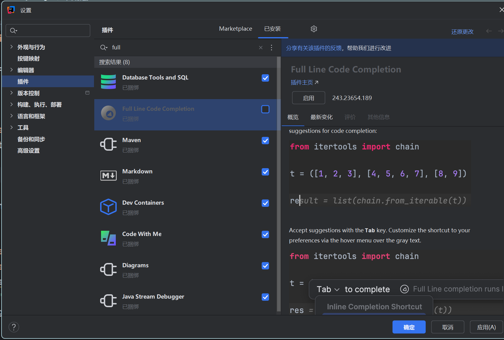
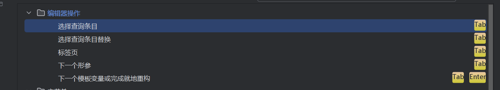
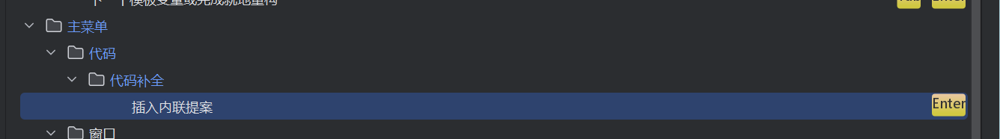
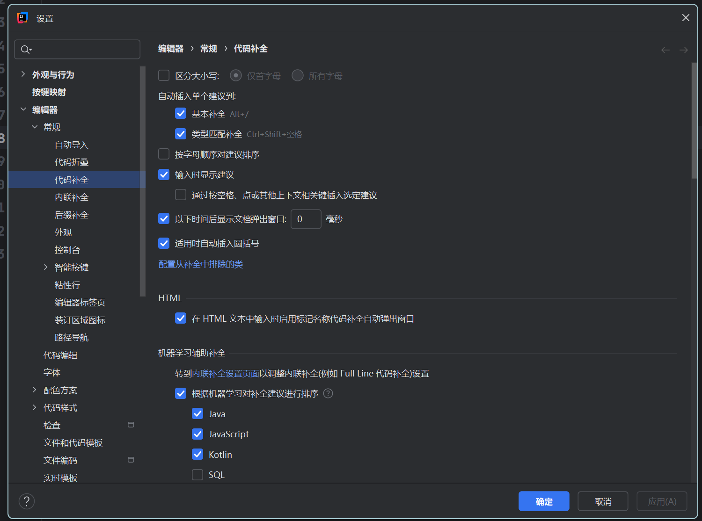

# 配置
0. 把tab设置为最常用的键例如学习的时候设为插入提示 工作设为自动补全;
1. 自动导入包
2. 大小写不敏感
3. enter 补全代码 内联插入 为tab;
或者把补全代码改为tab 然后把内联提示插入改为enter
初学者最好把整行代码补全禁用;

代码补全 basic 改为 alt+/

4. 这个通过空格balabala得取消 改成tab不然命个变量命智能选它建议的了;

# 快捷键
0. ctrl z  ctrl shift z  ctrl c x v  ctrl /
1. ctrl d  alt+shift+↑↓;
2. .var  .if
3. fori  forr(逆序)   .for  .fori  .forr;
例如对一个list集合的遍历  list.for  ; 
1. sout souf
2.  ctrl alt shift t   与 ctrl alt t 包围代码
3.  alt + enter 快速修改;
4.  alt 拖拽; alt j
5. shift + shift
6. f2  or  shift f2
7. f11 shift f11 书签