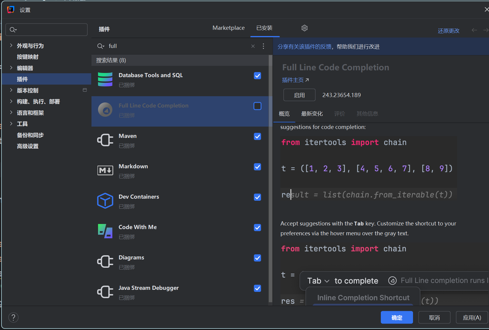
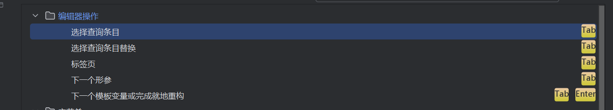
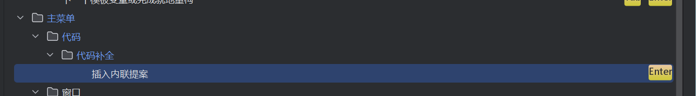
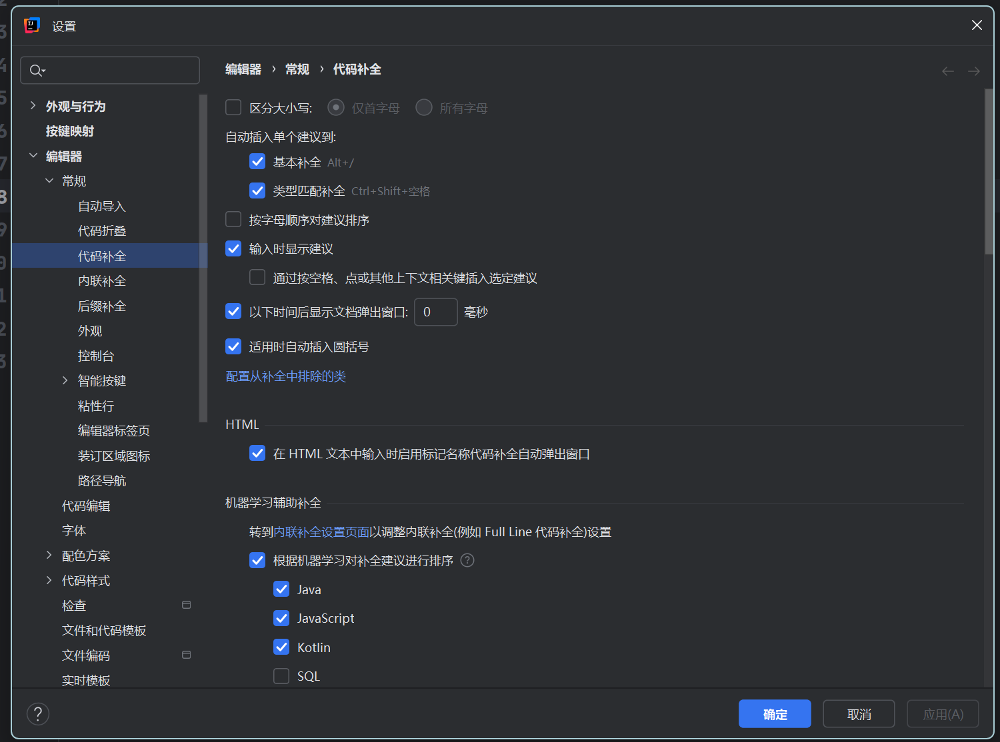

# 配置
0. 把tab设置为最常用的键例如学习的时候设为插入提示 工作设为自动补全;
1. 自动导入包
2. 大小写不敏感
3. enter 补全代码 内联插入 为tab;
最好补全代码用enter以后用cursor直接tab了 但两个最好都要掌握因为vs等编辑器是tab;
初学者最好把整行代码补全禁用;

代码补全 basic 改为 alt+/

4. 这个通过空格balabala得取消 改成tab不然命个变量命智能选它建议的了;

# 快捷键
1. 万能快捷键 alt+enter
2. f2找到下一个错误,shift+f2找到上一个错误
3. .var  .if .arg
5. fori  forr(逆序)   .for  .fori  .forr;
例如对一个list集合的遍历  list.for  ; 
1. ctrl z  ctrl shift z  ctrl c x v  ctrl /  ctrl b ctrl f r
2. ctrl d  alt+shift+↑↓;
3.  ctrl alt shift t   与 ctrl alt t 包围代码
4.  alt 拖拽; alt j
5. shift + shift
6. f2  or  shift f2
7. f11 shift f11 书签
8. sout souf

# 代码层面快捷键
- ctlr+点击 跳转
- ctrl+p 查看函数参数 pram
- ctrl+i 实现接口 implements
- alt+ctlr+m 抽取方法