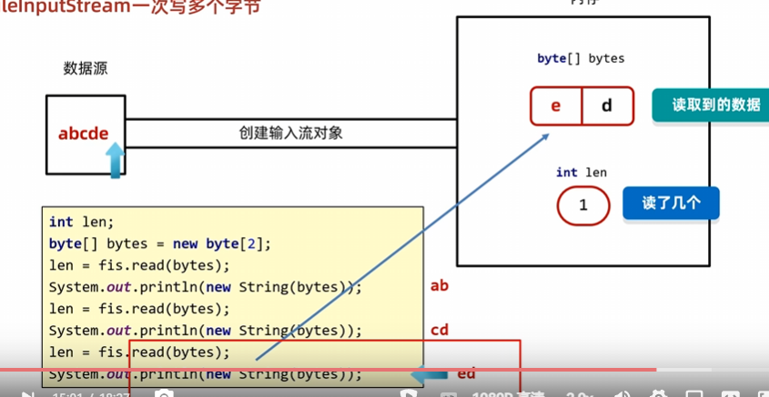
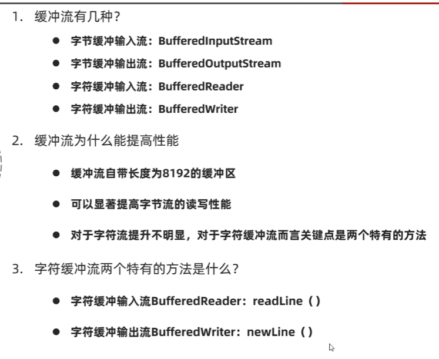
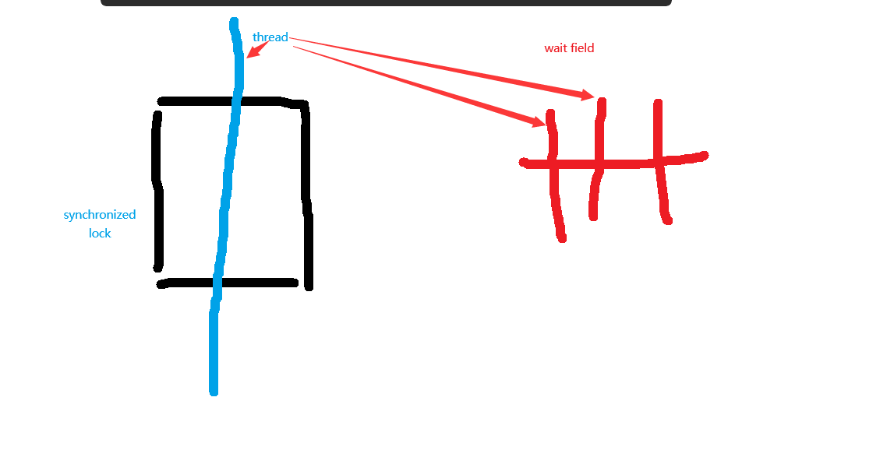
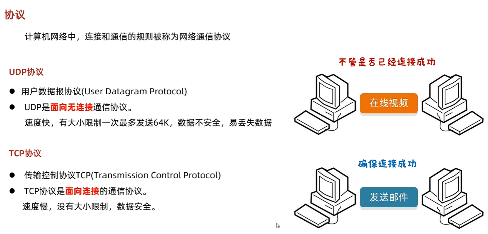

[TOC]
# 
- 这个为Java语法的重构版本,在学了c后对底层有了一些了解对java语法进行重构
- 没有的参见c++语法
# 引用(java中的指针)
- java除了int 等基本数据类型都是cpp中的引用类型 student & xm;
- 引用就是指针 pointer->new new出来的是值返回的是地址指针
## 参数传递
- 因为java中都是引用,所以方法的参数 增强for(迭代器) ...等都生成的一个指针副本
- 基本数据类型参数是值的副本


# 修饰符
## final
- public static final int x
常量 相当于c++的const
## static
**参见c++语法的static**
- 工具方法,共享变量
- 属于类本身,内存只有一份,不推荐用对象访问建议用类进行访问
- 静态区,外部可以访问静态区,静态区只能访问静态区
静态方法不能使用this因为this自指对象,对象不在静态区
### 静态代码块
- 因为类在方法区加载一次,static属于类只有一份内存
所以初始化的时候得在特定区域初始化,如果在()中初始化就会每次new对象初始化一次
- 静态代码块仅随着类在方法区加载初始化一次实现对一份内存的初始化,且仅能访问静态区的变量方法
```java
public class studeng{
    private static ...

    static{
        初始化静态...
    }
}
```

# 类和对象
```java
public class Student{
    //默认值
    public int age=0;
    public String name="xiaoming";
    //空构造要加上
    public Student(){}
    //初始化
    public Student(int age,String name){
        this.age=age;
        this.name=name;
    }
}

```

## lombook注解
直接嵌入getter setter 空构造和有参构造

## 默认值和初始化

## 构造函数
- () [] 是本体
## 拷贝函数

## 内部类
- 依赖外部类的工具类,例如汽车,发动机就是内部类

## static
**参见c++语法的static**
- 工具方法,共享变量
- 属于类本身,内存只有一份,不推荐用对象访问建议用类进行访问
- 静态区,外部可以访问静态区,静态区只能访问静态区
静态方法不能使用this因为this自指对象,对象不在静态区
### 静态代码块
- 因为类在方法区加载一次,static属于类只有一份内存
所以初始化的时候得在特定区域初始化,如果在()中初始化就会每次new对象初始化一次
- 静态代码块仅随着类在方法区加载初始化一次实现对一份内存的初始化,且仅能访问静态区的变量方法
```java
public class studeng{
    private static ...

    static{
        初始化静态...
    }
}
```


### 应用
- 共享变量
一份内存共享
```java
public Student(int age, String name) {
        this.age = age;
        this.name = name;
        Student.count++;
    }
```
- 工具方法

- 工具类
设计一些static的方法和变量存在一个工具类里方便当作工具箱
构造方法设计为private 逼格


## 封装(javabean)
```java
public class Student {
    private int age=0;
    private String name;

    public Student(int age, String name) {
        this.age = age;
        this.name = name;
    }
    //提供有参和无参构造方法
    public Student(){}

    public int getAge() {
        return age;
    }

    public void setAge(int age) {
        if(age<0){
            System.out.println("error");
            return;
        }
        this.age = age;
    }

    public String getName() {
        return name;
    }

    public void setName(String name) {
        this.name = name;
    }
}

```


## 访问权限
- public : 全局可访问
- protected : 包级权限 包内可访问子孙类可访问
- default : 包级权限 子孙类不可访问
- private : 仅类内可访问

一般都是public private

## this
- this自指对象本身
- 和static区别,static类所有,this自指虚拟的对象 
## 继承
- 子类将父类all都继承,相当于多个类组合构造一个对象,访问权限规范子类
```java
public class Sun extends Father{
    private String skill;
    public Sun(){}
    public Sun(int age,String name,String skill){
        super(age,name);
        this.skill=skill;
    }
    public void test(){
        int i = super.get();
        System.out.println(i);
    }

}
public class Father {
    private int age=0;
    private String name;
    public Father(){}
    public Father(int age, String name) {
        this.age = age;
        this.name = name;
    }
    public int get(){
        return this.age;
    }

}
```


### 方法重载
```java
public class Student{
    public int age;
    public String name;
    public String school;
    public Student(){}
    public Student(int age,String name){
        this(age,name,"...");
    }
    public Student(int age,String name ,String school){
        ...;
    }

```

### super
- 就近原则重名优先近的
- 和this类似 指向父类
- super() 父类构造方法 子类构造方法先调父类构造方法因为 方法区加载了父类和子类两个类

## 多态
- 子类给父类打补丁
### 一、什么是多态

**多态**（Polymorphism）是指同一个行为在不同对象上有不同表现形式（即同一个方法调用，表现出不同的执行效果）。

**简单理解**：同一个方法名，不同的实现。

---

### 二、多态的体现

Java中的多态主要体现在以下两个方面：

1. **方法的重写（Override）**
   子类重写父类的方法，调用方法时，实际执行的是子类的实现。

2. **对象的多态性（父类引用指向子类对象）**
   父类类型的变量可以引用子类类型的对象。

---

### 三、多态的实现条件

要实现多态，需要满足以下三个条件：

1. **继承关系**（有父子类关系）
2. **方法重写**（子类重写父类方法）
3. **父类引用指向子类对象**

---

### 四、代码示例

#### 1. 类定义

```java
class Animal {
    public void eat() {
        System.out.println("动物在吃东西");
    }
}

class Dog extends Animal {
    @Override
    public void eat() {
        System.out.println("狗在吃骨头");
    }
}

class Cat extends Animal {
    @Override
    public void eat() {
        System.out.println("猫在吃鱼");
    }
}
```

#### 2. 多态使用

```java
public class Demo {
    public static void main(String[] args) {
        Animal a1 = new Dog(); // 父类引用指向子类对象
        Animal a2 = new Cat();

        a1.eat(); // 输出：狗在吃骨头
        a2.eat(); // 输出：猫在吃鱼
    }
}
```
**说明**：虽然`a1`和`a2`的类型是`Animal`，但实际调用的是各自子类的`eat()`方法。

---

### 五、多态的好处

1. **提高代码的可扩展性和可维护性**
   新增子类时，不需要修改调用者代码，只需新增实现即可。

2. **使程序有更好的灵活性和可扩展性**
   统一接口，便于管理和维护。

---

### 六、多态的注意事项

1. **只能调用父类中声明的方法，不能调用子类特有方法（除非强制类型转换）**
   ```java
   Animal a = new Dog();
   a.eat(); // 可以
   a.lookHome(); // 编译错误！Dog特有的方法
   ```
2. **成员变量不具备多态性（编译和运行都看左边类型）**。
3. **方法调用具有多态性（编译看左边，运行看右边）**。

---

### 七、多态中的类型转换
- intanceof 判断
有时候需要将父类引用强制转换为子类类型，以访问子类特有的方法：

```java
Animal a = new Dog();
if (a instanceof Dog) {
    Dog d = (Dog) a;
    d.lookHome(); // 调用Dog特有的方法
}
```

---

### 八、面试常考：多态的绑定

- **编译时绑定**：方法调用时，编译器看左边引用类型（父类有没有这个方法）
- **运行时绑定**：实际执行时，看右边对象的真实类型（执行子类重写的方法）

---

### 九、总结

- 多态的核心是**父类引用指向子类对象**，调用方法时表现为**动态绑定**。
- 多态让代码更加灵活、可扩展。
- 多态只适用于方法，不适用于成员变量。

---

#### **一句话总结：**

> **多态就是同一个引用类型，指向不同的子类对象，调用同一方法时，表现出不同的行为。**

---


## hashcode和equals
- 重写的有String Integer系列


# 匿名内部类
new interface/class(大部分是abstract) {@Override};
- 底层会立即创建一个子类及其对象 所以叫匿名 ;
student-> student$1.class
- 方便传递一个接口对象
- comparator<> 比较器
## lambda
- 替代函数式接口 (接口)
- lambda就是简化代码用的尽量简化类似cpp的auto
```java
Arrays.sort(arr, new Comparator<student>() {
            @Override
            public int compare(student o1, student o2) {
                return 0;
            }
        });
        Arrays.sort(arr,((o1, o2) -> {return 0;}));
        //还能进一步简化
        x->x+1
```

# compareTo and Comparator<>
- java中两个元素a,b比较 a.compareTo(b) or compare(a,b)
- -1:a在b左边 0:a,b相等equals 1:a在b右边


# 面向接口(interface able)
**函数类多态** polymorph method class
- 方法类:接口是函数的集合,把对象共有的方法抽象出来 
- 接口多态:更好的解耦合便于运行维护加功能         
- 接口组合继承     
- 成员变量默认是常量和抽象方法                             
## 接口多态
- 接口多态可以用泛型(generics)辅助

```java
interface Sortable<T> {
    void sort(T[] arr);
}

class BubbleSort<T> implements Sortable<T> {
    public void sort(T[] arr) { /* 实现冒泡排序 */ }
}
//注意泛型确定类型以后就不用在具体实现类泛型声明了
class QuickSort implements Sortable<Integer> {
    public void sort(int[] arr) { /* 实现快速排序 */ }
}


```
## default方法
## 接口继承

# 组合
- 接口组合
- 内嵌

## 示例

### 一、核心需求
- 有多种设备：吊灯、电视、洗衣机、空调、窗帘、电饭煲等。
- 用户可以**选择设备**，进行**打开/关闭**操作。
- 不同设备可能有不同功能（比如有的可以调节温度、亮度等）。

---

### 二、面向接口建模

#### 1. 抽象出"可开关"设备接口

```java
public interface Switchable {
    void turnOn();
    void turnOff();
    boolean isOn();
}
```

#### 2. 具体设备实现接口

```java
public class Light implements Switchable {
    private boolean on = false;
    public void turnOn() {
        on = true;
        System.out.println("吊灯已开启");
    }
    public void turnOff() {
        on = false;
        System.out.println("吊灯已关闭");
    }
    public boolean isOn() {
        return on;
    }
}

public class TV implements Switchable {
    private boolean on = false;
    public void turnOn() {
        on = true;
        System.out.println("电视已开启");
    }
    public void turnOff() {
        on = false;
        System.out.println("电视已关闭");
    }
    public boolean isOn() {
        return on;
    }
}

public class WashingMachine implements Switchable {
    private boolean on = false;
    public void turnOn() {
        on = true;
        System.out.println("洗衣机已开启");
    }
    public void turnOff() {
        on = false;
        System.out.println("洗衣机已关闭");
    }
    public boolean isOn() {
        return on;
    }
}

// 其他设备类似
```

#### 3. 设备管理器（组合实现）

```java
import java.util.*;

public class SmartHomeController {
    private Map<String, Switchable> devices = new HashMap<>();

    public void addDevice(String name, Switchable device) {
        devices.put(name, device);
    }

    public void turnOn(String name) {
        Switchable device = devices.get(name);
        if (device != null) {
            device.turnOn();
        } else {
            System.out.println(name + " 设备不存在");
        }
    }

    public void turnOff(String name) {
        Switchable device = devices.get(name);
        if (device != null) {
            device.turnOff();
        } else {
            System.out.println(name + " 设备不存在");
        }
    }
}
```

---

#### 4. 用户操作示例

```java
public class Main {
    public static void main(String[] args) {
        SmartHomeController controller = new SmartHomeController();
        controller.addDevice("吊灯", new Light());
        controller.addDevice("电视", new TV());
        controller.addDevice("洗衣机", new WashingMachine());

        controller.turnOn("吊灯");
        controller.turnOff("电视");
        controller.turnOn("洗衣机");
    }
}
```

**输出示例：**
```
吊灯已开启
电视已关闭
洗衣机已开启
```

---

### 三、扩展能力（组合优于继承）

如果以后某些设备有特殊功能，比如**调节温度/亮度**，可以用组合：

```java
public interface Adjustable {
    void adjust(int value);
}

public class AirConditioner implements Switchable, Adjustable {
    private boolean on = false;
    private int temperature = 26;
    public void turnOn() { on = true; System.out.println("空调已开启"); }
    public void turnOff() { on = false; System.out.println("空调已关闭"); }
    public boolean isOn() { return on; }
    public void adjust(int value) {
        temperature = value;
        System.out.println("空调温度调为：" + temperature);
    }
}
```

添加到控制器即可：

```java
controller.addDevice("空调", new AirConditioner());
```

---

### 四、总结

- **接口**（Switchable，Adjustable）抽象各种设备的能力，灵活扩展。
- **组合**（SmartHomeController持有设备）实现对设备的统一管理和操作。
- 设备的功能随时可以扩展，不用修改原有控制器或设备管理逻辑。

---


# 循环标签
- 标签
```java
loop1:for(int i=0;i<100;i++){
    loop2:for(int j=0;j<100;j++){
        if(j==50){
            break loop2;or continue loop1;        
        }

    }
}

```
- 一般直接return就行

# 异常
- Java 异常体系分为两大类：

- （1）Checked Exception（受检异常）
编译器会检查。
方法中如果有可能抛出，必须用 throws 声明或用 try-catch 捕获。
例如：IOException, SQLException 等。
这些异常往往是外部不可控因素（如文件丢失、网络中断）。
抛出 RuntimeException（运行时异常）时，方法签名上不用 throws 声明，是因为 Java 认为这类异常是程序员的逻辑错误，编译器不会强制要求你捕获或声明它们。
编译器只强制你处理“受检异常”，而运行时异常属于程序员自身代码逻辑问题，Java 认为你应该通过改正代码来避免它们，而不是处理它们，所以不需要 throws 声明。
- （2）Unchecked Exception（非受检异常）
包括 RuntimeException 及其子类（如 NullPointerException, IndexOutOfBoundsException 等）。
编译器不会强制要求捕获或声明。
这些异常通常是程序错误（如空指针、下标越界等），是程序员应自己避免的。
Java 设计者认为，如果你写代码导致了运行时异常，你应该自己修正代码，而不是依赖异常处理来兜底。

## throws throw
- throws 声明方法抛出的异常类型 并把异常抛出到上层
- throw 相当于return 抛出异常后不处理就终止程序
- 类比 类型声明 和 return;

## try catch finally
```java
 try {
            System.out.println(f(0));
        } catch (MyException e) {
            e.printStackTrace();
        }
        out.println("end");
```


## 自定义异常
- 一般业务用RuntimeException 因为调用多次会每次处理异常很麻烦
```java
public static int f(int x)throws MyException {
        if(x==0){
            throw new MyException("error");
        }
        System.out.println("success");
        return x;
    }
```

# 泛型

- 参数化类型方便传递(arguments type)
- 泛型不能基本数据类型从cpp的指针引用考虑

## 一、什么是泛型？

**泛型**是 Java SE 5 引入的一个特性，用于在类、接口和方法中实现参数化类型。简单说，泛型允许你在定义类、接口、方法时，使用“类型参数”来指定将来使用时具体的数据类型，从而提高代码的复用性和类型安全性。

---

## 二、为什么需要泛型？

1. **类型安全**
   使用泛型可以在编译期检查类型错误，避免运行时抛出 `ClassCastException`。

2. **代码复用**
   只需编写一次通用代码，可以用于多种数据类型。

3. **避免强制类型转换**
   使用泛型后，很多地方不再需要手动类型转换，代码更简洁，出错率更低。

---

## 三、泛型的基本语法

### 1. 泛型类

```java
public class Box<T> {
    private T value;
    public void setValue(T value) { this.value = value; }
    public T getValue() { return value; }
}
```
使用：

```java
Box<Integer> intBox = new Box<>();
intBox.setValue(10);
Integer value = intBox.getValue();

Box<String> strBox = new Box<>();
strBox.setValue("Hello");
String str = strBox.getValue();
```

### 2. 泛型方法

```java
public class Util {
    public static <T> void printArray(T[] array) {
        for (T elem : array) {
            System.out.println(elem);
        }
    }
}
```
使用：

```java
Integer[] nums = {1, 2, 3};
Util.printArray(nums);

String[] strs = {"A", "B"};
Util.printArray(strs);
```
泛型类（或接口）：泛型参数作用于整个类/接口的成员变量和方法。
泛型方法：只在方法内部有效，与所在类是否为泛型类无关。即，泛型类中的泛型方法可以有自己独立的泛型参数。
例子：

```java
<JAVA>
public class Demo<T> {
    // 成员变量T，随类的泛型参数
    private T value;
    // 泛型方法，和类的T无关
    public <E> void show(E e) {
        System.out.println(e);
    }
}
```
### 3. 泛型接口

```java
public interface Comparable<T> {
    int compareTo(T o);
}
```
实现：

```java
public class Student implements Comparable<Student> {
    public int compareTo(Student other) {
        // 实现比较逻辑
    }
}
```

---

## 四、泛型的通配符

### 1. `?` 通配符

- `List<?>`：可以指任何类型的 List，例如 `List<String>`、`List<Integer>` 等。
- 主要用于只读场景（不能添加元素，除了 null）。

### 2. 有界通配符

- 上界（extends）：`List<? extends Number>`
  - 表示元素类型是 Number 或其子类。extends 的可以是接口
- 下界（super）：`List<? super Integer>`
  - 表示元素类型是 Integer 或其父类。

**示例：**

```java
public void printNumbers(List<? extends Number> list) {
    for (Number n : list) {
        System.out.println(n);
    }
}
```

---

## 五、类型擦除

Java 泛型在编译后会进行**类型擦除**，泛型类型参数会被替换为原始类型（如 Object），所以运行时不会有泛型信息。

---

## 六、使用泛型的注意事项

1. 不能用在静态变量上（因为类型参数属于实例）。
2. 不能实例化泛型类型参数（不能 new T()）。
3. 不能创建泛型数组（如 new T[]）。
4. 不能使用基本类型作为泛型参数（如 List<int>，只能用 List<Integer>）。

---

## 七、常见应用

- 集合框架：`List<T>`, `Set<T>`, `Map<K,V>`
- 自定义工具类和数据结构

---

## 总结

泛型是 Java 提高类型安全和代码复用的重要机制。掌握泛型的基本用法、通配符和常见注意事项，有助于写出更健壮、灵活的代码。


# 字符串
- 用StringBuilder
## 方法
- 增 append insert
- 删 delete 
- 改 replace
- 查 indexof charat substring

## 转换
- Integer.parseInt() Integer.valueOf() int 和 Integer
- String.valueOf() ""+int

# Collection 接口
## 迭代器
```java
Iterator<Integer> iterator = arr.iterator();
        while(iterator.hasNext()){
            Integer next = iterator.next();
            iterator.remove();
        }
```
- 建议用增强for ,
删除元素 设计并发问题需要i--;
用removeIf+lambda

### 增强for
collection.for  idea .后缀自动遍历;
### removeIf
```java
ArrayList<Integer> arr = new ArrayList<>();
        arr.removeIf(new Predicate<Integer>() {
            // 可lambda简化;
            @Override
            public boolean test(Integer integer) {
                if(integer>1){
                    return true;
                }
                return false;
            }
        });
```

## List
- arraylist<>
- linkedlist<>

## Set
- hahsCode 重写hashCode和equals方法
### HashSet<>

### TreeSet
- 重写compareTo() 方法 -1 左边小  0相等   1右边大

## Map
- map.entrySet() 将map转成元素是map.Entry<>的set就能for迭代了
变成set后才能removeif 解决并发修改问题
map生成的set是一个视图和map共用一个内存区域
- 键唯一 值可重复


# Stream流
- 链式操作,new 流会复制一份不是视图
- 生成流
collection.stream()  arrays.stream(int[] arr)  streamof  

## 中间方法

- filter sorted limit skip
```java
list.stream().skip(3).limit(3).forEach(...)
```
- distinct去重

- map类型转换

- Stream.concat(,)

## 终结方法
- forEach 遍历
- toArray(x->new object[x])
- collect
```java
        Map<Integer, Integer> map = arr.stream().collect(Collectors.toMap(x -> x, x -> x + 1));
        //tolist toset同理
```


# IO流
- 相当于构建一个信息传输通道
- 字节流(word 等所有类型文件) 字符流(.md  .txt)
- 文件路径可以/ 后者\\
```java
FileInputStream fi = new FileInputStream("D:\\gangbalei\\java\\csp\\src\\input.txt");
        FileOutputStream fo = new FileOutputStream("D:\\gangbalei\\java\\csp\\src\\output.txt",true);
        int tmp;
        while(true){
            tmp=fi.read();
            if(tmp==-1){
                break;
            }
            fo.write(tmp);
        }
fo.close();
        fi.close(); //注意按照栈的方式close
// 创建一个

```
## 拷贝
- 用一个字节数组一块读取 建议1024的整数倍
注意tmp数组会有残留

```java
 FileInputStream fi = new FileInputStream("D:\\gangbalei\\java\\csp\\src\\input.txt");
        FileOutputStream fo = new FileOutputStream("D:\\gangbalei\\java\\csp\\src\\output.txt",true);
        int len;
        byte[] tmp = new byte[1024 * 1024 * 5];
        while(true){
            len=fi.read(tmp);
            if(len==-1){
                break;
            }
            fo.write(tmp,0,len);
        }
        fo.close();
        fi.close();
```
## 异常处理
- 开发当中直接抛出 throw || throws处理

## 字符编码
1.在计算机中，任意数据都是以二进制的形式来存储的
2.计算机中最小的存储单元是一个字节
3.ASCI字符集中，一个英文占一个字节
4.简体中文版Windows，默认使用GBK字符集
5.GBK字符集完全兼容ASCII字符集
一个英文占一个字节，二进制第一位是0
一个中文占两个字节，二进制高位字节的第一位是1

## unicode
- utf-8:编码规则 将查到的unicode编码按照某种方式存起来
ascii 1字节 0开头
中文 3字节表示 1110 10 10 


## 字符流
字节流+字符集格式化
和字符流类似 byte[]->char[]
```java
FileWriter fw = new FileWriter("D:/output.txt",true);
        FileReader fr = new FileReader("D:/input.txt");
        fw.write("\n");
        int len=0;
        char[] tmp = new char[1024 * 1024 * 5];
        while(true){
                len=fr.read(tmp);
                if(len==-1){
                    break;
                }
                fw.write(tmp,0,len);
            }
```
- 底层原理
1. 判断是否有字符读取
2. 没有就放到内存缓冲区
3. 读取

## 缓冲流
Buffered

### 缓冲流就是对字节流的高级包装

```java
BufferedInputStream bis = new BufferedInputStream(new FileInputStream("D:/input.txt"));
        BufferedOutputStream bos = new BufferedOutputStream(new FileOutputStream("D:/output.txt", true));
        int len=0;
        byte[] tmp = new byte[1024 * 1024 * 5];
        while(true){
            len=bis.read(tmp);
            if(len==-1){
                break;
            }
            bos.write(tmp,0,len);
        }
        //
        bos.close();
        bis.close();
```


# java多线程
## 进程

## 线程
- 线程包含在进程中
- 在进程中互相独立能同时运行
- 多线程

## 并发和并行
- 多个指令单个cpu交替执行
- 多个指令在多个cpu同时执行

## 实际开发中，推荐优先使用实现Runnable接口，其次是Callable接口，几乎不用直接继承Thread。

## Thread 类
- main线程
- setName getName
有默认名字叫Thread+数字
- Thread.sleep(1000) 此线程进入等待去休眠1000ms
- Thread.currentThread 获取该方法所在的线程对象
### Priority 线程优先级
- java线程优先级是抢占随机式 优先级高抢到线程概率高
- 优先级有1-10 个等级默认等级是5
### setDaemon 守护线程
相当于主线程的仆人,主线程退出守护线程惯性一段时间再退出
### yeild 礼让线程
- 执行到Thread.yeild() 本线程腾出cpu给别的线程
### join 插入线程用的不多


## Runnable 接口
- Thread(Runnable)
runnable接口是线程具体执行的代码块- 
```java
public class Test implements Runnable{
    @Override
    public void run() {
        Thread t=Thread.currentThread(); //返回此方法在哪个线程中运行
        System.out.println(t.getName()+"nihao");
    }
}

public class Main{
    public static void main(String[] args) {
        Thread thread1 = new Thread(new Test());
                thread1.setName("thread one");
        thread1.start();
    }
}
```
## Callable<>
- 线程返回值用这个接口
- Thread(RunnableFuture(Callable))
FutureTask implements RunnableFuture
### RunnableFuture封装
- Thread接受的对象是runable
- futuretask实现了runnableFuture接口,这个接口又实现了runable接口可以加入thread又实现了future接口可以返回值
```java
public class Test implements Callable<Integer> {

    @Override
    public Integer call() throws Exception {
        Thread thread = Thread.currentThread();
        Thread.sleep(1000);
        System.out.println(thread.getName()+"nihao");
        return 0;
    }
}

main{
    public static void main(String[] args) throws ExecutionException, InterruptedException {
        RunnableFuture<Integer> runnableFuture = new FutureTask<>(new Test());
        Thread t1 = new Thread(runnableFuture);
        t1.setName("thread1 ");
        t1.start();
        System.out.println(runnableFuture.get());
    }
}
```

### 2.3 FutureTask的作用

**FutureTask**是一个适配器（桥梁），它实现了Runnable接口和Future接口：

```java
public class FutureTask<V> implements RunnableFuture<V>
```
而RunnableFuture又继承了Runnable和Future：

```java
public interface RunnableFuture<V> extends Runnable, Future<V>
```

- 它可以包装Callable对象，变成一个Runnable对象，这样可以供Thread/线程池执行。
- 同时，它又能让你通过Future接口拿到任务执行的返回值、异常。

---

### 2.4 线程池的作用

- 线程池（如ExecutorService）可以直接接受Runnable和Callable任务，统一管理线程。
- 你用线程池的`sumbit(Callable)`方法，线程池内部会帮你包装成FutureTask。

---

### 3. 总结

- **为什么要用FutureTask包装Callable？**
  - 因为Thread只能接受Runnable，不能直接接受Callable。
  - FutureTask既实现了Runnable（可以给Thread/线程池执行），又实现了Future（可以拿返回值和异常）。
  - 线程池内部也是用FutureTask来适配Callable的。

- **为什么用线程池？**
  - 线程池能自动管理线程、回收资源、复用线程，还能统一管理任务的返回值/异常。

---

### 4. 小结一句话

> **Callable不能直接给Thread用，要用FutureTask包装成Runnable；线程池也会自动用FutureTask适配，这样才能获取线程的返回值和异常。**

---

## 线程安全
- i++ 先读取再写入可能会出现多个线程一起操作的情况线程不安全
### 锁
#### synchronized
同步代码块中仅允许一个线程执行,
synchronized(唯一锁对象){};
```java
public class Test implements Callable<Integer> {
    //锁对象唯一用类的字节码文件可以实现
    public static int i=0;
    @Override
    public Integer call() throws Exception {
            while(true){
                //类的字节码文件唯一,因为钥匙只有一把
                 synchronized (Test.class){
                Test.i++;
                System.out.println(Test.i);
            }
        }
        return 0;
    }
}
```
#### synchronized方法关键字
锁对象:
非静态 this
静态 类.class
将synchronized代码块中抽取成方法

### 死锁

## 等待唤醒机制
- 
- synchronized 代码块就是runnable对象,传递到thread中进行执行
- 一条线程执行完runnable任务就会直接销毁;所以要套在while(true)里
### 生产消费者
```java
public class Desk {
    public static Object lock=Desk.class;
    public static int count=10;
    public static int isHave=0;

}
public class Consumer implements Runnable{
    @Override
    public void run() {
        while (true){
            synchronized (Desk.lock){
                if(Desk.count==0){
                    break;
                }else{
                    //此synchronized代码块的线程进入等待区
                    if(Desk.isHave==0){
                        try {
                            Desk.lock.wait();
                        } catch (InterruptedException e) {
                            e.printStackTrace();
                        }
                    }else{
                        Desk.count--;
                        System.out.println("consumer吃"+ Desk.count);
                        Desk.isHave=0;
                        //唤醒等待区线程
                        Desk.lock.notifyAll();
                    }
                }
            }
        }
    }
}


public class Producer implements Runnable{
    @Override
    public void run() {
        while (true){
            synchronized (Desk.lock){
                if(Desk.count==0){
                    break;
                }else{
                    if(Desk.isHave==0){
                        Desk.isHave=1;
                        System.out.println("producer做");
                        //唤醒等待区线程
                        Desk.lock.notifyAll();
                    }else{
                        //此synchronized代码块的线程进入等待区
                        try {
                            Desk.lock.wait();
                        } catch (InterruptedException e) {
                            e.printStackTrace();
                        }

                    }
                }
            }
        }
    }
}

public class Main{
    public static void main(String[] args) {
        Runnable consumer = new Consumer();
        Runnable producer = new Producer();
        Thread thread1 = new Thread(consumer);
        Thread thread2 = new Thread(producer);
        thread1.start();
        thread2.start();
    }
}
```

### 阻塞队列

## 线程池
- 线程复用
```java
public static void main(String[] args) {
        //无上限线程池
        ExecutorService threadpool1 = Executors.newCachedThreadPool();
        //有上限线程池
        ExecutorService threadpool2 = Executors.newFixedThreadPool(3);
        //runnable 任务
        Runnable runnable = new Test();
        //线程池提交任务
        threadpool2.submit(runnable);
        threadpool2.submit(runnable);
        threadpool2.submit(runnable);
        threadpool2.submit(runnable);
        // 线程池销毁一般不销毁
        threadpool1.shutdown();
    }

```


# java 网络
## 三要素
- ip
- 端口
- 通信协议

## 特殊ip
- 192.168. . 
- 127.0.0.1 回环地址

## 协议



## UDP


### 组播 广播
- 224.0.0.0~ 是组播地址
- 255.255.255.255 广播地址


# Junit 单元测试
```java
public class StringYewu {
    public int len(String str){
            return str.length()-1;

    }

}public class StringYewuTest {
    @Test
    //空参空返回
    public void testLen(){
        StringYewu test = new StringYewu();
        int fsd = test.len("fsd");
        Assert.assertEquals(3,fsd);
        test.len(null);
    }
}

```
- 右键测试方法进行单元测试
- 可在文件/项目结构中查询依赖 移出或管理 junit
