[TOC]
## ReadMe
与java有关的语法  API 题目等;数据结构 算法具体的知识 与之有关的技巧不写入;

# API
### I/O 
- Bufferedreader PrintWriter StringTokenizer .split
- 造一个fastreader类
```java
public class FastReader {
    BufferedReader br;
    StringTokenizer st;

    // 构造函数中初始化 BufferedReader 和一个空的 StringTokenizer
    public FastReader() {
        br = new BufferedReader(new InputStreamReader(System.in));
        st = new StringTokenizer(""); // 初始一个空的 StringTokenizer
    }

    // 返回下一个输入项（以空白字符分隔）
    public String next() {
        // 只判断 StringTokenizer 中是否还有 token
        while (!st.hasMoreTokens()) {
            try {
                String line = br.readLine();
                // 这里如果输入结束，可以选择返回 null 或者抛出异常，依据具体需求决定
                if (line == null) {
                    return null;
                }
                st = new StringTokenizer(line);
            } catch (IOException e) {
                e.printStackTrace();
            }
        }
        return st.nextToken();
    }

    // 读取下一个 int 数值
    public int nextInt() {
        return Integer.parseInt(next());
    }

    // 读取下一个 long 数值
    public long nextLong() {
        return Long.parseLong(next());
    }

    // 读取下一个 double 数值
    public double nextDouble() {
        return Double.parseDouble(next());
    }

    // 读取整行数据
    public String nextLine() {
        String str = "";
        try {
            // 如果当前 StringTokenizer 中仍有未读数据，可以先将剩余部分返回；
            // 否则直接读取下一行
            if (st.hasMoreTokens()) {
                str = st.nextToken("\n");
            } else {
                str = br.readLine();
            }
        } catch (IOException e) {
            e.printStackTrace();
        }
        return str;
    }
}

```
- printwriter  原理是 把结构全输出到流中 最后out.flush()再一次性打印到控制台;记得最后out.close();
#### StringTokenizer
st=new StringTokenizer(line," ,&") ""里的是分割符分隔符是或的关系无法使用正则表达式;
st.hasMoreTokens()
st.nextToken()
#### string.split
.split(" {1,}")split可以使用正则表达式;

#### 一般情况
注意if(line == null || line.isEmpty()){break;} line可能是空字符 操蛋玩意也要
```java
        //全都初始化好 输入输出和分词器
        PrintWriter out=new PrintWriter(new OutputStreamWriter(System.out));
        BufferedReader reader=new BufferedReader(new InputStreamReader(System.in));
        StringTokenizer st=new StringTokenizer("");
        //start三剑客
        int [] [] arr=new int[2][3];
                for (int i   = 0; i <2 ; i++) {
                    st=new StringTokenizer(reader.readLine());
                    for(int j=0;j<3;j++){
                        arr[i][j]=Integer.parseInt(st.nextToken());
                    }
                }

        for (int i = 0; i < 2; i++) {
            for (int j = 0; j < 3; j++) {
                out.println(arr[i][j]);
            }
        }
        out.flush();
```

### BigInteger
- 底层逻辑是字符串转成高精度
- 用一个数组位置代表数字的一位高精度
- 可完全视为数字 运算用其自带的库函数就行;
- 因为是用多余空间进行高精度所以如果不超过位数不要用biginteger否则空间时间会很高
### System类
- System.arraycopy() 是 Java 中一个非常常用的用于数组拷贝的静态方法。它的作用是将源数组中的一部分或全部元素复制到目标数组中的指定位置。这个方法是系统级的，因此执行效率比较高。
public static void arraycopy(Object src, int srcPos, Object dest, int destPos, int length)
参数说明：
src：源数组（从这个数组中复制元素）。
srcPos：源数组的起始位置（从该位置开始复制）。
dest：目标数组（将元素复制到这个数组）。
destPos：目标数组的起始位置（复制到目标数组的哪个位置）。
length：要复制的元素个数。
### StringBuilder/String类
相较于String来说，处理速度更快，所以处理字符串的时候一般使用StringBuilder，最后再通过toString()方法转为字符串
常见的 add  remove  set  get 方法
```java
// 构建一个值为str的可变字符串【也可传空参数】
StringBuilder(String str)
// 返回索引i位置的字符
charAt(int i)
// 返回此字符串的长度
length()
// 在此字符串追加str【参数为StringBuilder也可以】
append(String str)
// 在index处插入字符数组c【c也可以是单个字符或者其他类型】
insert(int index, char[] c)	
// 将char的子数组【下标offset开始，长度len】追加到此字符串
append(char[] str, int offset, int len)	
// 移除此序列从start到end-1的字符串
delete(int start, int end)	
// 移除指定索引上的字符
deleteCharAt(int index)	
// 将指定索引处的字符替换为ch
setCharAt(int index, char ch)	
// 将此字符串反转
reverse()			
// 返回此字符串从start开始至length-1结束的String
substring(int start)		
// 返回此字符串从start开始至end-1结束的String
substring(int start, int end)	
// 返回此序列中的String表示形式
toString()		

// lastIndexOf有类似用法👇
// 返回子字符串第一次出现的索引
indexOf(String str)		
// 同上，从指定位置查找
indexOf(String str, int fromIndex)
```

### Integer Double 等
- .parseInt .valueOf

### Math 类
- Math.min()  返回最大最小可以不用if判断直接max函数
Math.max 同理


### Arrays类
- Arrays.sort(int [] arr); 将数组arr 升序排列 
- Arrays.binarySearch(int[] arr,int tg); 
### Collections
##### Collections.sort
Collections.sort(Collectiong arr , new Comparator(){@Override public int compare(Object o1,Object o2){}});
重写比较方法 参数为arr中的相邻两元素 1 是交换 -1是不交换;


# 集合API
- 数据结构satck queue等就是个Cache 临时存储数据用的
## 方法大纲
### 元素
- add put
- remove delete poll pop
- set 
- contains indexof 
### 子集
- sub
- 
### 全集
- equals
- keySet entrySet 

## Comparator<E> 接口
- 匿名内部类:对于接口的实例化
new可以生成类的对象不能生成接口的对象因为接口里边没有成员变量仅是其他类的方法
尽享传递一个接口的时候可以使用匿名内部类
new Interface<E>(){
	@Override
	重写方法
}
相当于创造了一个实现这个接口的对象 

- 使用情况:需要进行排序的常见如sort(arr,new Comparator<E>(){}),new PriorityQueue<E>(new Comparator<E>(){})

- 用法:
new一个匿名内部类重写compare方法,compare方法是以升序为基准return 0 1 -1, 1为o1>o2  0为o1=o2  -1为o1<o2
-1 前者优先级高,1后者优先级高,0优先级相同;
可以简单理解为1是改变两者排序 -1是不改变两者排序
- 多重比较
```java
new Comparator<E>(){
	@Override
	public int compare(E o1,E o2){
		if(o1.height!=o2.height){
			return o1.height-o2.height;
		}else{
			if(o1.age!=o2.age){
				return Integer.compare(o1.age,o2.age);  //利用很多类都提供的compare方法BigInteger Integer 也都提供 x.compareTo(y)这俩一样后者常有因为前者是静态方法;
			}else{
				return -1;
			}
		}
	}
};
```

## Arrays
- Arrays.sort()  比Collectiong的更底层能够排指定range的 可以将collecions toArray转换为数组
- Arrays.fill()
- Arrays.binarySearch() 找到不是左边的需要再往左遍历才能找到 找不到就是  -(极限+1);可以取abs()-1;
## E[] 

## Collections
Collections.sort() 比arrays的能操作的空间更少;
binarySearch()  找不到返回 -(index+1);同arrays.binarySearch
## ArrayList<E>

## LinkedList<E> and ArrayDeque<E>

### Queue

### Stack

## PriorityQueue<E>
- 基于heap堆实现
- 可用Comparator<E>接口对元素进行优先级比较;

## FindUnion
并查集好用且常用;
```java
class FindUnion{
    int[] father;
    int[] size;
    FindUnion(int n){
        father=new int[n];
        size=new int[n];
        for(int i=0;i<n;i++){
            father[i]=i;
            size[i]=1;
        }
    }
    int find(int n){
        int i=n;
        ArrayDeque<Integer> stack=new ArrayDeque<>();
        while(!(i==father[i])){
            stack.push(i);
            i=father[i];
        }
        while(!stack.isEmpty){
            int pop=stack.pop();
            father[pop]=i;
        }
        return i;
    }
    void union(int a,int b){
        fa=find(a);
        fb=find(b);
        if(fa!=fb){
            if(size[a]>=size[b]){
                father[fb]=fa;
                size[fa]+=size[fb];
            }else{
                father[fa]=fb;
                size[fb]+=size[fa];
            }
        }
    }
    boolean isSameSet(int a,int b){
        return find(a)==find(b);
    }
}
```

## MonotonicQueue<E>
```java
package tools;

import java.io.OutputStreamWriter;
import java.io.PrintWriter;
import java.util.ArrayDeque;
import java.util.LinkedList;

//单调递减队列
public class MonotonicQueue {
        ArrayDeque<Integer> deque=new ArrayDeque<>();

        void offer(int element){
            //null合并逻辑;
            while(!deque.isEmpty() && element>deque.peekLast()){  //注意是> 不是>=  贪心思想;
                deque.pollLast();
            }
            deque.offerLast(element);
        }

        void poll(){
            deque.pollFirst();
        }

        int peek(){
            return deque.peekFirst();
        }
}

```

## HashSet
- 哈希表 值对N集的映射

## TreeSet
- 有序表 重写equals  hashcode方法
- 一般无重复集合

## HashMap/TreeMap
同理set;
- 键值对的集合 将键做成哈希表 值链到键下边;所以TreeMap中插入比较器时候只能对键排序
- map中的对象是Map.Entry<*,*>
- getOrDefault(key,value) 有就返回get没有就设置初始值;

## Graph
```java
class Vertex{
    int name;
    ArrayList<Edge> edges=new ArrayList<>();
    //
    boolean visited;
    //
    int indegree;
    //
    int distance
    Vertex prev;
    Vertex(int name){
        this.name=name;
    }
}
class Edge{
    int weight;
    // Vertex from Vertex to
    Vertex link;
    Edge(int weight,Vertex link){
        this.weight=weight;
        this.link=link;
    }
}
```
-------------------------------------------------------------------------------------
# 前缀和 和 差分
- 积分和微分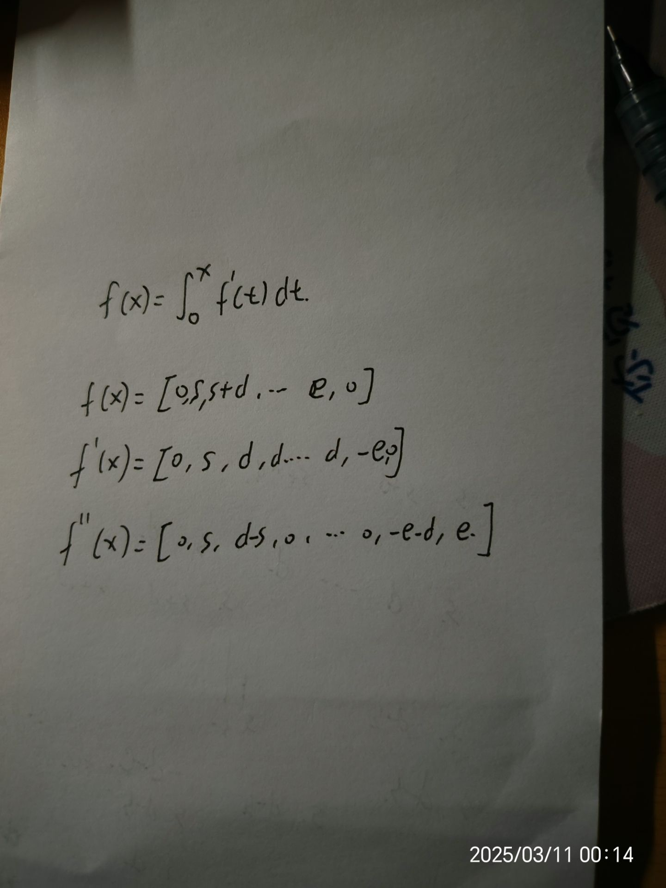
- sentry 二维和一维 补充哨兵节点
- 容斥原理;

## 前缀和
- 连续函数中的积分离散数组中的前缀和
## 子数组问题
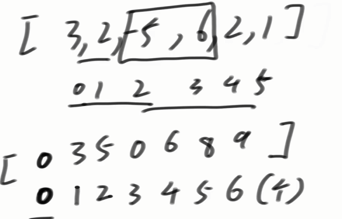
开头设置哨兵节点 真实位置映射到为+1
```java
public NumArray(int[] nums) {
			sum = new int[nums.length + 1];
			for (int i = 1; i <= nums.length; i++) {
				sum[i] = sum[i - 1] + nums[i - 1];
			}
		}

		public int sumRange(int left, int right) {
			return sum[right + 1] - sum[left];
		}
	}

```
- 子数组一定连续
## 最长子数组
```java
public static int compute() {
		map.clear();
		// 重要 : 0这个前缀和，一个数字也没有的时候，就存在了
		map.put(0, -1);
		int ans = 0;
		for (int i = 0, sum = 0; i < n; i++) {
			sum += arr[i];
			if (map.containsKey(sum - aim)) {
				ans = Math.max(ans, i - map.get(sum - aim));
			}
			if (!map.containsKey(sum)) {   // 如果有了就不用添加了;
				map.put(sum, i);
			}
		}
		return ans;
	}
```
- 子数组次数就把上题的value改为次数即可
## 子数组01转换
力扣1124 将数组转换成1,-1在前缀和;
```java
public static int longestWPI(int[] hours) {
		// 某个前缀和，最早出现的位置
		HashMap<Integer, Integer> map = new HashMap<>();
		// 0这个前缀和，最早出现在-1，一个数也没有的时候
		map.put(0, -1);
		int ans = 0;
		for (int i = 0, sum = 0; i < hours.length; i++) {
			sum += hours[i] > 8 ? 1 : -1;
			if (sum > 0) {
				ans = i + 1;
			} else {
				// sum <= 0
				if (map.containsKey(sum - 1)) {
					ans = Math.max(ans, i - map.get(sum - 1));
				}
			}
			if (!map.containsKey(sum)) {
				map.put(sum, i);
			}
		}
		return ans;
	}
```
## 子数组和同余原理
用同余原理可以构造前缀余数和;
- 力扣1590
```java
public static int minSubarray(int[] nums, int p) {
		// 整体余数
		int mod = 0;
		for (int num : nums) {
			mod = (mod + num) % p;
		}
		if (mod == 0) {
			return 0;
		}
		// key : 前缀和%p的余数
		// value : 最晚出现的位置
		HashMap<Integer, Integer> map = new HashMap<>();
		map.put(0, -1);
		int ans = Integer.MAX_VALUE;
		for (int i = 0, cur = 0, find; i < nums.length; i++) {
			// 0...i这部分的余数
			cur = (cur + nums[i]) % p;
			find = cur >= mod ? (cur - mod) : (cur + p - mod);
			// find = (cur + p - mod) % p;
			if (map.containsKey(find)) {
				ans = Math.min(ans, i - map.get(find));
			}
			map.put(cur, i);
		}
		return ans == nums.length ? -1 : ans;
	}
```
## 子数组和状态压缩
- 力扣1371
将五个元素抽象成2进制的五个位置
前缀和就是^无进位加法;int[32] map;就是哈希表
.

## 差分

差分方程就是微分函数;
- 连续函数的微分dy 可以看作数组上的差分;
- 力扣1109经典差分
```java
class Solution {
    public int[] corpFlightBookings(int[][] bookings, int n) {
        int[] arr=new int[n+2];
        for(int i=0;i<bookings.length;i++){
            arr[bookings[i][0]]+=bookings[i][2];
            arr[bookings[i][1]+1]-=bookings[i][2];
        }
        int[] ans=new int[n];
        for(int i=1;i<=n;i++){
            arr[i]=arr[i]+arr[i-1];
            ans[i-1]=arr[i];
        }
        return ans;
    }
}
```
## 等差数列差分
arr[r]+=s
arr[r+1]+=d-s
arr[l+1]-=d-e
arr[l+2]+=e 
通过两次微分离散函数可以得到
## 二维前缀和
- 二维积分  →→  ↓↓ all 行积分 再 all列积分
- 容斥原理
## 二维差分
- 同理一维;

# 树状数组
- 线段树是从顶层二分构建,树状数组是从底层2的幂构建;
- 用来维护可微分的函数(可差分的信息)
- 最值等不可差分的信息直接交给线段树
- 技术细节:
下标一定要从1开始
^性质:无进位加法,...
Brian算法(n&-n)
## 性质
- i所维护的范围是[i-i&-i+1,i]; or (i-i&-i,i]
- 包含i的所有点是f(i)=i+i&-i;
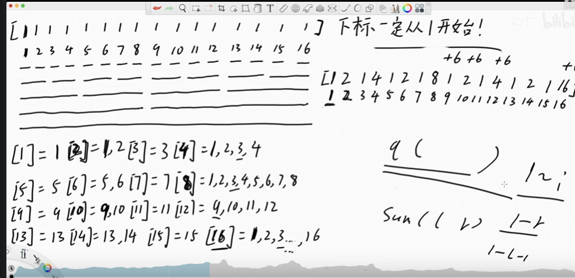
## add sum方法
- 根据性质可得;
- add(i,x)在所有包含i的点上+=x;
- sum(i)依次寻找i之前的所有维护范围累加;
## TreeArray类
```java
class TreeArray {
    int[] treeArray;

    //可以用方法重载实现两种构造方法;
    TreeArray(int[] arr) {
        treeArray = new int[arr.length + 1];
        for (int i = 1; i < treeArray.length; i++) {
            add(i, arr[i - 1]);
        }
    }
    TreeArray(int n) {
        treeArray = new int[n+1 + 1];
    }

    // 单点更新：在第 i 个位置加上 x
    void add(int i, int x) {
        // 保证 i 小于 treeArray 的长度
        while (i < treeArray.length) {
            treeArray[i] += x;
            // 注意括号，保证先计算 (i & -i)
            i = i + (i & -i);
        }
    }

    // 返回 1~i 的前缀和
    int sum(int i) {
        int sum = 0;
        while (i > 0) {
            sum += treeArray[i];
            i = i - (i & -i);
        }
        return sum;
    }

    // 返回区间 [l, r] 的和
    int range(int l, int r) {
        return sum(r) - sum(l - 1);
    }
}

```
## 单点增加范围查询
用treearray维护就行
## 范围增加单点查询
用treearray来维护原数组的差分数组(导函数)
## 范围增加范围查询
直接线段树

## 二维
- 线段树解决二维得用树套树所以用树状数组;
- 范围增加单点查询和单点增加范围查询直接同理一维增加一个for循环
```java
private void add(int x, int y, int v) {
			for (int i = x; i <= n; i += lowbit(i)) {
				for (int j = y; j <= m; j += lowbit(j)) {
					tree[i][j] += v;
				}
			}
		}
		// 从(1,1)到(x,y)这个部分的累加和
		private int sum(int x, int y) {
			int ans = 0;
			for (int i = x; i > 0; i -= lowbit(i)) {
				for (int j = y; j > 0; j -= lowbit(j)) {
					ans += tree[i][j];
				}
			}
			return ans;
		}
```
### 范围增加范围查询
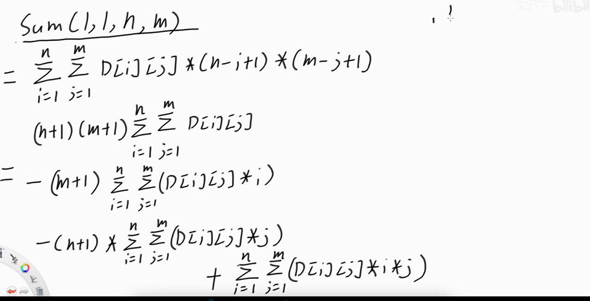
维护 [i][j] [i][j]i  [i][j]j [i][j]ij 4个树状数组;

## 离散化
- 将数组值映射到连续的正数数组中
- 例如用treeset logn级别的离散化操作
```java
int[] arr=new int[]{1,3,4,4,55,6,7};
        TreeSet<Integer> set=new TreeSet<>(new Comparator<Integer>() {
            @Override
            public int compare(Integer o1, Integer o2) {
                return o1-o2;
            }
        });
        for (int i : arr) {
            set.add(i);
        }
        HashMap<Integer,Integer> map=new HashMap<>();
        int cnt=1;
        for (Integer i : set) {
            map.put(i,cnt++);
        }
        
        int[] arrnew=new int[arr.length];
        for (int i = 0; i < arrnew.length; i++) {
            arrnew[i]=map.get(arr[i]);
        }

```
# 线段树7
- 技术细节:
维护一段区间的信息,解决范围增加范围查询的题目
jobl,jobr区间不断在线段树上往下筛直到包围住某个节点维护的区间;最后递归树的叶子节点组合成线段正好是jobl,jobr这个线段所以叫线段树
lazy机制:包住某个区间直接返回在lazy数组中记录并+=tree中的信息,每次下筛经过此区域再下发lazy的信息;
- 一维线段树树状数组都可以,二维树状数组;
- 范围查询和范围修改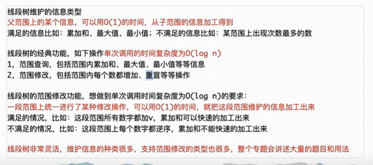
- 下标从1开始将数组拆成子线段然后分成二叉树 二叉树数组大小为4*n+1 子节点是2*i 和 2*i+1;
- 递归填写每个节点的值; 
- 建树,query方法
```java
static void build(int[] arr, int l, int r, int index) {
        if (l == r) {
            tree[index] = arr[l];
            return;
        }
        int mid = (l + r) >> 1;
        build(arr, l, mid, index << 1);
        build(arr, mid + 1, r, index << 1 | 1);
        // 节点的值为左右子树和的累加
        tree[index] = tree[index << 1] + tree[index << 1 | 1];
    }


```
## lazy update
- 记忆指针: 
- 懒更新:遇到包住的区间直接修改当前维护区间的值然后记录在lazy数组中,相当于记忆指针记忆了以后子树需要更新的信息
懒住了,以后的子树不管了,等下筛经过此节点再下发更新子树的维护信息;

## segmenttreejava类
```java
class SegmentTree{
    int n;
    int[] tree;
    int[] lazy;
    SegmentTree(int n){
        this.n=n;
        tree=new int[n<<2];
        lazy=new int[n<<2];
    }
    void build(int[] arr,int l,int r,int i){
        if(l==r){
            tree[i]=arr[l];
            return;
        }
        int m=(r+l)>>1;
        build(arr,l,m,i<<1);
        build(arr,m+1,r,i<<1 | 1);
        tree[i]=tree[i<<1]+tree[i<<1 | 1];
        return ;
    }
    // lazy set down建议都设置为lazy(int jobv,int i,int l,int r)因为每个节点状态是一个线段!;
    // 最好再来个set方法更好的体现逻辑,set方法是对节点进行任务;
    void set(int jobv,int i,int n){
        tree[i]=jobv*n;
    }
    void lazy(int jobv,int i,int n){
        lazy[i]+=jobv;
        
    }
    void down(int i,int ln,int rn){
        if(lazy[i]!=0){
            set(lazy[i],i<<1,ln);
            set(lazy[i],i<< | 1,rn);
            lazy(lazy[i],i<<1,ln);
            lazy(lazy[i],i<<1 | 1,rn);

            lazy[i]=0;
        }
    }
    int query(int jobl,int jobr,int l,int r,int i){
        if(jobl<=l && r<=jobr){
            return tree[i];
        }
        int m=(r+l)>>1;
        int ans=0;
        down(i,m+1-l,r-m);
        if(jobl<=m){
            ans+=query(jobl,jobr,l,m,i<<1);
        }
        if(jobr>=m+1){
            ans+=query(jobl,jobr,m+1,r,i<<1 | 1);
        }
        return ans;
    }
    void add(int jobl,int jobr,int jobv,int l,int r,int i){
        if(jobl<=l && r<=jobr){
            set(jobv,i,r+1-1);
            lazy(jobv,i,r+1-l);
            return ;
        }
        int m=(r+l)>>1;
        down(i,m+1-l,r-m);
        if(jobl<=m){
            add(jobl,jobr,jobv,l,m,i<<1);
        }
        if(jobr>=m+1){
            add(jobl,jobr,jobv,m+1,r,i<<1 | 1);
        }
        tree[i]=tree[i<<1] + tree[i<<1 | 1];   // 一定要记得遍历返回的时候更新维护的信息;
    }
}
```

# 滑动窗口
- 用两个不回退指针来表示滑动窗口
## 209. 长度最小的子数组力扣
不满足就左窗口移动;
# 指针
## 不回退指针
https://leetcode.cn/problems/sort-array-by-parity-ii/description/
盛水最多的容器
供暖器
救生艇
- 将数组排序实现不回退
## 快慢指针
- 数组中仅有一个重复的数字找出来
- 可把数组抽象成一个链表,然后这个链表就有环了所以可以通过快慢指针来做
- 证明用同余定理
- 相遇后都用慢的速度让一个指针回到起始点

# 2进制和位运算
## 2进制讨论(补码)
- 计算机擅长加法 所以补码满足加法逻辑 所以 0-000 是0开头的0代表正号
1-111是-1 开头的1代表负号 然后考虑计算机擅长加法所以 1111+1=0000 所以1111是-1
然后1000->1111,0000,-> 0111  排列起来就是所有能表示的 +-2^3 这些数;
- 整数映射 有符号,四位 0111表示2^3-1;然后依次映射;
## 位运算
& | ^ ~  <<  >>  >>>(无符号右移0来补充)
- ~:取反 
相反数:~a+1 注意负数最小数没有相反数 eg:1000 -> 0111+1->1000 还是它自己
- &: 有0则0,相当于乘法  1&0=0 1&1=1 0&0=0; 
- |: 有1则1,相当于单进位加法  1|0=1 1|1=10(1) 0|0=0;
- ^: 相同则0 取补集; 无进位相加
所以例如取出某二进制数的后16位  n&0xFFFF
### 应用
- <<n  二进制表示右移n位;相当于乘了2^n;
- >>n  二进制表示左移n位,相当于整除了2^n;
- int n  n& 1<<i 可取出n二进制下第i位的数;

检查奇偶性：使用 a & 1 来检查一个整数是否为奇数（如果结果为 1，则为奇数）。

计算最大公约数：使用位运算可以高效地计算两个数的最大公约数。
位运算的性能很高，因为它们直接操作硬件级别的二进制位，不需要复杂的计算。

## ^ 异或运算
- 无进位相加
- 满足交换结合律
- n^n=0  n^0=n;
- 补集 A包含于C  补集就是 C^A   a^b=c   a^b^b=c^b  a^0=c^b a=c^b;
- brian算法取出最右侧的1;n&(-n)=n&(~n+1);
### 应用
- 一个树奇数次其他所有数都是偶数次  
aa b cccc dd   直接求xor和 就是b;
- 一个区间A中缺失了某个数字b
补集直接  原区间元素的xor和是c    a^b=c  a^b^b=c^b   a=c^b
- 交换两个数：可以通过 XOR 运算交换两个数的值，例如：
java
Copy code
int a = 5, b = 3;
a = a ^ b;
b = a ^ b;
a = a ^ b;
- brian 算法 n&(-n)可以取得某个数二进制最右边的1
这个算法很常用
-

-

# 递归
- 递归可以看做对递归树的dfs 深搜
- 仅有logn级别的程序能够使用递归因为2^n 的幂级数很大!

## master公式
- 规模相同的子状态;
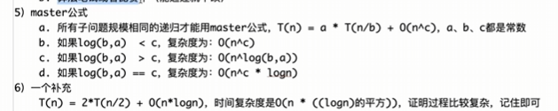
## 归并排序
- 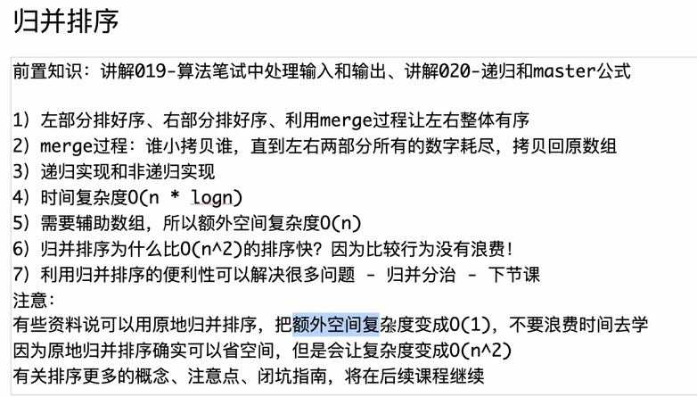
logn级别的递归
master 公式 可得O(nlogn);
```java
class Solution {
    static int[] arr=new int[50001];
    static int[] help=new int[50001];
    public int[] sortArray(int[] nums) {
            mergeSort(0,nums.length-1);
            return nums;
    }
    static void mergeSort(int l,int r){
        if(l==r){
            return;
        }
        int m=(l+r)>>>1;
        mergeSort(l,m);
        mergeSort(m+1,r);
        merge(l,r,m);
        return;
    }

    static void merge(int l,int r,int m){
        int a=l;
        int b=m+1;
        int i=l;
        while (!(a>m || b>r)){
            help[i++]= arr[a]<=arr[b] ? arr[a++] : arr[b++];
        }
        while(!(a>m)){
            help[i++]=arr[a++];
        }
        while (!(b>r)){
            help[i++]=arr[b++];
        }

        //调用系统级别api
        System.arraycopy(help,l,arr,l,r-l+1);
    }
}
```
## 归并分治
将暴力n^2 通过二分变为 nlogn
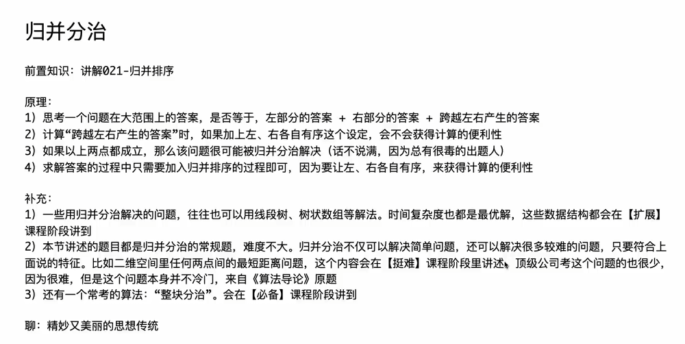
- 能不能变成二分解决
- 递归过程是不是有跨左右的过程
- 嵌入归并排序是否变简单;进行排序统计

一般按照图都得嵌套归并排序
### 小和
```java
public static long merge(int l, int m, int r) {
		// 统计部分 双指针统计优化;
		long ans = 0;
		for (int j = m + 1, i = l, sum = 0; j <= r; j++) {
			while (i <= m && arr[i] <= arr[j]) {
				sum += arr[i++];
			}
			ans += sum;
		}
		// 正常merge
		int i = l;
		int a = l;
		int b = m + 1;
		while (a <= m && b <= r) {
			help[i++] = arr[a] <= arr[b] ? arr[a++] : arr[b++];
		}
		while (a <= m) {
			help[i++] = arr[a++];
		}
		while (b <= r) {
			help[i++] = arr[b++];
		}
		for (i = l; i <= r; i++) {
			arr[i] = help[i];
		}
		return ans;
	}
```

### 反转对
```java
public static int merge(int[] arr, int l, int m, int r) {
		// 统计部分
		int ans = 0;
		for (int i = l, j = m + 1; i <= m; i++) {
			while (j <= r && (long) arr[i] > (long) arr[j] * 2) {
				j++;
			}
			ans += j - m - 1;
		}
		// 正常merge
		int i = l;
		int a = l;
		int b = m + 1;
		while (a <= m && b <= r) {
			help[i++] = arr[a] <= arr[b] ? arr[a++] : arr[b++];
		}
		while (a <= m) {
			help[i++] = arr[a++];
		}
		while (b <= r) {
			help[i++] = arr[b++];
		}
		for (i = l; i <= r; i++) {
			arr[i] = help[i];
		}
		return ans;
	}
```

## 快速排序
- 用划分指针
- 三个指针一个指针遍历,其余两个指针划分区域;
```java
public static void quickSort2(int l, int r) {
		if (l >= r) {
			return;
		}
		// 随机这一下，常数时间比较大
		// 但只有这一下随机，才能在概率上把快速排序的时间复杂度收敛到O(n * logn)
		int x = arr[l + (int) (Math.random() * (r - l + 1))];
		partition2(l, r, x);
		// 为了防止底层的递归过程覆盖全局变量
		// 这里用临时变量记录first、last
		int left = first;
		int right = last;
		quickSort2(l, left - 1);
		quickSort2(right + 1, r);
	}

	// 荷兰国旗问题
	public static int first, last;

	// 已知arr[l....r]范围上一定有x这个值
	// 划分数组 <x放左边，==x放中间，>x放右边
	// 把全局变量first, last，更新成==x区域的左右边界
	public static void partition2(int l, int r, int x) {
		first = l;
		last = r;
		int i = l;
		while (i <= last) {
			if (arr[i] == x) {
				i++;
			} else if (arr[i] < x) {
				swap(first++, i++);
			} else {
				swap(i, last--);//i不++因为换过来这个还没检查;
			}
		}
	}
```
## 快速分治


### 优化
1. /2优化改为 >>>1 无符号右移运算防止加起来溢出;
2. mid 取值可以用别的测度代替 如连续测度等


## 回溯 
- cache+recur 
- 状态是基本数据类型f(int n) 是局部变量自动回溯,
- 当状态是引用数据类型(指针)必须手动回溯
### 字符串子序列
```java
	public static void f1(char[] s, int i, StringBuilder path, HashSet<String> set) {
		if (i == s.length) {
			set.add(path.toString());
		} else {
			path.append(s[i]); // 加到路径中去
			f1(s, i + 1, path, set);
			path.deleteCharAt(path.length() - 1); // 从路径中移除
			f1(s, i + 1, path, set);
		}
	}
```
### 全排列
recur+cache+
状态是visited 和stack来储存;
```java
class Main {
    public static void main(String[] args) {
        int n=3;
        int[] arr={1,2,3};
        boolean[] visited=new boolean[n];
        Arrays.fill(visited,false);
        ArrayDeque<Integer> stack=new ArrayDeque<>();
        dfs(stack,arr,visited);
    }

    static  void dfs(ArrayDeque<Integer> stack, int [] arr, boolean[] visited){
        if(stack.size()==arr.length){
            System.out.println(stack);
            return ;
        }
        for (int i = 0; i < arr.length; i++) {
            if(visited[i]==true){
                continue;

            }
            
            stack.push(arr[i]);
            visited[i]=true;
            dfs(stack,arr,visited);
            visited[i]=false;
            stack.pop();
        }
    }

}

```
### 无重复全排列
先将数组排列,判断要是重复的就跳过
```java
class Main {
    public static void main(String[] args) {
        int n=3;
        int[] arr={1,1,3};
        boolean[] visited=new boolean[n];
        Arrays.fill(visited,false);
        ArrayDeque<Integer> stack=new ArrayDeque<>();
        dfs(stack,arr,visited);
    }

    static  void dfs(ArrayDeque<Integer> stack, int [] arr, boolean[] visited){
        if(stack.size()==arr.length){
            System.out.println(stack);
            return ;
        }
        for (int i = 0; i < arr.length; i++) {
            if(visited[i]==true){
                continue;
            
            }
            if(i!=0 && arr[i]==arr[i-1] rrr&& !visited[i-1]){  //这是判断语句一定要留意null ,
                                                        //技术细节:1,1',3要满足前一个相等且要被访问过;
                continue;
            }
            stack.push(arr[i]);
            visited[i]=true;
            dfs(stack,arr,visited);
            visited[i]=false;
            stack.pop();
        }
    }

}

```
### 组合
- 从全排列修改即可
- 有n个元素组合 以i元素开头的时候仅需递归i+1往后的就行
例如 1,2,3 选2个  (1,2)(1,3) (2,3)
- 对递归的branch来说后续不够个数的直接continue 剪枝;
```java
package ache;

import javax.swing.*;
import java.net.http.HttpConnectTimeoutException;
import java.util.*;

class Main {
    public static void main(String[] args) {
        int n=5;
        int[] arr={1,2,3,4,5};
        boolean[] visited=new boolean[n];
        Arrays.fill(visited,false);
        ArrayDeque<Integer> stack=new ArrayDeque<>();
        dfs(stack,arr,visited,3);
    }

    static  void dfs(ArrayDeque<Integer> stack, int [] arr, boolean[] visited,int target) {
        if (stack.size() == target) {
            System.out.println(stack);
            return;
        }
        if (stack.isEmpty()) {
            for (int i = 0; i < arr.length; i++) {
                if (visited[i] == true) {
                    continue;

                }
                if (i != 0 && arr[i] == arr[i - 1] && !visited[i - 1]) {
                    continue;
                }
                stack.push(arr[i]);
                visited[i] = true;
                dfs(stack, arr, visited, target);
                visited[i] = false;
                stack.pop();
            }
        } else {
            int i1 = Arrays.binarySearch(arr, stack.peek());
            for (int i = i1+1; i < arr.length; i++) {  // 技术细节:仅从i1+1即可
                if (visited[i] == true) {
                    continue;
                }
                if(arr.length-i<target-stack.size()){   //技术细节:减枝
                    continue;
                }
                if (i != 0 && arr[i] == arr[i - 1] && !visited[i - 1]) {
                    continue;
                }
                stack.push(arr[i]);
                visited[i] = true;
                if((arr.length-i1)<target- stack.size()){
                    visited[i] = false;
                    stack.pop();
                    return ;
                }
                dfs(stack, arr, visited, target);
                visited[i] = false;
                stack.pop();
            }
        }

    }}

```

### 无重复组合
同理无重复排列即可

### N皇后问题
- 简单的递归加回溯;
技术细节:
- 左右斜线冲突的映射是i+j and n-1-(i-j);通过解析几何
```java
package leetcode;

import java.util.ArrayList;
import java.util.Arrays;
import java.util.List;

class Solution {
    static char[][] qipan;
    static boolean[] lieChongtu;
    static boolean[] zuoChongtu;
    static boolean[] youChongtu;
    static List<List<String>> result;
    public List<List<String>> solveNQueens(int n) {
         result=new ArrayList<>();
        qipan=new char[n][n];
        for (int i = 0; i < qipan.length; i++) {
            Arrays.fill(qipan[i],'.');
        }
        lieChongtu=new boolean[n];
        zuoChongtu=new boolean[2*n-1];
        youChongtu=new boolean[2*n-1];

            dfs(0,n);
            return result;
    }

    static void dfs(int i,int n){
        if(i==n){
            toret(qipan);
            return;
        }

        for (int j = 0; j <n ; j++) {
            if(lieChongtu[j] || zuoChongtu[j+i] || youChongtu[n-1-(i-j)]){  //判断冲突;
                continue;
            }
            qipan[i][j]='Q';
            lieChongtu[j]= zuoChongtu[i+j]=youChongtu[n-1-i+j]=true;
            dfs(i+1,n);
            qipan[i][j]='.';
            lieChongtu[j]= zuoChongtu[i+j]=youChongtu[n-1-i+j]=false;
        }
        return ;

    }
    static void toret(char[][] ret){
        ArrayList<String> al=new ArrayList<>();
        for (int i = 0; i < ret.length; i++) {
            al.add(String.valueOf(ret[i]));
        }
        result.add(al);
    }
}
```


# 二分
- 很好的算法思想
- 实现可以通过划分指针和记忆指针实现;
- 因为是logn 级别的是递归的变种
## 二分搜索
- 可视为logn级别的递归;
- 技术细节:
- 划分指针 每个指针>= <= 不断往中间二分直到l+1=r;
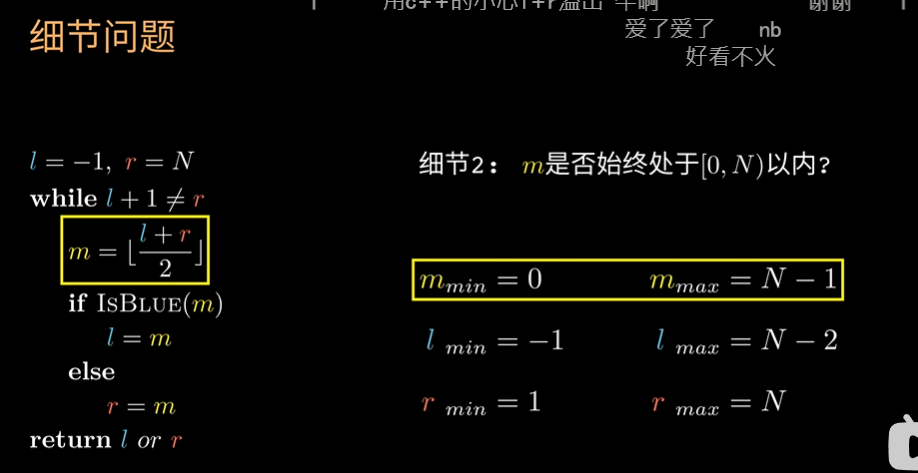
https://www.bilibili.com/video/BV1d54y1q7k7/?share_source=copy_web&vd_source=4dd7efe758648db09e00b24d05324a19
划分指针是寻找边界
- 记忆指针是寻找具体的值

- 划分指针:r划分>=tg的 l划分<tg的寻找< 和>=的边界;
```java
static int find(int[] arr,int tg){
    int l=-1;int r=n;int m=0;
    while(!(l+1==r)){
        m=(l+r)>>1;
        if(arr[m]>=tg){
            r=m;
        }else{
            l=m;
        }
    }
    return r;
}
```
其他如<=tg最右侧 可寻找其他边界实现;

- 记忆指针实现>=num的值;
```java
// 有序数组中找>=num的最左位置
	public static int findLeft(int[] arr, int num) {
		int l = 0, r = arr.length - 1, m = 0;
		int ans = -1;
		while (l <= r) {  //终止条件是r<l因为相等的时候还要判断;
			// m = (l + r) / 2;
			// m = l + (r - l) / 2;
			m = l + ((r - l) >> 1);
			if (arr[m] >= num) {
				ans = m;  //ans记忆指针
				r = m - 1;
			} else {
				l = m + 1;
			}
		}
		return ans;
	}
```
寻找最右侧的实现 可以在未找到tg时候 返回tg的极限值 如{1,2,3,5}找4返回 索引3
java.util.Arrays中的 Arrays.binarySearch(数组,值);不会返回最左侧答案;
这个要是没找到返回-(极限index+1);可以 abs(return)-1就是极限值;

## 二分答案
- 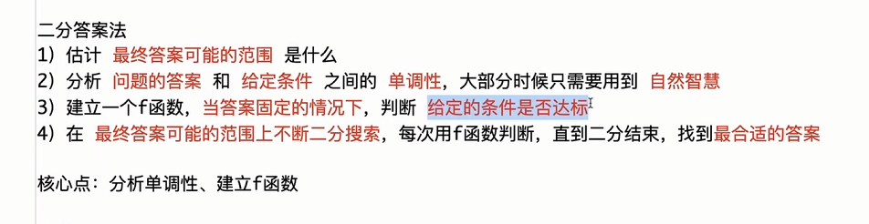
- 递归->递归树->二叉树
### 画家问题力扣410

### 二分峰值问题
找到数组中的一个峰值即可
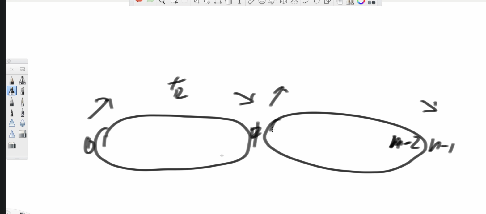
罗尔种植定理
```java

		public static int findPeakElement(int[] arr) {
			int n = arr.length;
			if (arr.length == 1) {
				return 0;
			}
			if (arr[0] > arr[1]) {
				return 0;
			}
			if (arr[n - 1] > arr[n - 2]) {
				return n - 1;
			}
			int l = 1, r = n - 2, m = 0, ans = -1; //指针皆为上升的对象//技术细节:二分查找皆为严格<>,

			while (l <= r) {
				m = (l + r) / 2;
				if (arr[m - 1] > arr[m]) {
					r = m - 1;
				} else if (arr[m] < arr[m + 1]) {
					l = m + 1;
				} else {
					ans = m;
					break;
				}
			}
			return ans;
		}
```

# 复杂度
1. 最差执行情况
2. 每句执行时间相同为1;
## 时间复杂度
大O表示法 O(n) logn O(nlogn) n^2...是f(n)的等价无穷大
二分查找为 O(logn)
- 调和级数收敛于 log n;如希尔排序很多时间复杂度都是nlogn
## 空间复杂度
内存占用大小


# 数据结构与算法引言
- 数据结构分为 连续结构和跳转结构 数组和链表就是基本数据结构;
- 算法分为硬计算和软计算  数学建模大量使用软计算;


# 数组 
N自然数集->数据的映射(和哈希值相反)
## 空间占用
java中的数组是对象: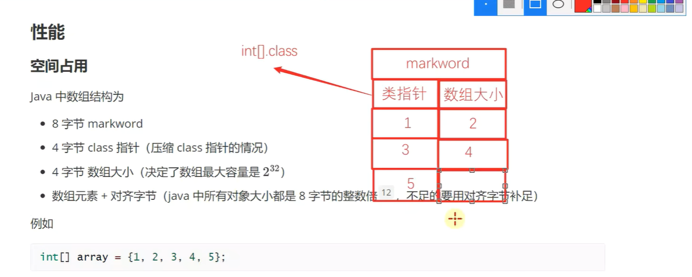
## 随机访问
索引查找,时间复杂度O(1);
## 动态数组
java的对象都得是8的整数倍
java自带的叫ArrayList<>
java自带的数组是静态的无法add 

函数式接口: Consumer<Integer> comsumer ;consumer.accept()接受参数 **并调用函数**
lambda表达式简化函数  (E args)->{sout(args);}

System.arraycopy() 是 Java 中一个非常常用的用于数组拷贝的静态方法。它的作用是将源数组中的一部分或全部元素复制到目标数组中的指定位置。这个方法是系统级的，因此执行效率比较高。
public static void arraycopy(Object src, int srcPos, Object dest, int destPos, int length)
参数说明：
src：源数组（从这个数组中复制元素）。
srcPos：源数组的起始位置（从该位置开始复制）。
dest：目标数组（将元素复制到这个数组）。
destPos：目标数组的起始位置（复制到目标数组的哪个位置）。
length：要复制的元素个数。

```java
//框架
public class DynamicArray{
	public int capacity=8;
	public int size;
	int[] arr=new int[capacity];

}
```

``` java
public class DynamicArray{
	private int size=0;  //控制数组实际大小
	private int capacity=8;  //动态扩容
	private int[] array=new int [capacity];

//add 实现
// 末尾插入
	public void addLast(int element){
		checkAndGrow();
		size++;
		array[size]=element;
	}

// 索引插入
	public void add(int index,int element){
		size++;
		if(index>0 && index <size){
		System.arraycopy(array,index,array,index+1,size-index);//size-index 中将index看成前一个元素的右一位个数考虑
		array[index]=element;}
		}else{
   		System.out.println("ERROR");
		}
	array[index]=element;  //合并addList();
}

// 查 get
public int get(int index) {
        return array[index];
    }

// 遍历函数式接口
public void foreach(Consumer<Integer> consumer) {
        for (int i = 0; i < size; i++) {
            // 提供 array[i]
            // 返回 void
            consumer.accept(array[i]);
        }
    }
	
// 迭代器遍历没学懂是java面向对象的内容

// remove 实现
public int remove(int index){
	int removed =array[index];
	System.arraycopy(array,index+1,array,index,size-index-1);
	size--;
	return removed;
}

// set 实现
public int set(int index ,int x){
	array[index]=x;
}

// 扩容
public void checkAndGrow(){
	if(size==capacity){
		capacity+=capacity/2; //java一般扩容1.5倍
	int [] newArray =new int[capacity];
	System.newarraycopy(array,0,newArray,0,size);
	array=newArray;
}}


	

```

## 二维数组
int[][] array=new int[n][m];
矩阵  array[i][j]  i是↓ j是→


# 链表
- 技术细节:
- 多指针;
- 哨兵节点
3(head)->2->1->0->null
单向链表 最后指向null;null<-双向链表->null;循环节点 头尾相连
哨兵节点:null不存数据
注意 boundary case 有头尾 和空指针;
- 循环终止条件p.next==null;
- node temp=p;p=p.next;
## 性能
随机访问:ingdex查找O(n)
插入删除: 单向头O(1) 尾O(n)  双向头就是尾  中间=查找时间+O(1)
## 代码实现
```java
//框架
public class Node{
	public int value;
	public Node next;
	Node(){};
	Node(int value,Node next){
		this.value=value;
		this.next=next;
	}
}
public class SinglyLinkedList{
	public Node head;
}

}
```
```java
public class SinglyLinkedList{ //用地址(指针)的想法去看待类和对象
	private Node head=null; // 头节点

	private	static class Node{  //内部类
		public int value; // 节点值
		public Node next;// 下一个节点的指针

		public Node(int value,Node next){//构造方法
			this.value =value;
			this.next=next;
		}public Node(){} //空参构造
	}

//add 实现
//头部添加
	public void addFirst(int value){
		if(head==null){
			head=new Node(value,null); // 由null指针从右往左加入head节点;
		}else{
		head=new Node(value,head);}
	}
//尾部添加
	private Node findLast(){
		if(head==null){
			return null;
		}else{
			Node p;
			while(p.next!=null){
				p=p.next;
			}
			return p;
		}
	public void addLast(int value){
		Node last=findLast();
		if(last=null){
			addFirst(value);
		}
		last.next=new Node(value,null);
	}

}

//中间插入
public void add(int index,int x){
	int i=0;Node p=head;
	while(!(p==null || index==0 || i==index-1)){
		p=p.next;
		i++
	}
		if(index==0){
		addFirst(x);
		return;
		}
	   if(p==null){
		sout("error");
		return ;
	}
	temp=new(x,p.next);
	p.next=temp;
}
//get 实现
public Node get(int index){
	int i=0;
	Node p=head;
	while(i!=index){
		p=p.next;
		i++
	}
	return p;
}
// 遍历
	public void loop1(Consumer<Node> consumer){
		Node p  =head;
		while(p!=null){     //函数式接口
			consumer.accept(p);  //accept接受参数并调用;
			p=p.next;
		}
	}
	
// remove 实现
public class SinglyLinkedList {
    // ...
	public void remove(int index) {
        if (index == 0) {
            if (this.head != null) {
                this.head = this.head.next;
                return;
            } else {
                throw illegalIndex(index);
            }
        }
        Node prev = findNode(index - 1);
        Node curr;
        if (prev != null && (curr = prev.next) != null) {
            prev.next = curr.next;
        } else {
            throw illegalIndex(index);
        }
    }
}


}
```
### 单向链表(带哨兵)指的是让一个与数据无关的哨兵当头指针
哨兵->null  基础链表
牛魔的这个head不与数据有关多好艹
```java
public class Node{
	public int value;
	public Node next;

	Node(){}
	Node(int value,Node next){
		this.value=value;
		this.next=next;
	}
}
public class HeadSinglyLinkedList{
	Node head=new Node(int 703,null);

	public void add(int index,int element){

	}
	public void add(int element){
		head.next=new(element,null);
	}
}
```
### 双向链表(带哨兵head)
head <--> tail  基础双向链表

```java
public Node get(int index){
	int i=-1;Node p=head;   // head and tail 哨兵是-1索引
	while(!(i==index || p==tail)){
		i++;p=p.next;
	}
	if(i==index){
		return p;
	}
	if(p==null){
		return null;
	}
}

```

### 环形链表
head->...->head  单向 
head<->...<->head 双向

## 多指针链表
### 寻找交点

### 快慢指针

## 链表题目
### tips
- 防止空指针,例如p3.val p3如果为null则空指针 所以要 p3!=null p.next!=null
- 多指针控制
- 设置哨兵头节点防止error
### 反转链表
- 构造新链表,以此遍历去出旧链表中的元素add进新链表
- 构造新的head->null 遍历旧链表 将每个元素依次add进去
### 删除指定元素
``` java
class Solution {
    public ListNode removeElements(ListNode head, int val) {
        // 创建辅助头节点，指向原链表的头节点
        ListNode h = new ListNode(666, head);
        ListNode p = h;

        // 遍历链表
        while (p.next != null) { // 确保 p.next 不为 null
            if (p.next.val == val) {
                // 如果找到值为 val 的节点，跳过它
                p.next = p.next.next;
            } else {
                // 否则移动到下一个节点
                p = p.next;
            }
        }

        // 返回辅助头节点的 next，作为新的链表头
        return h.next;
    }
}

```
### 删除倒数索引元素
双指针方法
```java
class Solution {
    public ListNode removeNthFromEnd(ListNode head, int n) {
        ListNode h=new ListNode(22,head);
        ListNode p1=h;ListNode p2 =h;
        for(int i=0;i<n;i++){
            p2=p2.next;
        }
        while(!(p2.next==null)){
            p1=p1.next;
            p2=p2.next;
        }
        p1.next=p1.next.next;
        return h.next;
    }
}
```
### 链表去重
```java
class Solution {
    public ListNode deleteDuplicates(ListNode head) {
        // 创建辅助头节点，指向原链表头
        ListNode h = new ListNode(-1, head);
        ListNode p1 = h;

        // 遍历链表
        while (p1.next != null && p1.next.next != null) {
            ListNode p2 = p1.next;       // 当前节点
            ListNode p3 = p2.next;      // 下一个节点

            // 如果当前节点和下一个节点的值相等
            if (p2.val == p3.val) {
                // 找到所有重复的节点
                while (p3.next != null && p3.next.val == p2.val) {
                    p3 = p3.next;
                }
                // 跳过重复的节点
                p1.next = p3.next;
            } else {
                // 如果没有重复，移动指针
                p1 = p1.next;
            }
        }

        // 返回去除重复节点后的链表
        return h.next;
    }
}

```
### 两数相加力扣2t
```java

import java.util.ArrayList;
import java.util.Arrays;
import java.util.List;

class Solution {
    public ListNode addTwoNumbers(ListNode l1, ListNode l2) {
        ListNode head =new ListNode(Integer.MAX_VALUE,null);
        ListNode p=head;
        ListNode p1=l1;
        ListNode p2=l2;
        int carray=0;
        while(p1!=null || p2!=null){
            int p1val;int p2val;
            if(p1==null){
                p1val=0;
            }else{
                p1val=p1.val;
                p1=p1.next;
            }if(p2==null){
                p2val=0;
            }else{
                 p2val=p2.val;
                 p2=p2.next;
            }
            int sum=p1val+p2val+carray;
            carray=sum/10;
            ListNode listNode = new ListNode(sum % 10, null);
            p.next=listNode;
            p=listNode;

        }
        if(carray!=0){
            ListNode listNode = new ListNode(carray, null);
            p.next=listNode;

        }
        return head.next;

    }
}


```

# 队列 
## 环形数组
tail指针是sentry哨兵指针
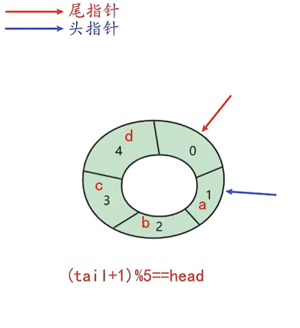
# 栈 
top指针是sentry指针;
## 最小栈
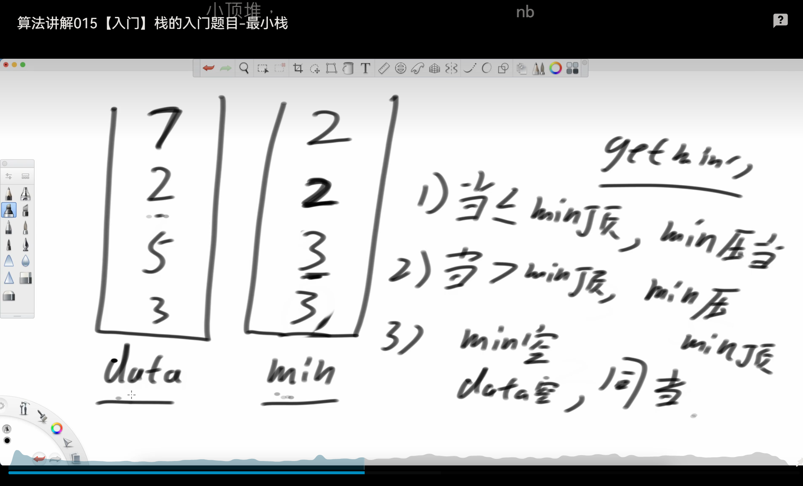
用两个栈来实现;
```java
class MinStack {
    ArrayDeque<Integer> stack1=new ArrayDeque<>();
    ArrayDeque<Integer> stack2=new ArrayDeque<>();
    
    /** initialize your data structure here. */
    public MinStack() {

    }

    public void push(int x) {
        if(stack1.isEmpty() || stack2.peek()>x){
            stack1.push(x);
            stack2.push(x);
        }else{
            stack1.push(x);
            stack2.push(stack2.peek());
        }
    }

    public void pop() {
        stack1.pop();
        stack2.pop();
    }

    public int top() {
            return stack1.peek();
    }

    public int getMin() {
            return  stack2.peek();
    }
}

```

# 单调队列和栈
## 滑动窗口
用单调队列
力扣239
```java

import java.util.ArrayDeque;
import java.util.ArrayList;
import  java.util.*;
import java.lang.*;
class Solution {
    public int[] maxSlidingWindow(int[] nums, int k) {
        ArrayList<Integer> arr=new ArrayList<>();
        MonotonicQueue queue=new MonotonicQueue();
        int left=0;
        //init
        for(int i=0;i<k;i++){
            queue.offer(nums[i]);
        }
        arr.add(queue.peek());
        //技术细节:右指针右移 只有三种情况新来的大 左指针大 中间的大 
        //一个一个讨论,新来的大直接单调队列把其他的都干死了
        //左指针大就得移除了
        //中间的大没影响;
        for(int i=k;i<nums.length;i++){
            queue.offer(nums[i]);
            if(queue.peek()==nums[left]){
                queue.queue.pollFirst();
            }
            left++;
            arr.add(queue.peek());
        }
        int[] arrNew=new int[arr.size()];
        for (int i = 0; i < arr.size(); i++) {
            arrNew[i]=arr.get(i);
        }
        return arrNew;
    }
    
}

class MonotonicQueue{
    ArrayDeque<Integer> queue =new ArrayDeque<>();
    int peek(){
        return queue.peekFirst();
    }
    void poll(){
        queue.pollFirst();
    }

    void offer(int element){
        while(!queue.isEmpty() && element>queue.peekLast() ){
            queue.pollLast();
        }
        queue.offerLast(element);
    }
}
```

## 借雨水
单调栈力扣42
```java
package  leetcode;

import java.util.ArrayDeque;
import java.lang.*;
class Solution {
    public int trap(int[] height) {
        int ret=0;
        ArrayDeque<Zhuzi> stack=new ArrayDeque<>();

        for (int i = 0; i < height.length; i++) {
            while(!stack.isEmpty() && height[i]>stack.peek().height){   //技术细节: 贪心
                Zhuzi pop = stack.pop();
                if(stack.isEmpty()){   //技术细节: 空的化就不用借了直接break;
                    continue;
                }
                Zhuzi peek = stack.peek();
                int min = Math.min(height[i], peek.height);
                ret+=(min-pop.height)*(i-peek.index-1);

            }
            stack.push(new Zhuzi(height[i],i));
        }
        return ret;
    }

    public static void main(String[] args) {
        System.out.println("d");
    }
}

class Zhuzi {
    int height;
    int index;
    Zhuzi(int height, int index){
        this.height=height;
        this.index=index;
    }
    Zhuzi(){}

}
```


# 哈希表
数据的哈希值到N的映射
## 哈希值

```java
public class HashTable{

}
```


# 树

# 堆
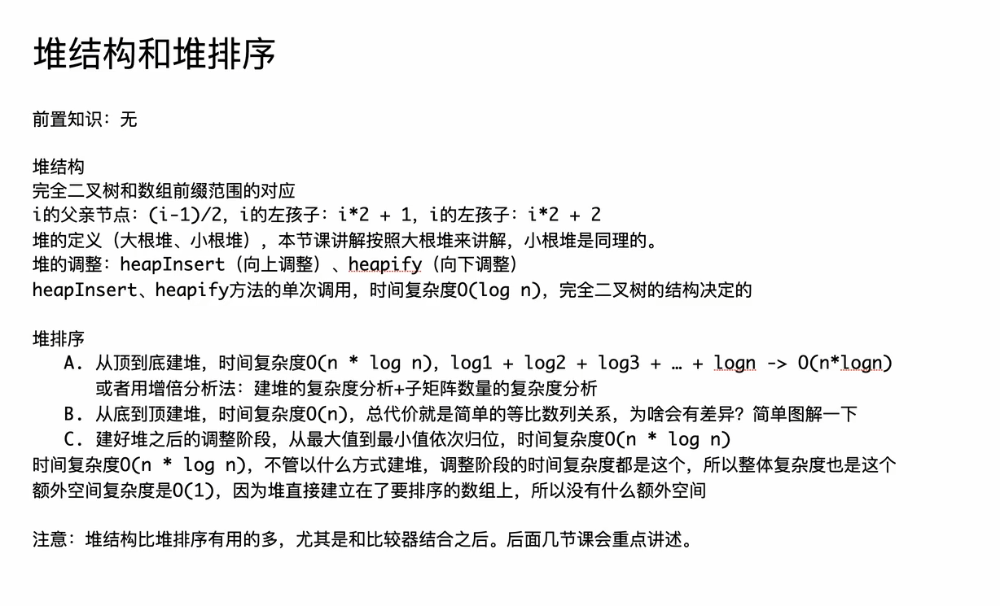
找父节点 (i-1)>>1 
找子节点 2i+1 2i+2
最后一个非叶节点 size/2-1;
填坑
## 优先级队列
- 底层是heap堆结构
详见api
## 常见题目
### 合并有序链表

### 最大重合线段数量
```java

import java.io.*;
import java.util.*;

// 注意类名必须为 Main, 不要有任何 package xxx 信息
public class Main {
    public static void main(String[] args) throws IOException {
        PrintWriter out=new PrintWriter(new OutputStreamWriter(System.out));
        StringTokenizer st=new StringTokenizer("");
        BufferedReader reader=new BufferedReader(new InputStreamReader(System.in));
        String line = reader.readLine();
        st=new StringTokenizer(line);
        int n= Integer.parseInt(st.nextToken());
        int[][] arr=new int[n][2];
        for (int i = 0; i < n; i++) {
            String line1 = reader.readLine();
            st=new StringTokenizer(line1);
            int a= Integer.parseInt(st.nextToken());
            int b= Integer.parseInt(st.nextToken());
            arr[i][0]=a;arr[i][1]=b;

        }
        Arrays.sort(arr, new Comparator<int[]>() {
            @Override
            public int compare(int[] o1, int[] o2) {
                return o1[0]-o2[0];
            }
        });
        //堆结构
        PriorityQueue<Integer> cache=new PriorityQueue<>(new Comparator<Integer>() {
            @Override
            public int compare(Integer o1, Integer o2) {
                return o1-o2;
            }
        });
        int result=0;
        for (int[] ints : arr) {
            //注意null
            //没有冲到的就弹出
            while(!(cache.isEmpty() || ints[0]<cache.peek())){

                cache.poll();
            }
            cache.offer(ints[1]);
            if(cache.size()>result){
                result=cache.size();
            }
        }
        out.println(result);

        out.flush();
        out.close();
    }
}

```

### 

# 二叉树
## 递归遍历
超级简单 
```java
static void dfs(TreeNode node){
    if(node==null){
        return ;
    }
    //在这sout就是先序遍历
    dfs(node.left);
    //在这就是中序
    dfs(node.right);
    //在这就是后;
    return;
}
```
## cache遍历
通过两个标志状态指针来模拟递归过程;
以后序遍历为模板
### 后序
```Java
public class Solution {
    public List<Integer> postorderTraversal(TreeNode root) {
        ArrayList<Integer> result=new ArrayList<>();
        ArrayDeque<TreeNode> cache=new ArrayDeque<>();
        TreeNode head=root;
        TreeNode pop=null;   //标记指针标记上一个弹出的元素;

        while(true){
            if(head==null && cache.isEmpty()){
                break;
            }
            if(head!=null){
                cache.push(head);
                head=head.left;
            }else{   // null是叶子节点 return;
                TreeNode peek = cache.peek();
                if(peek.right==pop || peek.right==null){  //如果右子树是null或者已被弹出直接return
                    pop = cache.pop();  //标记
                    result.add(pop.val);
                }else{
                    head=peek.right;        //否则head标记为right然后继续进栈;
                }
            }

        }

        return result;
    }
}
```
### 中序列
```Java
public class Solution {
    public List<Integer> postorderTraversal(TreeNode root) {
        ArrayList<Integer> result=new ArrayList<>();
        ArrayDeque<TreeNode> cache=new ArrayDeque<>();
        TreeNode head=root;
        TreeNode pop=null;

        while(true){
            if(head==null && cache.isEmpty()){
                break;
            }
            if(head!=null){
                cache.push(head);
                head=head.left;
            }else{
                //中序不用pop来判断是否return直接return即可;
                pop=cache.pop();
                result.add(pop.val);
                if(pop.right!=null){
                    head=pop.right;
                }
            }

        }

        return result;
    }
}

```

### 先序
和图的深度优先遍历一样
模拟递归方法就直接遍历到就add 用中序改
```java
public static void preOrder(TreeNode head) {
		if (head != null) {
			Stack<TreeNode> stack = new Stack<>();
			stack.push(head);
			while (!stack.isEmpty()) {
				head = stack.pop();
				System.out.print(head.val + " ");
				if (head.right != null) {
					stack.push(head.right);
				}
				if (head.left != null) {
					stack.push(head.left);
				}
			}
			System.out.println();
		}
	}
```

# 数据结构设计题目


# 并查集
- 很有用,相当于把一个集合进行划分然后查询速度也非常快;
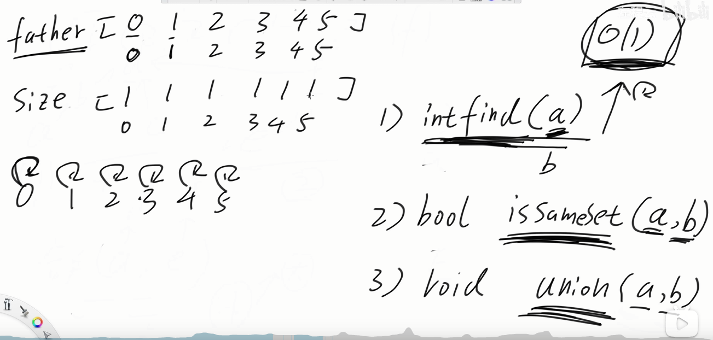
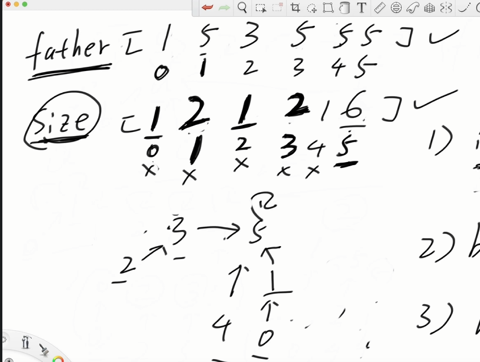
- 图的最小生成树 Kruscal算法需要
- 就是个向上的链表树加上find  union isSameSet方法;
- 用栈模拟递归实现扁平化
- 小挂大
## java类实现
```java
class UnionFind{
    int[] father;
    int[] size;   // 一般可以把size去掉
    //init
    UnionFind(int n){
        father=new int[n];
        size=new int[n];
        for (int i = 0; i < n; i++) {
            father[i]=i;
            size[i]=1;
        }
    }
    //
    int find(int n){
        ArrayDeque<Integer> stack=new ArrayDeque<>();
        int i=n;
        while(!(i==father[i])){
            stack.push(i);
            i=father[i];
        }
        //bianpinghua
        while(!stack.isEmpty()){
            Integer pop = stack.pop();
            father[pop]=i;
        }
        return i;
    }
    void union(int a,int b){
        int fa = find(a);
        int fb=find(b);
        if(fa!=fb){              //一定要看边界条件这俩可能在一个集合里
        //小挂大方便减小树的深度方便查询;
        if(size[fa]>=size[fb]){
            size[fa]+=size[fb];
            father[fb]=fa;
        }else{
            size[fb]+=size[fa];
            father[fa]=fb;
        }}
    }
    boolean isSameSet(int a,int b){
        return find(a)==find(b);
    }

}

```

- 去掉size 小挂大操作可以节省空间
```java
class UnionFind{
    int[] father;
    UnionFind(int n){
        father=new int[n];
        for (int i = 0; i < n; i++) {
            father[i]=i;
        }
    }
    int find(int n){
        ArrayDeque<Integer> stack=new ArrayDeque<>();
        int i=n;
        while(!(i==father[i])){
            stack.push(i);
            i=father[i];
        }
        while (!stack.isEmpty()){
            Integer pop = stack.pop();
            father[pop]=i;
        }
        return i;
    }
    void union(int a,int b){
        int fa = find(a);
        int fb=find(b);
        father[fb]=fa;

    }
    boolean isSameSet(int a,int b){
        return find(a) == find(b);
    }
}

```
# 图
- 可以直接在vertex类中定义一些变量例如 visited prev distance...用oop思想简化结构;
- 好多算法都是cache out/in 结构一般仅in的时候判断边界进行优化,dijkstra因为out的时候确定最短路径需要out,in都判断;
## 概念
- vertex edge 度 入度 出度 权 路径 连通图
- 图的表示 :
1. 邻接矩阵
   A B C D
A  0 1 1 0
B  1 0 0 1
C  1 0 0 1
D  0 1 1 0
2. 邻接表
A->B ->C
B ->A ->D
C->A ->D
D->B ->C
## java类
```java
//图节点
public class Vertex {
		public String name;
		public ArrayList<Edge> edges=new ArrayList<Edge>
		();//边集合
		public boolean visited=false;

		//dijkstra
		public int distance=Integer.MAX_VALUE ;
		public Vertex prev;

		public Vertex() {}

		public Vertex(String name) {
			super();
			this.name = name;
		}
		
		
}
//图的边
public class Edge {	
		public int weight;
		public Vertex Linked; //指向那个节点
		
		public Edge() {}

		public Edge(int weight, Vertex linked) {
			super();
			this.weight = weight;
			Linked = linked;
		}
		
		
		

}
```
- 链式前向星星(比赛减少空间);

## 建图
### 邻接表
```java
class Graph {
    int n;
    ArrayList<ArrayList<int[]>> arr = new ArrayList<>();// 边可以根据需要设置from w to  或者to
    boolean[] visited;
    int[] distance;
    int[] prev;
    
    Graph(int n){
        this.n = n;
        visited = new boolean[n+1];
        distance = new int[n+1];
        prev = new int[n+1];
        for (int i = 0; i < n + 1; i++) {
            arr.add(new ArrayList<>());
        }
    }
    
    void addEdge(int a, int b, int c){
        arr.get(a).add(new int[]{b, c});
    }
}


```
- 因为原算法都是用vertex类写的下面给出邻接表实现的算法
```java
import java.util.*;
  
public class Graph {
    int n;   // 顶点数，顶点编号从 0 到 n-1
    // 邻接表: 每个元素是 int[2] 数组，其中 [0]存储邻接顶点编号, [1] 存储边权重
    ArrayList<ArrayList<int[]>> adj;
    // 常用辅助数组，算法中可能需要重置
    boolean[] visited;
    int[] distance;   // 用于最短路算法等，初始值为 Integer.MAX_VALUE
    int[] prev;       // 前驱数组，用于记录最短路径
  
    public Graph(int n) {
        this.n = n;
        adj = new ArrayList<>();
        for (int i = 0; i < n; i++) {
            adj.add(new ArrayList<>());
        }
        visited = new boolean[n];
        distance = new int[n];
        prev = new int[n];
        Arrays.fill(distance, Integer.MAX_VALUE);
        Arrays.fill(prev, -1);
    }
  
    // 添加边 a -> b, 权重为 weight
    public void addEdge(int a, int b, int weight) {
        adj.get(a).add(new int[]{b, weight});
    }
    
    // 打印邻接表
    public void printGraph() {
        for (int i = 0; i < n; i++) {
            System.out.print(i + " -> ");
            for (int[] edge : adj.get(i)) {
                System.out.print("(" + edge[0] + ", " + edge[1] + ") ");
            }
            System.out.println();
        }
    }
    
    // 重置 visited 数组（便于重复使用 DFS/BFS 等）
    public void resetVisited() {
        Arrays.fill(visited, false);
    }
    
    // ------------------------------------------------------------
    // 拓扑排序（适用于有向无环图）
    public List<Integer> topologicalSort() {
        int[] indegree = new int[n];
        // 统计每个顶点的入度
        for (int u = 0; u < n; u++) {
            for (int[] edge : adj.get(u)) {
                int v = edge[0];
                indegree[v]++;
            }
        }
  
        Queue<Integer> queue = new ArrayDeque<>();
        for (int i = 0; i < n; i++) {
            if (indegree[i] == 0) {
                queue.offer(i);
            }
        }
  
        List<Integer> topoOrder = new ArrayList<>();
        while (!queue.isEmpty()) {
            int u = queue.poll();
            topoOrder.add(u);
            for (int[] edge : adj.get(u)) {
                int v = edge[0];
                indegree[v]--;
                if (indegree[v] == 0) {
                    queue.offer(v);
                }
            }
        }
  
        if (topoOrder.size() != n) {
            System.out.println("图中存在环, 拓扑排序失败");
            return null;
        }
        return topoOrder;
    }
  
    // ------------------------------------------------------------
    // BFS 广度优先搜索 (队列实现), 从起点 start 开始
    public void bfs(int start) {
        resetVisited();
        Queue<Integer> queue = new LinkedList<>();
        visited[start] = true;
        queue.offer(start);
  
        while (!queue.isEmpty()) {
            int u = queue.poll();
            System.out.print(u + " ");
            for (int[] edge : adj.get(u)) {
                int v = edge[0];
                if (!visited[v]) {
                    visited[v] = true;
                    queue.offer(v);
                }
            }
        }
        System.out.println();
    }
  
    // ------------------------------------------------------------
    // DFS 递归实现, 从顶点 u 开始
    public void dfs(int u) {
        if (visited[u]) return;
        visited[u] = true;
        System.out.print(u + " ");
        for (int[] edge : adj.get(u)) {
            int v = edge[0];
            dfs(v);
        }
    }
  
    // DFS 非递归实现 (利用栈), 从起点 start 开始
    public void dfsStack(int start) {
        resetVisited();
        Stack<Integer> stack = new Stack<>();
        visited[start] = true;
        stack.push(start);
  
        while (!stack.isEmpty()) {
            int u = stack.pop();
            System.out.print(u + " ");
            // 若要求顺序与递归一致，则可以逆序遍历 u 的邻接表
            List<int[]> neighbors = adj.get(u);
            for (int i = neighbors.size() - 1; i >= 0; i--) {
                int v = neighbors.get(i)[0];
                if (!visited[v]) {
                    visited[v] = true;
                    stack.push(v);
                }
            }
        }
        System.out.println();
    }
  
    // ------------------------------------------------------------
    // Dijkstra 算法 (非负权图)
    // 计算从起点 start 到各个顶点的最短距离，并记录前驱节点
    public void dijkstra(int start) {
        Arrays.fill(distance, Integer.MAX_VALUE);
        Arrays.fill(prev, -1);
        Arrays.fill(visited, false);
        distance[start] = 0;
  
        // 优先队列根据当前距离排序
        PriorityQueue<Integer> pq = new PriorityQueue<>(Comparator.comparingInt(u -> distance[u]));
        pq.offer(start);
  
        while (!pq.isEmpty()) {
            int u = pq.poll();
            if (visited[u]) continue;
            visited[u] = true;
  
            for (int[] edge : adj.get(u)) {
                int v = edge[0], w = edge[1];
                if (distance[u] != Integer.MAX_VALUE && distance[u] + w < distance[v]) {
                    distance[v] = distance[u] + w;
                    prev[v] = u;
                    pq.offer(v);
                }
            }
        }
    }
  
    // ------------------------------------------------------------
    // Bellman–Ford 算法 (可处理负权边，但无法处理负权环)
    public boolean bellmanFord(int start) {
        Arrays.fill(distance, Integer.MAX_VALUE);
        Arrays.fill(prev, -1);
        distance[start] = 0;
  
        // 共进行 n-1 轮松弛
        for (int i = 1; i < n; i++) {
            for (int u = 0; u < n; u++) {
                for (int[] edge : adj.get(u)) {
                    int v = edge[0], w = edge[1];
                    if (distance[u] != Integer.MAX_VALUE && distance[u] + w < distance[v]) {
                        distance[v] = distance[u] + w;
                        prev[v] = u;
                    }
                }
            }
        }
  
        // 检查是否仍能松弛，若能则说明存在负权环
        for (int u = 0; u < n; u++) {
            for (int[] edge : adj.get(u)) {
                int v = edge[0], w = edge[1];
                if (distance[u] != Integer.MAX_VALUE && distance[u] + w < distance[v]) {
                    System.out.println("检测到负权环");
                    return false;
                }
            }
        }
        return true;
    }
  
    // ------------------------------------------------------------
    // SPFA 算法 (Shortest Path Faster Algorithm)
    // 利用队列实现，通常在实际情况中效率较好，同时可检测负权环
    public boolean spfa(int start) {
        Arrays.fill(distance, Integer.MAX_VALUE);
        Arrays.fill(prev, -1);
        Arrays.fill(visited, false);
        int[] count = new int[n]; // 每个节点的松弛次数
        distance[start] = 0;
  
        Deque<Integer> deque = new ArrayDeque<>();
        deque.offer(start);
        visited[start] = true;
  
        while (!deque.isEmpty()) {
            int u = deque.poll();
            visited[u] = false;
  
            for (int[] edge : adj.get(u)) {
                int v = edge[0], w = edge[1];
                if (distance[u] != Integer.MAX_VALUE && distance[u] + w < distance[v]) {
                    distance[v] = distance[u] + w;
                    prev[v] = u;
                    if (!visited[v]) {
                        deque.offer(v);
                        visited[v] = true;
                        count[v]++;
                        if (count[v] >= n) {
                            System.out.println("检测到负权环");
                            return false;
                        }
                    }
                }
            }
        }
        return true;
    }
  
    // ------------------------------------------------------------
    // Floyd–Warshall 算法 (所有节点对最短路径)
    public void floyd() {
        int[][] dist = new int[n][n];
        int[][] next = new int[n][n];  // 用于路径重构
  
        // 初始化距离矩阵
        for (int i = 0; i < n; i++) {
            Arrays.fill(dist[i], Integer.MAX_VALUE);
            for (int j = 0; j < n; j++) {
                if (i == j) {
                    dist[i][j] = 0;
                    next[i][j] = j;
                } else {
                    next[i][j] = -1;
                }
            }
            for (int[] edge : adj.get(i)) {
                int v = edge[0], w = edge[1];
                dist[i][v] = w;
                next[i][v] = v;
            }
        }
  
        // 三重循环松弛所有路径
        for (int k = 0; k < n; k++) {
            for (int i = 0; i < n; i++) {
                for (int j = 0; j < n; j++) {
                    if (dist[i][k] != Integer.MAX_VALUE && dist[k][j] != Integer.MAX_VALUE &&
                        dist[i][k] + dist[k][j] < dist[i][j]) {
                        dist[i][j] = dist[i][k] + dist[k][j];
                        next[i][j] = next[i][k];
                    }
                }
            }
        }
  
        // 输出距离矩阵
        System.out.println("Floyd–Warshall 最短路径矩阵:");
        for (int i = 0; i < n; i++) {
            System.out.println(Arrays.toString(dist[i]));
        }
  
        // 示例：打印任意一对顶点之间的路径
        for (int i = 0; i < n; i++) {
            for (int j = 0; j < n; j++) {
                if (i != j && dist[i][j] != Integer.MAX_VALUE) {
                    System.out.print("路径 " + i + " -> " + j + " : " + i);
                    int k = i;
                    while (k != j) {
                        k = next[k][j];
                        System.out.print(" -> " + k);
                    }
                    System.out.println();
                }
            }
        }
    }
  
    // ------------------------------------------------------------
    // Kruskal 算法 (计算无向图的最小生成树)
    // 由于邻接表实现通常应用于有向图，为避免重复计入无向图中的同一条边，
    // 本示例中规定仅把 u < v 的边计入 MST 的候选列表
    public List<UndirectedEdge> getAllEdges() {
        List<UndirectedEdge> edges = new ArrayList<>();
        for (int u = 0; u < n; u++) {
            for (int[] edge : adj.get(u)) {
                int v = edge[0], w = edge[1];
                if (u < v) {
                    edges.add(new UndirectedEdge(u, v, w));
                }
            }
        }
        return edges;
    }
  
    public List<UndirectedEdge> kruskalMST() {
        List<UndirectedEdge> edgeList = getAllEdges();
        Collections.sort(edgeList, Comparator.comparingInt(e -> e.weight));
        UnionFind uf = new UnionFind(n);
        List<UndirectedEdge> mst = new ArrayList<>();
  
        for (UndirectedEdge e : edgeList) {
            if (!uf.isSameSet(e.u, e.v)) {
                uf.union(e.u, e.v);
                mst.add(e);
            }
        }
  
        if (mst.size() != n - 1) {
            System.out.println("图不连通，无法构成最小生成树");
            return null;
        }
        return mst;
    }
  
    // 辅助内部类：无向边 (用于 Kruskal 算法)
    public static class UndirectedEdge {
        int u, v, weight;
  
        public UndirectedEdge(int u, int v, int weight) {
            this.u = u;
            this.v = v;
            this.weight = weight;
        }
  
        @Override
        public String toString() {
            return "(" + u + " - " + v + ", weight = " + weight + ")";
        }
    }
  
    // 辅助内部类：并查集 (Union-Find)
    public static class UnionFind {
        int[] parent;
  
        public UnionFind(int n) {
            parent = new int[n];
            for (int i = 0; i < n; i++) {
                parent[i] = i;
            }
        }
  
        public int find(int x) {
            if (parent[x] != x) {
                parent[x] = find(parent[x]);
            }
            return parent[x];
        }
  
        public void union(int x, int y) {
            parent[find(x)] = find(y);
        }
  
        public boolean isSameSet(int x, int y) {
            return find(x) == find(y);
        }
    }
  
    // ------------------------------------------------------------
    // 主函数中给出所有算法的示例调用
    public static void main(String[] args) {
        // 示例 1：构造一个有向图测试 BFS, DFS, Dijkstra, Bellman–Ford, SPFA, Floyd 算法
        int n = 6;  // 顶点编号 0 ~ 5
        Graph g = new Graph(n);
        // 添加边 (有向图示例，如果需要当成无向图，请双向添加边)
        g.addEdge(0, 1, 2);
        g.addEdge(0, 2, 4);
        g.addEdge(1, 2, 1);
        g.addEdge(1, 3, 7);
        g.addEdge(2, 4, 3);
        g.addEdge(3, 5, 1);
        g.addEdge(4, 3, 2);
        g.addEdge(4, 5, 5);
  
        System.out.println("【邻接表表示的图】");
        g.printGraph();
  
        // 拓扑排序 (仅适用于无环图，若图中有环则会提示失败)
        System.out.println("\n【拓扑排序】");
        List<Integer> topo = g.topologicalSort();
        if (topo != null) {
            System.out.println(topo);
        }
  
        // BFS
        System.out.println("\n【BFS】 (从顶点0开始)");
        g.bfs(0);
  
        // DFS 递归
        System.out.println("\n【DFS 递归】 (从顶点0开始)");
        g.resetVisited();
        g.dfs(0);
        System.out.println();
  
        // DFS 非递归 (栈实现)
        System.out.println("\n【DFS 非递归 (栈实现)】 (从顶点0开始)");
        g.dfsStack(0);
  
        // Dijkstra 算法 (假设图中所有权重均为非负数)
        System.out.println("\n【Dijkstra 算法】 (从顶点0开始)");
        g.dijkstra(0);
        System.out.println("最短距离数组: " + Arrays.toString(g.distance));
        System.out.println("前驱数组: " + Arrays.toString(g.prev));
  
        // Bellman–Ford 算法
        System.out.println("\n【Bellman–Ford 算法】 (从顶点0开始)");
        if (g.bellmanFord(0)) {
            System.out.println("最短距离数组: " + Arrays.toString(g.distance));
            System.out.println("前驱数组: " + Arrays.toString(g.prev));
        }
  
        // SPFA 算法
        System.out.println("\n【SPFA 算法】 (从顶点0开始)");
        if (g.spfa(0)) {
            System.out.println("最短距离数组: " + Arrays.toString(g.distance));
            System.out.println("前驱数组: " + Arrays.toString(g.prev));
        }
  
        // Floyd–Warshall 算法
        System.out.println("\n【Floyd–Warshall 算法】");
        g.floyd();
  
        // 示例 2：构造一个无向图（双向添加边）测试 Kruskal 最小生成树算法
        System.out.println("\n【Kruskal 最小生成树】 (无向图)");
        Graph undirected = new Graph(4);
        // 无向图的边：双向添加保证邻接表正确，但在 MST 处理中只计一次(要求 u < v)
        undirected.addEdge(0, 1, 1);
        undirected.addEdge(1, 0, 1);
        undirected.addEdge(0, 2, 3);
        undirected.addEdge(2, 0, 3);
        undirected.addEdge(1, 2, 1);
        undirected.addEdge(2, 1, 1);
        undirected.addEdge(1, 3, 4);
        undirected.addEdge(3, 1, 4);
        undirected.addEdge(2, 3, 2);
        undirected.addEdge(3, 2, 2);
  
        System.out.println("无向图邻接表：");
        undirected.printGraph();
        List<UndirectedEdge> mst = undirected.kruskalMST();
        if (mst != null) {
            System.out.println("最小生成树的边:");
            for (UndirectedEdge e : mst) {
                System.out.println(e);
            }
        }
    }
}

```

### 链式前向星
- 类似于并查集原理的链表树,下标从一开始


## 拓扑排序
- 按照依赖顺序 排序 先排入度为0的点,然后去掉边更新入度,再排0的点;
- 用统计数量判断是否有环;
```java
class Vertex{
    int name;
    ArrayList<Edge> edges;
    //
    boolean visited;
    //
    int indegree;
    //
    int distance=Integer.MAX_VALUE;
    Vertex prev;

}
```
ArrayList<Vertex> arr 是所有节点的集合
- 对所有边进行遍历找出入度为0的点加入队列
```java
for v:arr
for e:v.edges
e.Vertex.indegree++;

ArrayDeque cache;
for v:arr;
v.indegree==0 cache.offer(v);

poll=cache.poll;
for e:poll.edges
e.Vertex.indegree--
if indegree==0;cache.offer(indegree);

```
- 统计poll的数量如果!=n 那就是有环直接return null;

## 最小生成树;
- n个节点的图最小生成树有n-1条边;
- kruskal算法比prim算法常用
### kruskal
- 并查集 priorityqueue 
- 将所有边扔到优先级队列里然后依次取出,所有节点用并查集,取出的两头节点进行划分,如果再取出的已经划分了就continue;
```java
import java.io.*;
import java.net.Inet4Address;
import java.util.*;

class Main{
    public static void main(String[] args)throws IOException {
        PrintWriter out=new PrintWriter(new OutputStreamWriter(System.out));
        BufferedReader reader=new BufferedReader(new InputStreamReader(System.in));
        StringTokenizer st=new StringTokenizer("");
        st=new StringTokenizer(reader.readLine());
        int n=Integer.parseInt(st.nextToken());
        int m=Integer.parseInt(st.nextToken());
        ArrayList<Edge> ans=new ArrayList<>();
        //将边仍进cache里然后贪心
        PriorityQueue<Edge> cache=new PriorityQueue<>(new Comparator<Edge>() {
            @Override
            public int compare(Edge o1, Edge o2) {
                return o1.weight-o2.weight;
            }
        });
        for (int i = 0; i < m; i++) {
            st=new StringTokenizer(reader.readLine());
            int a= Integer.parseInt(st.nextToken());
            int b= Integer.parseInt(st.nextToken());
            int c= Integer.parseInt(st.nextToken());
            cache.offer(new Edge(a-1,b-1,c));

        }
        UnionFind uf = new UnionFind(n);
        while(!cache.isEmpty()){
            Edge poll = cache.poll();
            int left = poll.left;
            int right = poll.right;
            if(!uf.isSameSet(left,right)){
                uf.union(left,right);
                ans.add(poll);
            }
        }
        int ansSum=0;
        for (Edge an : ans) {
            ansSum+=an.weight;
        }
        //用统计是否n-1判断是否符合要求
        out.println(ans.size()==n-1? ansSum : "orz");
        out.flush();
        out.close();
    }
}
class Edge{
    int left;
    int right;
    int weight;
    Edge(int l,int r,int w){
        left=l;
        right=r;
        weight=w;
    }
}
//并查集
class UnionFind{
    int[] father;
    UnionFind(int n){
        father=new int[n];
        for (int i = 0; i < n; i++) {
            father[i]=i;
        }
    }
    int find(int n){
        int i=n;
        ArrayDeque<Integer> stack=new ArrayDeque<>();
        while(i!=father[i]){
            stack.push(i);
            i=father[i];
        }
        while(!stack.isEmpty()){
            Integer pop = stack.pop();
            father[pop]=i;
        }
        return i;
    }
    void union(int a,int b){
        int fa=find(a);
        int fb=find(b);
        father[fb]=fa;
    }
    boolean isSameSet(int a,int b){
        return find(a)==find(b);
    }
}
```

## BFS
- 队列cache out/in实现广搜
```java
//bfs algorithm
    public static void bfs(Vertex v) {
        ArrayDeque<Vertex> queue = new ArrayDeque<>();   ////LinkedList 是链表实现  ArrayDeque是数组实现;
        v.visited = true;
        queue.offer(v);
          // 初始化时就标记起始节点为已访问

        while (!queue.isEmpty()) {
            Vertex poll = queue.poll();  // 从队列中取出一个节点

            // 访问该节点

            System.out.println(poll.name);  // 打印当前节点的名字

            // 遍历当前节点的邻接边
            for (Edge e : poll.arr) {
                if (!e.linked.visited) {  // 只有在未访问的节点才加入队列
                    e.linked.visited = true;  // 标记为已访问
                    queue.offer(e.linked);  // 将邻接节点加入队列
                }
            }
        }
    }
```
### 扩散
bfs可视作从一个节点螺旋式扩散,每次offer进队扩散度++,对于weight==1的图可实现扩散式最短路径;
## 多源bfs 
将多个节点进入0层队列然后一起扩散;
力扣1162;
- 剪枝
## 01 bfs
- dijkstra算法原理一样,将priorityqueue变为双端队列


## dfs 递归实现
- 不如栈实现时间短因为栈实现没返回;
```java
public static void dfs(Vertex v) {
    // boundary case：如果传入的顶点为 null 或者已经访问过，则直接返回
    if (v == null || v.visited) {
        return;
    }
    
    // 标记当前顶点为已访问
    v.visited = true;
    System.out.println(v.name);
    
    // 遍历所有相邻的顶点，并递归调用dfs
    for (int i = 0; i < v.edges.size(); i++) {						//和全排列的决策树,快速排序的左右部分类似  多分支用for循环每个循环以i为基准看作单分支进行递归编写
        dfs(v.edges.get(i).linked);
    }
}
//dfs算法
    public static void dfs(ArrayList<Vertex> dfsArr,Vertex v){
        if(v==null || v.visited==true){
            return ;
        }

        dfsArr.add(v);								// 考虑是否需要回溯通过if逻辑判断
        v.visited=true;								//这里 else严格限制 仅是没被遍历到的add进数组所以不用回溯;
        for(Edge e:v.arr){
            dfs(dfsArr,e.linked);
        }

    }

```

## Queue Stack实现dfs bfs

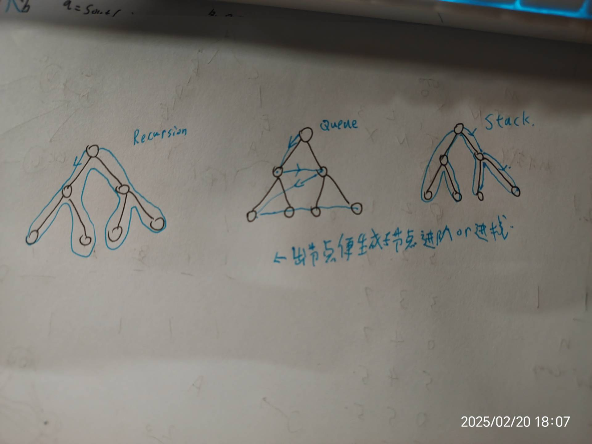
- 可以通过Tree来考虑 出节点就往数据结构中push or offer 子节点;
visited = true 相当于已经进入过数据结构了'
- Queue->bfs树  Stack->dfs树
- Stack可以实现没有return 递归 因为dfs树和递归树相似;
- stack queue 相当于Cache 寄存器;

```java
//dfs stack
    public static void dfsStack(Vertex v) {
        LinkedList<Vertex> stack = new LinkedList<>();		//LinkedList 是链表实现  ArrayDeque是数组实现;

        // 入栈时标记为已访问
        v.visited = true;
        
        stack.push(v);

        while (!stack.isEmpty()) {
            Vertex pop = stack.pop();
            // 对 pop 节点不需要再次标记了
            System.out.println(pop.name);
            // 注意：如果希望延迟打印，可以在出栈时打印，但推荐把标记放在入栈时
            for (Edge e : pop.arr) {
                if (!e.linked.visited) {
                    e.linked.visited = true; // 入栈时立即标记

                    stack.push(e.linked);
                }
            }
        }
    }

```

## Dijkstra 
- PriorityQueue<E>+Greedy
两重贪心;
- 节点弹出就visited,最短距离确定,offer poll发现visited直接continue;
Vertex要加入 public int distance and public Vertex prev;
```java
public static void dijkstra(Vertex source, List<Vertex> vertices) {
        // 初始化源点距离为0，其它点距离默认 Integer.MAX_VALUE（在顶点构造时已经设置）
        source.distance = 0;
        
        // 创建优先级队列，按照距离进行排序
        PriorityQueue<Vertex> pq = new PriorityQueue<>(new Comparator<Vertex>() {
            @Override
            public int compare(Vertex v1, Vertex v2) {
                return v1.distance - v2.distance;
            }
        });
        pq.offer(source);
        
        // 只在从队列中取出时标记 visited，poll后代表已经确定这个节点的最短路径了'
        while (!pq.isEmpty()) {
            Vertex current = pq.poll();
            
            // 如果该节点已经确定了最短距离，则跳过（这是 lazy deletion 的一种方法）
			//还真有可能队列中有多个相同的节点直接跳过;

			//优化
            if (current.visited) {  
                continue;
            }
            current.visited = true;
            
            // 遍历所有邻边
            for (Edge edge : current.edges) {
                Vertex neighbor = edge.linked;
               
				//还真有可能指向vistited的节点

				//优化
                if (!neighbor.visited) {       
                    int newDist = current.distance + edge.weight;
                    if (newDist < neighbor.distance) {  //未改变的不加入队列因为有别的路更短 Greedy;//叶子节点就是未改变的不加入priorityqueue
                        neighbor.distance = newDist;
                        neighbor.prev = current;
                        // 由于距离更新，将该节点加入队列
                        pq.offer(neighbor);
                    }
                }
            }
        }
    }

```
## A*
- dijkstra变式 小根堆排列加入预估参数
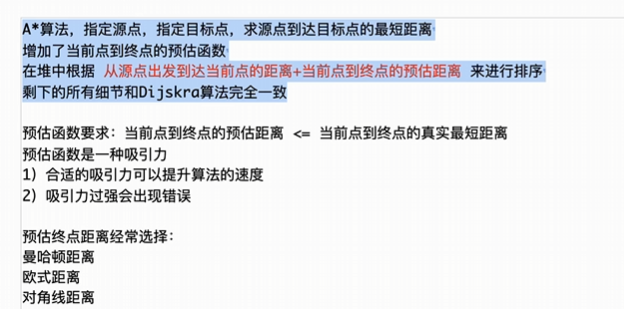


## BellmanFord算法
- dijkstra没法判断负数边的情况可以用这个
- 松弛每条边n-1次 数学上可证明 
- 每次更新起点和终点的distance;
- 没法处理负数环的结构;在vertex类中设置松弛次数如果次数>n-1就是有负环
```java
public static void bellmanFord(ArrayList<Vertex>vertices) {
    	vertices.get(0).distance=0;
    	for(int i=0;i<vertices.size()-1;i++) {
    		for(Vertex start:vertices ) {
    			if(start.distance==Integer.MAX_VALUE) {  //叶子结构 如果是无穷就跳过
    				continue;
    			}
    			for(Edge e:start.edges) {
    				Vertex end=e.linked;
    				int temp=start.distance+e.weight;
    				if(temp>end.distance) {
    					continue;
    				}
    				end.distance=temp;
    				end.prev=start;
    				
    				
    			}
    		}
    	}
    	
    }
```
## spfa优化
- 一般都用spfa判断负环,每个节点加入cnt每次松弛cnt++,如果cnt超过n-1就是有负环直接返回,其余没负数边直接dijkstra
- 借助队列减少遍历边的次数,队列中是上一轮松弛的点,边界判断,in的时候如果在队列不用重复加入,out
```java
static boolean spfa(Vertex v,int n){
        ArrayDeque<Vertex> cache=new ArrayDeque<>();
        v.distance=0;
        v.cnt++;
        cache.offer(v);
        while(!cache.isEmpty()){
            Vertex poll = cache.poll();
            poll.visited=false;
            for (Edge edge : poll.edges) {

                Vertex link = edge.link;
                int tmp=edge.weight+poll.distance;
                if(tmp<link.distance){
                    link.distance=tmp;
                    link.cnt++;
                    if(link.cnt==n){
                        return true;
                    }
                }
                if(link.visited==false){
                    cache.offer(link);
                    link.visited=true;
                }
            }
        }
        return false;
    }
```


## Floyd算法
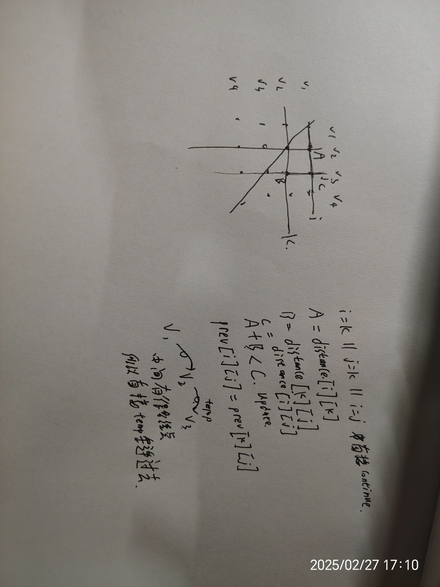
```java

 public static void floyd(ArrayList<Vertex> arr, int[][] distance, Vertex[][] prev) {
        HashMap<Vertex,Integer> map=new HashMap<>();
        //init
        for (int i = 0; i < arr.size(); i++) {
            map.clear();
            for (Edge edge : arr.get(i).edges) {
                map.put(edge.linked,edge.weight);
            }
            for (int j = 0; j < arr.size(); j++) {
                if(i==j){
                    distance[i][j]=0;
                    continue;
                }
                if(map.containsKey(arr.get(j))){
                    distance[i][j]=map.get(arr.get(j));
                    prev[i][j]= arr.get(i);
                }else{
                    distance[i][j]=Integer.MAX_VALUE;
                }

            }
        }

        // jielu
        for(int k = 0; k< arr.size(); k++){

            for (int i = 0; i < arr.size(); i++) {

                for (int j = 0; j < arr.size(); j++) {
                    if(i==k || j==k || i==j){
                        continue;
                    }else{}
                    int a= distance[i][k];int b= distance[k][j];
                    if(distance[i][k] == Integer.MAX_VALUE || distance[k][j]==Integer.MAX_VALUE){
                        continue;
                    }else{}
                    if(a+b< distance[i][j]){
                        distance[i][j]=a+b;
                        prev[i][j]= prev[k][j];
                    }else{}
                }
            }
        }
    }

    //打印路径
    for (int i = 0; i < arr.size(); i++) {
            for (int k = 0; k < arr.size(); k++) { //技术细节: 循环变量不能更改;
                int j=k;
                LinkedList<String> cache=new LinkedList<>();

                cache.push(arr.get(j).name);

                while (j!=i){

                    cache.push(prev[i][j].name);
                    j=arr.indexOf(prev[i][j]);
                }

                System.out.println(cache);
            }
        }

```


## 图题目
### P1551 亲戚 洛谷

```java
package qinqi;

import Tu.Edge;
import Tu.Test;
import Tu.Vertex;

import java.util.ArrayDeque;
import java.util.ArrayList;
import java.util.Scanner;

public class Main {
    public static boolean panduan=false;
    public static void main(String[] args) {
        Scanner sc = new Scanner(System.in);
        int n = sc.nextInt();
        int m = sc.nextInt();
        int p = sc.nextInt();
        Vertex [] arr=new Vertex[n];
        for(int i=0;i<n;i++){
            arr[i]=new Vertex(i);
        }
        for(int i=0;i<m;i++){
            int v1=sc.nextInt()-1;
            int v2=sc.nextInt()-1;
            Edge e1=new Edge(arr[v2]);
            Edge e2=new Edge(arr[v1]);

            arr[v1].edges.add(e1);
            arr[v2].edges.add(e2);

        }

        for(int i=0;i<p;i++){
            resetVisited(arr);
            int p1=sc.nextInt()-1;
            int p2=sc.nextInt()-1;
            dfsStack(arr[p1],arr[p2]);
            if(panduan){
                System.out.println("Yes");
            }else{
                System.out.println("No");
            }
            panduan=false;
        }


    }

    public static void dfsStack(Vertex v,Vertex tg){
        ArrayDeque<Vertex> cache =new ArrayDeque<>();
        cache.push(v);
        v.visited=true;
        while(!cache.isEmpty()){
            Vertex pop=cache.pop();
            if(pop.name== tg.name){
                panduan=true;
                return ;
            }
            for(Edge e:pop.edges){
                Vertex temp=e.linked;
                if(temp.visited){
                    continue;
                }else{
                    cache.push(temp);
                    temp.visited=true;
                }
            }

        }

    }
    public static void bfs(Vertex v,Vertex tg){
        ArrayDeque<Vertex> cache=new ArrayDeque<>();
        cache.offer(v);
        v.visited=true;
        while(!cache.isEmpty()){
            Vertex poll=cache.poll();
            if(poll.name==tg.name){
                panduan=true;
                return;
            }
            for(Edge e:poll.edges){
                if(e.linked.visited==true){
                    continue;
                }else{
                    e.linked.visited=true;
                    cache.offer(e.linked);
                }
            }

        }

    }

    public static void resetVisited(Vertex[] arr) {
        for (Vertex vertex : arr) {
            vertex.visited = false;
        }
    }

    public static void dfs(Vertex v,Vertex tg){
        if(v.visited==true){
            return;
        }
        v.visited=true;
        int temp=v.name;
        if(temp==tg.name){
            panduan=true;
        }
        for(Edge e:v.edges){
            if(e.linked.visited==true){
                continue;
            }else{
                dfs(e.linked,tg);
            }
        }
        v.visited=false;
        return;

    }

    public static class Vertex{
        public int name;
        public ArrayList<Edge> edges=new ArrayList<>();
        public boolean visited=false;
        public Vertex(int name){
            this.name=name;
        }

    }

    public static class Edge{
        public Vertex linked;

        public Edge(Vertex linked){
            this.linked=linked;
        }

    }
}

```

# Greedy
- 寻找最优解:适用范围;

## 排队接水问题
## 选考试问题

## Huffman编码


# DP
recursion+memo -> 直接从base case开始解决;
可以优化
## Fibonacci dp
### recursion memo
```java
public class Main{
	public static HashMap<Integer,BigInteger> memo=new HashMap<>();

	public static BigInteger fibonacci(int n){
		if(memo.containsKey(n)){
			return memo.get(n);
		}

		BigInteger ret=fibonacci(n-1).add(fibonacci(n-2));
		memo.put(n,ret);
		return ret;
	}
}

```
### fibonacci dp
```java
public static int fibonacci(int n){
    int[] dp=new int[n+1];
    dp[0]=1;dp[1]=1;
    if(n==0 || n==1){
        return 1;
    }

    for(int i=2;i<=n;i++){
        dp[i]=dp[i-1]+dp[i-2];
    }
    return dp[n];

    //降维
    //dp[] 直接将为dp1 dp2;
}
```

### 类Fibonaccileetcode62 走格子问题
```java
//dp二维表
public int f(int m,int n){
    int[][] dp=new int[m][n];
    for(int i=0;i<m;i++){
        dp[i][0]=1;

    }
    for(int i=1;i<n;i++){
        dp[0][i]=1;
    }
    for(int i=1;i<m;i++){
        for(int j=1;j<n;j++){
            dp[i][j] = dp[i-1][j]+ dp[i][j-1];
        }
    }
    return dp[m-1][n-1];
}
//优化降维
public int f(int m,int n){
   int[] dp=new int[n]
   for(int j=0;j<n;j++){
    dp[j]=1;
   }
   dp[0]=1;
   for(int i=1;j<m;j++){
    dp[j]=dp[j]+dp[j-1];
   }

}

```

## 01背包问题
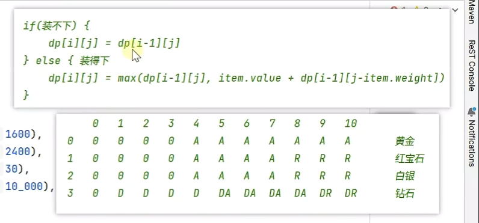
```java
public static int  select(Item[] items,int total){
    int[][] dp = new int[items.length][total + 1];
       
        Item item0 = items[0];
        for (int j = 0; j < total + 1; j++) {
            if (j >= item0.weight) {
                dp[0][j] = item0.value;
            }
        }
        
        for (int i = 1; i < dp.length; i++) {
            Item item = items[i];
            for (int j = 1; j < total + 1; j++) {
                // x: 上一次同容量背包的最大价值
                int x = dp[i - 1][j];
                if (j >= item.weight) {
                    // j-item.weight: 当前背包容量-这次物品重量=剩余背包空间
                    // y: 剩余背包空间能装下的最大价值 + 这次物品价值
                    int y = dp[i - 1][j - item.weight] + item.value;
                    dp[i][j] = Integer.max(x, y);
                } else {
                    dp[i][j] = x;
                }
            }
            
        }
        return dp[dp.length - 1][total];
}
//降维优化
```java
static int select(Item[] items, int total) {
    int[] dp = new int[total + 1];
    for (Item item : items) {
        for (int j = total; j > 0; j--) {
            if (j >= item.weight) { // 装得下
                dp[j] = Integer.max(dp[j], item.value + dp[j - item.weight]);
            }
        }
        System.out.println(Arrays.toString(dp));
    }
    return dp[total];
}
```
注意：内层循环需要倒序，否则 dp[j - item.weight] 的结果会被提前覆盖


## 完全背包
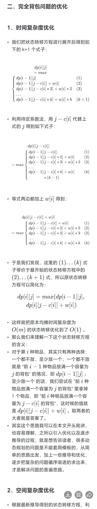
```java
private static int select(Item[] items, int total) {
        int[][] dp = new int[items.length][total + 1];
        Item item0 = items[0];
        for (int j = 0; j < total + 1; j++) {
            if (j >= item0.weight) {
                dp[0][j] = dp[0][j - item0.weight] + item0.value;
            }
        }
        print(dp);
        for (int i = 1; i < items.length; i++) {
            Item item = items[i];            
            for (int j = 1; j < total + 1; j++) {
                // x: 上一次同容量背包的最大价值
            	int x = dp[i - 1][j];
                if (j >= item.weight) {
                    // j-item.weight: 当前背包容量-这次物品重量=剩余背包空间
                    // y: 剩余背包空间能装下的最大价值 + 这次物品价值
                    int y = dp[i][j - item.weight] + item.value;
                    dp[i][j] = Integer.max(x, y);
                } else {
                    dp[i][j] = x;
                }
            }
            print(dp);
        }
        return dp[dp.length - 1][total];
    }
```
```java
private static int select(Item[] items, int total) {
    int[] dp = new int[total + 1];
    for (Item item : items) {
        for (int j = 0; j < total + 1; j++) {
            if (j >= item.weight) {
                dp[j] = Integer.max(dp[j], dp[j - item.weight] + item.value);
            }
        }
        System.out.println(Arrays.toString(dp));
    }
    return dp[total];
}
``` 
这个是正序;
### 零钱兑换问题
和完全背包一样,技术细节:凑不到目标钱数就是total+1
所以数组初始化都成total+1


## 0-1bag problem
```java
package leetcode;

import java.util.Arrays;
import java.util.stream.IntStream;

public class KnapsackProblem {
    /*
        1. n个物品都是固体，有重量和价值
        2. 现在你要取走不超过 10克 的物品
        3. 每次可以不拿或全拿，问最高价值是多少

            编号 重量(g)  价值(元)                        简称
            1   4       1600           黄金一块   400    A
            2   8       2400           红宝石一粒 300    R
            3   5       30             白银一块         S
            0   1       1_000_000      钻石一粒          D
        1_001_630

        1_002_400
     */

    /*
        1   2   3   4   5   6   7   8   9   10
                    a
                    a               r
                    a               r
        d               da          da  dr  dr
     */

    static class Item {
        int index;
        String name;
        int weight;
        int value;

        public Item(int index, String name, int weight, int value) {
            this.index = index;
            this.name = name;
            this.weight = weight;
            this.value = value;
        }

        @Override
        public String toString() {
            return "Item(" + name + ")";
        }
    }
    public static int[][] memo;
    public static Item[] items;
    public static void main(String[] args) {

         items = new Item[]{
                new Item(1, "黄金", 4, 1600),
                new Item(2, "宝石", 8, 2400),
                new Item(3, "白银", 5, 30),
                new Item(4, "钻石", 1, 10_000),
        };
         int capacity = 11;
         int n=4;
        memo =new int[n][capacity];
        //初始化memo;
        for(int i=0;i<n;i++){
            Arrays.fill(memo[i],-1);
        }
        for(int i=0;i<capacity;i++){
            if(capacity>=items[n-1].weight){
                memo[n-1][i]=items[n-1].value;
            }else{
                memo[n-1][i]=0;
            }
        }

        System.out.println(bagRecur(0, 10));
    }

	//递归实现
    public static int bagRecur(int index,int capacity){
        if(index==items.length-1){
            return memo[index][capacity];
        }
        if(memo[index][capacity]!=-1){
            return memo[index][capacity];
        }

        if(capacity<items[index].weight){
            return bagRecur(index+1,capacity);
        }
		//max相当于 Fibonacci中的加号运算;
        int ret =Math.max(bagRecur(index+1,capacity),items[index].value+bagRecur(index+1,capacity-items[index].weight));
        memo[index][capacity] = ret;
        return ret;

    }
    static int select(Item[] items, int total) {
        int[][] dp = new int[items.length][total + 1];
        print(dp);
        Item item0 = items[0];
        for (int j = 0; j < total + 1; j++) {
            if (j >= item0.weight) {
                dp[0][j] = item0.value;
            }
        }
        print(dp);
        for (int i = 1; i < dp.length; i++) {
            Item item = items[i];
            for (int j = 1; j < total + 1; j++) {
                // x: 上一次同容量背包的最大价值
                int x = dp[i - 1][j];
                if (j >= item.weight) {
                    // j-item.weight: 当前背包容量-这次物品重量=剩余背包空间
                    // y: 剩余背包空间能装下的最大价值 + 这次物品价值
                    int y = dp[i - 1][j - item.weight] + item.value;
                    dp[i][j] = Integer.max(x, y);
                } else {
                    dp[i][j] = x;
                }
            }
            print(dp);
        }
        return dp[dp.length - 1][total];
    }

    static void print(int[][] dp) {
        System.out.println("   " + "-".repeat(63));
        Object[] array = IntStream.range(0, dp[0].length + 1).boxed().toArray();
        System.out.printf(("%5d ".repeat(dp[0].length)) + "%n", array);
        for (int[] d : dp) {
            array = Arrays.stream(d).boxed().toArray();
            System.out.printf(("%5d ".repeat(d.length)) + "%n", array);
        }
    }
}

```
## 完全背包problem
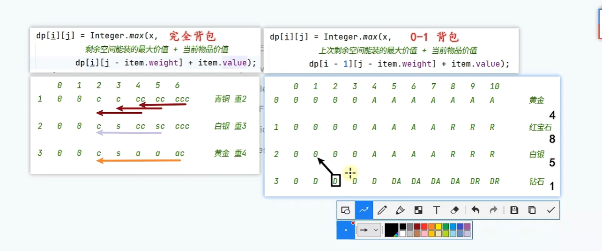和0-1背包的区别
完全背包问题子问题的证明

```java

package leetcode;
import java.util.Arrays;
import java.util.Comparator;
import java.util.stream.IntStream;

public class KnapsackProblem {
    static class Item {
        int index;
        String name;
        int weight;
        int value;

        public Item(int index, String name, int weight, int value) {
            this.index = index;
            this.name = name;
            this.weight = weight;
            this.value = value;
        }

        @Override
        public String toString() {
            return "Item(" + name + ")";
        }
    }
    public static Item[] items;
    public static int[][] memo;
    public static void main(String[] args) {
            items = new Item[]{
                new Item(1, "青铜", 2, 3),    // c
                new Item(2, "白银", 3, 4),    // s
                new Item(3, "黄金", 4, 7),    // a
        };
            Arrays.sort(items,new Comparator<Item>() {
                @Override
                public int compare(Item o1, Item o2) {
                    return o2.weight - o1.weight;
                }
            });
            memo=new int[3][7];
            //init memo
        for(int i=0;i<3;i++){
            Arrays.fill(memo[i],-1);

        }
        for(int i=0;i<7;i++){
            memo[2][i]=i/items[2].weight*items[2].value;
        }
        System.out.println(bagRecur(0, 6));
    }
	//递归,
    public static int bagRecur(int index ,int c ) {
        if (memo[index][c] != -1) {
            return memo[index][c];
        }

        if (items[index].weight > c) {
            return bagRecur(index + 1, c);
        }
		//注意状态转移方程 考虑先放入一个;
        int ret = Math.max(bagRecur(index + 1, c), bagRecur(index, c - items[index].weight) + items[index].value);
        memo[index][c] = ret;
        return ret;
    
    }

    /*
            0   1   2   3   4   5   6
        1   0   0   c   c   cc  cc  ccc
        2   0   0   c   s   cc  cs  ccc
        3   0   0   c   s   a   a   ac
     */

    private static int select(Item[] items, int total) {
        int[][] dp = new int[items.length][total + 1];
        Item item0 = items[0];
        for (int j = 0; j < total + 1; j++) {
            if (j >= item0.weight) {
                dp[0][j] = dp[0][j - item0.weight] + item0.value;
            }
        }
        print(dp);
        for (int i = 1; i < items.length; i++) {
            Item item = items[i];
            for (int j = 1; j < total + 1; j++) {
                // x: 上一次同容量背包的最大价值
                int x = dp[i - 1][j];
                if (j >= item.weight) {
                    // j-item.weight: 当前背包容量-这次物品重量=剩余背包空间
                    // y: 剩余背包空间能装下的最大价值 + 这次物品价值
                    int y = dp[i][j - item.weight] + item.value;
                    dp[i][j] = Integer.max(x, y);
                } else {
                    dp[i][j] = x;
                }
            }
            print(dp);
        }
        return dp[dp.length - 1][total];
    }

    static void print(int[][] dp) {
        System.out.println("   " + "-".repeat(63));
        Object[] array = IntStream.range(0, dp[0].length + 1).boxed().toArray();
        System.out.printf(("%5d ".repeat(dp[0].length)) + "%n", array);
        for (int[] d : dp) {
            array = Arrays.stream(d).boxed().toArray();
            System.out.printf(("%5d ".repeat(d.length)) + "%n", array);
        }
    }
}
```
- 找零钱问题,切钢条问题也是这个完全背包问题;
```


# 字符串
## 输入
next系列和scanf 一样无法处理空格 按照流进行处理;
常用BufferedReader输入
```java
BufferedReader reader = new BufferedReader(new InputStreamReader(System.in));
			StringBuilder sb=new StringBuilder();
			String line ;
			while(true) {
				line =reader.readLine();
				if (line==null) {
					break;
				}
				sb.append(line);
			}
```
## String
""+3 == "3"  善用字符串的+运算符;  ((char)42)+""+1  思考 ((char)42)+1+""的区别
## StringBuilder

# 排序
## 计数排序
构造n的数组 数组下标就是计数;然后按照计数将数组下标展开;
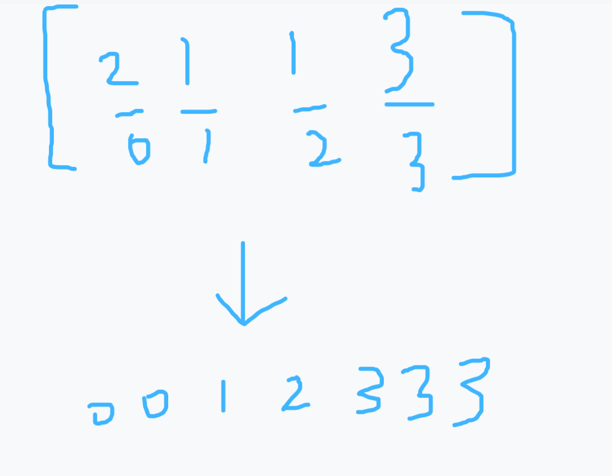
```c
#include<stdio.h>
#include<stdlib.h>
#include<string.h>
#include<math.h>
int main(){
	int n=0,m=0,arr[1001]={0};
	scanf("%d %d",&n,&m);
	int temp=0;
	for(int i=0;i<m;i++){
		scanf("%d",&temp);
		arr[temp]++;
	}
	for(int i=1;i<=n;i++){
		for(int j=0;j<arr[i];j++){
			printf("%d ",i);
		}
	}
	
}
```
## 简单比较排序
### 选择排序(数组顺序排序)
按照索引每次选择最小的
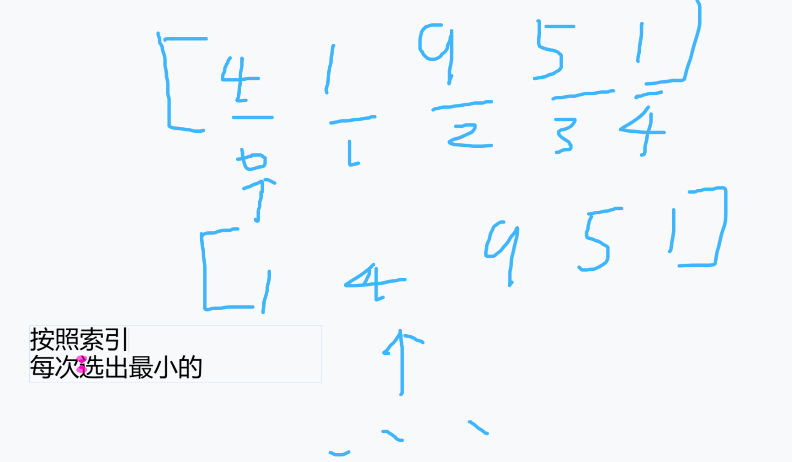
### 冒泡排序

### 插入排序
记住插入排序元素怎么移动的
```java
int [] arr= {4,3,2,1};
			for(int i=1;i<4;i++) {
				int flag=arr[i];int j=i-1;
				while(true) {
					if(j<0 || arr[j]<=flag) {
						break;
					}
					arr[j+1]=arr[j];
					j--;
				}
				arr[j+1]=flag;
				
			}

```

## Arrays.sort  和  Collections.sort
Arrays.sort(arrays , new Comparator<Student>(){@Override public int compare(Student s1,Student s2){}})  对数组排序
Collectiongs(list, new Comparator<Student>(){@Override public int compare(Student s1,Student s2){}}) 	对动态数组排序
Node  \Class\Java\JavaStudy\生日排序算法实现.md

# 枚举
- 枚举经典题目数正方形还是长方形 按照边长枚举 每次枚举  是上边滑动到底和下边滑动到底的乘积;
```java
import java.util.Scanner;

public class Main {
    public static void main(String[] args) {
        Scanner sc = new Scanner(System.in);
        // 注意：题目给的是棋盘的行数和列数，即单元格数。
        // 若输入为 n, m，则棋盘有 n 行 m 列，对应的横线数为 n+1，竖线数为 m+1。
        int a = sc.nextInt();
        int b = sc.nextInt();
        sc.close();
        int n = a + 1; // 横线数
        int m = b + 1; // 竖线数

        long squareCount = 0;    // 正方形总数
        long nonSquareCount = 0; // 长方形（非正方形）的总数

        // 枚举横向距离 d（行差）和竖向距离 w（列差）
        for (int d = 1; d < n; d++) {
            for (int w = 1; w < m; w++) {
                long count = (long)(n - d) * (m - w);
                if (d == w) {
                    squareCount += count;
                } else {
                    nonSquareCount += count;
                }
            }
        }
        System.out.println(squareCount + " " + nonSquareCount);
    }
}

```
## 子集枚举
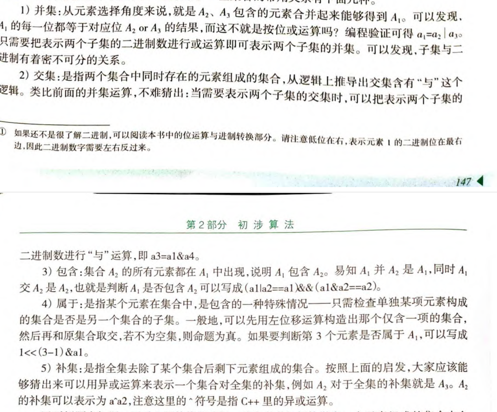
用2进制表示n个元素的集合中元素存在状态 从0000 到 1111 共有2^n个元素  1<<n;
第i个元素元素可表示为  1<<i  
交集 : &
并集: |
补集: ((1<<n)-1) ^ 
包含: (|)&&(&)
判断第j位是否有元素 i&(1<<j)!=0;
## 排列枚举
递归生成决策树
```java

public static void dfs(String str,ArrayList<Integer> arr) {
    	if(arr.size()==0) {
    		System.out.println(str);
    	}
    	
    	for(int i=0;i<arr.size();i++) {
    		int temp=arr.get(i);
    		ArrayList<Integer> newArr=new ArrayList<Integer>(arr);
    		newArr.remove(i);
    		dfs(str+temp,newArr);    // 用副本的方式实现回溯
    		
    	}
    	
    }
//更能表达递归回溯的是
public static void dfs(String str,ArrayList<Integer> arr) {
    	if(arr.size()==0) {
    		System.out.println(str);
    	}
    	
    	for(int i=0;i<arr.size();i++) {
    		int temp=arr.get(i);
    		arr.remove(i);
    		
    		str=str+temp;
    		dfs(str,arr);
    		// 因为子问题的状态是指针 要保持子问题的状态一致所以要回溯
			
			//回溯到原来的状态,为什么可以;因为把递归里的 dfs() 看作 {{{{{return}}}}}  在最外层remov(i) 再 add(i) 相当于每个栈归时都能-1+1 回到原来状态;
     		StringBuilder sb=new StringBuilder(str);
    		sb.deleteCharAt(sb.length()-1);
    		str=sb.toString();    
    		arr.add(i,temp);
    	}
    	
    }

```


# 数论
## 进制转换 
小技巧 将二进制拆分成4个一组不够的补零    1111 1111  就是十六进制的FF
例如 2 -> 8;
- to 10 从0开始遍历 sum=sum*original + temp  而不是从个位开始遍历,
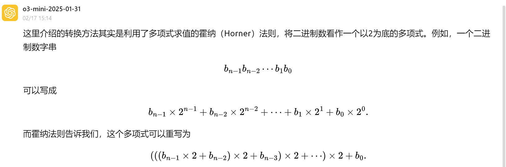
也可以按照公式进行遍历
- 10 to  先判断0  然后再用while if 不断mod boundary case是x==0;
```java
public class Main {
	    //主方法
	public static void main(String[] args) {
			Scanner sc=new Scanner(System.in);
			//主方法开始
			
			//构造映射列表
			char [] list = new char[16];
			for(int i=0;i<10;i++) {
				list[i]=(char)('0'+i);
			}
			for(int i=10;i<16;i++) {
				list[i]=(char)('A'+i-10);
			}
			int original =sc.nextInt();
			String x=sc.next();
			int tg=sc.nextInt();
			System.out.println(ten2Tg(original2Ten(x, original),tg,list));
			
			//主方法结束
		}
	public static int original2Ten(String x, int original) {
	    if (x.equals("0")) { 																	//注意// 字符串比较需要用 equals
	        return 0;
	    }

	    int sum = 0;
	    for (int i = 0; i < x.length(); i++) { 												// 注意从零开始遍历才是正确转换到10进制
	        char c = x.charAt(i);
	        int temp;

	        if (c >= '0' && c <= '9') {
	            temp = c - '0'; // 处理 0-9
	        } else if (c >= 'A' && c <= 'Z') {
	            temp = c - 'A' + 10; // 处理 A-Z
	        } else if (c >= 'a' && c <= 'z') {
	            temp = c - 'a' + 10; // 处理 a-z（可选，看需求）
	        } else {
	            throw new IllegalArgumentException("Invalid character in number: " + c);
	        }

	        if (temp >= original) { // 确保字符值在合法进制范围内
	            throw new IllegalArgumentException("Digit out of range for base " + original + ": " + c);
	        }

	        sum = sum * original + temp; // 累加计算
	    }
	    return sum;
	}

		
		
		//十进制转换目标进制;
		public static String ten2Tg(int x,int tg,char[] list) {
			
			StringBuilder sb=new StringBuilder();
			if(x==0) {																						//注意判断边界条件0;
				return "0";
			}
			while(true) {
				if(x==0) {
					break;
				}
				sb.append(list[x%tg]+"");
				x=x/tg;
			}
			return sb.reverse().toString();
		}
```
### 小数进制转换
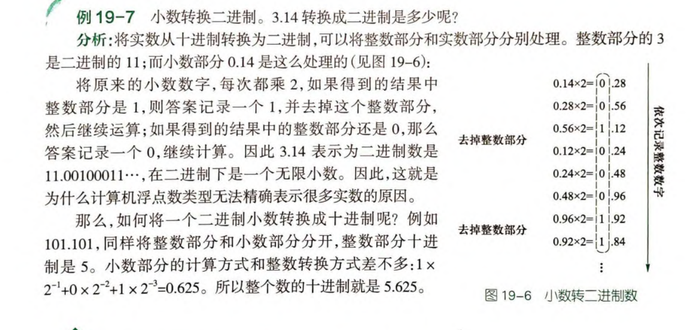

## gcd llm
- gcd(a,b)=gcd(b,a%b); 递归知道右边位置为0;
- llm(a,b)=a*b/gcd(a,b);
## 同余原理
- 每次运算都可以选择mod或者不mod
- (a+b+c)%d=(((a+b)%d)+c)%d=((a%d+b%d)%d+c%d)%d *乘法类似
- 负余数=m+负余数
负数可以+m转换为整数再mod
(b-a)%m = (b-a+m%m)%m=(b%m-a%m+m)%m
### 除法同余
- +-* 同余原理可以用,除法不行
- 逆元:b^(-1)==b^(m-2)%m  或者直接 biginteger.modInverse();                                                                                           
- (a/b)%m == (a*b^(-1))%m ==(a%m * b^(m-2)%m)%m;

### 快速幂
- 直接用biginteger.modPow(a,b,m)几把洛谷测试了一道题递归还不如biginteger快;
- 递归
```java
static int f(int a, int b, int m){
    if(b == 0){
        return 1;
    }
    if(b == 1){
        return a % m;
    }
    long tmp;  //把中间变量设置为long 防止溢出
    if(b % 2 == 0){
        tmp = f(a, b >> 1, m);
        return (int)((tmp * tmp) % m); //tmp返回的时候已经是mod过的了没必要再mod了
    } else {
        tmp = f(a, b >> 1, m);
        return (int)(((tmp * tmp) % m * (a % m)) % m);  //每步运算都运用同余原理防止溢出;
    }

```

## 素数相关
一般素数都是 i*i<=n !!!!!
## 判断小素数
- 6k+-1 先判断是否在这个集合中,然后遍历sqrt(n);
##  判断大质数
### miller rabin
<10^9 用miller rabin测试
### BigInteger  .isProbablePrime(10);
> 的话用biginteger 库 
.isProblePrime(10) 中间arg是测试的次数;
## 素数分解
- 技术细节
划分指针,
自动跳过合数4直接跳过因为4=2*2 ,
i*i<=n i表示2-i的质数都榨完了 如果i超过每次的根号n 根据对称性根号n之前没有质数可榨了就剩判断n本身和1了
```java
static void f(int n){
        for (int i = 2; i *i<=n ; i++) {
            //while 先操作再说
                while (n%i==0){
                    n=n/i;
                    out.println(i);
                }
        }
        if(n!=1){
            out.println(n);
        }
    }
```

## 埃氏素数筛
- 质数的倍数都是合数
- 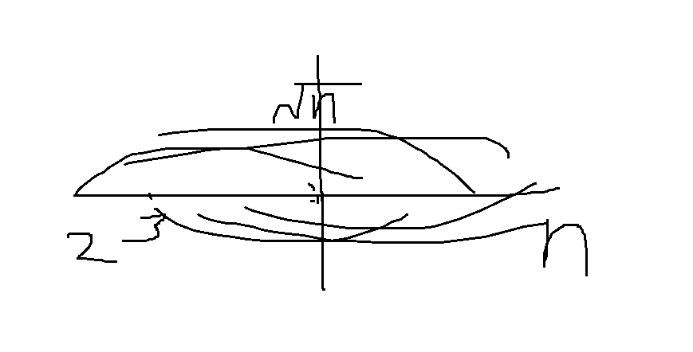
- n*log(logn)  一般用这个筛就行 虽然欧拉筛是n级别的
- 2-n范围筛出质数
- i*i<=n就行因为根据对称性另一半肯定也筛完了
- 先都设置为质数false 然后从2开始2的倍数都是合数  3从3*3开始因为 3*2已经被2筛了
```java
public static int ehrlich(int n) {
		// visit[i] = true，代表i是合数
		// visit[i] = false，代表i是质数
		// 初始时认为0~n所有数都是质数
		boolean[] visit = new boolean[n + 1];
		for (int i = 2; i * i <= n; i++) {  //i*i<=n因为之后的已经筛过了
			if (!visit[i]) {  //是质数就筛
				for (int j = i * i; j <= n; j += i) {
					visit[j] = true;
				}
			}
		}
		int cnt = 0;
		for (int i = 2; i <= n; i++) {
			if (!visit[i]) {
				// 此时i就是质数，可以收集，也可以计数
				cnt++;
			}
		}
		return cnt;
	}
```

## 乘法快速幂
- 7^(11)==7^(1011)=7^(1+2+0*4+8)=7^(1)*7^(2)*7^(4*0)*7^(8) 构建迭代式递归每个节点的状态就是7^(2^n);
- 将指数转为二进制,再转为1,2,4,8..相乘每个节点包含一个状态,二进制的01对应这个状态下是否乘这个状态;
```java
static int pow(int a,int b){
    int ans=1;
    while(b>0){
        if(b&1==1){
            ans*=a;
        }
        a*=a;
        b>>=1;
    }
}
```

## 矩阵快速幂
- 矩阵乘法ans[i][j]=a[i][c]*b[c][j];这里c相当于不回退指针;
```java
static int[][] matMultiply(int[][] a,int[][] b){
            int n=a.length;
            int m=b[0].length;
            int k=a[0].length;
            int[][] ans=new int[n][m];
            for (int i = 0; i < n; i++) {
                for (int j = 0; j < m; j++) {
                    for (int l = 0; l < k; l++) {
                        ans[i][j]+=a[i][l]*b[l][j];
                    }
                }
            }
            return ans;
        }
```
- 快速幂同理乘法快速幂
```java
static int[][] matMultiply(int[][] a,int[][] b){
            int n=a.length;
            int m=b[0].length;
            int k=a[0].length;
            int[][] ans=new int[n][m];
            for (int i = 0; i < n; i++) {
                for (int j = 0; j < m; j++) {
                    for (int l = 0; l < k; l++) {
                        ans[i][j]+=a[i][l]*b[l][j];
                    }
                }
            }
            return ans;
        }
        static int[][] matPow(int[][] arr,int m){
            int n=arr.length;
            int[][] ans=new int[n][n];
            for (int i = 0; i < n; i++) {
                ans[i][i]=1;
            }
            while(m>0){
                if((m&1)==1){
                    ans=matMultiply(ans,arr);
                }
                m>>=1;
                arr=matMultiply(arr,arr);
            }
            return ans;
        }
```
- 矩阵快速幂解斐波那契额数列
0 1 1 2 3 5... 相当于[0 1] * M^p这个M就是状态转移矩阵用矩阵快速幂  [0 1]是行向量所以要右成矩阵才能线性变换;

# 字符串
## KMP
- 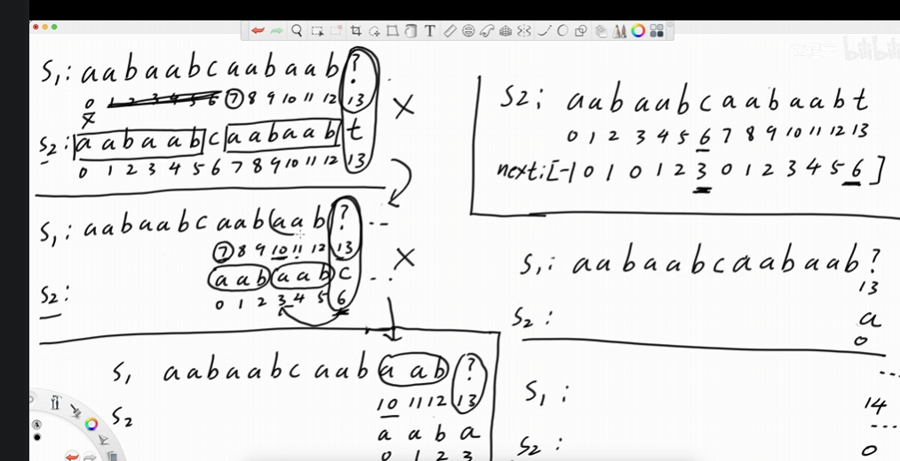
- 
### next数组


## 字符串题目
### 高精度加法 洛谷P1601
```java
import java.util.Scanner;

public class HighPrecisionAdditionString {

    /**
     * 字符串形式的大数加法
     * @param num1 数字字符串1
     * @param num2 数字字符串2
     * @return 两个大数相加的结果
     */
    public static String add(String num1, String num2) {
        // 创建 StringBuilder 用于存储结果（反向存储）
        StringBuilder result = new StringBuilder();

        int i = num1.length() - 1;
        int j = num2.length() - 1;
        int carry = 0;  // 进位

        // 当两个数字还有未处理的位数或仍然存在进位时，继续计算
        while (!(i<0 && j<0 && carry==0)) {// boundary case 仔细思考这个边界条件  或者改为while(!(i<0 && j<0)) if(carry==1) {sb.append(carry+"")};后边再判断boundary case
			
            int digit1 = i >= 0 ? num1.charAt(i) - '0' : 0;  // 如果没数字则认为是 0
            int digit2 = j >= 0 ? num2.charAt(j) - '0' : 0;  // 如果没数字则认为是 0

            int sum = digit1 + digit2 + carry;
            result.append(sum % 10);  // 取个位，添加到结果中
            carry = sum / 10;         // 计算进位值

            // 移动指针
            i--;
            j--;
        }

        // 由于结果是反向存储的，所以需要反转后返回
        return result.reverse().toString();
    }

}


## 模拟
## 模拟题目
### P1042
```java
import java.util.*;
import java.math.*;
import java.lang.*;
import java.io.*;
public class Main {
	    //主方法
		public static void main(String[] args) throws IOException {
			BufferedReader reader = new BufferedReader(new InputStreamReader(System.in));
			StringBuilder sb=new StringBuilder();
			String line ;
			while(true) {
				line =reader.readLine();
				if (line==null) {
					break;
				}
				sb.append(line);
			}
			
			ArrayList<Integer> arr=new ArrayList<Integer>();
			for(int i=0;i<sb.length();i++) {
				if(sb.charAt(i)=='E') {
					break;
				}
				if(sb.charAt(i)!='W' && sb.charAt(i)!='L') {
					continue;
				}
				if(sb.charAt(i)=='W') {
					arr.add(1);
				}else {
					arr.add(0);
				}
				
			}
			int w=0;int l=0;
			for(int i=0;i<arr.size();i++) {
				if(arr.get(i)==1) {
					w++;
				}else {                                                    //注意这的boundary case 逻辑关系再w++之后;
					l++;
				}
				if(Math.max(w, l)>=11 && Math.abs(w-l)>=2) {
					System.out.println(w+":"+l);
					w=0;l=0;
				}
				
				
			}
			System.out.println(w+":"+l);
			System.out.println("");
			for(int i=0;i<arr.size();i++) {
					if(arr.get(i)==1) {
					w++;
				}else {
					l++;
				}
				if(Math.max(w, l)>=21 && Math.abs(w-l)>=2) {
					System.out.println(w+":"+l);
					w=0;l=0;
				}
			
				
			}
			System.out.println(w+":"+l);
			return;
		}}
```


# 双指针
- 双指针状态 双指针统计 双指针划分;
## 盛水最多的容器
两个指针 贪心每次移动少的
## 两数之和 
大了左移 小了右移
## 三数之和


# dustbin
## 递归
### 递归树
### 多路递归构造和memo优化
```java

import java.util.Arrays;

public class Main1 {

    public static void main(String[] args) {
        int n=4;
        int[] cache=new int[n+1] ;
        Arrays.fill(cache,-1);
        cache[0] =1;cache[1]=1;
        System.out.println(f(n,cache));
    }
    public static int  f(int n,int[] cache){
        if(cache[n] != -1){                   			//如果节点在数组里已经记录则它是叶子节点
            return cache[n];
        }
        int x=f(n-1,cache);								//也可以把 cache变成 public static int [] cache 然后再main中初始化
        int y=f(n-2,cache);
        cache[n]=x+y;
        return cache[n];								// 仅代表返回时候携带的值 对递归树无额外贡献;

    }

}

```

## 快速排序
[Node \Class\Java\JavaStudy\Java 快速排序及优化策略.md](https://github.com/GodBlf/Class/blob/main/Java/JavaStudy/Java%20%E5%BF%AB%E9%80%9F%E6%8E%92%E5%BA%8F%E5%8F%8A%E4%BC%98%E5%8C%96%E7%AD%96%E7%95%A5.md)

双指针进行分治
```java
int i=0;
for(int j=0;j<right-1;j++){
	if(arr[j]<pivot){
		int temp=arr[i];
		arr[i]=arr[j];
		arr[j]=temp;
		i++               //i指针是pivot 左边都是<pivot的
	}
}
int temp=arr[i];
arr[i]=pivot;
arr[right]=temp;//   最后再把pivot换到i处;

```

## 递归
## 反向打印
## 二分查找
```java
public static int binarySearch(int[] arr,int tg,int min,int max){
	min=0;max=arr.length-1;
	// boundary case
	if(min==max){
		return min;
	}

	int mid=(max+min)/2;
	if(tg>arr[mid]){
		return binarySearch(arr,tg,mid+1,max);
	}else if(tg<arr[mid]){
		return binarySearch(arr,tg,min,mid-1);
	}else{
		return binarySearch(arr,tg,min,mid);
	}
}
```
## 冒泡排序
```java
public static void boubbleSort(int[] arr,int n) { //n is update args
	// boundary case
			if(n==1) {
				return;
			}
			int flag=0;
			for(int i=0;i<n-1;i++) {
				if(arr[i]>arr[i+1]) {
					int temp=arr[i];
					arr[i]=arr[i+1];
					arr[i+1]=temp;
					flag=1;
				}
			}
			if(flag==0) {
				return;
			}
			
			boubbleSort(arr,n-1);
		}
```
## 插入排序
```java

```

## 斐波那契递归
```java
	//斐波那契递归
		public static int fabo(int n,int[] memo) {
			if(memo[n]!=-1) {
				return memo[n];
			}
			int x=fabo(n-1,memo);
			int y=fabo(n-2,memo);
			memo[n]=x+y;
			return x+y;
		}
```
## BigInteger Recursion
```java
package  luogu;

import java.math.BigInteger;
import java.util.Arrays;
import java.util.Scanner;

public class Main {
    public static BigInteger[] arr;

    public static void main(String[] args) {
        Scanner sc = new Scanner(System.in);
        //start
        int n = sc.nextInt();
        arr=new BigInteger[n+1];
        Arrays.fill(arr,null);
        arr[0]=new BigInteger("1");
        arr[1]=new BigInteger("1");
        System.out.println(f(n));

        //end
    }

    //fabo
        //root
    public static BigInteger f(int n){
        //leaf
        if(arr[n]!=null){
            return arr[n];
        }

        //branch
        BigInteger x=f(n-1);
        BigInteger y=f(n-2);

        arr[n]=x.add(y);

        return arr[n];

    }
}

```
## 


