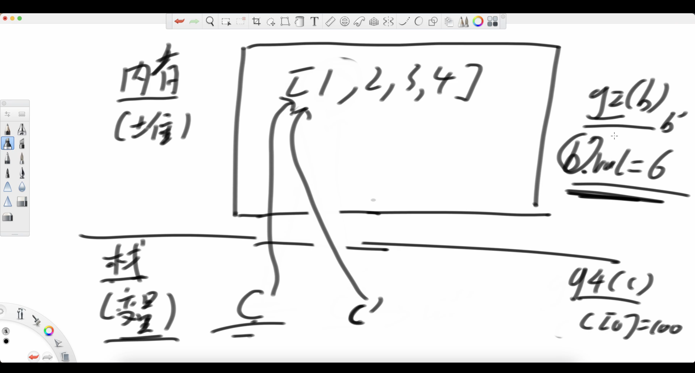
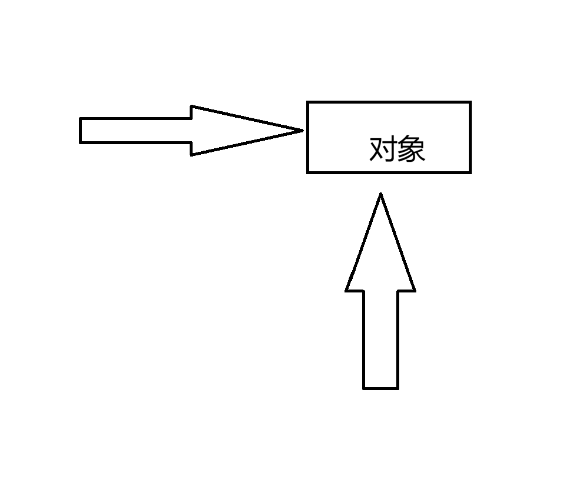
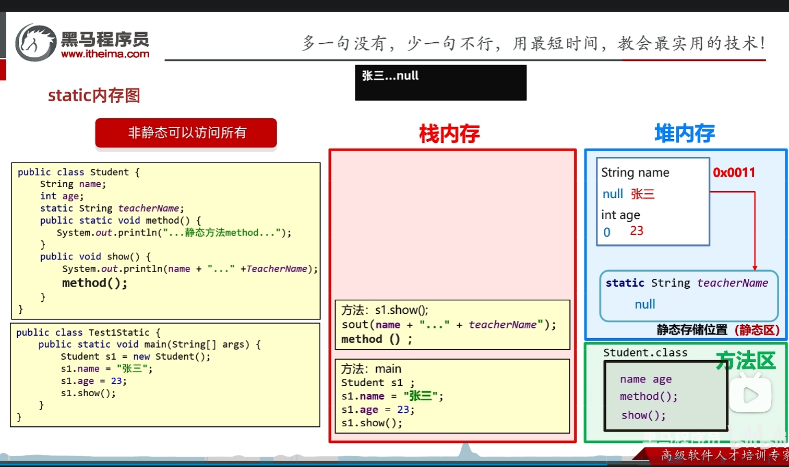

[TOC]

# 引用数据类型本质是指针
new Object<>() 构造方法生成的对象是一个地址
让后 Object<> var =new Object<>() 这个var是指向这个地址的指针
因为指针所以  让arr1=arr仅是让指针指向同一个不是copy;
## 指针副本
### 方法的形参

void g(p){
    p=null
}
p=new Object<>():
g(p)
具体过程: g(p'=p){p'=null};如图所示栈区域有生成了个指针指向堆区域的对象
### 增强for
增强for 每次返回的是副本
- 基本数据类型 副本无法对原对象修改
- 引用数据类型:1.对对象地址又加了个指针, 2.可以通过副本指针来修改对象的值3. 如果赋值是把新的指针指向别的对象;

# 对象的copy
- ArrayList<Integer> arr1=new ArrayList<>(arr);可用这种方法对对象进行复制
- 所以 拷贝ArrayList等引用数据类型
得 Object<E> o1 =new Object<E>();
Object<E> o2 =new Object<E>(o1);  构造方法中填入要拷贝的对象
eg.  ArrayList<Integer> arr=new ArrayList<>();
ArrayList<Integer> arr1=new ArrayList<>(arr);
因为指针所以  让arr1=arr仅是让指针指向同一个不是copy;

# static
- 工具方法 共享变量 工具类(工具箱)
Node \Class\Java\JavaStudy\static内部类.md
- 类的不是对象的
- 可简单理解为 划分为静态区和非静态区 !static -> static 
具体内存图

静态和非静态是两个世界的 非静态可以调用非静态和静态的变量方法,静态只能调用静态的;(在没有访问修饰符的前提下);
```c
//- 判断需不需要static 就看需不需要外部实例化对象;辅助功能;
//- static 静态修饰符 常用于辅助方法和辅助类 与类中的变量无关联 静态(孤立的);  
//如 Arrays.sort(int[]) 
//- 构造方法可使用静态方法进行成员变量计算;
```


# 格式化输出
Node \Class\Java\JavaStudy\格式化输出.txt

# 刷题如何定义类
Node \Class\Java\JavaStudy\刷题多个类同文件和静态内部类.md

# equals和hashCode重写
因为java中对象都是指针所以==只能比较地址哈希值也是按照地址哈希的,equals也只能比较地址相同吗
所以重写这两个方法可以使得equals按照对象的成员变量进行比较,hashcode按照成员变量进行哈希
string类型已经重写好了能够直接使用;
在建立hashmap 和 调用比较应该重写方法;


# 构造方法
```java
class Student{
    //成员变量default值,不赋值默认null
    int age;
    int height=1;
    double pingjun;
    //构造方法初始化
    Student(int age){
        this.age=age;
        this.pingjun=average(this.age,this.height);
    }

    static double average(int age,int height){
        return (double) height/age;
    }
}
```
# 成员变量和局部变量
局部变量是方法或者{} 代码块栈中的 栈消失也跟着消失,
成员变量和接口方法组成类 是结构框架 所以得用public 等修饰,它不会消失
``` java
class Item {
    private double price; //价格;
    private int quantity;  //数量
    private double unitValue; //单价

    // 将 unitValue 改为静态方法
    public static double unitValue(double price, int quantity) {
        return price / quantity;
    }

    // 修改构造函数，将 unitValue 的结果传递给构造函数
    public Item(double price, int quantity) {
        this.price = price;
        this.quantity = quantity;
        this.unitValue = Item.unitValue(price, quantity);  // 使用静态方法计算 unitValue
    }

    public double getUnitValue() {
        return unitValue;
    }

    @Override
    public String toString() {
        return "Item{price=" + price + ", quantity=" + quantity + ", unitValue=" + unitValue + "}";
    }
}

```

# 作用域


在 Java 中，如果一个变量、方法或类没有显式声明 `public`、`protected` 或 `private`，那么它的默认作用范围是 **包级私有（package-private）**，也称为 **默认访问权限（default access modifier）**。

## 作用范围划分：
### 1. **类的作用范围**
   - **类的默认权限**：如果一个类没有显式声明 `public` 或 `private`，那么它是 **包级私有** 的，即 **仅限于同一个包（package）中的类可以访问**。
   - **例子**：
     ```java
     class MyClass {  // 没有 public，作用范围是 package-private
         void sayHello() {
             System.out.println("Hello");
         }
     }
     ```
   - 只有 **相同包中的类** 可以访问 `MyClass`，但其他包的类无法访问它。

### 2. **变量的作用范围**
   - **实例变量、类变量（成员变量）**
     - 没有显式声明 `public`、`protected` 或 `private` 的变量默认为 **包级私有（package-private）**。
     - 只有 **相同包中的类** 才能访问这些变量，其他包的类无法访问。
   - **示例**：
     ```java
     class Test {
         int x = 10;  // package-private 变量，仅当前包内可访问
     }
     ```

### 3. **方法的作用范围**
   - **方法的默认权限**
     - 如果方法未声明 `public`、`protected` 或 `private`，则它的访问权限也是 **包级私有**。
     - 仅 **同一包内的类** 可以调用该方法，包外的类无法访问。
   - **示例**：
     ```java
     class Test {
         void display() {  // package-private 方法，仅当前包内可访问
             System.out.println("Hello, World!");
         }
     }
     ```

## **总结：默认访问权限（package-private）的特点**
| 访问修饰符 | 本类 | 同包类 | 子类 | 其他包 |
|-----------|------|--------|------|--------|
| `public`  | ✅  | ✅  | ✅  | ✅  |
| `protected` | ✅ | ✅ | ✅（即使不在同包中，也可以通过继承访问） | ❌ |
| （默认，不写） | ✅ | ✅ | ❌ | ❌ |
| `private` | ✅ | ❌ | ❌ | ❌ |

### **package-private（默认权限）适用场景**
- 适用于 **不希望类、变量、方法被外部包访问，但允许在同一个包内使用** 的情况。
- 常用于 **工具类、内部实现逻辑、封装的一部分**，防止不必要的访问。

---

## **示例代码**
```java
package mypackage;

class DefaultClass { // 作用范围：mypackage 内部可访问
    int value = 100; // package-private 变量
    void show() { // package-private 方法
        System.out.println("Value: " + value);
    }
}
```

```java
package mypackage;

public class Main {
    public static void main(String[] args) {
        DefaultClass obj = new DefaultClass(); // 可以访问
        obj.show(); // 允许访问
        System.out.println(obj.value); // 允许访问
    }
}
```

```java
package otherpackage; // 不同包

import mypackage.DefaultClass;

public class Other {
    public static void main(String[] args) {
        // DefaultClass obj = new DefaultClass(); // ❌ 编译错误，无法访问
        // obj.show(); // ❌ 编译错误
    }
}
```
**在 `otherpackage` 中，`DefaultClass` 是不可见的，无法实例化或调用方法。**

---

## **结论**
如果在 Java 中不声明 `public`、`protected` 或 `private`：
1. **类的作用范围**：包级私有（只能在同一个包内访问）。
2. **变量的作用范围**：包级私有（同包内的类可以访问）。
3. **方法的作用范围**：包级私有（同包内的类可以调用）。

这样可以控制类的访问权限，使其在 **同一包内可见，包外不可见**，从而提高封装性。

#
- java定义需要四段 声明  public static int binarySearch(int[] arr,int x){};   public abstract void move();
- interface 和 抽象方法 接口是子集不同的方法 抽象方法是子集中共有的方法  public abstract void f();
- 函数式接口: Consumer<Integer> comsumer ;consumer.accept()接受参数 **并调用函数**
lambda表达式简化函数  (E args)->{sout(args);}
- getClass() 获得对象的类int等基本数据类型可以(Object)强制类型转换然后.getClass获得其对应包装类的类型
'9'-'0'是int 类型;

- 方法重写 抽象方法必须重写 default 可选重写;
- 方法重载


