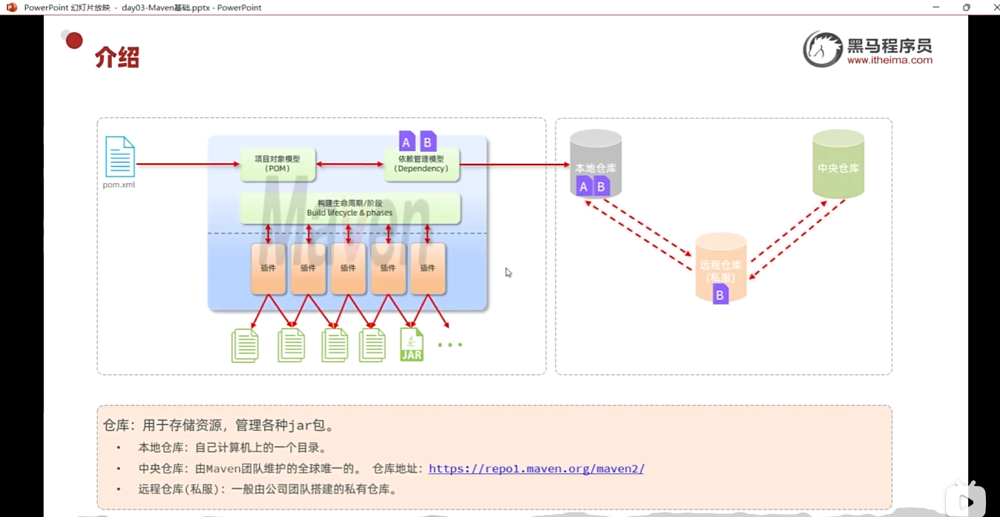
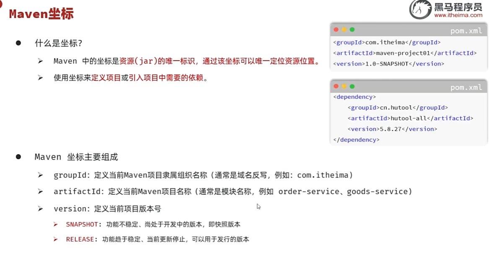
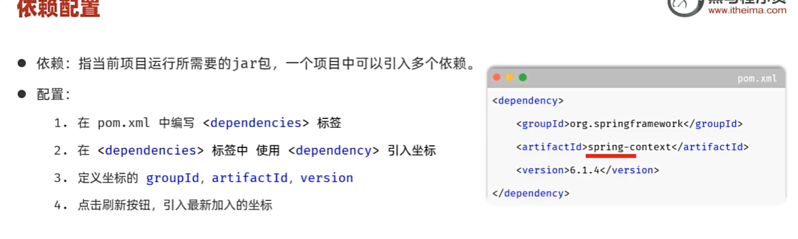
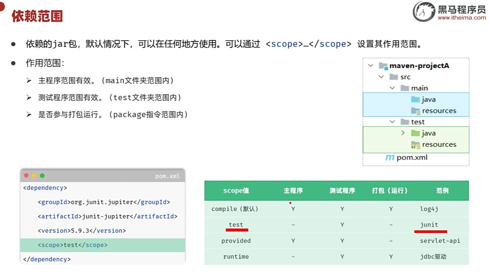
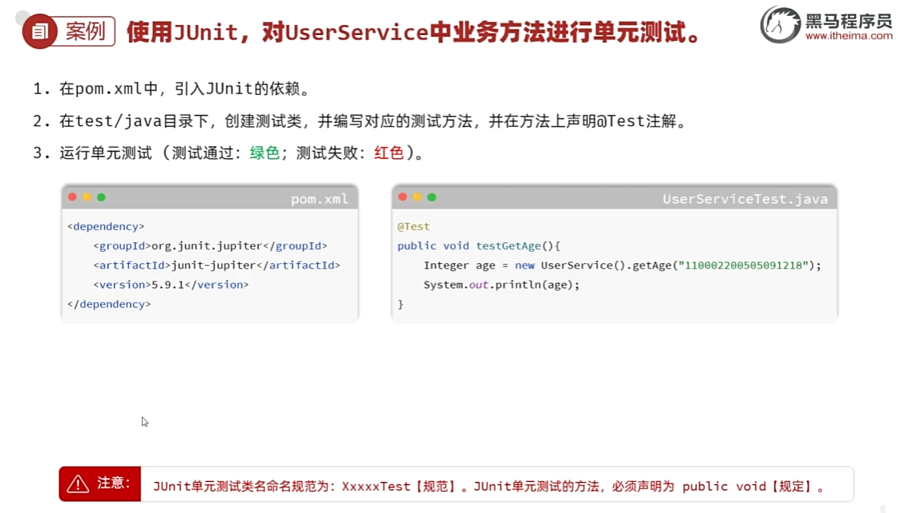
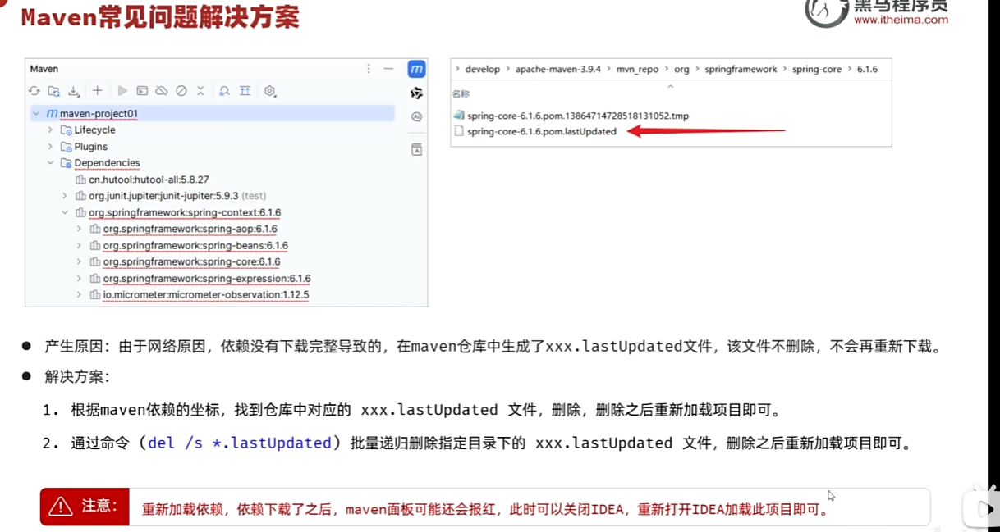

# 导论
- 管理和构建java项目的工具

- 依赖管理
在xml配置依赖自动导入第三方jar包


- 标准项目构建
compile test package

- 统一项目结构


# POM
project object modle 项目对象模型
- pom.xml 配置信息对项目对象的描述
- maven基于pom.xml 这个配置信息进行的

# Maven结构


# Maven配置
- 本地仓库
- 环境变量
```
一、什么是环境变量？
环境变量（Environment Variable）是操作系统用来存储系统运行环境的一些参数。它们是一组动态命名的值，可以影响操作系统或进程的行为。

简单来说，就是操作系统和应用程序运行时可以通过环境变量获得一些配置信息，比如系统路径、用户信息、临时文件夹位置等。

二、常见的Windows环境变量
PATH：存放可执行文件(.exe等)的搜索路径。当你在命令行输入一个命令时，系统会在这些路径下查找对应的可执行文件。
TEMP 和 TMP：存放临时文件的路径。
SystemRoot：Windows系统目录的路径（比如 C:\Windows）。
USERNAME：当前用户的用户名。
APPDATA：应用数据目录。
三、环境变量的作用
简化命令输入
你可以在任何路径下直接运行某些程序，因为它们的路径被加入了 PATH 变量。
配置程序运行环境
比如Java、Python等开发环境，需要配置环境变量告诉系统去哪里找相应的程序或库。
系统和软件信息传递
软件可以通过环境变量获取当前系统的一些配置信息。
四、如何查看和设置环境变量
1. 在命令行查看
查看所有环境变量：
<TEXT>
set
查看某个变量：
<TEXT>
echo %PATH%
2. 在图形界面设置
右键“此电脑” → 属性 → 高级系统设置 → 环境变量
可以分别设置“用户变量”和“系统变量”
五、注意事项
修改环境变量时要小心，尤其是PATH，不要误删原有内容，否则可能导致系统或程序无法正常运行。
修改后可能需要重启命令行窗口或计算机才能生效。
总结：

环境变量是在操作系统层面用来存储和传递配置信息的机制，对于软件开发、系统配置和日常使用都非常重要。学会正确使用和管理环境变量，可以让你的Windows使用和开发效率更高。
```
- 环境变量(文件路径)定义Maven  Path中应用定义的变量 %Maven%\bin

# 集成idea
- 关闭项目进入欢迎界面进行全局配置
- 配置maven路径 config runner 编译器

# maven坐标


# maven导入
- 资源管理器复制到项目内
- 文件/项目结构导入maven 选中pom.xml导入或者右边maven工具栏导入更简单

# maven依赖管理

- 依赖传递:依赖的依赖自动导入进来
- 排除依赖:排除不需要的依赖的依赖,在dependency标签内
```xml
<dependencies>
        <dependency>
            <groupId>org.springframework</groupId>
            <artifactId>spring-context</artifactId>
            <version>6.1.4</version>

            <exclusions>
                <exclusion>
                    <groupId>org.springframework</groupId>
                    <artifactId>spring-aop</artifactId>
                </exclusion>
            </exclusions>
        </dependency>
</dependencies>

```

## 依赖范围

- 单元测试可以设置为<scope>test</scope>junit依赖仅在test文件夹作用

# maven 生命周期
1. clean
2. default
3. site

# 单元测试
- 软件测试概论


## JUnit 单元测试框架

- maven有对应的test文件和主程序分开便于维护
- 设置[]Test类
- 设置test方法 规范为public void方法

```java
public class Yewu {
    public int stringLength(String str){
        return str.length()-1;
    }

}
//测试类
public class YewuTest {
//测试方法
    @Test
    // public void规范
    public void testStringLength(){
        //测试数据点
        Yewu yewu = new Yewu();
        int test1 = yewu.stringLength("test1");
        int test2 = yewu.stringLength("fdssfd");
        int test3 = new Yewu().stringLength("fa");
        Assertions.assertEquals(1,test3,"长度逻辑错误");
        Assertions.assertEquals(5,test2,"长度逻辑错误");
        Assertions.assertEquals(3,test1,"长度逻辑错误");
    }
}

```

## JUnit常见注解
- @Test 修饰测试方法
- @ParameterizedTest @ValueSource() 参数化测试
- @DisplayName 给测试类和测试方法命名
- @BeforeEach @BeforeAll @AfterEach @AfterAll 初始化和.close 修饰对应方法

# maven常见问题解决方案
1. 缺依赖库





