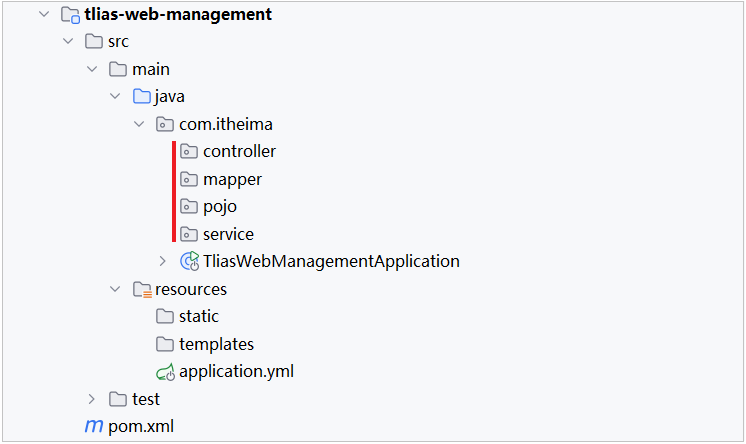
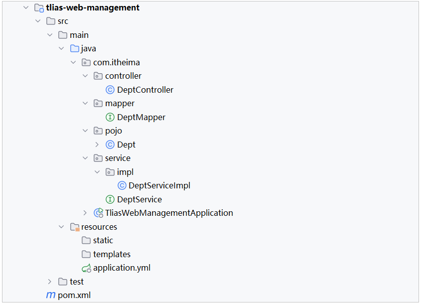

# 接口文档
- 开发规范,前后端分离一致开发
- 需求分析->api设计(接口文档)->前后端并行开发->单元测试->前后端联调测试

# Restful
## REST 表述性转换 软件架构风格
基于REST风格URL如下：
- http://localhost:8080/users/1       GET：查询id为1的用户
- http://localhost:8080/users          POST：新增用户
- http://localhost:8080/users          PUT：修改用户
- http://localhost:8080/users/1       DELETE：删除id为1的用户
其中总结起来，就一句话：通过URL定位要操作的资源，通过HTTP动词(请求方式)来描述具体的操作。

## 增删改查
在REST风格的URL中，通过四种请求方式，来操作数据的增删改查。 
- GET ：  查询
- POST ：新增
- PUT ：  修改
- DELETE ：删除
我们看到如果是基于REST风格，定义URL，URL将会更加简洁、更加规范、更加优雅。
## 注意事项：
- REST是风格，是约定方式，约定不是规定，可以打破
- 描述模块的功能通常使用复数，也就是加s的格式来描述，表示此类资源，而非单个资源。如：users、emps、books…

# 项目环境
1. springweb lombok mysql mybatis
2. 检查项目jdk 检查编码utf-8 检查maven
3. application.yml配置
```yml
spring:
  application:
    name: tlias-web-management
  #mysql连接配置
  datasource:
    driver-class-name: com.mysql.cj.jdbc.Driver
    url: jdbc:mysql://localhost:3306/tlias
    username: root
    password: asd456
mybatis:
  configuration:
    log-impl: org.apache.ibatis.logging.stdout.StdOutImpl
    map-underscore-to-camel-case: true

#logging:
#  level:
#    root: INFO
#    # org.springframework: DEBUG # 示例：Spring框架的DEBUG日志
#    # com.yourcompany.yourapp: DEBUG # 示例：你自己的应用程序包的DEBUG日志

```
4. logback.xml @slf4j日志配置
```xml
<?xml version="1.0" encoding="UTF-8"?>
<configuration>
    <!-- 控制台输出 -->
    <appender name="STDOUT" class="ch.qos.logback.core.ConsoleAppender">
        <encoder class="ch.qos.logback.classic.encoder.PatternLayoutEncoder">
            <!--格式化输出：%d 表示日期，%thread 表示线程名，%-5level表示级别从左显示5个字符宽度，%msg表示日志消息，%n表示换行符 -->
            <pattern>%d{yyyy-MM-dd HH:mm:ss.SSS} [%thread] %-5level %logger{50}-%msg%n</pattern>
        </encoder>
    </appender>
    <!-- 按照每天生成日志文件 -->
    <appender name="FILE" class="ch.qos.logback.core.rolling.RollingFileAppender">
        <rollingPolicy class="ch.qos.logback.core.rolling.SizeAndTimeBasedRollingPolicy">
            <!-- 日志文件输出的文件名, %i表示序号 -->
            <FileNamePattern>D:/logs/tlias-%d{yyyy-MM-dd}-%i.log</FileNamePattern>
            <!-- 最多保留的历史日志文件数量 -->
            <MaxHistory>30</MaxHistory>
            <!-- 最大文件大小，超过这个大小会触发滚动到新文件，默认为 10MB -->
            <maxFileSize>10MB</maxFileSize>
        </rollingPolicy>

        <encoder class="ch.qos.logback.classic.encoder.PatternLayoutEncoder">
            <!--格式化输出：%d 表示日期，%thread 表示线程名，%-5level表示级别从左显示5个字符宽度，%msg表示日志消息，%n表示换行符 -->
            <pattern>%d{yyyy-MM-dd HH:mm:ss.SSS} [%thread] %-5level %logger{50}-%msg%n</pattern>
        </encoder>
    </appender>
    <!-- 日志输出级别 -->
    <root level="info">
        <!--输出到控制台-->
        <appender-ref ref="STDOUT" />
        <!--输出到文件-->
        <appender-ref ref="FILE" />
    </root>
</configuration>
```

# management模块
## 项目结构
- 三层架构



## controller
```java
package com.xxh.tliaswebmanagement.controller;
@RequestMapping("/depts") //统一路径映射
@RestController
public class DeptController {
    private static final Logger log= LoggerFactory.getLogger(DeptController.class);
    @Autowired
    private DeptService deptService;

    //@RequestMapping(value = "/depts" ,method = RequestMethod.GET)
    //简化为getmapping
    @GetMapping
    public Result list(){
        System.out.println("查询全部数据");
        List<Dept> all = deptService.findAll();
        return Result.success(all);
    }

    @DeleteMapping
    //public Result deleteById(@RequestParam Integer id)的简化语法糖
    public Result deleteById(Integer id){
        Integer i = deptService.deleteById(id);
        System.out.println("influence i ");
        return Result.success();
    }

    @PostMapping
    public Result add(@RequestBody Dept dept){
        Integer add = deptService.add(dept);
        return Result.success();
    }

    @GetMapping("{id}")
    //简单参数传递可以省略注解
    public Result getById(@PathVariable Integer id){
        Dept byId = deptService.getById(id);
        return Result.success(byId);
    }


    @PutMapping
    public Result update(@RequestBody Dept dept){
        log.debug("hellow");
        deptService.update(dept);
        log.info("fd");
        return Result.success();
    }

}
```

## service
```java
public interface DeptService {
    List<Dept> findAll();
    //
    Integer deleteById(Integer id);
    //
    Integer add(Dept dept);
    //
    Dept getById(Integer id);
    //
    void update(Dept dept);
}
//impl
@Service
public class DeptServiceImpl implements DeptService {
    @Autowired
    private DeptMapper deptMapper;


    @Override
    public List<Dept> findAll() {
        return deptMapper.findAll();
    }

    @Override
    public Integer deleteById(Integer id) {
        Integer i = deptMapper.deleteById(id);
        return i;
    }

    @Override
    public Integer add(Dept dept) {
        Integer add = deptMapper.add(dept);
        return add;
    }

    @Override
    public Dept getById(Integer id) {
        Dept byId = deptMapper.getById(id);
        return byId;
    }
    @Override
    public void update(Dept dept) {
        //补全基础属性
        dept.setUpdateTime(LocalDateTime.now());
        //保存部门
        deptMapper.update(dept);
    }
}
```

## mapper
```java
@Mapper
public interface DeptMapper {
    @Select("select id, name, create_time, update_time from dept order by update_time desc;")
    public List<Dept> findAll();

    @Delete("delete from dept where id = #{id}")
    public Integer deleteById(Integer id);

    @Insert("insert into dept(name,create_time,update_time) values(#{name},#{createTime},#{updateTime})")
    public Integer add(Dept dept);

    @Select("select id,name ,create_time ,update_time from dept where id=#{id}")
    //@Param简单参数传递可以省略
    public Dept getById(@Param("id") Integer id);

    @Update("update dept set name = #{name},update_time = #{updateTime} where id = #{id}")
    void update(Dept dept);
}

```

## pojo
- Dept class and Result class

# 


# 登录系统
## 登录校验

### 会话技术


