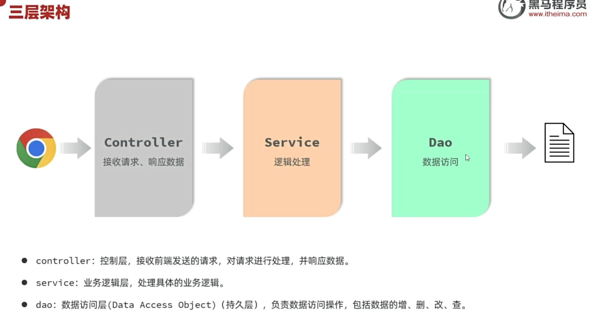
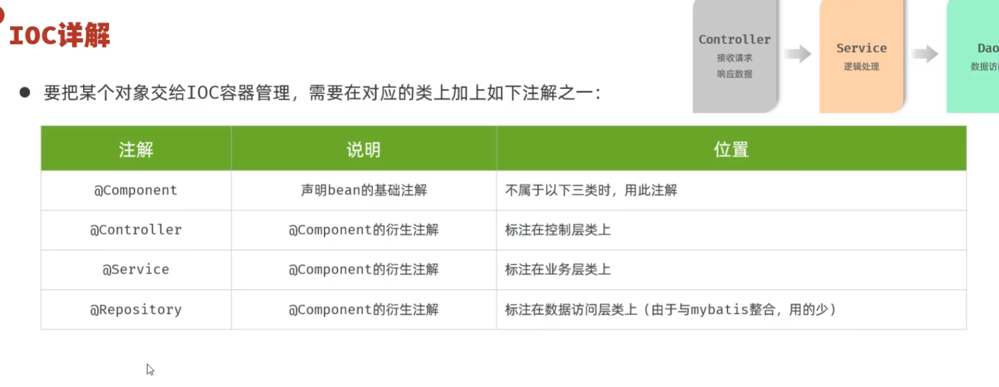

# 项目准备
构建springboot模块->maven管理->javaweb依赖
## 常见问题
- maven未显示依赖库
clear 后下载所有依赖再重启

# http协议
- localhost==127.0.0.1 localhost相当于dns域名
- Hyper Text Transfer Protocol
- 请求&响应

## Request
### @RestController
- 请求数据
```java
@RestController
public class HelloController {
    @RequestMapping("/hello")
    public String hello(HttpServletRequest request){
        //request method
        String method = request.getMethod();
        System.out.println(method);
        //request url
        String url = request.getRequestURL().toString();
        String uri = request.getRequestURI();
        System.out.println(url+" "+uri);
        //requese protocol
        String protocol = request.getProtocol();
        System.out.println(protocol);
        //request args
        String name = request.getParameter("name");
        String age = request.getParameter("age");
        System.out.println(name+" "+age);
        //request head
        String accept = request.getHeader("Accept");
        System.out.println(accept);
        return "ok";
    }
}

```
- 状态码
1xx:临时状态
2xx:ok
3xx:重新定向
4xx:客户端错误
5xx:服务端错误
| 状态码 | 英文描述                   | 解释                                                                     |
|--------|----------------------------|--------------------------------------------------------------------------|
| 200    | OK                         | 客户端请求成功，即**处理成功**，这是我们最想看到的状态码                     |
| 302    | Found                      | 指示所请求的资源已移动到由Location响应头给定的URL，浏览器会自动重新访问      |
| 304    | Not Modified               | 告诉客户端，你请求的资源至上次取得后，服务器并未更改，你直接用你本地缓存的即可 |
| 400    | Bad Request                | 客户端请求有**语法错误**，不能被服务器所理解                               |
| 403    | Forbidden                  | 服务器收到请求，但是**拒绝提供服务**，比如：没有权限访问相关资源               |
| 404    | Not Found                  | **请求资源不存在**，一般是URL输入有误，或者网站资源被删除了                   |
| 405    | Method Not Allowed         | 请求方式有误，比如应该用GET请求方式的资源，用了POST                          |
| 428    | Precondition Required      | **服务器要求有条件的请求**，告诉客户端要想访问该资源，必须携带特定的请求头      |
| 429    | Too Many Requests          | 指示用户在给定时间内发送了**太多请求**（“限速”），配合 Retry-After（多长时间后可重新请求）  |
| 431    | Request Header Fields Too Large | **请求头太大**，服务器不愿意处理请求，因为它的头部字段太大。请求可以在减少请求头大小后重试 |
| 500    | Internal Server Error      | **服务器发生不可预期的错误**。服务器出异常了，赶紧看日志去吧                  |
| 503    | Service Unavailable        | **服务器尚未准备好处理请求**，服务器刚刚启动，还未初始化好                     |
- 响应数据
```java
@RestController
public class ResponseControl {
    @RequestMapping("/hello")
    public void response(HttpServletResponse response) throws IOException {
        //状态码一般不设置
        response.setStatus(HttpServletResponse.SC_OK);
        //
         response.setHeader("hello","hello");
        //
        response.getWriter().write("Hleoo");
    }
    @RequestMapping("/hello2")
    public ResponseEntity<String> response2(){
        ResponseEntity<String> response = ResponseEntity.status(404)
                .header("hello", "hello")
                .body("<h1>Hello<h1>");
        return response;
    }
}
```
### 请求行
- 请求方法
- 请求
- 协议version

### 请求头


# 设计
## 三层架构
- 解耦,单一职责,提高复用性
- Controller<->Service<->Dao

https://heuqqdmbyk.feishu.cn/wiki/MQ95wDTtji6ob6kiRkyc9jamnwg
## 分层解耦
- 实现类交给IOC容器管理
- 容器提供对应的实现类DI
- @Component 将实现类交给IOC容器管理
- @Autowired IOC容器对实现类成员变量依赖注入

# IOC&DI
@Component->IOC_Container(bean_objects)->DI->@Autowired 成员变量
## 设计模式
当然可以！Spring Boot 的 IOC（控制反转，Inversion of Control）和 DI（依赖注入，Dependency Injection）核心思想就是**对象的创建和依赖由容器负责**，不是自己 new 出来。这里面运用了多个经典设计模式，主要有以下几个：

---

### 1. **工厂模式（Factory Pattern）**

**IOC 容器其实就是一个大型的对象工厂**。当你需要某个 bean（对象）时，Spring 容器会根据你的需求把对象“生产”出来，交给你使用，而不是你自己 new。

- **举例**：
  ```java
  @Autowired
  private UserService userService;
  ```
  你没有 new UserService，Spring 帮你生产（创建）并注入。

---

### 2. **单例模式（Singleton Pattern）**

**Spring 默认情况下，Bean 都是单例的**。也就是说，同一个 Bean 在整个容器中只会有一个实例。

- **举例**：
  ```java
  @Service
  public class OrderService { ... }
  ```
  只要没有特别配置（比如 @Scope("prototype")），OrderService 只会被创建一次。

---

### 3. **代理模式（Proxy Pattern）**

**AOP（面向切面编程）离不开代理模式**。Spring 在实现事务、日志等功能时，会为你的类生成一个代理对象，拦截方法调用，在前后插入额外逻辑。

- **举例**：
  ```java
  @Transactional
  public void doSomething() { ... }
  ```
  Spring 会给你的类“织入”事务相关逻辑，靠的就是代理。

---

### 4. **模板方法模式（Template Method Pattern）**

Spring 容器的生命周期管理（比如 Bean 的初始化、销毁）是通过模板方法模式来实现的，允许你在特定生命周期点插入自定义逻辑（如实现 InitializingBean、DisposableBean 接口）。

---

### 5. **依赖注入模式（Dependency Injection Pattern）**

虽然这不是传统的 GoF 23 种设计模式之一，但依赖注入本身是一种解耦模式，Spring 完整实现了它：依赖对象的创建、装配交给外部容器管理。

---

### 总结

- **工厂模式**：Spring 容器生产和管理 Bean。
- **单例模式**：Bean 默认单例。
- **代理模式**：AOP 动态增强 Bean。
- **模板方法模式**：管理 Bean 生命周期。
- **依赖注入模式**：实现对象间解耦。

这些设计模式共同支撑了 Spring Boot 的 IOC 和 DI 机制，让你的代码更加灵活、解耦、易于测试和维护。

如果你想看更详细的代码或示例，可以告诉我你感兴趣哪一块！
## IOC
- 控制反转
- @Component 及其衍生注解

注解后就交给IOC容器管理bean对象,bean对象命名为首字母小写类,
- 启动类结构不要动因为IOC容器有作用范围
启动类自动设置为他和他的子包

## DI
- 依赖注入
- @Autowired ioc容器自动注入成员变量
- 属性注入 和 构造方法注入
- ioc管理同接口多个实现类需要@Primary @Autowired&@Qualifier("") @Resource(name="")
primary注解是使实现类优先级高
resource和autowired不同 :分别按照名称, 类型注入

