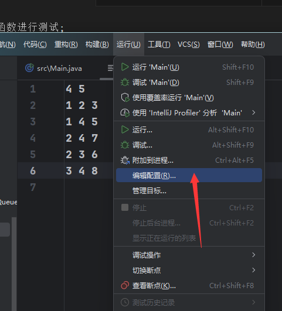
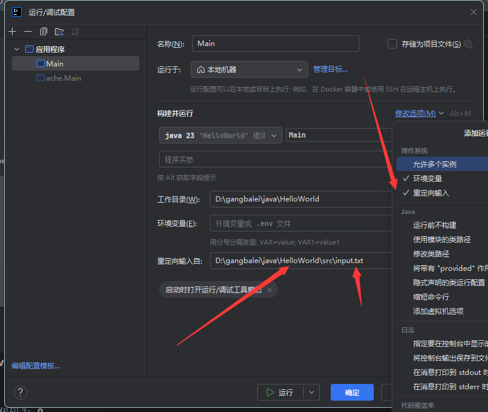

将变量设置为static 共享变量 然后在同一个包弄个Test类 调用Main类中的变量和函数进行测试;

你可以通过以下几种方法简化测试过程，不必每次手动在控制台输入数据：

1. **重定向标准输入（命令行方式）**
   将测试数据放入一个文件（例如 input.txt），然后在命令行中运行时使用重定向命令：
   ```bash
   java Main < input.txt
   ```
   这样程序就会从文件中读取数据，无需手动输入。

这个方法很好用重新定向到输入文件中


2. **IDE运行配置中设置标准输入**
   如果你使用 IDE（如 IntelliJ IDEA、Eclipse 等），可以在运行配置中设定“重定向输入”。
   - 在 IntelliJ IDEA 中：
     a. 打开 Run/Debug Configurations。
     b. 选择对应的运行配置，勾选“Redirect input from”，然后选择你的输入文件（例如 input.txt）。
   - 在 Eclipse 中：
     a. 打开 Run Configurations。
     b. 找到对应的运行配置，在“Common”选项卡中选择“Input File”，并指定文件路径。
   
   这样运行时 IDEA/Eclipse 会自动从指定文件中读取输入数据。

3. **内嵌测试数据（临时修改代码）**
   在调试过程中，你也可以将 BufferedReader 替换为读取字符串的方式（这种方法适合调试，不建议提交竞赛代码），例如：
   ```java
   String data = "4 5\n" +
                 "1 2 3\n" +
                 "1 4 5\n" +
                 "2 4 7\n" +
                 "2 3 6\n" +
                 "3 4 8\n";
   BufferedReader reader = new BufferedReader(new StringReader(data));
   ```
   这段代码会让程序直接从内存中的字符串读取数据，方便调试测试。

4. **使用测试用例框架**
   你还可以利用 JUnit 或其他测试框架编写单元测试，把输入数据和预期输出写入测试代码中。这样你可以一键运行所有测试用例，便于回归测试。

根据自己的使用环境选择合适的方法来简化测试流程。这样就不必每次都手动输入测试数据了。