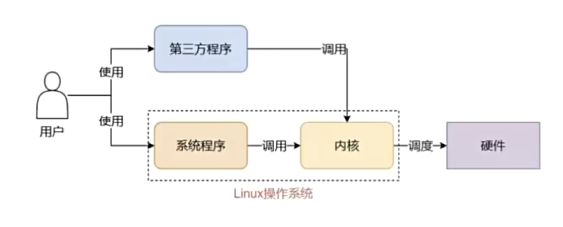
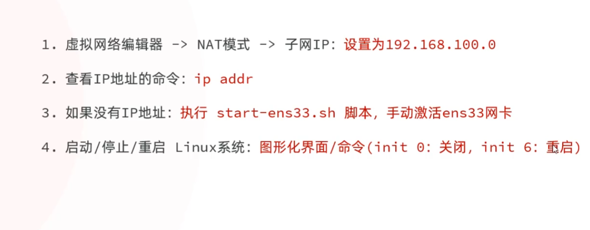
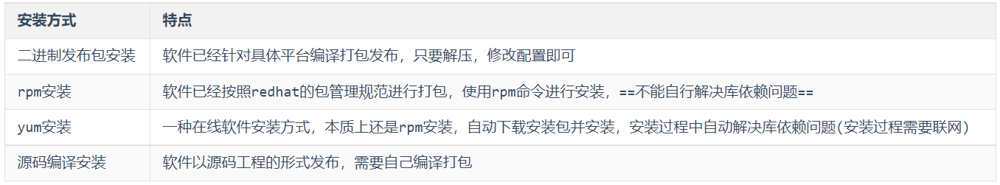
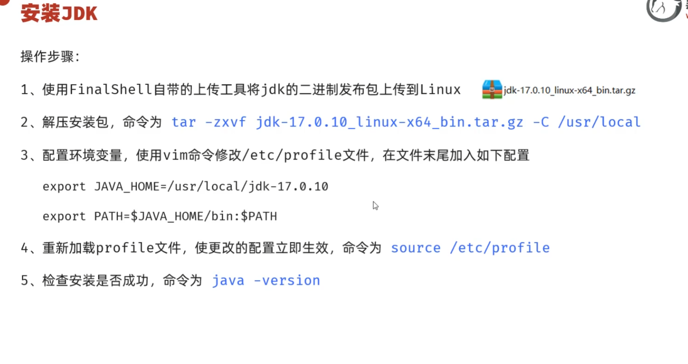

# Linux
- linux=linux内核+系统级应用程序
内核:cpu调度 io  内存操作等
系统级程序: 资源管理器等

- linux内核开源
自己加入系统级程序就能封装一个linux发行版例如ubuntu centos等

# vmware虚拟机
- 将net8子网改为192.168.100.0 避免ip冲突
- 电脑会给虚拟机分配两个网卡(mac地址)
- 

# ssh客户端
- xshell finalshell
- ssh链接客户端,用ssh协议链接虚拟机ip
- ip addr查看虚拟机ip(ens33网卡) 192.168.100.128 端口号22 链接即可

# 虚拟机快照
- 关机快照

# 树形目录结构
- /是所有文件的根目录 
/bin/dev/input.txt
- windows的盘符系统 c:/Windows/.. 类比
- /etc/profile 环境变量
- /usr/local  应用程序目录
# linux 命令
- 一个命令就是一个.exe程序
- command [-选项] [-参数]
- 多选项可简化 tar -zcvf
## tips
tab 补全
tab tab 提示
↑↓曾经用过的
ctrl+l clear 清屏
ctlr+c 退出
exit推出

## 服务相关
systemctl: 
           start 临时开启
           stop   临时关闭
           restart 临时重启
           enable 永久开启
           disable 永久关闭


## 管理员
sudo 其他命令

## ip
- ip addr
192.168.100.128/24 这里24代表前24位就是前3大位不能变进最后一位可以变动

## pwd
查看当前绝对路径

## ls
- ls -a [dir] 
列出全部文件包括隐藏文件
- ls -l [dir]
列出所有文件的详细信息
- ls -al [dir]
-a+-l
- ll [dir]
ll是ls -l简写

## cd
绝对路径和相对路径
./ 这级目录  ../上级目录
- cd ./[dir] == cd [dir] 
相对路径
- cd ..
- cd ../..
上上级目录
- cd /
绝对路径

## mkdir 创建目录
- mkdir dir
- mkdir -p xxh/a/b   -p不存在目录就创建一个

## touch 创建空文件
touch test.txt

## 现代不用了
### rm 不建议用直接用mv移动到垃圾箱
- rm -r dir 递归删除
- rm -f filename 强制删除不能删除目录
- rm -rf 递归强制删除

### cat 不好用
- cat -n fileneam

### more 也不好用
- more filename
- enter spacebar b ctrl+c

## head
- head -20 filename  现实头20行内容

## tail
- tail -20 filename 显示后20行内容
- tail -f filename 动态显示追加内容开另一个ssh标签用于显示追加的日志信息

## cp
  cp hello.txt itcast/            将hello.txt复制到itcast目录中
    cp hello.txt ./hi.txt           将hello.txt复制到当前目录，并改名为hi.txt
    cp -r itcast/ ./itheima/            将itcast目录和目录下所有文件复制到itheima目录下
    cp -r itcast/* ./itheima/                  将itcast目录下所有文件复制到itheima目录下
## mv
  - mv hello.txt hi.txt                   将hello.txt改名为hi.txt
  - mv hi.txt itheima/                   将文件hi.txt移动到itheima目录中
  - mv hi.txt itheima/hello.txt        将hi.txt移动到itheima目录中，并改名为hello.txt
  - mv itcast/ itheima/                 如果itheima目录不存在，将itcast目录改名为itheima
  - mv itcast/ itheima/                 如果itheima目录存在，将itcast目录移动到itheima目录中

## echo
echo $PATH

## 覆盖追加
> 覆盖
>> 追加
将命令的结果覆盖追加到对应的文件里
echo $PATH > test.txt

## 软链接
- ln -s /root/test.txt /root/test2
一定是绝对路径

## tar
- tar -zcvf [.tar.gz] [dir]
- tar -zxvf [.tar.gz] -C dir

## vim
- 作用: 对文件内容进行编辑，vim其实就是一个文本编辑器
- 语法: vim fileName
- 说明:
  - 1). 在使用vim命令编辑文件时，如果指定的文件存在则直接打开此文件。如果指定的文件不存在则新建文件。
  - 2). vim在进行文本编辑时共分为三种模式，分别是 命令模式（Command mode），插入模式（Insert mode）和底行模式（Last line mode）。这三种模式之间可以相互切换。我们在使用vim时一定要注意我们当前所处的是哪种模式。
- 三种模式:
  - 命令模式
    - A. 命令模式下可以查看文件内容、移动光标（上下左右箭头、gg、G)
    - B. 通过vim命令打开文件后，默认进入命令模式
    - C. 另外两种模式需要首先进入命令模式，才能进入彼此
### 命令模式
命令模式指令
含义
gg
定位到文本内容的第一行
G
定位到文本内容的最后一行
dd
删除光标所在行的数据
ndd
删除当前光标所在行及之后的n行数据
u
撤销操作
i 或 a 或 o 
进入插入模式(进入后光标所处的位置不同而已)
### 插入模式
  - 插入模式
    - A. 插入模式下可以对文件内容进行编辑
    - B. 在命令模式下按下[i,a,o]任意一个，可以进入插入模式。进入插入模式后，下方会出现【insert】字样
    - C. 在插入模式下按下ESC键，回到命令模式
    
### 底行模式
  - 底行模式
    - A. 底行模式下可以通过命令对文件内容进行查找、显示行号、退出等操作
    - B. 在命令模式下按下[:,/]任意一个，可以进入底行模式
    - C. 通过/方式进入底行模式后，可以对文件内容进行查找
    - D. 通过:方式进入底行模式后，可以输入wq（保存并退出）、q!（不保存退出）、set nu（显示行号）
底行模式指令
含义
:wq
保存并退出
:q!
不保存退出
:set nu
显示行号
:set nonu
取消行号显示
:n
定位到第n行，如 :10 就是定位到第10行

## date
date  "+%Y-%m-%d %H:%M:%S"


## find 
  - find  .  –name "*.java"                        在当前目录及其子目录下查找.java结尾文件
  - find  /itcast  -name "*.java"             在/itcast目录及其子目录下查找.java结尾的文件
## grep

## ufw 防火墙
- ufw enable 启用 ufw disable 禁用防火墙
- ufw status 
- ufw allow 8080 启用端口  ufw deny 8080
- ufw allow from 192.168.1.100 允许ip访问所有端口 ufw allow from 192.168.1.100 to any port 3306 允许ip访问特定端口
- 

### centos防火墙
#开发防火墙的3306端口号
firewall-cmd --zone=public --add-port=3306/tcp --permanent

#重新加载
firewall-cmd --reload

#查看开放的端口号
firewall-cmd --zone=public --list-ports
#关闭防火墙
systemctl stop firewalld

# 进程管理
- ps -ef | grep xxx
- ps -aux | grep xxx
- htop 先安装过apt install htop
- kill PID   
kill -9 PID 强制删除某个进程
- killall xxx

- 

# linux 软件安装
## 安装方式

## 二进制解压安装

- 注意重启/etc/profile 


# 虚拟机网络链接模式
好的，我们来详细讲解一下 **VMware 虚拟机中的三种常见网络连接模式**，它们分别是 **仅主机模式 (Host-Only)**、**NAT 模式 (Network Address Translation)** 和 **桥接模式 (Bridged)**。

---

### 1. **仅主机模式 (Host-Only)**
- **原理**：
  虚拟机只和宿主机（Host，即运行 VMware 的电脑）通信，虚拟机会被分配到一个虚拟网段，该网段与外部真实网络无关。
- **特性**：
  - 虚拟机可以和宿主机互相通信。
  - 多台虚拟机在同一 Host-Only 网段内也能互相通信。
  - **无法访问外网**。
- **使用场景**：
  - 测试环境，只希望虚拟机和主机及其它虚拟机通信，而不想暴露在外网环境。
  - 内部网络模拟和学习环境。

---

### 2. **NAT 模式 (Network Address Translation，网络地址转换)**
- **原理**：
  VMware 会在宿主机上创建一个虚拟 NAT 网关。虚拟机通过该虚拟网关访问外部网络，网关再利用 **网络地址转换 (NAT)** 把虚拟机的私有 IP 地址转换成宿主机的真实 IP 地址，从而访问外网。
- **特性**：
  - 虚拟机能够访问外网。
  - 默认情况下，外部网络无法主动访问虚拟机（除非配置端口映射）。
  - 虚拟机之间、虚拟机与主机之间可以互通。
- **使用场景**：
  - 虚拟机需要访问外网，例如下载软件、浏览网页，但无需让外网直接访问虚拟机。
  - 本地开发、测试环境。
#### 端口转发
将主机端口映射到虚拟机端口
访问主机端口即可转发到虚拟机映射的端口
---

### 3. **桥接模式 (Bridged)**
- **原理**：
  虚拟机的虚拟网卡直接“桥接”到宿主机的物理网卡，虚拟机相当于一台独立的计算机接入到真实局域网。
- **特性**：
  - 虚拟机会获取到与宿主机同一网段的 IP（通常由局域网的 DHCP 服务器分配）。
  - 虚拟机和局域网内的其他真实计算机互相通信，就像一台普通的物理机。
  - 外部网络可直接访问虚拟机（在 IP 可达的情况下）。
- **使用场景**：
  - 虚拟机需要和局域网其他主机对等通信，例如作为服务器对外提供服务。
  - 做网络实验、模拟真实环境。

---

✅ **总结对比表：**

| 模式         | 能否访问外网 | 能否与主机通信 | 外部能否访问虚拟机 | 典型应用场景 |
|--------------|--------------|----------------|--------------------|--------------|
| Host-Only    | ❌            | ✅              | ❌                  | 内网模拟、学习环境 |
| NAT (Network Address Translation) | ✅（通过宿主机 NAT 出口） | ✅ | ❌（如需需手动端口映射） | 上网、开发调试 |
| Bridged      | ✅（与宿主机同属局域网） | ✅ | ✅（局域网可达则直接访问） | 提供局域网服务、模拟真实主机 |

---

要不要我给你画一张**网络拓扑图示意图**（ASCII字符图或文字说明）来直观理解这三种模式？

# mysql
- mysql -h 192.168.100.128 -P3306 -uxxh -pasd456
- 用nat端口映射将localhost 3307映射到linux的3306
- 创建任意主机的root出现bug,采用创建xxh用户来debug 
```sql
CREATE USER 'xxh'@'%' IDENTIFIED BY 'asd456';

GRANT ALL PRIVILEGES ON *.* TO 'xxh'@'%';

FLUSH PRIVILEGES;
```


# redis

## 配置systemctl
BV1rV411M7eU


[Unit]
Description=redis-server
After=network.target
[Service]
Type=forking
ExecStart=/usr/local/bin/redis-server /usr/local/src/redis-6.2.10/redis.conf
PrivateTmp=true
[Install]
WantedBy=multi-user.target

systemctl daemon-reload

systemctl start/stop/restart/status  redis

## cli
redis-cli -h ip -p端口 -a密码
AUTH 密码 校验密码

- help 命令查看命令用法

- keys 查找键
- del 删除键
- exists 判断键是否存在
- expire 设置键的多少秒后死亡
- ttl  查看键寿命 -1永久不死 -2死了 

- set 添加键值对
- mset 批量添加键值对
- incr 自增1
- incrby 自增自定义步长可以用负数自减法

- setnx 存在不在创建
- setex 组合命令set+expire


## datagrip图形化界面
- 配置redis数据库 linux ip addr地址 和密码显示16个库即可


