## MermaidBoot
### 节点
- 大写字母表示节点变量 () 括号里写名字
- ()圆润矩形
- (())圆形
- {}菱形
- [] 方形
### 边
- --> 箭头
- ==>粗箭头
- --无向边
- -.>虚线
- |name| 边命名 或者在--之间直接写入文本
- <-->


增加-可以增加边的长度 ----->会很长

### graph
#### 树
TD(top to down)
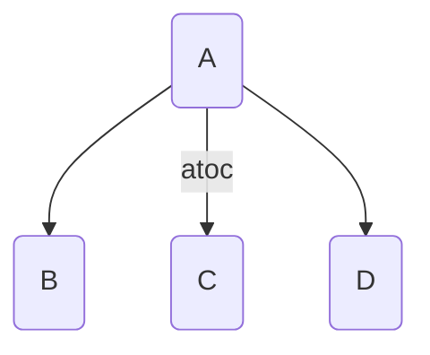

#### 图
LR(left to right) RL
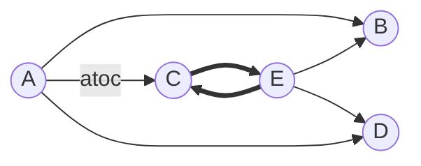

---

## 1. Mermaid 简介

- **Mermaid** 是一个基于 JavaScript 的图表绘制工具，允许在纯文本（如 Markdown）中直接用简单的标记语言生成 **流程图、思维导图、时序图、甘特图、状态图** 等。
- 优点：
  - **与 Markdown 无缝集成**，可在多数笔记软件（如 Obsidian、Typora、VSCode 插件、Notion 部分支持）中直接使用。
  - **轻量级，不用额外绘图软件。**

---

## 2. 基本使用步骤

在 Markdown 中加入代码块，指定语言为 `mermaid`：


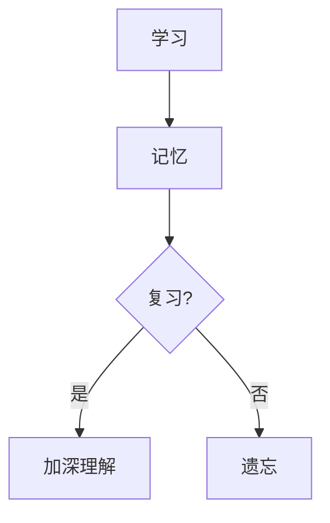


效果会自动渲染为图表（前提是支持 Mermaid 的 Markdown 编辑器）。

---

## 3. Mermaid 支持的主要图表类型

### 3.1 流程图 (Flowchart)

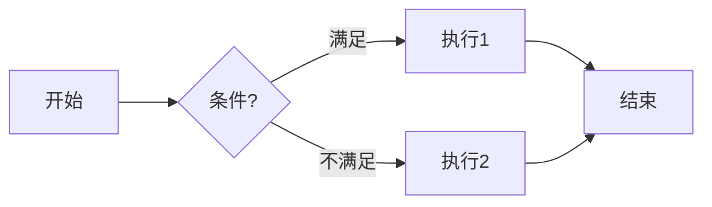

- `graph TD` = Top --> Down（节点从上到下）
- `graph LR` = Left --> Right（节点从左到右）

---

### 3.2 思维导图 (Mindmap)

Mermaid 新增了 `mindmap` 语法：

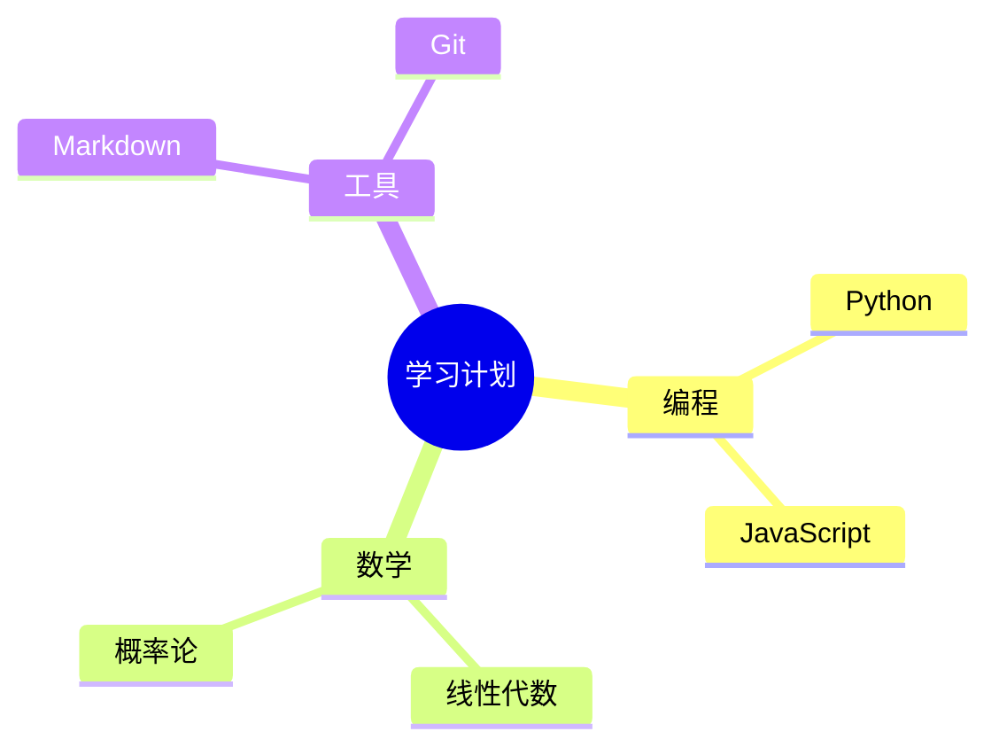

👉 非常适合你要做的“记忆辅助”。

---

### 3.3 时序图 (Sequence Diagram)

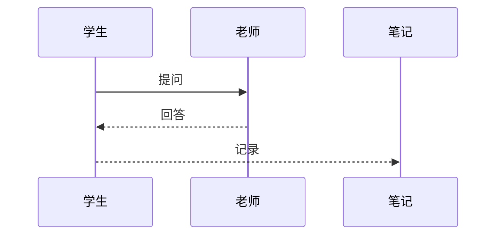

---

### 3.4 甘特图 (Gantt Chart)

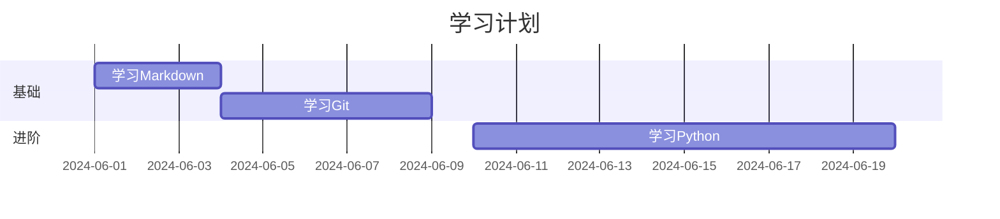

---

### 3.5 状态图 (State Diagram)

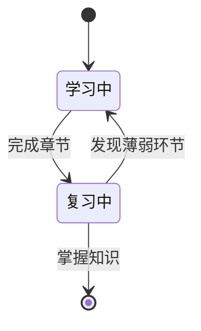

---

## 4. 常用技巧

1. **节点形状**
   - `A[方框]` → 方框
   - `A(圆角矩形)` → 圆角
   - `A((圆形))` → 圆
   - `A{菱形}` → 决策

2. **连线箭头**
   - `-->` 普通线
   - `---` 无箭头
   - `-.->` 虚线
   - `==>` 粗箭头

3. **样式控制**（高级用途）
   ```mermaid
   graph TD
       A[记忆] --> B[复习]
       style A fill:#f9f,stroke:#333,stroke-width:2px
   ```

---

## 5. 各笔记工具支持情况

- **Obsidian** → 原生支持 Mermaid
- **Typora** → 支持 Mermaid
- **VSCode** → 使用扩展 `Markdown Preview Mermaid Support`
- **Notion** → 需要嵌入 `<iframe>` 或者借助其他方式，不是原生

---

## 6. 使用建议

- **总结笔记时** → 用 `mindmap` 构建思维导图，加深知识点之间关系的理解。
- **流程记忆** → 用 `flowchart` 绘制公式推导/算法执行过程。
- **学习进度追踪** → 用 `gantt` 表可视化学习时间表。
- **对话或步骤** → 用 `sequenceDiagram` 表现问答和知识流动。

---

✅ 总结起来：
Mermaid 在 Markdown 中就是通过 ` ```mermaid ``` ` 代码块嵌入语法文本，即可生成各种图表。它特别适合做学习笔记、知识整理和记忆辅助。

---

要不要我帮你 **定制一个“高效学习法思维导图”** 的 Mermaid 代码模板？这样你可以直接复制到笔记里使用。

好问题 👍
你想用 **Mermaid** 来表示 **数据结构中的树与图**，那需要区分不同场景和需求：

---

## 1. **树（Tree）结构**
树是一种层级结构，有根节点和子节点，非常接近思维导图和流程图。

### 推荐方式
- **`mindmap`（思维导图）**：最直观的方式，树状天然分叉。
- **`graph TD`（流程图/一般有向图）**：更灵活，可以精确控制节点和连线。

### 示例（用 `mindmap` 表示二叉树）
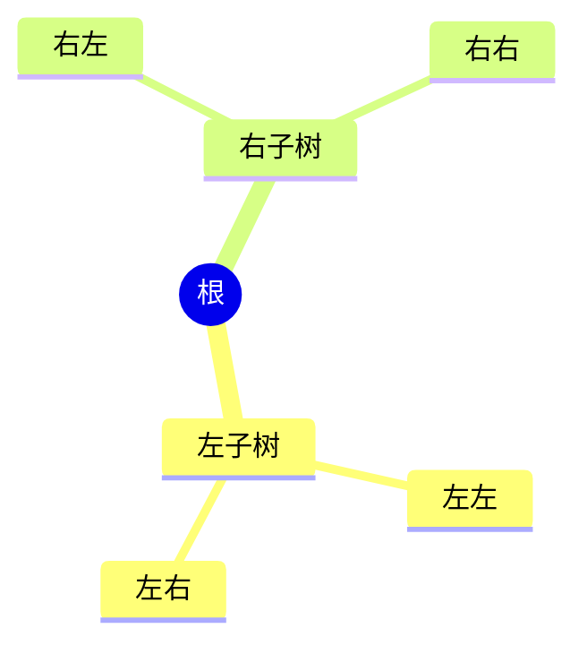

### 示例（用 `graph TD` 表示二叉树）
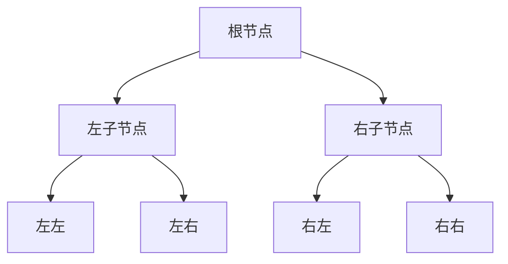

👉 对你这种“数据结构学习笔记”来说，
- `mindmap` 更直观，
- `graph` 更精确（能画二叉树、红黑树等）。

---

## 2. **图（Graph）结构**
图结构可以是有向图 / 无向图，可以有环。
Mermaid 提供的 **`graph`**（flowchart 模式）最适合。

### 示例（无向图）
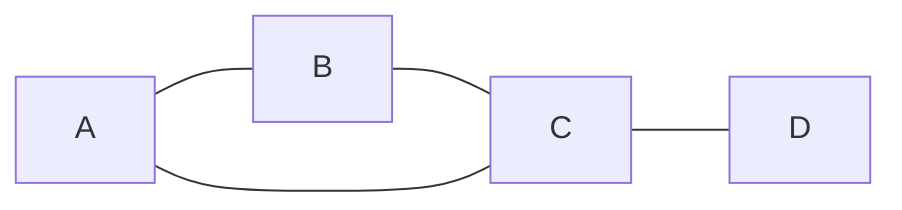

### 示例（有向图）
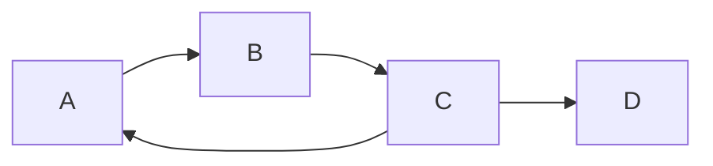

- `---` 表示无箭头（无向边）
- `-->` 表示有向边

---

## 3. 建议总结

- **学习树状数据结构（如二叉树、B 树）** →
  用 `graph` 更合适，因为你能明确控制左右指针、区分不同子树。
  `mindmap` 更适合发散性展示（比如概念分类）。

- **学习一般图结构（有向图、拓扑排序、最短路径）** →
  用 `graph LR/TD`，箭头和无箭头都能表示。

---

✅ 最终建议：

- **画树**：用 `graph TD`（精确控制子节点结构）。
- **画普通图**：用 `graph LR/TD/RL`（根据方向决定布局）。
- **整理知识点层级**：用 `mindmap`（更像大纲树，不适合精确数据结构）。

---

要不要我给你写一个 **“二叉搜索树 (BST) 的 Mermaid 图例”**，这样你直接可以在 Markdown 中展示？