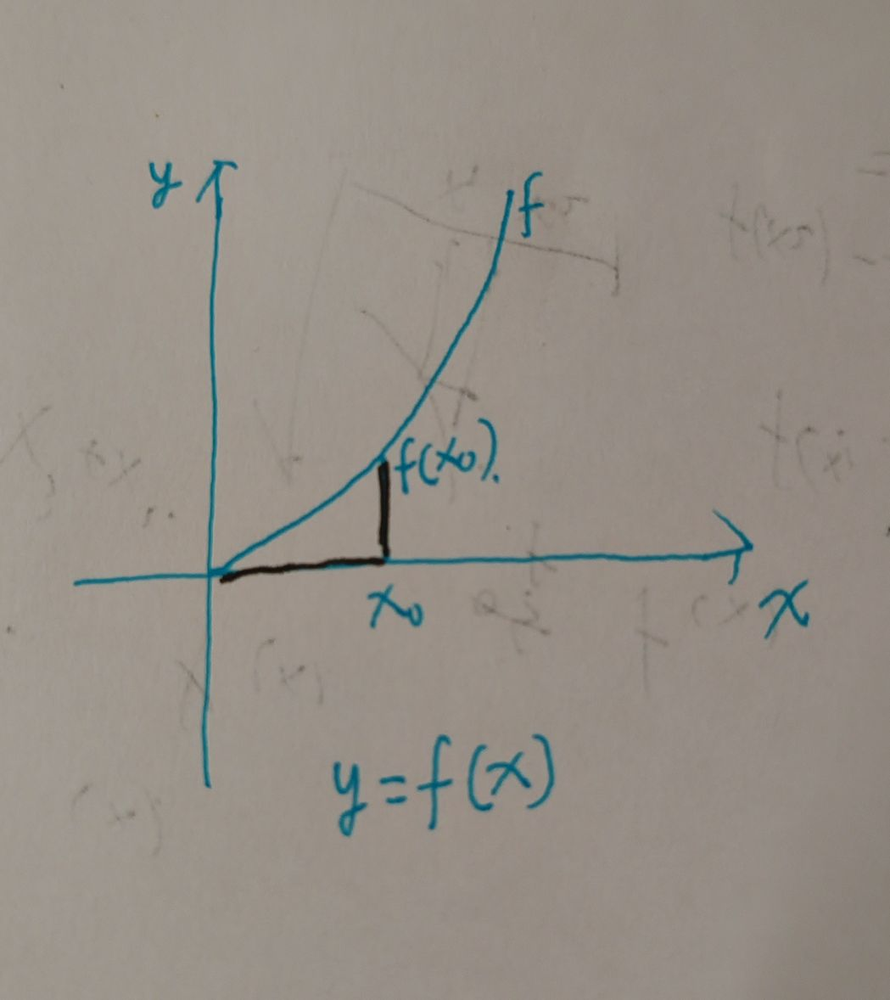

#
```json
{
    "set-element":"set和element不能分开,元素是集合的第一层元素,集合是元素无序不同的收集",
    //研究位面,我们仅研究集合和集合的第一层关系这在相同位面
    //例如C is {A,B} 元素A,B是集合但在同一研究位面下我们不关心A,B里的元素,如果需要讨论A,B里的元素需要深入下一层研究位面
    "order":"多个集合内element的有序组,由集合定义",
    //如果研究位面是集合 那么(A,B)成立 如果是A,B的元素则不成立
    //同一研究位面下我们研究多个set-element联系等用到order,
    //(a,b) -> {a,{a,b}} (a,b,c) -> ((a,b),c)递归定义n元组
    //  - order是具体的单个点,没有set的概念,order里的都是元素同一研究位面最小不可分原子
    //- 偏序关系定义新的数学结构 
    //例如(G,*,e,-1)群有序n元组
    "order_set":"研究的多个set-element所组成的order的导出集合",
    //笛卡尔积是研究的多个set-element所有order的集合,关系包含于笛卡尔积
    "variable state":"middle of set and element",
    //变量是研究位面下集合和元素的中间态,如果确定了state状态就会退化为元素
    //数理逻辑中1阶逻辑
    "operator":"process_quantity;operator_evolve;io;rule"
    //f()整体是算子,是一个过程量,其他的是集合元素量,f是命名标记
    //算子是根据某种规则(rule)栈将()括号里输入的东西输出成规则对应的东西
    //算子进化:operator -> orderset 算子生成order集合
    //f()根据自定义的规则栈,f就是一个命名标记全部输出完毕后这个标记就是这个order_set的命名标记;这样就生成了一个order_set
    //e.g.
    //y=f(x) x∈A y∈B  B=f(A)   4=f(2)  
    //算子将输入的变量x(A中元素和A集合的中间态)输出(映射)为对应的变量y  或者输入的集合A输出为对应的集合B 输入的元素2输出为对应的元素4
    //f(x):本身代表输出的变量 f(A):本身代表输出的集合 f(1):本身代表输出的值 =仅是等价关系
    
    //重新理解
    //f()是算子:将变量x映射到变量y
    //输出完毕,f是order_set
    //对于变量x0和输出的f(x0)他们都是黑色的一段并不是order_set上的order)

    //记忆soo
    //算子是过程量soo是集合元素量
    // {...} -> {...} {...} 坐标系 -> (4,3) 单个点 -> {(),()...} 组成的线面体等 -> variable operator
    //set-element -> order -> order_set->variabl state->()->operator

}
```


# 现代数学对象的集合论递进式定义


# set-element

## 0. 公理体系与集合
我们假定一切数学讨论都在ZFC集合论的公理体系内。无序不同元素
集合是唯一的“原生对象”，其所有成员也是集合。除了集合，没有其他对象。

---

## 1. 空集、基本集合
**定义：**
存在一个没有任何元素的集合，记为 \(\varnothing\)（公理保证其存在）。

所有具体对象（比如数）最终都被定义为集合。

---

## 2. 元素、子集与幂集
- 如果 \(x \in A\)，我们说 \(x\) 是集合 \(A\) 的元素。
- **子集：** \(B \subseteq A\) 当且仅当 \(\forall x (x \in B \implies x \in A)\)。
- **幂集：** \( \mathcal{P}(A) = \{B \mid B \subseteq A\} \)

### 3. variable state
- 变量是集合和元素的中间态,表示整个集合里的元素
- 变量状态确定后就会退化成元素
---
# order

## 3. 有序对和n元组  Pair and n-Tuple 的集合定义
**有序对：**
\[(a, b) := \{\{a\}, \{a, b\}\}\]

**有序n元组：**
递归定义，例如 \((a, b, c) := ((a, b), c)\)，依此类推。

**群**
(G,*,e,-1)
群是集合G,*函数,e,逆-1的有序4元组
---

# order_set
## 4. 笛卡尔积 
给定集合\(A, B\)：
\[A \times B := \{ (a, b) \mid a \in A, b \in B \}\]

这使用了前面定义的有序对。


## 5. 关系
**二元关系：**
是 \(A \times B\) 的任何一个子集
\[R \subseteq A \times B\]

**n元关系**类似，只是定义在\(A_1 \times ... \times A_n\)的子集上。

## = 等价关系

---

## 6. 函数
**定义：**
从集合 \(A\) 到集合 \(B\) 的函数 \(f\) 是 \(A \times B\) 的一个特殊子集，满足：
\[\forall a \in A,\ \exists ! b \in B, (a, b) \in f\]
即，对每个输入有唯一输出。

## variable and function 数学层面讨论
- 因为skills的公理就是vraiable:state function:()io input output {}stack operate return,所以有必要讨论这两个
### variable state
    "variable":"middle of set and element ; state",
    //变量是研究位面下集合和元素的中间态,如果确定了state状态就会退化为元素
- 变量是集合和元素的中间态,表示整个集合里的元素
- 变量状态确定后就会退化成元素

### 1. 背景：符号与集合的关系
在数学逻辑和集合论的框架里，**变量**并不是集合中的具体元素，而是一种**符号**，它在语法层面充当“占位符”的角色，用来指称集合中的元素。比如在一阶集合论（如 ZF 公理系统）中，我们说“对任意的 \(x\)，有……”，这里的 \(x\) 就是一个变量，它表示可以从全集\(V\)（即所有集合的类）中取任意一个元素。

---

### 2. 自由变元与约束变元
在逻辑公式中，变量的出现可以分为两种：
- **自由变量（free variable）**：没有被量词（如 ∀, ∃）作用的变量。此时它的取值范围是某个约定好的集合。比如 \(\varphi(x) : x \in \mathbb{N}\)，这里的 \(x\) 是自由变量。
- **约束变量（bound variable）**：被量词绑定的变量。比如 \(\forall x\ (x \in \mathbb{N} \rightarrow x+1 \in \mathbb{N})\)，这里的 \(x\) 就是被 \(\forall\) 绑定的，不指代任何固定的、外部的对象。

---

### 3. 从集合论的角度：变量是元素的“占位符”
在集合论中，我们研究集合及其元素。如果要表达“一切自然数都有某种性质”，我们就要使用符号来暂时代替任意的元素：

- **集合中的元素**：具体的对象，例如 \(0, 1, 2 \in \mathbb{N}\)。
- **变元（变量）**：一个临时符号（如 \(x\)），它可以在命题或函数里代表一个“尚未确定”的元素，但其取值范围是某个集合（如 \(\mathbb{N}\)）。
- **赋值（valuation）**：当我们真正把某个集合里的对象代入变量，就得到了具体语义。例如，令 \(x = 3 \in \mathbb{N}\)，公式“\(x+1 \in \mathbb{N}\)”解释后就成为\(3+1 \in \mathbb{N}\)，是真命题。

---

### function () {}
- 广义的函数是映射,就是order_set点集
- f(x)=x^2  这里 f是order_set 点集合
- ()io
y=f(x) x∈A y∈B  B=f(A)   4=f(2)  
括号这个运算的含义是:在order_set f这个集合下 将输入的变量x(A中元素和A集合的中间态)输出(映射)为对应的变量y  或者输入的集合A输出为对应的集合B 输入的元素2输出为对应的元素4
//f(x):本身代表输出的变量 f(A):本身代表输出的集合 =仅是等价关系,可以解释func fabbonaci(n int) *big.Int {} 
- {}
是计算机的栈在数学中不讨论

变量常用来构造函数。比如：
\[
f(x) = x^2
\]
严格地说，这个表达式表示一个函数 \(f: \mathbb{R} \to \mathbb{R},\ f(t) = t^2\)。
- 其中 \(x\) 是一个**哑变量(symbolic placeholder)**，函数的实际定义并不依赖于它被命名为什么字母，只要是一个占位符就行。
- 例如我们也可以写 \(f(y) = y^2\)，定义出的函数完全相同。

这体现出变量本质上是“占位符号”，它的意义由语境中的集合以及规则（赋值、量化）来决定。

---

### 5. 小结
- 变量不是某个集合的元素，而是符号，用于表示“任意元素”。
- 当给变量赋值（valuation），它才对应集合中的具体元素。
- 在逻辑与集合论的形式系统中，变量由语法定义：是公式中的特殊符号，可以自由或被量化地出现。
- 在函数与表达式中，变量是“占位符”，帮助描述从输入集合到输出集合的对应关系。

---

👉 如果你想，我可以进一步从**一阶逻辑的语义模型**角度更形式化地定义“变量的解释”，比如通过“变量赋值函数 \(g: \{变量\} \to 域\)”来说明。要不要我再展开这部分？

## 7. 数字系统（自然数、整数、有理数、实数...）

**自然数：**
可以用“冯·诺伊曼编码”定义：
- \(0 := \varnothing\)
- \(1 := \{0\} = \{\varnothing\}\)
- \(2 := \{0, 1\} = \{\varnothing, \{\varnothing\}\}\)
- 一般 \(n+1 := \{0, 1, ..., n\}\)

**整数、有理数、实数、复数**：
以自然数为基础，用集合方法递归定义。例如整数是有序对自然数的等价类，有理数是整数对非零整数的等价类，实数可用戴德金分割或柯西列等方式编码。


# symmetry
- 由set-element -order order_set 组合的对称结构
## 8. 结构：群、环、域、向量空间、拓扑空间等

### 8.1 群
一个群是有序对 \((G, \ast)\)，其中
- \(G\) 是集合
- \(\ast : G \times G \to G\) 是函数
- 满足群公理（结合律、单位元、逆元）

**更形式化地：**
群是\((G, \ast, e, {}^{-1})\)的**有序四元组**(4-tuple)，所有公理均用集合与函数语言化。

---

### 8.2 环、域
**环：\((R, +, \cdot)\)**
- \(R\) 是集合，
- \(+\)、\(\cdot\) 是两个从 \(R \times R\) 到 \(R\) 的函数，
- 满足环公理。

**域：** 具两个运算且乘法有单位和可逆元（除零外）。

---

### 8.3 向量空间
**向量空间：\((V, +, \cdot)\)**
- \(V\) 是集合，\(+\) 是和的函数，\(\cdot\) 是数量乘法。
- 数量来源于某个域 \(F\)，运算公理全用集合论表述。

---

### 8.4 代数结构的集合论表达
所有结构体都可以写作一个有序 n 元组：
\[
(A, f_1, ..., f_k, R_1, ..., R_m)
\]
其中 \(A\) 是基集，\(f_i\) 是各种构造的函数，\(R_j\) 是特定关系（也是集合的子集），整体是集合的集合。

---

### 8.5 拓扑空间
拓扑空间定义为有序对 \((X, \tau)\)
- \(X\) 是集合，
- \(\tau \subseteq \mathcal{P}(X)\)，且符合“空集和全集在内，任意并封闭，有限交封闭”的拓扑公理。

---

### 8.6 度量空间、测度空间等
- **度量空间**：\((X, d)\)，\(X\) 是集合，\(d: X \times X \to \mathbb{R}\) 是函数，满足度量公理。
- **测度空间**：\((X, \mathcal{F}, \mu)\)，\(\mathcal{F}\) 是σ-代数（可定义为\(\mathcal{P}(X)\)的子集族），\(\mu: \mathcal{F} \to [0, +\infty]\) 是满足测度公理的函数。

---

## 9. 范畴（进阶）
**对象**和**态射**可以都是集合或集合间的结构（映射），在严格集合论体系（小范畴）内，范畴本身也是某集合的结构体（有序三元组 \((Ob, Mor, comp)\)），更高级别的“类”概念则需更复杂公理系统。

---

# 总结

所有现代数学对象，从最基础的数、集合，到函数、结构体、空间、范畴都可**递归地表示为集合及其包含的有序n元组和子集**，进一步加上合适的关系与函数。所有对象本质上全是集合，通过公理约束与递归成长为多样的数学世界。

---

### 进一步阅读

- 孙德克、蒋湘宁《集合论及其数学基础》
- Halmos 《Naive Set Theory》
- Suppes 《Axiomatic Set Theory》
- 刘培德《近现代数学基础讲座·集合论》

