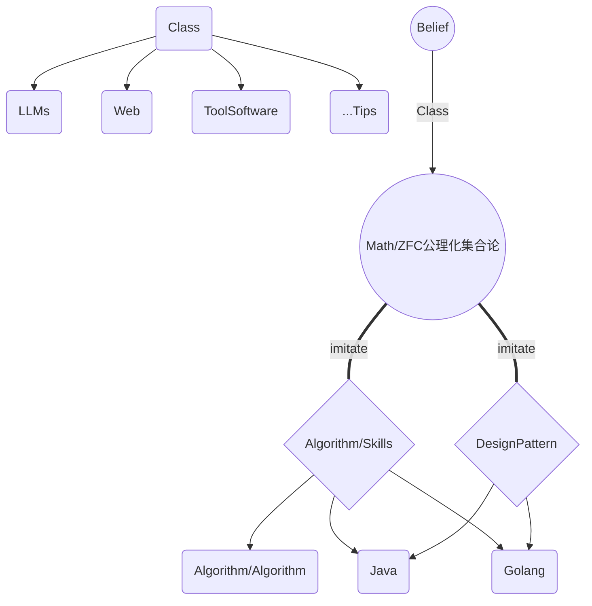
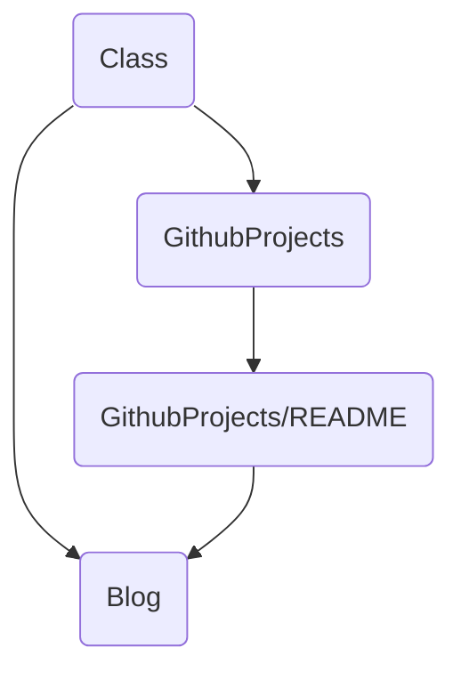
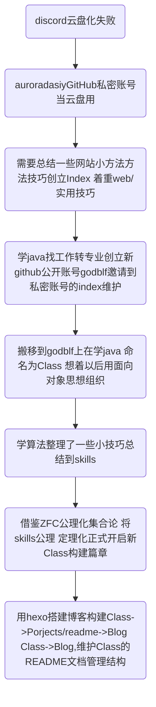

# ClassBoot
一切皆从Class启动

# 树形结构

# 仓库依赖

# 格式导论
## json
- 每一部分开头写一个json来作为导论
- "重要内容":"辅助记忆的内容"//注释
- 辅助记忆的内容可以是符号 英文单词 或者自己造的专有名词例如Skills里的很多内容
(自己造专有名词/skills里的>符号>英文单词)注释可以随便修饰
- 目的就是轻量化记忆起到导论的作用总结重点,可以有的没有,不可以有的坚决没有
- 参考自数学的ZFC公理体系集合论
- 通过集合可以构造出代数分析体系
- skills对应集合论公理定理 json对应如何组合公理定理方便记忆
## mermaid
- mermaid 图 辅助记忆类似思维导图
## boot
- xxxboot
快速预览某个技术栈
## 模板
- 某个技术栈的模板直接copy

# 历史

https://discord.com/channels/1218507417533419531/1271304462656475167