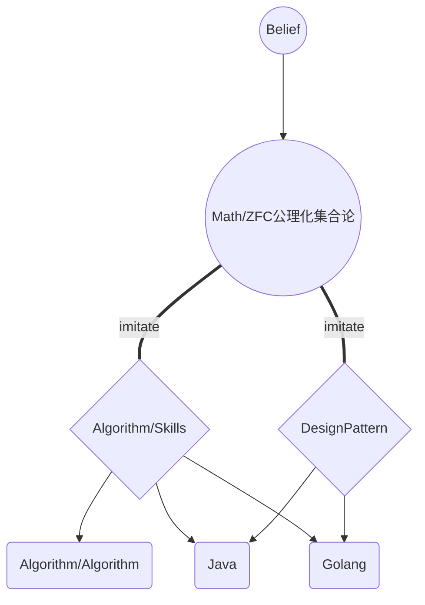
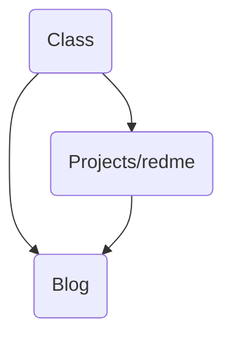
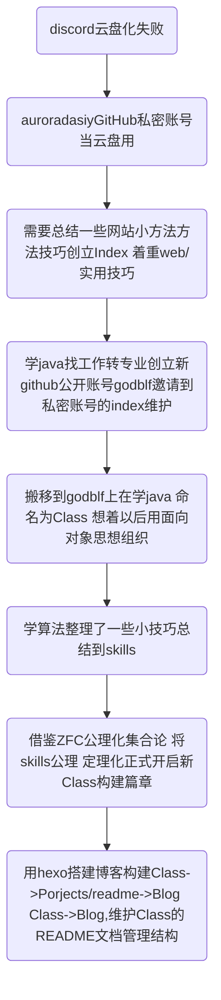

# ClassBoot
一切皆从Class启动

# 树形结构

```mermaid
graph TD

A((Math/ZFC公理化集合论))
B{Algorithm/Skills}
C{DesignPattern}
D(Algorithm/Algorithm)
Java(Java)
Go(Golang)
Blf((Belief))--->A
A===|imitate|B
A===|imitate|C
B-->D
B-->Java
B-->Go
C-->Java
C-->Go
```

# 文档管理

```mermaid
graph TD
A(Class)-->B(Blog)
A-->C(Projects/redme)
C-->B

```

# 历史

```mermaid
graph TD

a(discord云盘化失败)-->b(auroradasiyGitHub私密账号当云盘用)

b-->c(需要总结一些网站小方法方法技巧创立Index 着重web/实用技巧)
c-->d(学java找工作转专业创立新github公开账号godblf邀请到私密账号的index维护)
d-->e(搬移到godblf上在学java 命名为Class 想着以后用面向对象思想组织)
e-->f(学算法整理了一些小技巧总结到skills)
f-->g(借鉴ZFC公理化集合论 将skills公理 定理化正式开启新Class构建篇章)
g-->h(用hexo搭建博客构建Class->Porjects/readme->Blog Class->Blog,维护Class的README文档管理结构)


```

https://discord.com/channels/1218507417533419531/1271304462656475167