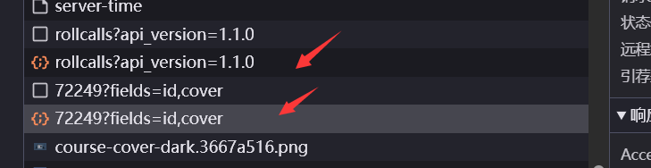

active rollanswer 这俩接口 状态码500

getRollcalStatusResult 这个没权限

# 签到信息

https://lnt.xmu.edu.cn/api/radar/rollcalls?api_version=1.1.0
https://lnt.xmu.edu.cn/api/courses/72249?fields=id,cover
这两个接口

包为.xhr

## 格式:
https://lnt.xmu.edu.cn/api/courses/72249?fields=name,course_code,instructors(name)
{
  "allow_admin_update_basic_info": true,
  "allow_update_basic_info": false,
  "allowed_to_invite_assistant": true,
  "allowed_to_invite_student": true,
  "allowed_to_join_course": true,
  "archived": false,
  "auto_archive_course_date": "",
  "course_code": "20252026113013001020701",
  "credit_state": {
    "credit_remaining": 500,
    "status": "active"
  },
  "has_ai_ability": true,
  "instructors": [
    {
      "name": "林文水"
    }
  ],
  "knowledge_graph_publish_type": "unpublished",
  "name": "离散数学",
  "problem_graph_publish_type": "unpublished",
  "show_archive_course_tips": false
}
{
    "rollcalls": [
        {
            "avatar_big_url": "",
            "class_name": "",
            "course_id": 72249,
            "course_title": "\u79bb\u6563\u6570\u5b66",
            "created_by": 20994,
            "created_by_name": "\u6797\u6587\u6c34",
            "department_name": "\u4fe1\u606f\u5b66\u9662",
            "grade_name": "",
            "group_set_id": 0,
            "is_expired": false,
            "is_number": true,
            "is_radar": false,
            "published_at": null,
            "rollcall_id": 141798,
            "rollcall_status": "in_progress",
            "rollcall_time": "2025-09-01T11:12:37Z",
            "scored": true,
            "source": "number",
            "status": "absent",
            "student_rollcall_id": 0,
            "title": "2025.09.01 19:12",
            "type": "another"
        }
    ]
}
{
  "rollcalls": [
    {
      "avatar_big_url": "",
      "class_name": "",
      "course_id": 70155,
      "course_title": "大学物理实验",
      "created_by": 20690,
      "created_by_name": "姚真瑜",
      "department_name": "物理科学与技术学院",
      "grade_name": "",
      "group_set_id": 0,
      "is_expired": false,
      "is_number": false,
      "is_radar": false,
      "published_at": null,
      "rollcall_id": 145866,
      "rollcall_status": "in_progress",
      "rollcall_time": "2025-09-04T23:47:30Z",
      "scored": true,
      "source": "qr",
      "status": "on_call_fine",
      "student_rollcall_id": 0,
      "title": "2025.09.05 07:47",
      "type": "qr_rollcall"
    }
  ]
}

# 签到码信息接口
https://lnt.xmu.edu.cn/api/rollcall/143343/student_rollcalls  140892为签到信息里的id
getStudentsRollcallsStats: function(e) {
                    return "/api/course/".concat(e, "/students_rollcalls")
                },

# 学习心得
- 完全基于http协议底层原理,每次来回是因为js代码在不停执行
- session也是基于https 原理就是把每次request response返回的所有cookie之类的保存起来
- js脚本如何发送数据,服务端返回到本地http接口,js通过组装这些接口实现发送数据,爬到网站接口js文件来请求服务器
- 返回的cookie是识别身份用的
- 二维码登录是pc端在不断轮询或者建立了websocket双向通讯

# 逆向
- 调用栈 断点调试
- password encrypt搜索
- unicode

