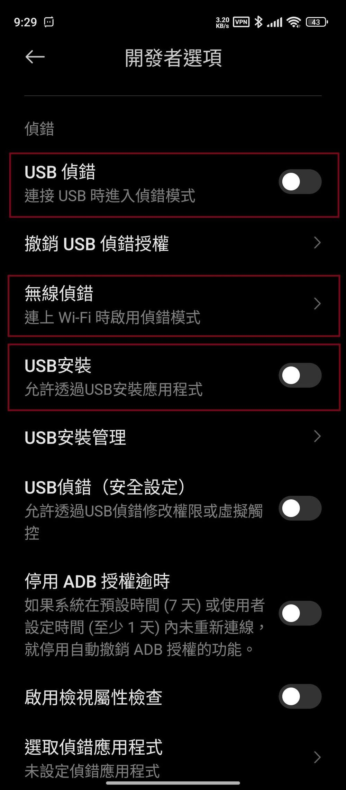
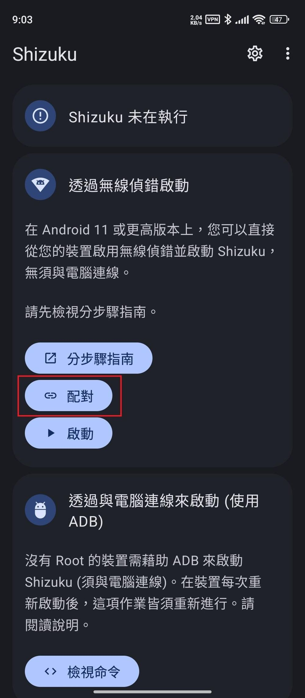
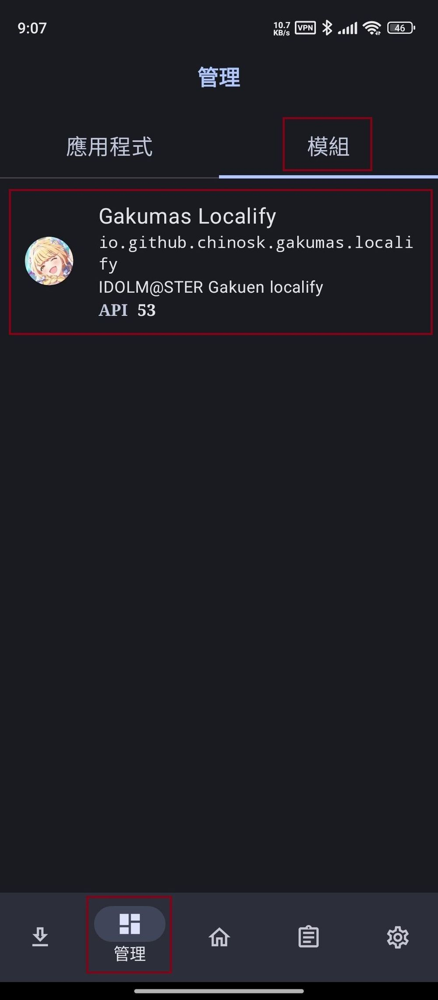
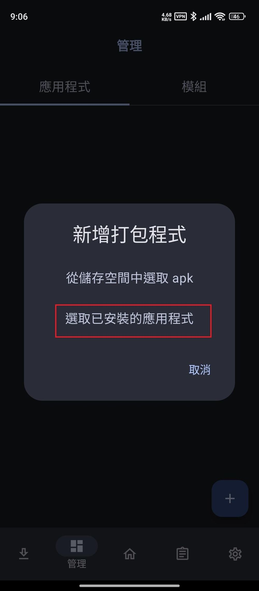
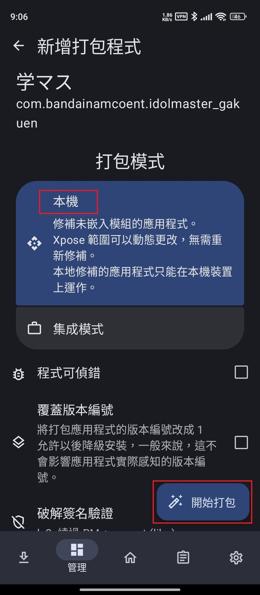
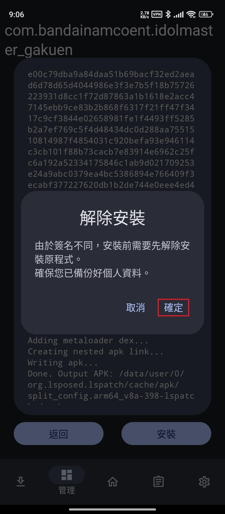
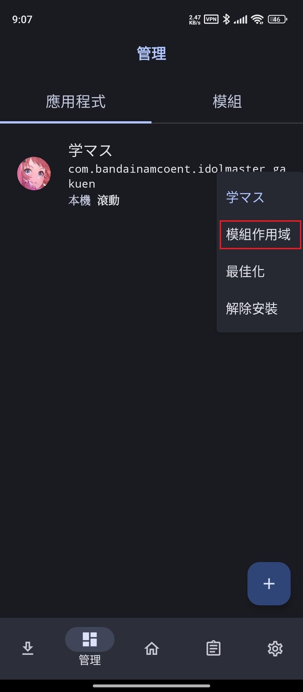

# root讲解
- 手机是真的垃圾不如电脑一根
- root指的是获取手机的最高权限可以使用最高权限某些接口进行开发等
## root的风险
- 某些沟槽app检测到root了就不给使用

# 技术简要讲解
## 准备
- (汉化插件库)[https://github.com/chinosk6/gakuen-imas-localify]
- (LSPatch)[https://github.com/LSPosed/LSPatch]
- Shizuku(Googleplay直接下载)
## gakuen-imas-localify(汉化插件库)
- xposed插件
注入app汉化插件
## LSPatch
- 工具
通过链接shizuku服务器调用接口能够对app进行重新打包,并注入插件
## Shizuku
- 获取系统级别的接口权限
- 是一个服务器可以通过wifi usb等链接桥接这些接口实现变相root

# 方法
1.  开启开发者选项并设定。
找到手机系统版本号并连点，"开启开发者选项"下拉，
同意风险，开启"USB 侦错"与"USB 安装"选项。
  (汉化完后这些项目可以再回来关掉)

2. 打开 Shizuku
透过无线侦错启动，选择"配对"，按照提示开启通知，
  回到"开发者选项"，点选"无线侦错"，
选择"使用配对码配对装置"，接着通知会提示已找到配对服务，
点选"输入配对码"，输入下方系统提供的 wifi 配对码即可配对成功。

  配对完成后返回 Shizuku 点选"启动"。
(过程中如有提示任何操作，或是不同安卓版本，可查看"分步骤指南"，请以 app 提示为主，按照 app 提供的方式去操作)

3. 开启 LSPatch，
  检查 Shizuku 服务使否成功启用，
点选下方"管理"，到"模组"中查看是否有 Gakumas Localify，
  确认没问题后开始进行应用程式打包。

  选择"应用程式"，点选右下方"+"，
  点选"选取已安装的应用程式"，
  找到"学园偶像大师"，
  选择打包模式"本机"，点选右下方"开始打包"，
  完成后"安装"。

4. 开启模组
点选"模组作用域"，勾选"Gakumas Localify"，记得点右下角的" ✓ "。
  回到桌面开启游戏享受汉化。

# 常见问题与解答
## Laspath安装打包好的app卡住
- 直接用gakuen-imas-localify打包app里边集成了Laspath

---

# root模拟器或者手机汉化方法
https://forum.gamer.com.tw/C.php?bsn=79730&snA=229